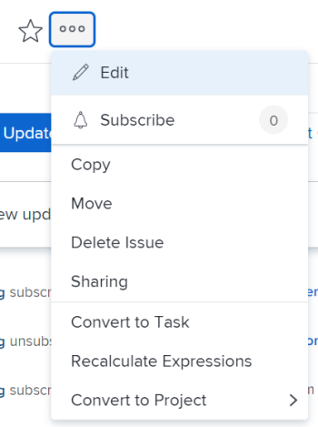

# Excluir problemas

<!--Audited: 01/2024-->

Você pode excluir problemas ou solicitações no Adobe Workfront se tiver o acesso e as permissões corretas para fazer isso.

>[!TIP]
>
>&quot;Problemas&quot; e &quot;solicitações&quot; são usados alternadamente no Workfront. Você pode registrar problemas em projetos e tarefas para indicar trabalho imprevisto que precisa ser resolvido. Você também pode enviar solicitações que são registradas como ocorrências em um projeto designado como uma Fila de solicitações.

## Requisitos de acesso

Você deve ter o seguinte acesso para executar as etapas deste artigo:

<table style="table-layout:auto"> 
 <col> 
 <col> 
 <tbody> 
  <tr> 
   <td role="rowheader">plano do Adobe Workfront</td> 
   <td> 
Qualquer
 </td> 
  </tr> 
  <tr> 
   <td role="rowheader">Licença da Adobe Workfront*</td> 
   <td> 
Novo: Colaborador ou superior

   
Atual: solicitação ou superior

 </td> 
  </tr> 
  <tr> 
   <td role="rowheader">Configuração do nível de acesso</td> 
   <td> 
Editar acesso a ocorrências
 
Acesso de visualização ou superior a projetos e tarefas
  
Para obter informações sobre acesso a problemas em seu Nível de Acesso, consulte <a href="../../../administration-and-setup/add-users/configure-and-grant-access/grant-access-issues.md" class="MCXref xref">Conceder acesso a problemas</a>.  
 </td> 
  </tr> 
  <tr> 
   <td role="rowheader">Permissões de objeto</td> 
   <td> 
Gerenciar permissões no problema
 
Permissões do Contribute ou superiores no projeto ou na tarefa
 
 Para obter informações sobre a concessão de permissões para problemas, consulte <a href="../../../workfront-basics/grant-and-request-access-to-objects/share-an-issue.md" class="MCXref xref">Compartilhar um problema </a>
 </td> 
  </tr> 
 </tbody> 
</table>

&#42;Para saber qual plano, tipo de licença ou acesso você tem, contate o administrador do Workfront. Para obter mais informações sobre requisitos de acesso, consulte [Requisitos de acesso na documentação do Workfront](/help/quicksilver/administration-and-setup/add-users/access-levels-and-object-permissions/access-level-requirements-in-documentation.md).

## Considerações para exclusão de problemas

* O administrador do Workfront ou um administrador de grupo deve habilitar a exclusão de problemas em um projeto com o status Concluído na área Preferências do projeto. Para obter informações sobre como configurar preferências de projeto, consulte [Configurar preferências de projeto do sistema](../../../administration-and-setup/set-up-workfront/configure-system-defaults/set-project-preferences.md).

* Se o problema tiver registrado horas, o administrador do Workfront ou um administrador de grupo deverá permitir a exclusão desses problemas configurando as Preferências de tarefas e problemas na sua instância do Workfront. Isso também se aplica quando você tenta excluir projetos que têm problemas com horas registradas neles.

  <!--
  <MadCap:conditionalText data-mc-conditions="QuicksilverOrClassic.Draft mode">
  (this is not possible in classic)
  </MadCap:conditionalText>
  -->

  Para obter mais informações sobre como habilitar a exclusão de problemas em que as horas são registradas, consulte a seção &quot;Exclusão&quot; em [Configurar preferências de tarefas e problemas em todo o sistema](../../../administration-and-setup/set-up-workfront/configure-system-defaults/set-task-issue-preferences.md).

## O impacto da exclusão de problemas

Ao excluir uma ocorrência, você afeta outros objetos vinculados à ocorrência.

Os seguintes objetos anexados a uma ocorrência também são excluídos quando você exclui uma ocorrência:

* Documentos

  Não é possível excluir um problema que tenha um documento com check-out anexado a ele. Para obter mais informações sobre o check-out de documentos, consulte [Check-out de documentos](../../../documents/managing-documents/check-out-documents.md).

* Notas
* Aprovações

Dependendo de como o administrador do Workfront ou do grupo configura as Preferências de exclusão de projeto, tarefa ou problema na **Folha de horas e preferências de hora** da sua instância do Workfront, as horas registradas para os problemas serão tratadas de uma das seguintes maneiras ao excluir um problema:

* Mova para o projeto e não será restaurado no problema, se o problema for restaurado posteriormente.
* Será excluído e será restaurado no problema, se o problema for restaurado posteriormente.

  Isso também se aplica quando você tenta excluir projetos com tarefas com horas registradas.

  <!--
  <MadCap:conditionalText data-mc-conditions="QuicksilverOrClassic.Draft mode">
  (this is not possible in classic)
  </MadCap:conditionalText>
  -->

  Para obter mais informações sobre como configurar as preferências de exclusão para horas registradas em problemas, consulte [Configurar preferências de horas e planilha de horas](../../../administration-and-setup/set-up-workfront/configure-timesheets-schedules/timesheet-and-hour-preferences.md).

* Os usuários atribuídos ao problema ou à aprovação do problema permanecem na equipe do projeto.\
  Para obter mais informações sobre as equipes de projeto, consulte [Visão geral da Equipe de Projeto](../../../manage-work/projects/planning-a-project/project-team-overview.md).

## Excluir problemas

* [Excluir vários problemas em um projeto simultaneamente](#delete-multiple-issues-in-a-project-simultaneously)
* [Excluir um único problema](#delete-a-single-issue)

### Excluir vários problemas em um projeto simultaneamente  {#delete-multiple-issues-in-a-project-simultaneously}

1. Vá para o **Menu principal**.
1. Clique em **Projetos**.
1. Clique no nome do projeto que contém os problemas que você deseja excluir.
1. Clique em **Problemas** no painel esquerdo.
1. Selecione um problema e clique no ícone  de **Excluir** na parte superior da lista.

1. Se a exclusão for permitida, clique em **Sim, Exclua-a**.\
   O administrador do Workfront pode não permitir a exclusão de problemas em que as horas são registradas.\
   Para obter mais informações sobre acesso e permissões necessárias para excluir um problema, consulte [Excluir problemas](#access-and-permissions-needed).

### Excluir um único problema {#delete-a-single-issue}

{{step1-to-projects}}

1. Clique no nome do projeto que contém o problema que você deseja excluir.
1. Clique em **Problemas** no painel esquerdo.

   

1. Clique no nome do problema que deseja excluir.
1. Clique no menu **Mais** à direita do nome do problema.

   

1. Clique em **Excluir problema**.
1. Se a exclusão for permitida, clique em **Sim, Exclua-a**.

   O administrador do Workfront pode não permitir a exclusão de problemas em que as horas são registradas.\
   Para obter mais informações sobre acesso e permissões necessárias para excluir um problema, consulte [Excluir problemas](#access-and-permissions-needed).

## Restaurar problemas excluídos

Um administrador de grupo ou da Workfront pode restaurar problemas 30 dias após a exclusão. Para obter mais informações sobre como restaurar itens no Workfront, consulte [Restaurar itens excluídos](../../../administration-and-setup/manage-workfront/manage-deleted-items/restore-deleted-items.md).
