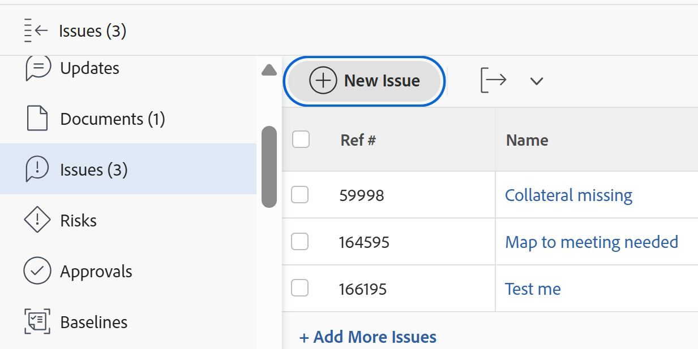
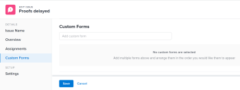
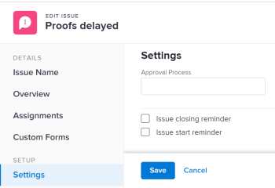

# Editar problemas

É possível editar informações sobre problemas criados por você ou criados por outros usuários se eles compartilharem os problemas com você.

É possível editar um único problema ou editar problemas em uma lista. Para obter informações sobre como editar problemas em uma lista, consulte [Editar problemas em uma lista](../../../manage-work/issues/manage-issues/edit-issues-in-a-list.md).

## Requisitos de acesso

Você deve ter o seguinte acesso para executar as etapas deste artigo:

<table style="table-layout:auto"> 
 <col> 
 <col> 
 <tbody> 
  <tr> 
   <td role="rowheader">plano do Adobe Workfront*</td> 
   <td> 
Qualquer 
 </td> 
  </tr> 
  <tr> 
   <td role="rowheader">Licença da Adobe Workfront*</td> 
   <td> 
Solicitação ou superior
 
Licença de revisão ou superior para editar problemas na seção Problemas de uma tarefa ou projeto
 </td> 
  </tr> 
  <tr> 
   <td role="rowheader">Nível de acesso*</td> 
   <td> 
Editar acesso a ocorrências
 
<b>Nota</b>

Se você ainda não tiver acesso, pergunte ao administrador do Workfront se ele definiu restrições adicionais em seu nível de acesso. Para obter informações sobre acesso a problemas em seu Nível de Acesso, consulte <a href="../../../administration-and-setup/add-users/configure-and-grant-access/grant-access-issues.md" class="MCXref xref">Conceder acesso a problemas</a>. Para obter informações sobre como um administrador do Workfront pode alterar seu nível de acesso, consulte <a href="../../../administration-and-setup/add-users/configure-and-grant-access/create-modify-access-levels.md" class="MCXref xref">Criar ou modificar níveis de acesso personalizados</a>. 
 </td>
</tr> 
  <tr> 
   <td role="rowheader">Permissões de objeto</td> 
   <td> 
Permissões do Contribute para um problema a fim de editar os seguintes campos na área Detalhes: 

   <ul>
   <li>Descrição</li>
   <li>Status</li>
   <li>Severidade</li>
   </ul>
   
Gerenciar permissões de um problema para editar todos os campos na área Detalhes ou na caixa Editar problema
 
 Para obter informações sobre a concessão de permissões para problemas, consulte <a href="../../../workfront-basics/grant-and-request-access-to-objects/share-an-issue.md" class="MCXref xref">Compartilhar um problema </a>
 
Para obter informações sobre como solicitar permissões adicionais, consulte <a href="../../../workfront-basics/grant-and-request-access-to-objects/request-access.md" class="MCXref xref">Solicitar acesso aos objetos </a>.
 </td> 
  </tr> 
 </tbody> 
</table>

&#42;Para saber qual plano, tipo de licença ou acesso você tem, contate o administrador do Workfront.

## Limitações ao editar problemas

Existem algumas limitações que podem impedir a edição de problemas.

* Não é possível editar problemas que estão em um Processo de aprovação. Você só pode registrar horas ou atualizar o status de um problema que esteja em Aprovação pendente.
* Você pode editar e adicionar documentos a problemas em um projeto com status Concluído, Inativo ou Pendente de Aprovação somente quando o administrador do Workfront ou um administrador de grupo ativou essa funcionalidade na área Preferências do projeto. Para obter informações sobre como definir preferências de projeto, consulte [Configurar preferências de projeto do sistema](../../../administration-and-setup/set-up-workfront/configure-system-defaults/set-project-preferences.md).

## Editar um único problema

Você pode editar um problema usando as áreas Editar problema ou Detalhes do problema. As etapas a seguir descrevem a edição de um problema na caixa Editar problema.

1. Vá para o **Menu Principal**.
1. Clique em **Projetos** e no nome de um projeto para abri-lo.
1. (Opcional) Clique em **Tarefas** e no nome de uma tarefa para abri-la.
1. Clique em **Problemas** no painel esquerdo.

   

1. (Opcional) Para editar informações limitadas sobre um problema, clique em **Detalhes do Problema** no painel esquerdo.

   >[!NOTE]
   >
   >Dependendo de como o administrador do Workfront ou do Administrador de grupo modificou o Modelo de layout, os campos na área Detalhes do problema podem ser reorganizados ou não ser exibidos. Para obter informações, consulte [Personalizar o modo de exibição de Detalhes usando um modelo de layout](../../../administration-and-setup/customize-workfront/use-layout-templates/customize-details-view-layout-template.md).

   Para editar informações na seção Detalhes, faça o seguinte:

   1. (Opcional) Clique no ícone **Recolher Tudo** no canto superior direito para recolher todas as áreas.
   1. (Opcional e condicional) Quando uma área for recolhida, clique na **seta apontando para a direita**  ao lado de cada área para expandir a área que você deseja editar.
   1. (Opcional) Para anexar um formulário personalizado, comece digitando o nome de um formulário no campo **Adicionar formulário personalizado**, selecione-o quando ele for exibido na lista e clique em **Salvar alterações**.
   1. (Opcional) Clique no ícone **Exportar**  para exportar as informações de Visão geral e formulários personalizados para um arquivo PDF e, em seguida, clique em **Exportar**. Selecione entre as seguintes opções:

      * Selecionar tudo (é exibido somente quando há pelo menos um formulário personalizado anexado)
      * Visão geral
      * O nome de um ou vários formulários personalizados

      O arquivo PDF é baixado no computador.

      

      Para obter mais informações, consulte [Exportar detalhes de formulários e objetos personalizados](../../../workfront-basics/work-with-custom-forms/export-custom-forms-details.md).

   Para obter informações sobre os campos visíveis na seção Detalhes do problema, continue editando o problema na caixa Editar problema conforme descrito abaixo.

1. Para editar todas as informações sobre um problema, selecione um problema em uma lista e clique em **Editar** na parte superior da lista

   Ou

   Clique no nome de um problema em uma lista e no menu **Mais** ao lado do nome do problema e, em seguida, **Editar.**

   A caixa de diálogo **Editar Problema** é exibida.

   >[!IMPORTANT]
   >
   >Você deve ter permissões de Gerenciamento para o problema para ver o link Editar.

   Todos os campos de problema estão disponíveis na caixa Editar problema e são agrupados pelas áreas listadas no painel esquerdo.

1. Considere especificar informações em qualquer uma das seguintes seções:

   * [Nome do Problema](#issue-name)
   * [Visão geral](#overview)
   * [Atribuições](#assignments)
   * [Formulários personalizados](#Custom%C2%A0F)
   * [Configurações](#settings)

   >[!NOTE]
   >
   >Dependendo de como o administrador do Workfront configura nosso Modelo de layout, os campos na caixa Editar problema podem ser diferentes em seu ambiente. Para obter informações, consulte [Personalizar o modo de exibição de Detalhes usando um modelo de layout](../../../administration-and-setup/customize-workfront/use-layout-templates/customize-details-view-layout-template.md).
   >
   >A maioria dos campos listados nas seções abaixo também podem ser acessados na caixa Nova ocorrência, ao criar uma ocorrência. As seções sob as quais os campos estão localizados não correspondem à caixa Nova ocorrência. Para obter informações sobre como criar problemas, consulte [Criar problemas](../../issues/manage-issues/create-issues.md).

### Nome do Problema {#issue-name}

1. Comece a editar um problema conforme descrito acima.
1. Clique em **Nome do problema**.

   

1. Atualize o campo **Nome do Problema**.
1. Clique em **Salvar** ou continue editando as seções a seguir.

### Visão geral {#overview}

1. Comece a editar um problema conforme descrito acima.
1. Clique em **Visão geral**.

   

1. Atualize ou revise qualquer um dos campos na tabela a seguir:

   <table style="table-layout:auto"> 
    <col> 
    <col> 
    <tbody> 
     <tr> 
      <td role="rowheader">Descrição</td> 
      <td> 
Inclua informações adicionais sobre o problema.
 </td> 
     </tr> 
     <tr> 
      <td colspan="2" role="rowheader">Seção de informações básicas</td> 
     </tr> 
     <tr> 
      <td role="rowheader">Status</td> 
      <td> 
Selecione o status da ocorrência. Para obter mais informações sobre status de problemas, consulte <a href="../../../administration-and-setup/customize-workfront/creating-custom-status-and-priority-labels/issue-statuses.md" class="MCXref xref">Acessar a lista de status de problemas do sistema</a>. 
 </td> 
     </tr> 
     <tr> 
      <td role="rowheader">Prioridade</td> 
      <td> 
Este é um sinalizador visual para você que permite priorizar problemas.
 
Selecione entre as seguintes opções:
 
       <ul> 
        <li> 
<strong>Nenhum</strong> 
 </li> 
        <li> 
<strong>Baixo</strong> 
 </li> 
        <li> 
<strong>Normal</strong> 
 </li> 
        <li> 
<strong>Alta</strong> 
 </li> 
        <li> 
<strong>Urgente</strong> 
 </li> 
       </ul> 
Dependendo das Preferências do projeto selecionadas pelo administrador do Workfront, os nomes das prioridades podem ser diferentes para você. Para obter mais informações sobre como editar prioridades, consulte <a href="../../../administration-and-setup/customize-workfront/creating-custom-status-and-priority-labels/create-customize-priorities.md" class="MCXref xref">Criar e personalizar prioridades</a>.
 </td> 
     </tr> 
     <tr> 
      <td role="rowheader">Severidade</td> 
      <td> 
Este é um sinalizador visual para você que indica a gravidade do problema descrito no problema. As severidades são específicas para os problemas. Selecione entre as seguintes opções:
 
       <ul> 
        <li> 
Cosmética
 </li> 
        <li> 
Causa Confusão
 </li> 
        <li> 
Problema com Solução
 </li> 
        <li> 
Problema Sem Solução
 </li> 
        <li> 
Erro Fatal
 </li> 
       </ul> 
Dependendo das Preferências do projeto selecionadas pelo administrador do Workfront, os nomes das severidades podem ser diferentes para você. Para obter mais informações sobre como editar severidades, consulte <a href="../../../administration-and-setup/customize-workfront/creating-custom-status-and-priority-labels/create-customize-issue-severities.md" class="MCXref xref">Criar ou personalizar severidades de problemas</a>.
 </td> 
     </tr> 
     <tr> 
      <td role="rowheader">URL</td> 
      <td> 
Digite um link da Web relacionado às informações sobre o problema.
 </td> 
     </tr> 
     <tr> 
      <td role="rowheader">Tipo</td> 
      <td> 
De acordo com as Propriedades da fila selecionadas pelo gerente do projeto na área Detalhes da fila do projeto, talvez seja possível especificar o tipo de problema. Selecione entre as seguintes opções no menu suspenso <b>Tipo</b>: 
 
       <ul> 
        <li> 
<strong>Relatório de erro</strong> 
 </li> 
        <li> 
<strong>Pedido de alteração</strong> 
 </li> 
        <li> 
<strong>Problema</strong> 
 </li> 
        <li> 
<strong>Solicitar</strong> 
 </li> 
       </ul> 
Dependendo das Preferências do projeto selecionadas pelo administrador do Workfront, os nomes dos tipos de problemas podem ser diferentes para você.
 </td> 
     </tr> 
     <tr> 
      <td role="rowheader">Contato Primário</td> 
      <td>Por padrão, o contato primário é o criador do problema. Para modificar isso, comece digitando o nome de qualquer usuário ativo no Workfront e, em seguida, selecione-o na lista. Um problema pode ter apenas um contato principal.  Se você alterar o Contato Principal, o contato principal original ainda terá acesso de Gerenciamento ao problema. Você deve remover manualmente esse acesso da caixa Acesso à ocorrência, ao compartilhar um problema.

   <b>DICA</b>

   
Ao adicionar um usuário de contato principal, observe o avatar, a função principal do usuário e seu endereço de email para distinguir entre usuários com nomes idênticos. Os usuários devem ser associados a pelo menos uma função de trabalho para visualizá-la à medida que forem adicionados.

      
 Você deve ter a configuração Exibir informações de contato ativada no seu nível de acesso para que os usuários visualizem os emails dos usuários. Para obter informações, consulte <a href="../../../administration-and-setup/add-users/configure-and-grant-access/grant-access-other-users.md">Conceder acesso aos usuários</a>.

   </td> 
     </tr> 
     <tr> 
      <td role="rowheader">Data e hora de confirmação</td> 
      <td> 
Esta é a data em que o destinatário da emissão estima que a emissão será concluída. Somente as pessoas atribuídas podem editar este campo.
 </td> 
     </tr> 
     <tr> 
      <td role="rowheader">Data de Início Planejada</td> 
      <td>Por padrão, a Data de início planejada é a data e a hora em que a ocorrência foi criada. Você pode atualizar a <strong>Data de Início Planejada</strong> do problema. </td> 
     </tr> 
     <tr> 
      <td role="rowheader">Data e hora de conclusão planejadas</td> 
      <td> Por padrão, a Data de conclusão planejada é 24 horas a partir da Data inicial planejada padrão. Por padrão, os problemas têm uma Duração de 1 dia. Você pode atualizar a <strong>Data de conclusão planejada</strong> do problema.</td> 
     </tr> 
     <tr> 
      <td role="rowheader">Data e Hora de Início Efetivo</td> 
      <td>A Data de Início Efetivo é preenchida automaticamente quando você altera o status do problema para <strong>Em Andamento</strong>. Você pode atualizar a <strong>Data de Início Efetiva</strong> do problema. Você pode atualizar a data manualmente, se necessário. </td> 
     </tr> 
     <tr> 
      <td role="rowheader">Data e hora de término efetivo</td> 
      <td>A Data de Término Efetivo é preenchida automaticamente quando você altera o status do problema para <strong>Fechado</strong> ou<strong>Resolvido</strong>. Você pode atualizar a <strong>Data de Término Efetivo</strong> do problema. Você pode atualizar a data manualmente, se necessário.</td> 
     </tr> 
     <tr> 
      <td role="rowheader">Resolvido por</td> 
      <td> 
Isso mostra se o problema foi resolvido por outro objeto. Você pode selecionar se esse problema é resolvido por uma tarefa, um projeto ou outro problema no menu suspenso e, em seguida, começar a digitar o nome da tarefa, do projeto ou do problema que resolverá o problema. Selecione-o quando ele aparecer na lista.

   <b>OBSERVAÇÃO</b>

   Quando você seleciona um objeto para resolver um problema, o status do problema é vinculado ao status do objeto de resolução e não pode ser alterado no problema. Para obter mais informações sobre a resolução de objetos, consulte <a href="../../../manage-work/issues/convert-issues/resolving-and-resolvable-objects.md" class="MCXref xref">Visão Geral de Objetos Resolventes e Resolvíveis </a>.

   <b>DICA</b>

   Quando o administrador do sistema ou do grupo adiciona o campo &quot;Resolvido por&quot; ao cabeçalho personalizado de um problema, o campo é alterado para &quot;Resolvendo problema&quot;, &quot;Resolvendo tarefa&quot; ou &quot;Resolvendo projeto&quot; quando há um objeto de resolução associado ao problema.

   Não é possível editar esse campo quando ele é exibido no cabeçalho do problema. Para obter mais informações sobre como personalizar cabeçalhos de problemas, consulte <a href="../../../administration-and-setup/customize-workfront/use-layout-templates/customize-object-headers.md">Personalizar cabeçalhos de objetos usando um modelo de layout </a>
   </td> 
     </tr>

   <tr> 
      <td role="rowheader">Resolvendo problema, Resolvendo tarefa ou Resolvendo projeto</td> 
      <td>O nome vinculado do problema, tarefa ou problema que resolve o problema.  </td> 
     </tr> 
      <tr> 
      <td role="rowheader">Isso resolve</td> 
      <td>O nome vinculado do problema que é concluído quando o problema que você está acessando é resolvido.  </td> 
     </tr>

   </tbody> 
   </table>

1. Clique em **Salvar** ou continue editando as seções a seguir.

#### Atribuições {#assignments}

1. Comece a editar o problema conforme descrito acima.
1. Clique em **Atribuições** no painel esquerdo.

   

1. Clique em **Pesquisar pessoas, funções e equipes** e comece a digitar o nome de um usuário, função ou equipe que deseja atribuir à tarefa, em seguida, clique nele ou pressione Enter quando ele for exibido na lista.

   <!--
   
(NOTE: ensure this is still called this; asked Anna to change it to "roles" and add a comma)

   -->

   >[!NOTE]
   >
   >Se o nome do usuário contiver um caractere especial, você deverá incluí-lo no campo de pesquisa.

   >[!TIP]
   >
   >Você pode atribuir vários usuários, funções de trabalho ou equipes. Você pode atribuir somente usuários, funções de trabalho e equipes ativos.
   >
   >
   >Se um usuário, função de trabalho ou equipe foi atribuído antes de ser desativado, ele permanece atribuído ao item de trabalho. Nesse caso, recomendamos o seguinte:
   >
   >* Reatribuir o item de trabalho aos recursos ativos.
   >* Associe os usuários de uma equipe desativada a uma equipe ativa e reatribua o item de trabalho à equipe ativa.

1. (Opcional) Indique se um destinatário é o principal responsável pelo problema, passando o cursor do mouse sobre o nome do destinatário e clicando em **Tornar primário**. Uma equipe não pode ser o principal destinatário de um problema.
1. Atualize os seguintes campos:

   <table style="table-layout:auto"> 
    <col> 
    </col> 
    <col> 
    </col> 
    <tbody> 
     <tr> 
      <td role="rowheader">Horas planejadas</td> 
      <td> 
Esta é a quantidade de tempo real que os designados da ocorrência levariam para concluí-la. Digite o número de Horas planejadas para a ocorrência. 
 
Nota: Alterar as Horas Planejadas da emissão não alterará a Data de Término Planejada da emissão. 
 </td> 
     </tr> 
     <tr data-mc-conditions=""> 
      <td role="rowheader">Função do atribuidor</td> 
      <td> 
Selecione uma função no menu suspenso <strong>Função do destinatário</strong> ao selecionar uma pessoa como destinatário. Essa é a função que o destinatário pode desempenhar nesse problema. 
 
<b>DICA</b>

   Somente as funções de trabalho associadas a cada destinatário em seu perfil são exibidas no menu suspenso.
 </td>
   </tr> 
    </tbody> 
   </table>

1. Clique em **Salvar** ou continue editando as seções a seguir.

### Forms personalizado

1. Comece a editar um problema conforme descrito acima.
1. Clique em **Forms Personalizado**.

   

1. No campo **Adicionar formulário personalizado**, selecione o(s) formulário(s) personalizado(s) que deseja associar ao problema. Você deve criar os formulários personalizados antes que eles estejam disponíveis para seleção neste campo. Somente formulários personalizados ativos são exibidos na lista. Para obter mais informações sobre a criação de formulários personalizados, consulte [Criar um formulário com o designer de formulário](/help/quicksilver/administration-and-setup/customize-workfront/create-manage-custom-forms/form-designer/design-a-form/design-a-form.md). Você pode adicionar até dez formulários personalizados a um problema.

1. (Condicional) Se você anexou um formulário personalizado ao problema, edite os campos no formulário. Você deve especificar todos os campos obrigatórios antes de poder salvar a ocorrência.

   >[!NOTE]
   >
   >Dependendo de como o administrador do Workfront define as permissões para as seções no formulário personalizado, nem todos podem exibir ou editar os mesmos campos em um determinado formulário personalizado. As permissões para editar campos em uma seção de um formulário personalizado dependem das permissões que você tem no próprio problema. Para obter informações sobre a configuração de permissões em seções de um formulário personalizado, consulte [Criar um formulário com o designer de formulário](/help/quicksilver/administration-and-setup/customize-workfront/create-manage-custom-forms/form-designer/design-a-form/design-a-form.md). Para obter informações sobre como configurar permissões de problemas, consulte [Compartilhar um problema](../../../workfront-basics/grant-and-request-access-to-objects/share-an-issue.md).

1. Clique em **Salvar** ou continue editando a seção a seguir.

### Configurações {#settings}

1. Comece a editar um problema conforme descrito acima.
1. Clique em **Configurações**.

   

   Atualize as seguintes informações:

   <table style="table-layout:auto"> 
    <col> 
    </col> 
    <col> 
    </col> 
    <tbody> 
     <tr> 
      <td role="rowheader">Processo de aprovação</td> 
      <td> 
       
 
       
Selecione um processo de aprovação que deseja associar ao problema. O administrador do Workfront deve definir Processos de aprovação no nível do sistema antes que você possa associá-los a problemas. Usuários com acesso administrativo aos processos de Aprovação  também podem criar processos de aprovação específicos do grupo.Para obter mais informações sobre como criar Processos de Aprovação, consulte <a href="../../../administration-and-setup/customize-workfront/configure-approval-milestone-processes/create-approval-processes.md" class="MCXref xref">Criar um processo de aprovação para itens de trabalho</a>. 
 
       
Considere o seguinte ao adicionar processos de aprovação: 
 
       <ul> 
       <li>Somente os processos de aprovação ativos são exibidos na lista. </li> 
       <li> 
Os processos de aprovação específicos do grupo e de todo o sistema são exibidos na lista. Um processo de aprovação associado a um grupo diferente daquele do projeto não é exibido na lista.
 
Importante: se o grupo do projeto mudar, o processo de aprovação específico do grupo se tornará um processo de aprovação de uso único. Para obter mais informações sobre como as alterações no grupo do projeto ou no processo de aprovação afetam as configurações de aprovação, consulte <a href="../../../administration-and-setup/customize-workfront/configure-approval-milestone-processes/how-changes-affect-group-approvals.md" class="MCXref xref">Como as alterações no grupo e no processo de aprovação afetam os processos de aprovação atribuídos</a>. 
 </li> 
       <li> 
Você pode definir processos de aprovação padrão para serem anexados automaticamente a ocorrências ao criar filas de solicitações ou Tópicos de fila. Para obter informações sobre como atualizar Detalhes da Fila, consulte <a href="../../../manage-work/requests/create-and-manage-request-queues/create-request-queue.md" class="MCXref xref">Criar uma Fila de Solicitações</a>. Para obter informações sobre como criar Tópicos da Fila, consulte <a href="../../../manage-work/requests/create-and-manage-request-queues/create-queue-topics.md" class="MCXref xref">Criar Tópicos da Fila</a>. 
 </li> 
       <li>Quando ocorrer problemas de edição em massa, os seguintes cenários existem: 
       <ul> 
       <li>
Quando você seleciona vários problemas do mesmo grupo, os processos de aprovação específicos do sistema e do grupo são exibidos nesse campo.
</li> 
       <li>
Quando você seleciona vários problemas de grupos diferentes, somente os processos de aprovação no nível do sistema são exibidos nesse campo.
</li> 
       <li>
Quando qualquer um dos problemas tiver um processo de aprovação de uso único anexado, ele será substituído pelo processo de aprovação no nível do sistema ou do grupo selecionado. 
</li> 
       </ul></li> 
       </ul> 
       
 </td> 
     </tr> 
     <tr> 
      <td role="rowheader">Notificações de Lembrete</td> 
      <td> 
Marque a caixa de seleção para a qual Notificações de lembrete você deseja anexar a esse problema. Todas as notificações de lembrete de problemas são exibidas. O administrador do Workfront deve configurar Notificações de lembretes antes de selecioná-las em um problema. Para obter mais informações sobre como configurar Notificações de Lembrete, consulte <a href="../../../administration-and-setup/manage-workfront/emails/set-up-reminder-notifications.md" class="MCXref xref">Configurar notificações de lembrete</a>
 </td> 
     </tr> 
    </tbody> 
   </table>

1. Clique em **Salvar.**

## Editar um problema no cabeçalho do problema (limitado)

Você pode editar uma quantidade limitada de informações no cabeçalho da ocorrência.

O administrador do sistema ou do grupo pode personalizar os campos exibidos no cabeçalho do problema. Para obter informações, consulte [Personalizar cabeçalhos de objetos usando um modelo de layout](../../../administration-and-setup/customize-workfront/use-layout-templates/customize-object-headers.md).

Os seguintes campos são incluídos no cabeçalho da ocorrência, por padrão:

* Nome do problema
* Percentual completo
* Atribuições
* Data e hora de conclusão planejadas
* Status
* Tome decisões de aprovação se você estiver definido como aprovador em um processo de aprovação atual
