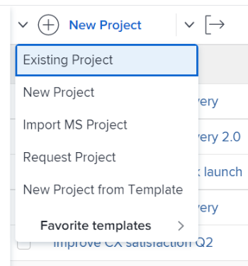

# Adicionar projetos a um portfólio

<!--Audited: 5/2025-->

As informações destacadas nesta página referem-se a funcionalidades que ainda não estão disponíveis. Ela está disponível somente no ambiente de Pré-visualização para todos os clientes. Os mesmos recursos também estarão disponíveis no ambiente de Produção para todos os clientes após uma semana da versão de Pré-visualização. 

Para obter mais informações, consulte [Modernização de interface](/help/quicksilver/product-announcements/product-releases/interface-modernization/interface-modernization.md). 

Recomendamos que você adicione projetos aos portfólios ao iniciá-los. No entanto, você pode adicioná-los a um portfólio a qualquer momento durante sua vida útil.

Considere o seguinte ao adicionar projetos a portfólios:

* Embora um portfólio possa conter um número ilimitado de projetos, você pode associar apenas um portfólio a um projeto.
* Um projeto permanece em um portfólio até ser removido ou associado a outro portfólio.

## Requisitos de acesso

+++ Expanda para visualizar os requisitos de acesso para a funcionalidade neste artigo.

<table style="table-layout:auto"> 
 <col> 
 <col> 
 <tbody> 
  <tr> 
   <td role="rowheader">[!DNL Adobe Workfront] plano</td> 
   <td> 
Qualquer

   </td> 
  </tr> 
  <tr> 
   <td role="rowheader">[!DNL Adobe Workfront] licença*</td> 
   <td>
Novo: Padrão
 
   
Atual: [!UICONTROL Plano] 
 </td> 
  </tr> 
  <tr> 
   <td role="rowheader">Nível de acesso</td> 
   <td> 
Portfólios de acesso ao [!UICONTROL Editar]
 
[!UICONTROL Editar] acesso a Projetos
 </td> 
  </tr> 
  <tr> 
   <td role="rowheader">Permissões de objeto</td> 
   <td> 
Permissões do [!UICONTROL Manager] para o portfólio
 
[!UICONTROL Gerenciar] permissões para os projetos
  </td> 
  </tr> 
 </tbody> 
</table>

*Para obter informações, consulte [Requisitos de acesso na documentação do Workfront](/help/quicksilver/administration-and-setup/add-users/access-levels-and-object-permissions/access-level-requirements-in-documentation.md).

+++

## Adicionar um projeto a um portfólio

1. Vá para um portfólio e clique em **[!UICONTROL Projetos]** no painel esquerdo.

   

1. Clique em **[!UICONTROL Novo projeto]** e selecione um método para adicionar um projeto.

   >[!TIP]
   >
   >Não é possível adicionar um projeto ao exibir a lista de projetos na exibição [!UICONTROL Marco].

   Selecione entre as seguintes opções:

   <table style="table-layout:auto"> 
    <col> 
    <col> 
    <tbody> 
     <tr> 
      <td role="rowheader">[!UICONTROL Projeto Existente]</td> 
      <td> 
Adicione um projeto já criado.
 </td> 
     </tr> 
     <tr> 
      <td role="rowheader">[!UICONTROL Novo Projeto]</td> 
      <td> 
Adicione um novo projeto. 
 
Para obter mais informações sobre como criar um novo projeto, consulte <a href="../../../manage-work/projects/create-projects/create-project.md" class="MCXref xref">Criar um projeto</a>. 
 </td> 
     </tr> 
     <tr> 
      <td role="rowheader">[!UICONTROL Importar um Projeto de [!DNL MS Project]] </td> 
      <td> 
Adicione um projeto que você exportou anteriormente do [!DNL MS Project] e salvou no computador. 
 
Para obter mais informações sobre como criar um novo projeto importando-o de [!DNL Microsoft Project], consulte <a href="../../../manage-work/projects/create-projects/import-project-from-ms-project.md" class="MCXref xref">Importar um projeto de [!DNL Microsoft Project]</a>.
 </td> 
     </tr> 
     <tr> 
      <td role="rowheader">[!UICONTROL Solicitar Projeto]</td> 
      <td> 
Solicitar que um projeto seja aprovado.
 
Para obter informações sobre a solicitação de projetos, consulte <a href="../../../manage-work/projects/create-projects/request-project.md">Solicitando um projeto</a>. 
 </td> 
     </tr> 
     <tr> 
      <td role="rowheader">[!UICONTROL Novo do Modelo]</td> 
      <td> 
Adicione um novo projeto usando um modelo existente. 
 
Para obter mais informações sobre como criar um projeto a partir de um modelo, consulte <a href="../../../manage-work/projects/create-projects/create-project-from-template.md" class="MCXref xref">Criar um projeto usando um modelo</a>.
 </td> 
     </tr> 
    </tbody> 
   </table>

   

1. (Condicional) Se você optou por adicionar um projeto existente, a caixa **Adicionar projetos** será aberta. <!--check this after UI changes-->

    <!--check this after UI changes-->

1. Comece digitando o nome de um projeto no campo **[!UICONTROL Adicionar projetos a este Portfolio]** e clique neles quando eles aparecerem na lista.  <!--check this after UI changes-->

   Você pode adicionar mais de um projeto.

1. (Opcional) Clique no ícone **X** à direita do nome do projeto para removê-lo da lista, caso decida não adicioná-lo ao portfólio.

   <!--replace last step with this, for unshim: 1. (Optional) Click the **Delete** icon  next to the name of a project if you decide not to add it to the portfolio.-->

1. Clique em **[!UICONTROL Adicionar Projetos]**. <!--check this after UI changes-->

   O projeto ou projetos selecionados agora estão associados ao portfólio.
