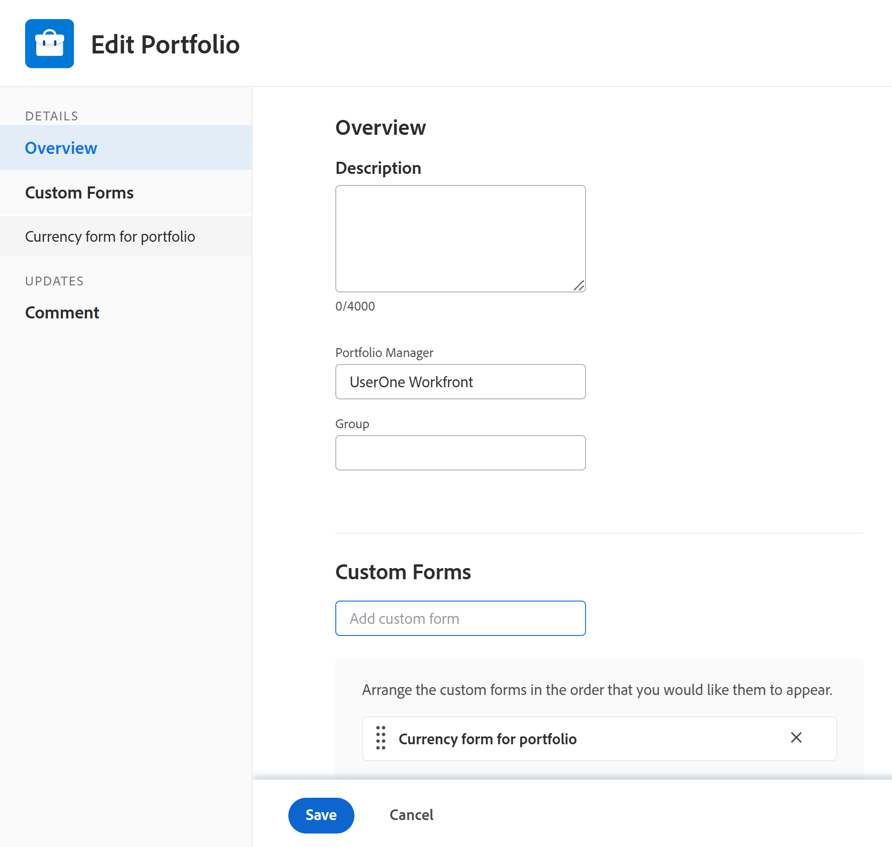

# Editar portfólios

<!--
 

The highlighted information on this page refers to functionality not yet generally available. It is available only in the Preview environment for all customers. The same features will also be available in the Production environment for all customers after a week from the Preview release.      

For more information, see [Interface modernization](/help/quicksilver/product-announcements/product-releases/interface-modernization/interface-modernization.md).  

-->

É possível editar informações nos portfólios criados por você ou criadas por outros usuários, caso eles tenham sido compartilhados com você.

É possível editar um portfólio na página de portfólio ou editar portfólios em uma lista.

## Requisitos de acesso

+++ Expanda para visualizar os requisitos de acesso para a funcionalidade neste artigo. 

<table style="table-layout:auto"> 
 <col> 
 <col> 
 <tbody> 
  <tr> 
   <td role="rowheader">[!DNL Adobe Workfront] pacote</td> 
   <td> 
Qualquer
</td> 
  </tr> 
  <tr> 
   <td role="rowheader">Licenças do Adobe [!DNL Workfront]</td> 
   <td> 
[!UICONTROL Padrão]

   
[!UICONTROL Plano]
 </td> 
  </tr> 
  <tr> 
   <td role="rowheader">Nível de acesso</td> 
   <td> 
[!UICONTROL Editar] acesso a [!UICONTROL Portfólios]
  </td> 
  </tr> 
  <tr> 
   <td role="rowheader">Permissões de objeto</td> 
   <td> 
Permissões [!UICONTROL Manage] para um portfólio

   
Permissões [!UICONTROL Manage] para os projetos no portfólio para adicioná-los ou removê-los dele
  </td> 
  </tr> 
 </tbody> 
</table>

*Para obter informações, consulte [Requisitos de acesso na documentação do Workfront](/help/quicksilver/administration-and-setup/add-users/access-levels-and-object-permissions/access-level-requirements-in-documentation.md).

+++ 

<!--Old:

<table style="table-layout:auto"> 
 <col> 
 <col> 
 <tbody> 
  <tr> 
   <td role="rowheader">[!DNL Adobe Workfront] plan</td> 
   <td> 
Any
</td> 
  </tr> 
  <tr> 
   <td role="rowheader">Adobe [!DNL Workfront] licenses*</td> 
   <td> 
New: Standard

   
Current: [!UICONTROL Plan] 
 </td> 
  </tr> 
  <tr> 
   <td role="rowheader">Access level</td> 
   <td> 
[!UICONTROL Edit] access to Portfolios
  </td> 
  </tr> 
  <tr> 
   <td role="rowheader">Object permissions</td> 
   <td> 
[!UICONTROL Manage] permissions to a portfolio

   
 Manage permissions to the projects in the portfolio to add or remove them from the portfolio
  </td> 
  </tr> 
 </tbody> 
</table>

*For information, see [Access requirements in Workfront documentation](/help/quicksilver/administration-and-setup/add-users/access-levels-and-object-permissions/access-level-requirements-in-documentation.md).-->

## Editar portfólios

{{step1-to-portfolios}}

1. (Opcional) Para editar informações limitadas sobre o portfólio, faça o seguinte:

   1. Clique no nome de um portfólio para abri-lo e, em seguida, clique em **[!UICONTROL Detalhes do Portfolio]** no painel esquerdo.

      

      <!--
      
(NOTE: the note below will also be true for Edit Portfolio box)

      -->

      >[!NOTE]
      >
      >Dependendo de como o administrador do [!DNL Workfront] ou o administrador de Grupo modificou o Modelo de Layout, os campos na área [!UICONTROL Detalhes do Portfolio] podem ser reorganizados ou não ser exibidos. Para obter informações, consulte [Personalizar a exibição [!UICONTROL Detalhes] usando um modelo de layout](../../../administration-and-setup/customize-workfront/use-layout-templates/customize-details-view-layout-template.md).

      Para editar informações na seção [!UICONTROL **Detalhes**], faça o seguinte:

   1. (Opcional) Clique no ícone **[!UICONTROL Recolher tudo]**  no canto superior direito para recolher todas as áreas.
   1. (Opcional e condicional) Quando uma área for recolhida, clique no ícone **Expandir**  ao lado de cada área para expandir a área que você deseja editar.

      >[!TIP]
      >
      >Você pode clicar no ícone **Expandir tudo**  no canto superior direito da seção Detalhes, quando todas as áreas estiverem recolhidas.

      Para obter informações sobre os campos visíveis na seção [!UICONTROL **Detalhes do Portfolio**], continue editando o portfólio na caixa [!UICONTROL **Editar Portfolio**], conforme descrito abaixo.
   1. (Opcional) Se não houver formulários personalizados anexados ao portfólio, comece digitando o nome de um formulário no campo **[!UICONTROL Adicionar formulário personalizado]** no canto superior direito da página **Detalhes** e selecione-o quando ele for exibido na lista.
   1. Adicione informações aos campos nas áreas [!UICONTROL **Visão geral**] e [!UICONTROL **Forms personalizada**], depois clique em [!UICONTROL **Salvar alterações**].
   1. (Opcional) Clique no ícone **[!UICONTROL Exportar]**  para exportar a [!UICONTROL Visão geral] e as informações de formulários personalizados para um arquivo do PDF e clique em **[!UICONTROL Exportar]**. Selecione entre as seguintes opções:

      * Selecionar tudo (é exibido somente quando há pelo menos um formulário personalizado anexado)
      * Visão geral
      * O nome de um ou vários formulários personalizados

        O arquivo PDF é baixado no computador.

        

        Para obter mais informações, consulte [Exportar detalhes de formulários e objetos personalizados](../../../workfront-basics/work-with-custom-forms/export-custom-forms-details.md).

1. (Opcional) Para editar todas as informações sobre um ou mais portfólios, selecione um ou mais portfólios que deseja editar em uma lista de portfólios e clique no ícone **[!UICONTROL Editar]**  na parte superior da lista.

   <!--
   
(NOTE: this might have to be split in two sections if the single edit and the bulk edit won't come at the same time for portfolios)

   -->
   A caixa **[!UICONTROL Editar Portfolio]** é exibida.

   

   Todos os campos do portfólio estão disponíveis na caixa [!UICONTROL Editar Portfolio] e são agrupados pelas áreas listadas no painel esquerdo.

1. Considere especificar informações em qualquer uma das seguintes seções:

   * [[!UICONTROL Visão geral]](#overview)
   * [Formulários personalizados](#custom-forms)
   * [Comentário](#comment)

   >[!TIP]
   >
   >Para recalcular campos personalizados para vários portfólios de uma vez, selecione vários portfólios em uma lista e clique no menu **Mais**  na parte superior da lista e **Recalcular Expressões**.

### [!UICONTROL Visão geral] {#overview}

1. Comece a editar um portfólio, conforme descrito acima.
1. Clique em **[!UICONTROL Visão geral]** e especifique os seguintes campos:

   <!--
   
(NOTE: note below is drafted: drafted till they release new Edit Portfolio boxes)

   -->

   <!--
   <note type="note">
   Depending on how your Workfront administrator or Group administrator sets up our Layout Template, the fields in the Edit Portfolio box might be rearranged or not display. For information, see
   <a href="../../../administration-and-setup/customize-workfront/use-layout-templates/customize-details-view-layout-template.md" class="MCXref xref">Customize the Details view using a layout template</a>.
   </note>
   -->

   <table style="table-layout:auto"> 
    <col> 
    <col> 
    <tbody> 
     <tr> 
      <td role="rowheader">[!UICONTROL Nome]</td> 
      <td> 
Atualize o nome do portfólio. 
 
<b>DICA</b>
 
      
O campo Nome não está disponível quando você seleciona mais de um portfólio. 
 </td> 
     </tr> 
     <tr> 
      <td role="rowheader">[!UICONTROL Descrição]</td> 
      <td> 
Digite uma descrição para o Portfolio para indicar o que é exclusivo sobre ele. 
 </td> 
     </tr> 
     <tr> 
      <td role="rowheader">[!UICONTROL Portfolio Manager]</td> 
      <td> 
Comece digitando o nome de um usuário que deseja indicar como gerente de portfólio e, em seguida, selecione-o quando ele aparecer na lista. É o mesmo que [!UICONTROL Proprietário do Portfolio]. Essa é a pessoa que pode supervisionar o trabalho definido nos projetos do portfólio e aprovar o Business Case.
 
Importante: quando você designa alguém como o Portfolio Manager, ele automaticamente obtém permissões do [!UICONTROL Manager] para o portfólio, os programas e os projetos no portfólio. 
 
Dica: você pode atualizar rapidamente o gerente de portfólio no cabeçalho do portfólio. 
 </td> 
     </tr> 
     <tr> 
      <td role="rowheader">[!UICONTROL Grupo]</td> 
      <td> 
Adicione o nome de um único grupo se ele estiver associado ao portfólio ou tiver responsabilidade de concluí-lo. 
 
Dica:  
Ao acessar o campo [!UICONTROL Group] a partir da página [!UICONTROL Portfolio Details], faça o seguinte: 
 
Você pode verificar se está selecionando o grupo correto passando o mouse sobre ele e clicando no ícone [!UICONTROL information]  que é exibido ao lado dele. Uma dica de ferramenta que lista informações sobre o grupo, como a hierarquia de grupos acima dele e seus administradores.
 
  
 
Esta opção não está disponível na caixa [!UICONTROL Editar Portfolio]. 
 
 </td> 
     </tr> 
     <tr> 
      <td role="rowheader"> 
[!UICONTROL Scorecard de Alinhamento]
 </td> 
      <td> 
Selecione o scorecard de alinhamento que deseja usar na lista suspensa. Um cartão de pontuação é usado para medir o alinhamento de um projeto com os critérios estabelecidos de uma Portfolio, geralmente refletindo a missão, os valores e os objetivos estratégicos de uma organização. Para obter mais informações, consulte <a href="../../../manage-work/projects/define-a-business-case/apply-scorecard-to-project-to-generate-alignment-score.md" class="MCXref xref">Aplicar um cartão de pontuação a um projeto e gerar uma Pontuação de Alinhamento</a> e <a href="../../../administration-and-setup/set-up-workfront/configure-system-defaults/create-scorecard.md" class="MCXref xref">Criar um cartão de pontuação</a>.
 </td> 
     </tr> 
     <tr> 
      <td role="rowheader">[!UICONTROL Está Ativo]</td> 
      <td> 
 Marque essa caixa de seleção se desejar que o portfólio fique ativo. Outros usuários podem encontrar portfólios ativos e anexá-los a projetos ao criar ou editar projetos. Portfólios inativos não podem ser anexados a projetos. Isso é ativado por padrão.
 </td> 
     </tr> 
    </tbody> 
   </table>

1. Clique em [!UICONTROL **Salvar**] e continue editando as seções a seguir.

### Formulários personalizados

1. Comece a editar o portfólio conforme descrito acima.
1. Comece digitando o nome de um formulário no campo [!UICONTROL **Adicionar formulário personalizado**].

   Você deve criar formulários personalizados de portfólio antes que eles estejam disponíveis para adicionar.

   >[!NOTE]
   >
   >Dependendo de como o administrador do [!DNL Workfront] definiu as permissões para as seções no formulário personalizado, nem todos podem exibir ou editar os mesmos campos em um determinado formulário personalizado. As permissões para editar campos em uma seção de um formulário personalizado dependem das permissões que você tem no próprio portfólio. Para obter informações sobre como configurar permissões em seções de um formulário personalizado, consulte [Criar um formulário personalizado](/help/quicksilver/administration-and-setup/customize-workfront/create-manage-custom-forms/form-designer/design-a-form/design-a-form.md).

1. Clique em [!UICONTROL **Salvar**] e continue editando as seções a seguir.

### Comentário {#comment}

1. Comece a editar um portfólio, conforme descrito acima.
1. Clique em **[!UICONTROL Comentário]**.

   

1. Adicione um comentário no campo **[!UICONTROL Adicionar uma atualização ao portfólio]**.
1. (Opcional) Clique no ícone **[!UICONTROL Pessoas]** para adicionar um usuário ou uma equipe ao comentário.
1. (Opcional) Clique no ícone **[!UICONTROL Bloquear]** para bloquear o comentário e torná-lo privado somente para os usuários em sua empresa.
1. Clique em [!UICONTROL **Salvar**].
