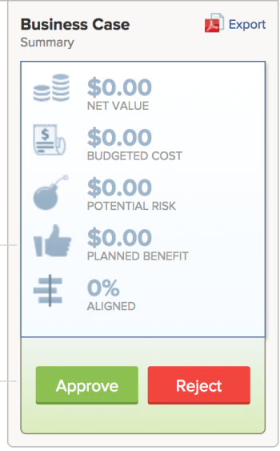

# Revisar projetos solicitados

Quando várias solicitações de projeto são enviadas para revisão, o escritório de gerenciamento de projetos ou o comitê do portfólio pode se reunir para revisar as solicitações enviadas e determinar as aprovações das solicitações do projeto. As solicitações de projeto são exibidas como projetos com status [!UICONTROL Solicitado] em [!DNL Adobe Workfront].

Você pode submeter uma solicitação de projeto para revisão seguindo um destes procedimentos:

* Alterar o status do projeto para **[!UICONTROL Solicitado]**.
* Conclua o [!UICONTROL Business Case] do projeto e envie-o para aprovação.\
   Para obter mais informações sobre como concluir um Plano de Negócio para um projeto, consulte [Criar um Plano de Negócio para um projeto](../../../manage-work/projects/define-a-business-case/create-business-case.md).

Você pode revisar projetos solicitados nas seguintes áreas do [!DNL Adobe Workfront]:

* Em um relatório de projeto
* Em um portfólio

## Requisitos de acesso

Você deve ter o seguinte acesso para executar as etapas deste artigo:

<table style="table-layout:auto"> 
 <col> 
 <col> 
 <tbody> 
  <tr> 
   <td role="rowheader">[!DNL Adobe Workfront] plano*</td> 
   <td> 
[!UICONTROL Business] ou superior
 </td> 
  </tr> 
  <tr> 
   <td role="rowheader">[!DNL Adobe Workfront] licença*</td> 
   <td> 
[!UICONTROL Plano] 
 </td> 
  </tr> 
  <tr> 
   <td role="rowheader">Configurações de nível de acesso*</td> 
   <td> 
Acesso de [!UICONTROL View] ou superior a Portfolio
 
[!UICONTROL Editar] acesso a Projetos
 
Observação: se você ainda não tiver acesso, pergunte ao administrador do [!DNL Workfront] se ele definiu restrições adicionais no seu nível de acesso. Para obter informações sobre como um administrador do [!DNL Workfront] pode alterar seu nível de acesso, consulte <a href="../../../administration-and-setup/add-users/configure-and-grant-access/create-modify-access-levels.md" class="MCXref xref">Criar ou modificar níveis de acesso personalizados</a>.
 </td> 
  </tr> 
  <tr> 
   <td role="rowheader">Permissões de objeto</td> 
   <td> 
Permissões de [!UICONTROL View] ou superiores no portfólio
 
Permissões [!UICONTROL Manage] nos projetos para atualizar seu status
 
Para obter informações sobre como solicitar acesso adicional, consulte <a href="../../../workfront-basics/grant-and-request-access-to-objects/request-access.md" class="MCXref xref">Solicitar acesso aos objetos </a>.
 </td> 
  </tr> 
 </tbody> 
</table>

&#42;Para saber qual plano, tipo de licença ou acesso você tem, contate o administrador do [!DNL Workfront].

## Revisar projetos solicitados em um relatório de projeto

Você pode criar um relatório para projetos para ver quais projetos têm status de [!UICONTROL Solicitado].

Para obter mais informações sobre como aprovar solicitações de projeto criando um relatório de projeto, consulte a seção [[!UICONTROL Aprovando o Business Case Criando um Relatório de Projeto]](../../../manage-work/projects/define-a-business-case/approve-business-case.md#build-a-report) em [Aprovar um Business Case](../../../manage-work/projects/define-a-business-case/approve-business-case.md). 

## Revisar projetos solicitados em um portfólio

1. Vá para o portfólio cujos projetos solicitados você deseja revisar.
1. Clique em&#x200B;**[!UICONTROL Projetos]** no painel esquerdo
1. No menu suspenso **[!UICONTROL Filtro]**, selecione **[!UICONTROL Solicitado]**.

   Somente projetos com status **[!UICONTROL Solicitado]** são exibidos na lista.

   >[!TIP]
   >
   > Além de ter o status **[!UICONTROL Solicitado]**, os projetos devem ser associados ao Portfolio selecionado para serem exibidos nesta lista.

1. Clique no nome de um projeto na lista para abri-lo.
1. Clique em **[!UICONTROL Detalhes do projeto]** no painel esquerdo.
1. Siga um destes procedimentos:

   * Clique em **[!UICONTROL Business Case]** e em **[!UICONTROL Aprovar]** ou **[!UICONTROL Rejeitar]** na área [!UICONTROL Resumo de Business Case] para aprovar ou rejeitar o Business Case.

     

     O status do projeto será alterado para **[!UICONTROL Aprovado]** se o Business Case for aprovado.

     O status do projeto será alterado para **[!UICONTROL Rejeitado]** se o Plano de Negócio for rejeitado.

     >[!NOTE]
     >
     >Não há notificações que alertem o usuário que enviou a aprovação do business case se a solicitação do projeto foi aprovada ou rejeitada. 

     Ou

   * Altere o status do projeto para qualquer outro status no menu suspenso **[!UICONTROL Status]**.

     
 

 
