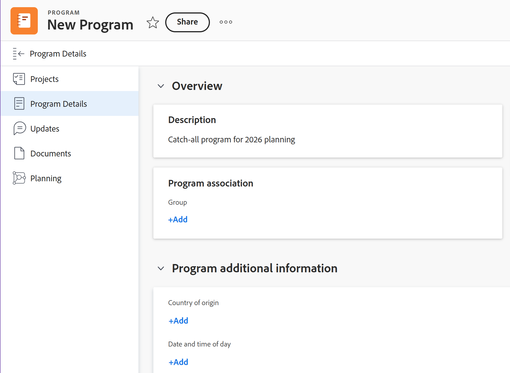

# Editar programas

É possível editar informações sobre programas que você criou ou que outros usuários criaram se compartilharam com você.

Você pode editar um programa na página do programa ou pode editar programas em uma lista.

## Requisitos de acesso

Você deve ter o seguinte acesso para executar as etapas neste artigo:

<table style="table-layout:auto"> 
 <col> 
 <col> 
 <tbody> 
  <tr> 
   <td role="rowheader">[!DNL Adobe Workfront] plano*</td> 
   <td> 
Qualquer Um
 </td> 
  </tr> 
  <tr> 
   <td role="rowheader">[!DNL Adobe Workfront] licença*</td> 
   <td> 
[!UICONTROL Plan] 
 </td> 
  </tr> 
  <tr> 
   <td role="rowheader">Nível de acesso*</td> 
   <td> 
Acesso à [!UICONTROL Editar] para programas
 
Observação: Se ainda não tiver acesso, pergunte ao seu [!DNL Workfront] administrador se eles definirem restrições adicionais em seu nível de acesso. Para obter informações sobre o acesso a programas em seu Nível de acesso, consulte <a href="../../../administration-and-setup/add-users/configure-and-grant-access/grant-access-programs.md" class="MCXref xref">Conceder acesso aos programas</a>. Para obter informações sobre como uma [!DNL Workfront] administrador pode alterar seu nível de acesso, consulte <a href="../../../administration-and-setup/add-users/configure-and-grant-access/create-modify-access-levels.md" class="MCXref xref">Criar ou modificar níveis de acesso personalizados</a>. 
 </td> 
  </tr> 
  <tr> 
   <td role="rowheader">Permissões de objeto</td> 
   <td> 
Permissões do [!UICONTROL Gerenciar] para um programa
 
 Para obter informações sobre a concessão de permissões para programas, consulte <a href="../../../workfront-basics/grant-and-request-access-to-objects/share-a-program.md" class="MCXref xref">Compartilhar um programa </a>. 
 
Para obter informações sobre a solicitação de permissões adicionais, consulte <a href="../../../workfront-basics/grant-and-request-access-to-objects/request-access.md" class="MCXref xref">Solicitar acesso a objetos </a>.
 </td> 
  </tr> 
 </tbody> 
</table>

&#42;Para descobrir qual plano, tipo de licença ou acesso você tem, entre em contato com seu [!DNL Workfront] administrador.

## Editar programas

1. Vá para o **[!UICONTROL Menu principal]**.
1. Clique em **[!UICONTROL Programas]**, em seguida, clique no nome de um programa para abri-lo.

   >[!TIP]
   >
   >Você pode acessar um programa do portfólio ao qual ele está associado acessando primeiro o portfólio e clicando em **[!UICONTROL Programas]** no painel esquerdo. Para obter mais informações, consulte [Criar um programa](../../../manage-work/portfolios/create-and-manage-programs/create-program.md).

1. (Opcional) Para editar informações limitadas sobre o programa, clique em **[!UICONTROL Detalhes do programa]** no painel esquerdo.

   >[!TIP]
   >
   >Se quiser editar todas as informações sobre o programa, vá para a etapa 4.

   

   >[!NOTE]
   >
   >Dependendo de como o [!DNL Workfront] administrador ou administrador de grupo modificou seu Modelo de layout, os campos na [!UICONTROL Detalhes do programa] pode ser reorganizada ou não ser exibida. Para obter mais informações, consulte [Personalize o [!UICONTROL Detalhes] exibir usando um modelo de layout](../../../administration-and-setup/customize-workfront/use-layout-templates/customize-details-view-layout-template.md).

   <!--
   
(NOTE: the above note will also come to the Edit Program box)

   -->

   Para editar informações na [!UICONTROL Detalhes] faça o seguinte:

   1. (Opcional) Clique no botão **[!UICONTROL Recolher Tudo]** ícone no canto superior direito para recolher todas as áreas.
   1. (Opcional e condicional) Quando uma área for recolhida, clique no botão **seta apontando para a direita**  ao lado de cada área para expandir a área que você deseja editar.
   1. Para obter informações sobre os campos visíveis no [!UICONTROL Detalhes do programa] , continue com a edição do programa no [!UICONTROL Editar programa] conforme descrito abaixo.
   1. (Opcional) Se não houver formulários personalizados anexados ao programa, comece a digitar o nome de um formulário no **[!UICONTROL Adicionar formulário personalizado]** , selecione-o quando for exibido na lista e clique em **[!UICONTROL Salvar alterações]**.
   1. (Opcional) Clique no botão **[!UICONTROL Exportar]** ícone  para exportar o [!UICONTROL Visão geral] e informações personalizadas de formulários para um arquivo PDF, em seguida, clique em **[!UICONTROL Exportar]**. Selecione uma das opções a seguir:

      * Selecionar tudo (é exibido somente quando há pelo menos um formulário personalizado anexado)
      * [!UICONTROL Visão geral]
      * O nome de um ou vários formulários personalizados

      O arquivo PDF é baixado para o computador.

      

      Para obter mais informações, consulte [Exportar formulários personalizados e detalhes do objeto](../../../workfront-basics/work-with-custom-forms/export-custom-forms-details.md).

1. Para editar todas as informações sobre um ou mais programas, siga um destes procedimentos:

   * Clique no botão **[!UICONTROL Mais]** menu  ao lado do nome do programa, em seguida, &#x200B;**[!UICONTROL Editar].**
   * Vá para uma lista de programas, selecione um ou mais programas que deseja editar e clique no botão **[!UICONTROL Editar]** ícone  na parte superior da lista.

   O **[!UICONTROL Editar programa]** será exibida.

   

   Todos os campos do programa estão disponíveis na variável [!UICONTROL Editar programa] e são agrupadas pelas áreas listadas no painel esquerdo.

1. Considere especificar informações em qualquer uma das seguintes seções:

   * [[!UICONTROL Visão geral]](#overview)
   * [[!UICONTROL Formulários personalizados]](#Custom%C2%A0F)
   * [[!UICONTROL Comentário]](#comment)

### [!UICONTROL Visão geral] {#overview}

1. Comece a editar um programa conforme descrito acima.
1. Clique em **[!UICONTROL Visão geral]** e especifique os seguintes campos:

   <!--
   
(NOTE:&nbsp;note below drafted for now)

   -->

   <!--
   <note type="note">
   Depending on how your Workfront administrator or Group administrator sets up our Layout Template, the fields in the Edit Program box might be rearranged or not display. For information, see
   <a href="../../../administration-and-setup/customize-workfront/use-layout-templates/customize-details-view-layout-template.md" class="MCXref xref">Customize the Details view using a layout template</a>.
   </note>
   -->

   <table style="table-layout:auto"> 
    <col> 
    <col> 
    <tbody> 
     <tr> 
      <td role="rowheader">[!UICONTROL Name]</td> 
      <td> 
Atualize o nome do programa. 
 
Dica: Isso não está disponível quando você selecionou mais de um programa. 
 </td> 
     </tr> 
     <tr> 
      <td role="rowheader">[!UICONTROL Descrição]</td> 
      <td> 
Digite uma descrição para o Portfolio para indicar o que é exclusivo sobre ele. 
 </td> 
     </tr> 
     <tr> 
      <td role="rowheader">[!UICONTROL Gerenciador do programa]</td> 
      <td> 
Comece a digitar o nome de um usuário que você deseja indicar como o gerente do programa e selecione-o quando ele for exibido na lista. Quem pode fiscalizar o trabalho definido nos projetos do programa é essa pessoa. 
 
Importante: Quando você designa alguém como o Gerenciador de programas, ele obtém automaticamente as permissões do [!UICONTROL Manager] para o programa e os projetos do programa. 
 
Dica: Você pode atualizar rapidamente o gerente do programa no cabeçalho do programa. 
 </td> 
     </tr> 
     <tr> 
      <td role="rowheader">[!UICONTROL Grupo]</td> 
      <td> 
Adicione o nome de um único grupo se ele estiver associado ao programa ou tiver a responsabilidade de completá-lo. 
 
Dica:  
Ao acessar o campo [!UICONTROL Group] da página [!UICONTROL Program Details], faça o seguinte: 
 
Certifique-se de selecionar o grupo correto ao passar o mouse sobre ele e clicar no ícone [!UICONTROL informações]  que é exibido ao lado dele. Isso exibe uma dica de ferramenta listando informações sobre o grupo, como a hierarquia de grupos acima dele e seus administradores.
 
  
 
Essa opção não está disponível na caixa [!UICONTROL Editar programa]. 
 
 </td> 
     </tr> 
     <tr> 
      <td role="rowheader">[!UICONTROL Está Ativo]</td> 
      <td> 
 Marque essa caixa de seleção se desejar que o programa esteja ativo. Outros usuários podem encontrar programas ativos e anexá-los a projetos ou adicioná-los a portfólios. Os programas inativos não podem ser anexados a projetos ou portfólios. Isso é ativado por padrão.
 </td> 
     </tr> 
    </tbody> 
   </table>

1. Clique em **[!UICONTROL Salvar alterações]** ou continue editando as seções a seguir.

### [!UICONTROL Formulários personalizados]

1. Comece a editar o programa conforme descrito acima.
1. Clique no botão **[!UICONTROL Adicionar Forms]** menu suspenso para selecionar um formulário personalizado e adicioná-lo ao programa.

   Você deve criar formulários personalizados do programa antes que eles estejam disponíveis para adição.

   >[!NOTE]
   >
   >Dependendo de como o [!DNL Workfront] O administrador definiu as permissões para as seções em seu formulário personalizado. Nem todos podem exibir ou editar os mesmos campos em um determinado formulário personalizado. As permissões para editar campos em uma seção de um formulário personalizado dependem das permissões que você tem no próprio programa. Para obter informações sobre como configurar permissões em seções de um formulário personalizado, consulte [Criar ou editar um formulário personalizado](../../../administration-and-setup/customize-workfront/create-manage-custom-forms/create-or-edit-a-custom-form.md).

1. Atualize quaisquer campos nos formulários personalizados e clique em **[!UICONTROL Salvar alterações]** ou continue com a seção a seguir.

### [!UICONTROL Comentário] {#comment}

1. Comece a editar um programa conforme descrito acima.
1. Clique em **[!UICONTROL Comentário]**.

   

1. Adicione um comentário na **[!UICONTROL Publicar uma atualização no programa]** campo.
1. (Opcional) Clique no botão **[!UICONTROL Pessoas]** ícone para adicionar um usuário ou uma equipe ao comentário.
1. (Opcional) Clique no botão **[!UICONTROL Bloquear]** ícone para bloquear o comentário e torná-lo privado somente para usuários em sua empresa.

   Depois de salvar as alterações, o comentário adicionado é exibido no relatório de [!UICONTROL Atualizações] e envia um email para os usuários incluídos nela.
