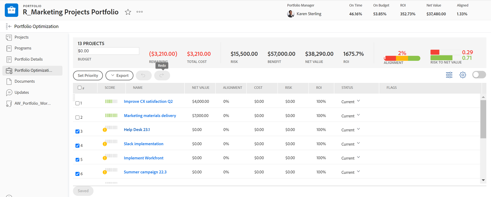
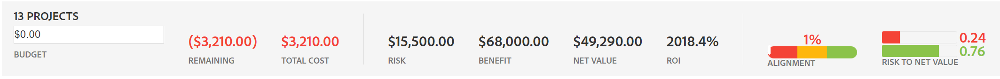

# Visão geral do [!UICONTROL Portfolio Otimizer]

<!-- Audited: 01/2024 -->

O [!UICONTROL Portfolio Otimizer] é a ferramenta usada para avaliação e comparação do projeto. O processo de revisar e comparar valores de [!UICONTROL Caso de Negócios] para projetos atribuídos a um portfólio é como um gerente de portfólio pode priorizar projetos e gerar o maior valor para uma organização.

A finalidade do [!UICONTROL otimizador de portfólio] é fornecer uma interface através da qual um gerente de portfólio, comitê de direção ou escritório de gerenciamento de produtos possa exibir informações resumidas sobre o business case de cada projeto. Os projetos podem então ser priorizados de acordo com valores e objetivos estratégicos ou de acordo com sua pontuação geral.

O [!UICONTROL Portfolio Otimizer] só poderá ajudá-lo se você tiver concluído os seguintes pré-requisitos:

* Os [!UICONTROL Casos de Negócios] foram concluídos nos projetos. Para obter informações, consulte os artigos em [Definir um Business Case: índice do artigo](../../projects/define-a-business-case/define-business-case.md).
* Um portfólio é definido na área Visão geral do projeto da seção Detalhes do projeto para os projetos que você deseja revisar.
* Você indicou o Orçamento do Projeto e o Benefício Planejado para os projetos que deseja revisar. Custo Fixo e Receita Fixa são opcionais, mas adicionam valor. Para obter informações, consulte [Campos de finanças do projeto](../../projects/project-finances/project-finances-overview-1.md).

Para obter informações sobre como localizar o [!UICONTROL Portfolio Otimizer], consulte [Localizar o [!UICONTROL Portfolio Otimizer]](../../../manage-work/portfolios/portfolio-optimizer/locate-portfolio-optimizer.md).

## Finanças no [!UICONTROL Portfolio Otimizer]

Você pode ver o estado financeiro do seu portfólio a qualquer momento durante a vida útil de seus projetos ao usar o [!UICONTROL Portfolio Otimizer].

Considere o seguinte ao trabalhar com finanças no [!UICONTROL Portfolio Otimizer]:

* Cada projeto recebe uma pontuação quando seu [!UICONTROL Business Cases] é concluído de acordo com os critérios que ele corresponde no [!UICONTROL Portfolio Otimizer]. Por exemplo, projetos de baixo custo ou de alto alinhamento recebem uma pontuação mais alta.

  Para obter mais informações sobre como calcular a pontuação do otimizador de portfólio de um projeto, consulte [Visão geral da [!UICONTROL Pontuação do Otimizador de Portfolio]](../../../manage-work/portfolios/portfolio-optimizer/portfolio-optimizer-score.md).

* Os cálculos financeiros do [!UICONTROL Portfolio Otimizer] usam o [!UICONTROL Custo Orçado] no [!UICONTROL Business Case] do projeto.
* Você pode priorizar manualmente seus projetos no [!UICONTROL Portfolio Otimizer], levando em conta todas as informações sobre eles. Isso inclui dados financeiros, alinhamento aos cartões de pontuação e ROI, por exemplo.

### As áreas financeiras no [!UICONTROL Portfolio Otimizer] {#the-financial-areas-in-the-portfolio-optimizer}

Você pode exibir informações financeiras nas seguintes áreas do [!UICONTROL Portfolio Otimizer]:

* **[!UICONTROL Cabeçalho do Portfolio]**: esta área exibe informações financeiras coletadas de todos os projetos no portfólio. Ele é exibido em cada guia do objeto Portfolio.
* **[!UICONTROL Portfolio Finances para Projetos Selecionados]**: esta área exibe informações financeiras coletadas dos projetos selecionados no [!UICONTROL Portfolio Otimizer]. É possível adicionar ou remover projetos e entender como isso afetará as finanças do portfólio, visualizando as informações nesta área.
* **[!UICONTROL Finanças do Projects]**: esta área exibe as informações financeiras de cada projeto listado no [!UICONTROL Portfolio Otimizer].

### Os campos financeiros no [!UICONTROL Portfolio Otimizer] {#the-financial-fields-in-the-portfolio-optimizer}

Os seguintes campos financeiros são exibidos no [!UICONTROL Portfolio Otimizer]:

* [cabeçalho do Portfolio](#portfolio-header)
* [Finanças do Portfolio para projetos selecionados](#portfolio-finances-for-selected-projects)

#### cabeçalho do Portfolio {#portfolio-header}

[!DNL Adobe Workfront] calcula os campos financeiros no cabeçalho do portfólio usando informações de projetos com status que equivalem apenas a [!UICONTROL Aprovado] ou [!UICONTROL Atual].

<table style="table-layout:auto"> 
 <col> 
 <col> 
 <thead> 
  <tr> 
   <th><strong>Nome do campo</strong> </th> 
   <th><strong>Descrição</strong> </th> 
  </tr> 
 </thead> 
 <tbody> 
  <tr> 
   <td>[!UICONTROL No Prazo]</td> 
   <td> 
A porcentagem de projetos no portfólio que são considerados [!UICONTROL No Prazo]. Isso é visível em qualquer guia dentro de um portfólio.
 
Um projeto é considerado [!UICONTROL No Prazo] quando a <strong>[!UICONTROL Condição]</strong> do Projeto é <strong>[!UICONTROL No Destino]</strong>.  Para obter mais informações sobre [!UICONTROL Condições de Projeto], consulte o artigo <a href="../../../manage-work/projects/manage-projects/project-condition-and-condition-type.md" class="MCXref xref">Visão Geral de Condição de Projeto e Tipo de Condição</a>.
 
A porcentagem <strong>[!UICONTROL No Tempo]</strong> é calculada usando a seguinte fórmula:
 
<em>[!UICONTROL Porcentagem de Portfolio no Prazo] = Número de [!UICONTROL no Prazo] Projetos/ Número Total de Projetos em um status [!UICONTROL Atual] ou [!UICONTROL Aprovado]</em> 
 </td> 
  </tr> 
  <tr> 
   <td>[!UICONTROL Na Estimativa]</td> 
   <td> 
A porcentagem de projetos no portfólio que são considerados [!UICONTROL On Budget]. Isso é visível em qualquer guia dentro de um [!UICONTROL portfolio].
 
Os projetos são <strong>[!UICONTROL No Orçamento]</strong> quando não excederam seu orçamento predefinido.  Para obter mais informações sobre o orçamento de um projeto, consulte o artigo <a href="../../../manage-work/projects/project-finances/manage-project-finance-area.md" class="MCXref xref">[!UICONTROL Manager] informações na área Finanças do projeto</a>.
 
A porcentagem de [!UICONTROL On Budget] é calculada usando a seguinte fórmula:
 
<em>[!UICONTROL Na Porcentagem de Portfolio do Orçamento] = Número de [!UICONTROL No Orçamento] Projetos/ Número Total de Projetos </em><em>em um status [!UICONTROL Atual] ou [!UICONTROL Aprovado]</em> 
 </td> 
  </tr> 
  <tr> 
   <td>ROI (para portfólio)</td> 
   <td> 
O [!UICONTROL Retorno sobre o Investimento] (ROI) do portfólio é calculado levando-se em conta o total de [!UICONTROL Benefício] da [!UICONTROL Portfolio] e o total dos [!UICONTROL Custos Orçados] dos projetos. Isso é visível em qualquer guia dentro de um portfólio.
 
O valor de ROI do Portfolio é calculado usando a seguinte fórmula:
 
<em>ROI do Portfolio = ([!UICONTROL Benefício Total] - [!UICONTROL Custo Total Orçado])/ [!UICONTROL Custo Total] * 100</em> 
 
Para obter mais informações sobre como o ROI é calculado para um projeto, consulte o artigo <a href="../../../manage-work/projects/project-finances/calculate-roi.md" class="MCXref xref">Calcular Retorno sobre o Investimento (ROI)</a>.
 </td> 
  </tr> 
  <tr> 
   <td>[!UICONTROL Alinhado] ou [!UICONTROL Pontuação de Alinhamento] </td> 
   <td> 
Uma média de todos os valores de [!UICONTROL Pontuação de Alinhamento de Projeto], que são calculados após a conclusão do [!UICONTROL Scorecard] no [!UICONTROL Business Case] do projeto. A pontuação de alinhamento de cada projeto está listada na coluna [!UICONTROL Alinhamento] do [!UICONTROL Portfolio Otimizer]. Isso é visível em qualquer guia dentro de um portfólio.
 
Para obter mais informações sobre como gerar uma pontuação de alinhamento para um projeto, consulte o artigo <a href="../../../manage-work/projects/define-a-business-case/apply-scorecard-to-project-to-generate-alignment-score.md" class="MCXref xref">Aplicar um cartão de pontuação a um projeto e gerar uma Pontuação de Alinhamento</a>.
 </td> 
  </tr> 
  <tr> 
   <td>[!UICONTROL Valor de Rede]</td> 
   <td> 
A soma de todos os [!UICONTROL Valores Líquidos] de todos os projetos no portfólio. Isso é visível em qualquer guia dentro de um portfólio.
 
Para obter mais informações sobre como o [!UICONTROL Valor Líquido] é calculado para um projeto, consulte o artigo <a href="../../../manage-work/projects/project-finances/calculate-net-value.md" class="MCXref xref">Calcular Valor Líquido</a>.
 </td> 
  </tr> 
 </tbody> 
</table>

#### Finanças do Portfolio para projetos selecionados {#portfolio-finances-for-selected-projects}

<table style="table-layout:auto"> 
 <col> 
 <col> 
 <thead> 
  <tr> 
   <th><strong>Nome do campo</strong> </th> 
   <th><strong>Descrição</strong></th> 
  </tr> 
 </thead> 
 <tbody> 
  <tr> 
   <td>[!UICONTROL Número de projetos]</td> 
   <td> 
O número total de projetos ativos no portfólio. Os projetos considerados ativos em um portfólio podem estar em qualquer um dos seguintes status:
 
    <ul> 
     <li>[!UICONTROL Atual]</li> 
     <li>[!UICONTROL Planning]</li> 
     <li>[!UICONTROL Aprovado]</li> 
    </ul> </td> 
  </tr> 
  <tr> 
   <td>[!UICONTROL Orçamento]</td> 
   <td>Você pode atualizar manualmente esse campo para indicar qual é o orçamento total de todo o portfólio. Esse orçamento é usado para todos os projetos dentro do portfólio. </td> 
  </tr> 
  <tr> 
   <td>[!UICONTROL Restante]</td> 
   <td> 
O orçamento restante após todos os [!UICONTROL Budgeted Costs] em todos os projetos dentro do portfólio foi subtraído do orçamento do portfólio.
 
A [!UICONTROL Orçamento Restante do Portfolio] é calculada usando a seguinte fórmula:
 
<em>[!UICONTROL Orçamento Restante do Portfolio] = [!UICONTROL Orçamento Total do Portfolio] - Total [!UICONTROL Custo Orçado] de Todos os Projetos Portfolio</em> 
 
O [!UICONTROL Custo Orçado] geral de todos os projetos no portfólio é representado na barra de indicadores no campo Orçamento. 
 
Para obter mais informações sobre como rastrear custos em um projeto, consulte <a href="../../../manage-work/projects/project-finances/track-costs.md" class="MCXref xref">Rastrear custos</a>.
 </td> 
  </tr> 
  <tr> 
   <td>[!UICONTROL Custo Total]</td> 
   <td> 
A soma dos custos de todos os projetos exibidos no [!UICONTROL Portfolio Otimizer]. O custo de cada projeto é o mesmo que o [!UICONTROL Custo Orçado] do Projeto exibido no [!UICONTROL Resumo de Business Case]. 
 
Para obter mais informações sobre os campos financeiros de projetos no [!UICONTROL Business Case], consulte a seção "Entendendo os Campos Financeiros no Business Case" no artigo <a href="../../../manage-work/projects/define-a-business-case/create-business-case.md" class="MCXref xref">Criar um Business Case para um projeto</a>.
 </td> 
  </tr> 
  <tr> 
   <td>[!UICONTROL Risco] </td> 
   <td> 
A soma de todos os [!UICONTROL Custos de Risco Potencial] de todos os projetos no portfólio. O [!UICONTROL Custo do Risco Potencial] de cada projeto está listado na coluna [!UICONTROL Risco] do [!UICONTROL Portfolio Otimizer]. 
 
Para obter mais informações sobre como calcular riscos para projetos, consulte o artigo <a href="../../../manage-work/projects/project-finances/potential-risk-cost.md" class="MCXref xref">Calcular Custo do Risco Potencial</a>.
 </td> 
  </tr> 
  <tr> 
   <td>[!UICONTROL Benefício]</td> 
   <td> 
A soma de todos os valores de [!UICONTROL Benefício Planejado] de todos os projetos no portfólio. O valor de Benefício Planejado de cada projeto está listado na coluna [!UICONTROL Benefício] do [!UICONTROL Portfolio Otimizer]. 
 
Para obter mais informações sobre o [!UICONTROL Benefício Planejado] de um projeto, consulte o artigo <a href="../../../manage-work/projects/project-finances/project-planned-benefit.md" class="MCXref xref">Visão Geral do Benefício Planejado do projeto</a>.
 </td> 
  </tr> 
  <tr> 
   <td>Indicador de [!UICONTROL Risco de Valor Líquido]</td> 
   <td> 
Mede o valor de [!UICONTROL Risco Potencial], levando em conta o [!UICONTROL Valor Líquido] fornecido por todos os projetos no portfólio. Para obter a maior eficiência do portfólio, o indicador [!UICONTROL Risco] é baixo e o indicador [!UICONTROL Valor Líquido] é alto. 
 
Para obter mais informações sobre como calcular o Risco de [!UICONTROL Valor Líquido], consulte o artigo <a href="../../../manage-work/portfolios/portfolio-optimizer/calculate-risk-to-net-value-in-portfolio.md" class="MCXref xref">Calcular o Risco de Valor Líquido em um portfólio</a>.
 </td> 
  </tr> 
 </tbody> 
</table>

## Personalizar o [!UICONTROL Portfolio Otimizer]

Você pode personalizar apenas a área da lista de projetos do [!UICONTROL Portfolio Otimizer] usando configurações para alterar as informações na lista.

Os ícones e opções a seguir estão disponíveis para o [!UICONTROL Portfolio Otimizer]:

<table style="table-layout:auto"> 
 <col> 
 <col> 
 <col> 
 <tbody> 
  <tr> 
   <td><strong>Ícone no Portfolio Otimizer</strong></td> 
   <td><strong>Nome</strong></td> 
   <td><strong>Função</strong></td> 
  </tr> 
  <tr> 
   <td>  </td> 
   <td>[!UICONTROL Definir prioridade de projeto]</td> 
   <td>
Use esse ícone quando quiser salvar a ordem do projeto, com base em sua prioridade.

   
Você deve ter permissões de Gerenciamento para todos os projetos da lista para poder usar <b>Definir prioridade do projeto</b>
.
    </td> 
  </tr> 
  <tr> 
   <td>  </td> 
   <td>[!UICONTROL Otimizar portfólio]</td> 
   <td>Use este ícone para otimizar o portfólio com base nos seguintes valores financeiros dos projetos:
    <ul>
     <li>[!UICONTROL Custo]</li>
     <li>[!UICONTROL Alinhamento]</li>
     <li>[!UICONTROL Valor]</li>
     <li>[!UICONTROL Risco para Benefício]</li>
     <li>[!UICONTROL ROI]</li>
    </ul>
Para obter mais informações sobre como otimizar seu portfólio, consulte o artigo <a href="../../../manage-work/portfolios/portfolio-optimizer/optimize-projects-in-portfolio-optimizer.md" class="MCXref xref">Otimizar projetos no [!UICONTROL Portfolio Otimizer]</a>.
</td> 
  </tr> 
  <tr> 
   <td>  </td> 
   <td>Ícones de [!UICONTROL Desfazer]/ [!UICONTROL Refazer]</td> 
   <td>Use esses ícones para cancelar ou refazer as alterações feitas no [!UICONTROL Portfolio Otimizer] antes de salvar.</td> 
  </tr> 
  <tr> 
   <td>  </td> 
   <td>[!UICONTROL Mostrar]/[!UICONTROL Ocultar] projetos desmarcados</td> 
   <td>Use esses ícones para exibir ou ocultar os projetos no portfólio que você desmarcou.</td> 
  </tr> 
  <tr> 
   <td>  </td> 
   <td>[!UICONTROL Exportar] </td> 
   <td> 
Use este ícone para exportar os dados na área [!UICONTROL Priorização de Projeto] do [!UICONTROL Portfolio Otimizer]. É possível exportá-la para os seguintes formatos:
 
    <ul> 
     <li>PDF</li> 
     <li>[!DNL Excel]</li> 
     <li>Delimitado pela [!UICONTROL Tab]</li> 
    </ul> </td> 
  </tr> 
  <tr> 
   <td>  </td> 
   <td>[!UICONTROL Preferências]</td> 
   <td> 
Use este ícone para modificar os campos de projeto exibidos nas colunas do [!UICONTROL Portfolio Otimizer] ou para modificar quais projetos você exibe no [!UICONTROL Otimizer], com base em seus status. 
 
Dica:  
     <ul> 
      <li> 
Nem todos os campos padrão [!DNL Workfront] estão disponíveis para serem adicionados nas colunas. 
 </li> 
     </ul> 
     <ul> 
      <li> 
Você pode adicionar somente campos personalizados com um valor diferente de zero em qualquer um dos projetos no portfólio.
 </li> 
     </ul> 
 </td> 
  </tr> 
 </tbody> 
</table>
