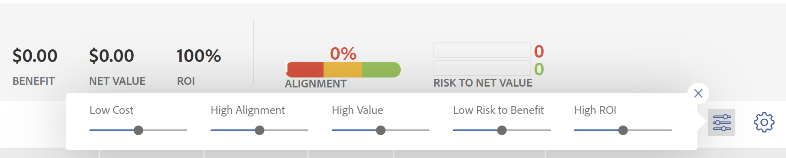

# Visão geral da pontuação do [!UICONTROL Portfolio Otimizer]

<!--Audited: 01/2025-->

Você pode encontrar a pontuação [!UICONTROL Portfolio Otimizer] no [!UICONTROL Portfolio Otimizer]. Ele é exibido na coluna **[!UICONTROL Pontuação]** para cada projeto. Isso representa uma pontuação para cada projeto no portfólio.

Para obter informações sobre como localizar o [!UICONTROL Portfolio Otimizer], consulte o artigo [[!UICONTROL visão geral do Portfolio Otimizer]](../../../manage-work/portfolios/portfolio-optimizer/portfolio-optimizer-overview.md).

Para obter informações sobre como [!DNL Adobe Workfront] usa a Pontuação do projeto e outras informações do projeto para otimizar projetos no [!UICONTROL Portfolio Otimizer], consulte [Otimizar projetos no Portfolio Otimizer](../../../manage-work/portfolios/portfolio-optimizer/optimize-projects-in-portfolio-optimizer.md).

## Diferença entre a [!UICONTROL Pontuação de Alinhamento] e a [!UICONTROL Pontuação do Portfolio Otimizer]

Há uma diferença entre a pontuação de alinhamento e a pontuação do otimizador de portfólio de um projeto.

A pontuação de alinhamento de um projeto é calculada com base nos pontos obtidos após concluir o cartão de pontuação. Essa pontuação é então usada para determinar a pontuação de alinhamento do portfólio. A pontuação de alinhamento é exibida como uma porcentagem.

A pontuação de alinhamento de um projeto é exibida na coluna **[!UICONTROL Alinhamento]** do [!UICONTROL Portfolio Otimizer] ou no campo [!UICONTROL Alinhamento] do [!UICONTROL Resumo do Business Case].


Para obter mais informações sobre como gerar a pontuação de alinhamento de um projeto, consulte o artigo [Aplicar um cartão de pontuação a um projeto e gerar uma Pontuação de Alinhamento](../../../manage-work/projects/define-a-business-case/apply-scorecard-to-project-to-generate-alignment-score.md).

A pontuação do [!UICONTROL otimizador de portfólio] é uma classificação calculada automaticamente no [!UICONTROL Portfolio Otimizer] pela qual os projetos podem ser priorizados. A pontuação do otimizador de portfólio é exibida como um ícone de indicador acompanhado por um número e exibida na coluna **[!UICONTROL Pontuação]** do [!UICONTROL Portfolio Otimizer].

>[!NOTE]
>
>Um projeto só poderá ser pontuado no [!UICONTROL Portfolio Otimizer] se o Business Case tiver sido concluído. Para obter mais informações sobre como concluir um Business Case, consulte o artigo [[!UICONTROL Criar um Business Case] para um projeto](../../../manage-work/projects/define-a-business-case/create-business-case.md).


A pontuação para cada projeto é calculada com base na importância das seguintes categorias:

* [!UICONTROL Custo]
* [!UICONTROL Alinhamento]
* [!UICONTROL Valor Líquido]
* [!UICONTROL Risco de Benefício]
* [!UICONTROL ROI]

## Calcular a pontuação do [!UICONTROL Portfolio Otimizer]

<!--
<p data-mc-conditions="QuicksilverOrClassic.Draft mode">(NOTE: This was edited based on this issue, per Anna: https://hub.workfront.com/issue/603d0c58000095ea0bc00ce5e2110693/overview)</p>
-->

[!DNL Workfront] produz uma pontuação usando o [!UICONTROL Portfolio Otimizer], que é uma classificação para auxiliar na priorização de projetos. Os valores no portfólio são baseados em valores inseridos nos casos de negócios dos projetos e são usados para calcular uma pontuação para o projeto. Projetos com uma pontuação mais alta podem ser considerados de maior importância e podem ser priorizados para serem concluídos primeiro.

Para descobrir a classificação de um projeto, faça o seguinte:

1. Vá para o [!UICONTROL Portfolio Otimizer].
1. Passe o mouse sobre o ícone de classificação para ver a pontuação do otimizador de portfólio de um projeto.


O algoritmo para calcular as pontuações leva em consideração os valores descritos nos Casos de negócios dos projetos e os pesos que eles carregam. Ela atribui uma pontuação a cada projeto no otimizador e normaliza essa pontuação para que haja sempre um projeto com uma pontuação de 100. Isso dá uma pontuação alta para o melhor projeto.

>[!BEGINSHADEBOX]

**EXEMPLO**

Por exemplo, se você fizer do [!UICONTROL alinhamento superior] o único fator a ser considerado, o projeto com o alinhamento mais alto obterá a pontuação de 100.

>[!ENDSHADEBOX]

A seguir estão os critérios pelos quais você pode pontuar um projeto:

* [!UICONTROL Custo]
* [!UICONTROL Alinhamento]
* [!UICONTROL Valor]
* [!UICONTROL Risco de Benefício]
* [!UICONTROL ROI]



Para obter informações sobre como otimizar projetos no portfólio, consulte [Otimizar projetos no [!UICONTROL Portfolio Otimizer]](../../../manage-work/portfolios/portfolio-optimizer/optimize-projects-in-portfolio-optimizer.md).

Cada critério no painel de configuração ([!UICONTROL Custo], [!UICONTROL Alinhamento], [!UICONTROL ROI], [!UICONTROL Valor Líquido], [!UICONTROL Risco de Benefício]) recebe seu peso no intervalo de 0 a 100 com base no que você selecionou.

Para cada projeto com um business case completo, uma pontuação por critério é gerada usando a seguinte fórmula:

```
Score Per Criteria = (Project Value For The Criteria - AVG(all the project values for this criteria)) / Standard Deviation of that value for that project
```

**Exemplo:** Para a [!UICONTROL Pontuação do Alinhamento] para o Projeto A, você terá o seguinte:

```
Alignment Score = (Project A Alignment Score - AVG (of all the project Alignments)) / Standard Deviation of alignment score for that project
```

Depois de calcular todos os [!UICONTROL Pontuação por critério], você pode adicioná-los levando em conta seus pesos para obter a pontuação completa por projeto. A pontuação do projeto é calculada usando a seguinte fórmula:

```
Score = Cost Score * Cost Weight + Alignment Score * Alignment Weight + ROI Score * ROI Weight + Net Value Score * Net Value Weight + Risk Score * Risk Weight
```

Para o custo do projeto e [!UICONTROL risco] a lógica funciona de forma inversa da forma como os outros critérios funcionam: se você deseja que o [!UICONTROL Baixo Custo] seja importante para você, ele não vai aumentar, mas diminuir a pontuação geral do projeto em `Cost Score * Cost Weight`.

Depois de calcular as pontuações para cada projeto, a [!UICONTROL Pontuação de otimização] é definida da seguinte maneira para os projetos:

1. [!UICONTROL Pontuações mínimas] e [!UICONTROL máximas] estão definidas.
1. O intervalo entre esses valores é calculado.
1. Para cada projeto, a [!UICONTROL Pontuação de Otimização] é calculada usando a seguinte fórmula:

   ```
   Optimization Score = Rounded ((Score - Minimum / Range)*100)
   ```
