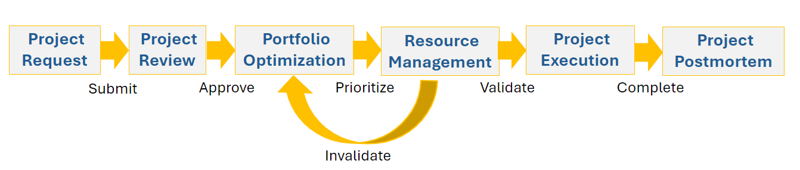

# Visão geral do gerenciamento do Portfolio

<!--Audited: 09/2024-->

## Visão Geral do Gerenciamento do Project Portfolio (PPM)

O Portfolio ou o Project Portfolio Management (PPM) é o processo de priorizar e gerenciar uma lista de projetos para atingir objetivos de negócios específicos.

Este artigo descreve os conceitos gerais para gerenciamento de portfólio. Para obter informações gerais sobre o gerenciamento de portfólios no Adobe Workfront, consulte [Entender a metodologia de portfólio](/help/quicksilver/manage-work/portfolios/portfolios-overview/portfolio-overview.md).

Um portfólio é uma coleção de projetos com metas comerciais comuns. O resultado de uma metodologia PPM eficaz permite aos executivos:

* Identifique todos os projetos em um portfólio.
* Entenda o impacto de cada projeto em recursos, custos e receita.
* Tome uma decisão inteligente e estratégica ao priorizar, selecionar ou remover projetos em um portfólio.

Normalmente, os profissionais de PPM usam as seguintes etapas para realizar PPM:

1. Crie critérios de avaliação para a seleção e a priorização de projetos.
1. Coletar solicitações de projeto.
1. Selecione vários projetos solicitados como um projeto de portfólio com base nos critérios criados.
1. Priorize os projetos selecionados usando os mesmos critérios.
1. Avaliar a disponibilidade de recursos para executar os projetos selecionados.
1. Revise e avalie o progresso dos projetos no portfólio e faça ajustes, se necessário.

## Visão geral do processo de PPM [!DNL Adobe Workfront]

Você pode priorizar seus projetos e garantir que eles estejam alinhados às suas metas e requisitos comerciais usando as ferramentas de Gerenciamento do Portfolio no [!DNL Workfront].

O diagrama a seguir ilustra a visão geral de alto nível do processo PPM em [!DNL Workfront]:

* [Solicitação de Projeto](#project-request)
* [Revisão do projeto](#project-review)
* [Otimização do Portfólio](#portfolio-optimization)
* [Gerenciamento de recursos](#resource-management)
* [Execução do projeto](#project-execution)
* [Projeto post-mortem](#project-postmortem)

### Solicitação de Projeto {#project-request}

O Project Portfolio Management é iniciado com uma solicitação de projeto. Nesta fase, um proprietário de projeto cria uma solicitação de projeto e a envia para análise a um comitê executivo ou ao Gerente da Portfolio. É quando eles concluem o Business Case do projeto e, em seguida, o enviam para aprovação.

Para obter mais informações sobre como criar um business case e uma solicitação de projeto, consulte [Criar um business case para um projeto](../../../manage-work/projects/define-a-business-case/create-business-case.md).

### Revisão do projeto {#project-review}

Depois que você envia a solicitação do projeto, o Gerente do Portfolio ou uma equipe executiva a revisa e decide se aprova o projeto. Se eles aprovarem o projeto, ele será selecionado para uma empresa, a Project Portfolio.

Para obter mais informações sobre portfólios, consulte [Entender a metodologia de portfólio](../../../manage-work/portfolios/portfolios-overview/portfolio-overview.md). Para obter mais informações sobre como aprovar um Business Case, consulte [Aprovar um Business Case](../../../manage-work/projects/define-a-business-case/approve-business-case.md).

### Otimização do Portfólio {#portfolio-optimization}

Depois de adicionar todos os projetos ao portfólio, o gerente da Portfolio os otimiza e prioriza de acordo com seu valor, alinhamento e benefício para a organização.

Para obter mais informações sobre otimização de portfólio, consulte [Otimizar projetos no Portfolio Otimizer](../../../manage-work/portfolios/portfolio-optimizer/optimize-projects-in-portfolio-optimizer.md).

### Gerenciamento de recursos {#resource-management}

Além de otimizar o desempenho do portfólio e priorizar os projetos, o Gerenciador de Recursos garante que os recursos adequados sejam alocados para os projetos. Eles avaliam a disponibilidade e a alocação dos recursos usando as ferramentas de Gerenciamento de Recursos disponíveis em [!DNL Workfront].

Dependendo da disponibilidade dos recursos, o Gerente do Portfolio pode precisar repriorizar os projetos.

Para obter mais informações sobre o Gerenciamento de Recursos, consulte a seção [Gerenciar recursos](../../../resource-mgmt/manage-resources.md).

### Execução do projeto {#project-execution}

Depois de receber a aprovação do projeto do Gerenciador de Portfolio e a validação dos recursos do Gerenciador de Recursos, como Proprietário do Projeto, você pode colocar o projeto no status [!UICONTROL Atual] e os usuários poderão iniciar o trabalho para concluir o projeto. Recomendamos capturar uma linha de base do projeto nesta fase, para ter um ponto de referência para o projeto, em seu estado original.

Para obter mais informações sobre como gerenciar projetos no [!DNL Workfront], consulte [Gerenciar projetos: índice do artigo](../../../manage-work/projects/manage-projects/manage-projects-overview.md).

Para obter mais informações sobre como criar linhas de base em projetos, consulte [Criar linhas de base de projeto](../../../manage-work/projects/create-projects/create-baselines.md).

### Projeto post-mortem {#project-postmortem}

Após a conclusão dos projetos no portfólio, é possível revisar o sucesso de cada projeto criando uma linha de base e comparando-a com a linha de base original.

Para obter mais informações sobre como criar linhas de base em projetos, consulte [Criar linhas de base de projeto](../../../manage-work/projects/create-projects/create-baselines.md).
