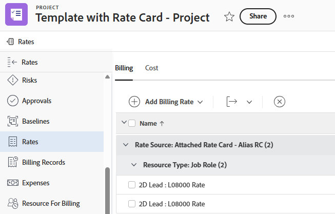

# Anexar um cartão de taxa a um modelo

Quando você atribui um cartão de taxa a um modelo, o cartão de taxa é anexado a todos os projetos criados a partir do modelo. O cartão de taxa se torna o padrão no projeto, mas pode ser substituído, se necessário.

Para obter informações sobre cartões de taxa, consulte [Gerenciar cartões de taxa](/help/quicksilver/administration-and-setup/manage-enterprise-operations/manage-rate-cards.md).

Para obter informações sobre modelos de projeto, consulte [Visão geral do modelo de projeto](/help/quicksilver/manage-work/projects/create-and-manage-templates/project-template-overview.md).

## Requisitos de acesso

+++ Expanda para visualizar os requisitos de acesso da funcionalidade neste artigo.

<table style="table-layout:auto"> 
 <col> 
 <col> 
 <tbody> 
  <tr> 
   <td>Pacote do Adobe Workfront</td> 
   <td>Workflow Ultimate</td> 
  </tr> 
  <tr> 
   <td>Licença do Adobe Workfront</td> 
   <td>Padrão</td> 
  </tr> 
  <tr> 
   <td>Configurações de nível de acesso</td> 
   <td>Editar acesso a modelos</td> 
  </tr> 
  <tr> 
   <td>Permissões de objeto</td> 
   <td>Gerenciar permissões para o cartão de taxa com permissões para Editar Taxas de Cobrança</td> 
  </tr> 
 </tbody> 
</table>

Para obter informações, consulte [Requisitos de acesso na documentação do Workfront](/help/quicksilver/administration-and-setup/add-users/access-levels-and-object-permissions/access-level-requirements-in-documentation.md).

+++

## Pré-requisitos

O cartão de taxa que você deseja atribuir ao modelo deve ser criado no Workfront. Para obter mais informações, consulte [Gerenciar cartões de taxa](/help/quicksilver/administration-and-setup/manage-enterprise-operations/manage-rate-cards.md).

O campo **Cartão de Taxa** deve ser habilitado para Modelos no seu modelo de layout.

1. No modelo de layout, clique na seta para baixo em **Personalizar o que os usuários veem** e clique em **Modelo**.
1. Na seção **Detalhes**, selecione o campo **Cartão de Taxa** na área **Visão geral**.

   Para obter mais informações, consulte [Personalizar o modo de exibição de Detalhes usando um modelo de layout](/help/quicksilver/administration-and-setup/customize-workfront/use-layout-templates/customize-details-view-layout-template.md).

## Anexar um cartão de taxa a um modelo

{{step1-to-templates}}

1. Crie um novo modelo ou edite um modelo existente.
1. Na seção Detalhes do modelo > Visão geral > Associação do modelo, selecione um cartão de taxa no campo **Cartão de taxa**.

   Somente os cartões de taxa com os quais você tem permissão estão disponíveis para a escolha.
Você pode começar a digitar o nome de um cartão de taxa para restringir a lista de resultados.

   

1. Salve o template quando terminar de editá-lo.

   Para obter mais informações sobre como criar um modelo, consulte [Criar um modelo de projeto](/help/quicksilver/manage-work/projects/create-and-manage-templates/create-template.md).

   Para obter mais informações sobre como editar um modelo, consulte [Editar modelos de projeto](/help/quicksilver/manage-work/projects/create-and-manage-templates/edit-templates.md).

## Aplicar o modelo a um projeto

1. Crie um projeto usando o modelo.

   Há várias maneiras de criar um projeto a partir de um modelo. Para obter informações, consulte estes artigos:

   * [Criar um projeto usando um modelo](/help/quicksilver/manage-work/projects/create-projects/create-project-from-template.md)
   * [Converter uma tarefa em um projeto](/help/quicksilver/manage-work/tasks/manage-tasks/convert-task-to-project.md)
   * [Converter um problema em um projeto](/help/quicksilver/manage-work/issues/convert-issues/convert-issue-to-project.md)

   O cartão de taxa é salvo automaticamente no projeto. Na seção Visão geral > Associação de projeto da caixa Novo projeto, você pode remover o cartão de taxa ou selecionar um cartão de taxa diferente no campo **Cartão de taxa**.

   

   O cartão de taxa e suas taxas associadas aparecem na área Taxas do projeto.

   Você também pode remover o cartão de taxa do projeto ou anexar um cartão de taxa diferente na área Taxas. Para obter mais informações, consulte [Anexar um cartão de taxa a um projeto](/help/quicksilver/manage-work/projects/project-finances/attach-rate-card-to-project.md).

   

   >[!NOTE]
   >
   >Se uma taxa individual estiver no modelo e um cartão de taxa também estiver anexado ao modelo, ao criar um projeto a partir do modelo, a taxa individual e o cartão de taxa aparecerão na lista de taxas.

1. (Opcional) Para aplicar o cartão de taxa a um projeto existente, anexe o modelo ao projeto.

   Ao usar a opção **Personalizar e anexar** na visualização do modelo, você pode selecionar o item **Cartão de Taxa** na seção Anexar Modelo > Opções para adicionar o cartão de taxa ao projeto. Desmarque a caixa de seleção para excluir a transferência do cartão de taxa para o projeto.

   Para obter mais informações, consulte [Anexar um modelo a um projeto](/help/quicksilver/manage-work/projects/create-and-manage-templates/attach-template-to-project.md).

1. (Opcional) Para salvar o cartão de taxa de um projeto específico em um modelo, salve o projeto como um modelo.

   Na seção Opções da caixa Salvar como Modelo, você pode selecionar o item **Cartão de Taxa** para adicionar o cartão de taxa ao modelo. Desmarque a caixa de seleção para excluir a transferência do cartão de taxa para o modelo.

   Para obter mais informações, consulte [Salvar um projeto como modelo](/help/quicksilver/manage-work/projects/manage-projects/save-project-as-template.md).

