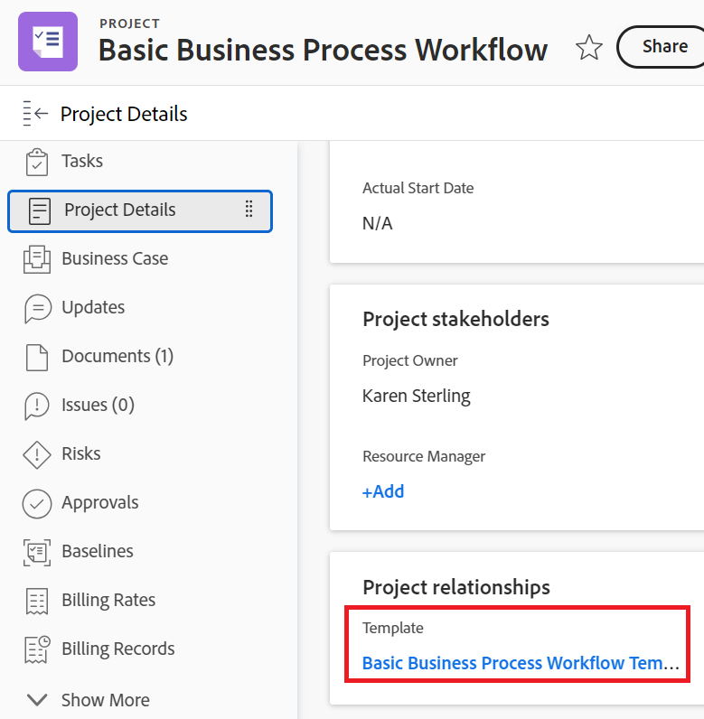

# Anexar um modelo a um projeto

Você pode anexar um modelo a um projeto durante a fase de criação inicial do projeto ou após sua criação.

Para obter mais informações sobre como criar um projeto usando um modelo, consulte [Criar um projeto usando um modelo](../../../manage-work/projects/create-projects/create-project-from-template.md).

## Requisitos de acesso

Você deve ter o seguinte para executar as etapas descritas neste artigo:

<table style="table-layout:auto"> 
 <col> 
 <col> 
 <tbody> 
  <tr> 
   <td role="rowheader">plano do Adobe Workfront*</td> 
   <td> 
Qualquer 
 </td> 
  </tr> 
  <tr> 
   <td role="rowheader">Licença da Adobe Workfront*</td> 
   <td> 
Plano 
 </td> 
  </tr> 
  <tr> 
   <td role="rowheader">Configurações de nível de acesso*</td> 
   <td> 
Editar acesso a projetos 
 
Para obter informações sobre acesso a projetos, consulte <a href="../../../administration-and-setup/add-users/configure-and-grant-access/grant-access-projects.md" class="MCXref xref">Conceder acesso a projetos</a>.
 
Visualizar acesso a modelos
 
Para obter informações sobre permissões de modelo, consulte <a href="../../../workfront-basics/grant-and-request-access-to-objects/share-a-template.md" class="MCXref xref">Compartilhar um modelo</a>. 
 
Para obter informações sobre acesso a modelos, consulte <a href="../../../administration-and-setup/add-users/configure-and-grant-access/grant-access-templates.md" class="MCXref xref">Conceder acesso a modelos</a>.
 
Observação: se você ainda não tiver acesso, pergunte ao administrador do Workfront se ele definiu restrições adicionais em seu nível de acesso. Para obter informações sobre como um administrador do Workfront pode modificar seu nível de acesso, consulte <a href="../../../administration-and-setup/add-users/configure-and-grant-access/create-modify-access-levels.md" class="MCXref xref">Criar ou modificar níveis de acesso personalizados</a>.
 </td> 
  </tr> 
  <tr> 
   <td role="rowheader">Permissões de objeto</td> 
   <td> 
Gerenciar permissões do projeto
 
Para obter informações sobre permissões de projeto, consulte <a href="../../../workfront-basics/grant-and-request-access-to-objects/share-a-project.md" class="MCXref xref">Compartilhar um projeto no Adobe Workfront</a>. 
 
Exibir permissões ou superiores ao modelo
 
Para obter informações sobre como solicitar acesso adicional, consulte <a href="../../../workfront-basics/grant-and-request-access-to-objects/request-access.md" class="MCXref xref">Solicitar acesso aos objetos </a>.
 </td> 
  </tr> 
 </tbody> 
</table>

&#42;Para saber qual plano, tipo de licença ou acesso você tem, contate o administrador do Workfront.

<!--

<h2>Considerations when adding templates to projects</h2>

(NOTE: moved this to an Overview article of its own) 

Consider the following when adding templates to projects:

<ul>
<li> 
You can attach only active templates to projects. 
 </li>
<li> 
You can attach a template to a project when the project is in a status of Complete, Dead, or in Pending Approval, only when your Adobe Workfront administrator or a group administrator has enabled this functionality in the Project&nbsp;Preferences area. For information about setting project preferences, see <a href="../../../administration-and-setup/set-up-workfront/configure-system-defaults/set-project-preferences.md" class="MCXref xref">Configure system-wide project preferences</a>. 
 </li>
<li> 
Unless you exclude specific template tasks from being added in the attachment process, all template tasks are added to the existing project. 
 </li>
<li> 
Most template settings are added to the project. 
 </li>
<li> 
Some settings from the template automatically transfer to the project, unless you specifically mark them to be excluded. 

Example: </b>">
<b>Example: </b>

For example, these settings are added to the project:

<ul>
<li>Start&nbsp;From field</li>
<li>Custom forms and the information on them</li>
<li>Queue Details </li>
<li>Financial settings </li>
</ul>

 </li>
</ul>

-->

## Anexar um modelo a um projeto existente {#attach-a-template-to-an-existing-project}

Você pode anexar um modelo a um projeto no Workfront a partir da página do projeto ou de uma lista de projetos ou relatório.

1. Vá para o projeto ao qual deseja anexar um modelo e clique no ícone **Mais** ícone  à direita do nome do projeto

   

   Ou

   Vá para uma lista de projetos ou relatório, selecione um projeto e clique no ícone **Mais** ícone  na parte superior da lista.

   

1. Clique em **Anexar Modelo**.

   A caixa Anexar Modelo será exibida.

1. Comece a digitar o nome do modelo que deseja anexar no campo **Modelos de Pesquisa** e clique nele quando ele for exibido.na lista

   Ou

   Clique no nome de um modelo na área **Outros modelos**.

   Uma pré-visualização do modelo é exibida à direita, contendo as seguintes informações sobre ele:

   * Duração
   * Proprietário
   * O número de tarefas de nível superior (inclui uma lista das três primeiras tarefas de nível superior)
   * Número total de tarefas
   * Nomes de formulários personalizados anexados

   

1. (Opcional) Clique no ícone **Favoritos**  à esquerda do nome do modelo para marcá-lo como favorito. Isso move o modelo na lista Favoritos.

   

1. (Opcional) Clique novamente no ícone **Favoritos**  para removê-lo da lista Favoritos.
1. Clique em **Personalizar e anexar**.

   

1. Atualize as informações nas seguintes seções antes de anexar o modelo (ou clique em **Anexar modelo** a qualquer momento):

   <table style="table-layout:auto"> 
    <col> 
    <col> 
    <tbody> 
     <tr> 
      <td role="rowheader" colspan="2"> 
seção Tarefas
 
  
 </td> 
     </tr> 
     <tr> 
      <td role="rowheader">As tarefas de modelo selecionadas abaixo são importadas para o projeto. Desmarque aqueles que deseja excluir. </td> 
      <td>Desmarque todas as tarefas que deseja excluir do modelo antes de anexá-lo ao projeto.</td> 
     </tr> 
     <tr> 
      <td role="rowheader">Selecione a tarefa do projeto que você deseja como predecessora das tarefas neste modelo.</td> 
      <td> 
Clique no campo para exibir uma lista de tarefas do projeto. Selecione qual tarefa do projeto você deseja concluir antes que as tarefas do modelo possam começar. Como alternativa, você pode ignorar essa etapa e configurar relações no projeto depois que o modelo for anexado. 
 
 Selecione as informações de <strong>Tipo de Dependência</strong>, <strong>Atraso</strong> e se você deseja que o predecessor seja <strong>Aplicado</strong> ou não. 
 </td> 
     </tr> 
     <tr> 
      <td role="rowheader">Selecione a tarefa de projeto que você deseja como a principal das tarefas neste modelo.</td> 
      <td> Selecione qual tarefa do projeto você deseja designar como tarefa pai para todas as tarefas do modelo. Se você não fizer uma seleção, todas as tarefas do modelo aparecerão no final das tarefas do projeto atual. Você pode ignorar essa etapa e mover tarefas no projeto depois que o modelo for anexado.</td> 
     </tr> 
     <tr> 
      <td role="rowheader" colspan="2"> 
seção Opções
 
  
 </td> 
     </tr> 
     <tr> 
      <td role="rowheader">Os itens selecionados abaixo são transferidos para o projeto. Desmarque aqueles que deseja excluir.</td> 
      <td> 
Desmarque as caixas de seleção ao lado de qualquer informação que você deseja apagar do modelo antes de anexá-la ao projeto. Essas informações não são transferidas do modelo para o projeto. Para obter mais informações sobre cada campo, consulte <a href="../../../manage-work/projects/create-and-manage-templates/attach-template-to-project-overview.md" class="MCXref xref">Visão geral de anexar um modelo a um projeto</a>. 
 
Importante: se você marcar a caixa <strong>Propriedades da fila e configuração de problemas</strong>, os Detalhes da fila do modelo substituirão os do projeto. Nesse caso, as Regras de Encaminhamento, os Tópicos de Fila e os Grupos de Tópicos do modelo são adicionados àqueles do projeto.  Se o projeto estiver configurado como uma fila de solicitações e o modelo anexado ao projeto não estiver configurado como uma fila de solicitações, as informações da fila do projeto serão removidas se você deixar marcada a caixa <strong>Propriedades da fila e Configuração de problemas</strong>.  Se você desmarcar a caixa <strong>Propriedades da Fila e Configuração de Problema</strong>, todas as configurações de Configuração da Fila do projeto serão preservadas e nenhuma configuração de Fila do modelo será anexada. 
 </td> 
     </tr> 
     <tr> 
      <td role="rowheader" colspan="2"> 
Seção Forms personalizada
 
  
 </td> 
     </tr> 
     <tr> 
      <td role="rowheader">Forms personalizado</td> 
      <td> 
Quando os formulários personalizados são anexados ao modelo, seus nomes são exibidos no painel esquerdo. 
 </td> 
     </tr> 
    </tbody> 
   </table>

1. (Opcional) Atualize as informações nos formulários personalizados. Essas informações são transferidas para o projeto.

   >[!TIP]
   >
   >* Esta etapa é obrigatória quando os formulários personalizados no modelo contêm campos obrigatórios que estão vazios.
   >* Se os campos dos formulários personalizados do modelo já existirem no projeto e contiverem informações, eles preservarão as informações já existentes no projeto. Não é possível editá-los durante a anexação do template.

1. Clique em **Anexar Modelo.**
1. Clique em **Cancelar anexo** para parar de anexar o modelo.

   Ou

   Permitir que o anexo seja concluído para adicionar o modelo ao projeto.

   Depois de anexar o modelo, você pode editar o projeto e ajustar qualquer tarefa, informação ou configuração, conforme necessário.

1. (Opcional) Clique em **Detalhes do projeto** e depois em **Visão geral** para exibir o nome do modelo anexado na área **Relações do projeto**.

   >[!TIP]
   >
   >Se você anexar mais de um modelo ao projeto, somente o modelo anexado primeiro será exibido nesse campo. Para obter informações, consulte a seção [Anexar vários modelos a um projeto existente e exibir informações do modelo](#attach-multiple-templates-to-an-existing-project-and-view-template-information) neste artigo.

1. (Opcional) Remova as informações do modelo do projeto ao qual você anexou o modelo. Para obter informações, consulte [Remover informações do modelo de um projeto](../../../manage-work/projects/create-and-manage-templates/remove-template-from-project.md).

## Anexar vários modelos a um projeto existente e exibir informações do modelo {#attach-multiple-templates-to-an-existing-project-and-view-template-information}

Você pode anexar vários modelos (um de cada vez) ao mesmo projeto, seguindo as etapas descritas na seção [Anexar um modelo a um projeto existente](#attach-a-template-to-an-existing-project) neste artigo. Isso adiciona as tarefas e outras informações de cada modelo ao projeto.

>[!TIP]
>
>Quando você anexa vários modelos a um projeto, somente o que você anexou primeiro é exibido na área Detalhes do projeto.

Para entender qual modelo é aplicado a um projeto:

1. Navegue até um projeto que tenha um modelo anexado.
1. Clique em **Detalhes do projeto** no painel esquerdo.
1. Encontre o nome do modelo anexado ao projeto no campo **Modelo** na parte inferior da seção **Visão geral** em **Relações do projeto**.

   

