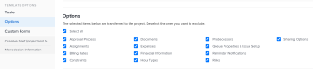

# Anexar um modelo a um projeto

<!-- Audited: 10/2025 -->

Você pode anexar um modelo a um projeto durante a fase de criação inicial do projeto ou após sua criação.

Para obter mais informações sobre como criar um projeto usando um modelo, consulte [Criar um projeto usando um modelo](../../../manage-work/projects/create-projects/create-project-from-template.md).

## Requisitos de acesso

+++ Expanda para visualizar os requisitos de acesso da funcionalidade neste artigo.

<table style="table-layout:auto"> 
 <col> 
 <col> 
 <tbody> 
  <tr> 
   <td role="rowheader">Pacote do Adobe Workfront</td> 
   <td> 
Qualquer
 </td> 
  </tr> 
  <tr> 
   <td role="rowheader">Licença do Adobe Workfront</td> 
   <td> 
Padrão

    
Plano

    
 </td> 
  </tr> 
  <tr> 
   <td role="rowheader">Configurações de nível de acesso</td> 
   <td> 
Editar acesso a projetos 
 
Visualizar acesso a modelos
</td> 
  </tr> 
  <tr> 
   <td role="rowheader">Permissões de objeto</td> 
   <td> 
Gerenciar permissões do projeto
 
Exibir permissões ou superiores ao modelo
 </td> 
  </tr> 
 </tbody> 
</table>

Para obter mais detalhes sobre as informações nesta tabela, consulte [Requisitos de acesso na documentação do Workfront](/help/quicksilver/administration-and-setup/add-users/access-levels-and-object-permissions/access-level-requirements-in-documentation.md).

+++

<!--Old:
 
 <table style="table-layout:auto"> 
 <col> 
 <col> 
 <tbody> 
  <tr> 
   <td role="rowheader">Adobe Workfront plan</td> 
   <td> 
Any 
 </td> 
  </tr> 
  <tr> 
   <td role="rowheader">Adobe Workfront license</td> 
   <td> 
New: Standard

   
Or

   
Current: Plan

    
 </td> 
  </tr> 
  <tr> 
   <td role="rowheader">Access level configurations</td> 
   <td> 
Edit access to Projects 
 
For information about project access, see <a href="../../../administration-and-setup/add-users/configure-and-grant-access/grant-access-projects.md" class="MCXref xref">Grant access to projects</a>.
 
View access to Templates
 
For information about template permissions, see <a href="../../../workfront-basics/grant-and-request-access-to-objects/share-a-template.md" class="MCXref xref">Share a template</a>. 
 
For information about template access, see <a href="../../../administration-and-setup/add-users/configure-and-grant-access/grant-access-templates.md" class="MCXref xref">Grant access to templates</a>.
 
Note: If you still don't have access, ask your Workfront administrator if they set additional restrictions in your access level. For information on how a Workfront administrator can modify your access level, see <a href="../../../administration-and-setup/add-users/configure-and-grant-access/create-modify-access-levels.md" class="MCXref xref">Create and modify custom access levels</a>.
 </td> 
  </tr> 
  <tr> 
   <td role="rowheader">Object permissions</td> 
   <td> 
Manage permissions to the project
 
For information about project permissions, see <a href="../../../workfront-basics/grant-and-request-access-to-objects/share-a-project.md" class="MCXref xref">Share a project in Adobe Workfront</a>. 
 
View permissions or higher to the template
 
For information on requesting additional access, see <a href="../../../workfront-basics/grant-and-request-access-to-objects/request-access.md" class="MCXref xref">Request access to objects </a>.
 </td> 
  </tr> 
 </tbody> 
</table>-->

<!--

<h2>Considerations when adding templates to projects</h2>

(NOTE: moved this to an Overview article of its own) 

Consider the following when adding templates to projects:

<ul>
<li> 
You can attach only active templates to projects. 
 </li>
<li> 
You can attach a template to a project when the project is in a status of Complete, Dead, or in Pending Approval, only when your Adobe Workfront administrator or a group administrator has enabled this functionality in the Project Preferences area. For information about setting project preferences, see <a href="../../../administration-and-setup/set-up-workfront/configure-system-defaults/set-project-preferences.md" class="MCXref xref">Configure system-wide project preferences</a>. 
 </li>
<li> 
Unless you exclude specific template tasks from being added in the attachment process, all template tasks are added to the existing project. 
 </li>
<li> 
Most template settings are added to the project. 
 </li>
<li> 
Some settings from the template automatically transfer to the project, unless you specifically mark them to be excluded. 

Example: </b>">
<b>Example: </b>

For example, these settings are added to the project:

<ul>
<li>Start From field</li>
<li>Custom forms and the information on them</li>
<li>Queue Details </li>
<li>Financial settings </li>
</ul>

 </li>
</ul>

-->

## Anexar um modelo a um projeto existente {#attach-a-template-to-an-existing-project}

Você pode anexar um modelo a um projeto a partir da página do projeto ou de uma lista de projetos ou relatório.

{{step1-to-projects}}

1. Na página **Projetos**, selecione o projeto ao qual deseja anexar um modelo.

1. Clique no ícone **Mais**  à direita do nome do projeto.

   

   Ou

   Vá para uma lista de projetos ou relatório, selecione um projeto e clique no ícone **Mais**  na parte superior da lista.

   

1. Clique em **Anexar Modelo**. A caixa **Anexar Modelo** é exibida.

1. Comece a digitar o nome do modelo que deseja anexar no campo **Modelos de Pesquisa** e clique nele quando ele for exibido na lista.

   Ou

   Clique no nome de um modelo na área **Outros modelos**.

   Uma pré-visualização do modelo é exibida à direita, contendo as seguintes informações sobre ele:

   * Duração
   * Proprietário
   * O número de tarefas de nível superior (inclui uma lista das primeiras 3 tarefas de nível superior)
   * Número total de tarefas
   * Nomes de formulários personalizados anexados

   

1. (Opcional) Clique no ícone **Favoritos**  à direita do nome do modelo para marcá-lo como favorito e movê-lo para a lista **Favoritos**.

1. (Opcional) Clique novamente no ícone **Favoritos**  para removê-lo da lista **Favoritos**.
1. Clique em **Personalizar e anexar**. O painel lateral **Anexar modelo** é aberto.

1. (Opcional) Atualize as informações nas seguintes seções:

   <table style="table-layout:auto"> 
    <col> 
    <col> 
    <tbody> 
     <tr> 
      <td role="rowheader" colspan="2"> 
seção Tarefas
 
  
 </td> 
     </tr> 
     <tr> 
      <td role="rowheader">As tarefas de modelo selecionadas abaixo são importadas para o projeto. Desmarque aqueles que deseja excluir. </td> 
      <td>
Desmarque todas as tarefas que deseja excluir do modelo antes de anexá-lo ao projeto.

      
<b>DICA</b>

      
Você pode escolher apenas uma tarefa.

      </td> 
     </tr> 
     <tr> 
      <td role="rowheader">Selecione a tarefa do projeto que você deseja como predecessora das tarefas neste modelo.</td> 
      <td> 
Clique dentro da caixa de campo para exibir uma lista de tarefas do projeto e, em seguida, selecione qual tarefa deve ser concluída antes que as tarefas do modelo possam começar. Como alternativa, você pode ignorar essa etapa e configurar relações no projeto depois que o modelo for anexado. 
 
 Selecione as informações de <strong>Tipo de Dependência</strong>, <strong>Tempo de Atraso</strong> e se desejar que o predecessor seja aplicado marcando a caixa de seleção <strong>Impor Predecessor</strong>. 
 </td> 
     </tr> 
     <tr> 
      <td role="rowheader">Selecione a tarefa de projeto que você deseja como a principal das tarefas neste modelo.</td> 
      <td> 
Selecione qual tarefa do projeto você deseja designar como tarefa pai para todas as tarefas do modelo. Se você não fizer uma seleção, todas as tarefas do modelo aparecerão no final das tarefas do projeto atual. Você pode ignorar essa etapa e mover tarefas no projeto depois que o modelo for anexado.

      
<b>Nota</b>

      
Se você selecionou uma tarefa de modelo pai com filhos adicionais, somente o pai exibirá a tarefa do projeto como sua predecessora depois de adicionada ao projeto. As tarefas de modelo filho não exibirão uma predecessora.

      
Se você selecionou apenas uma tarefa de modelo filho, a tarefa do projeto será exibida como sua predecessora depois de ser adicionada ao projeto. 

   </td> 
     </tr> 
     <tr> 
      <td role="rowheader" colspan="2"> 
seção Opções
 
  
 </td> 
     </tr> 
     <tr> 
      <td role="rowheader">Os itens selecionados abaixo são transferidos para o projeto. Desmarque aqueles que deseja excluir.</td> 
      <td> 
Desmarque as caixas de seleção de qualquer informação que você deseja excluir do modelo antes de anexá-la ao projeto. Para obter mais informações sobre cada campo, consulte <a href="../../../manage-work/projects/create-and-manage-templates/attach-template-to-project-overview.md" class="MCXref xref">Visão geral de anexar um modelo a um projeto</a>. 
 
Importante: se você marcar a caixa <strong>Propriedades da fila e configuração de problemas</strong>, os Detalhes da fila do modelo substituirão os do projeto. Nesse caso, as Regras de Encaminhamento, os Tópicos de Fila e os Grupos de Tópicos do modelo são adicionados àqueles do projeto.  Se o projeto estiver configurado como uma fila de solicitações e o modelo anexado ao projeto não estiver configurado como uma fila de solicitações, as informações da fila do projeto serão removidas se você deixar marcada a caixa <strong>Propriedades da fila e Configuração de problemas</strong>.  Se você desmarcar a caixa <strong>Propriedades da Fila e Configuração de Problema</strong>, todas as configurações de Configuração de Fila do projeto serão preservadas e nenhuma configuração de Fila do modelo será anexada. 
 </td> 
     </tr> 
     <tr> 
      <td role="rowheader" colspan="2"> 
Seção Forms personalizada
 
  
 </td> 
     </tr> 
     <tr> 
      <td role="rowheader">Formulários personalizados</td> 
      <td> 
Quando os formulários personalizados são anexados ao modelo, seus nomes são exibidos no painel esquerdo. 
 </td> 
     </tr> 
    </tbody> 
   </table>

1. (Opcional) Atualize as informações nos formulários personalizados. Essas informações são transferidas para o projeto.

   >[!TIP]
   >
   >* Esta etapa é obrigatória quando os formulários personalizados no modelo contêm campos obrigatórios que estão vazios.
   >* Se os campos dos formulários personalizados do modelo já existirem no projeto e contiverem informações, eles preservarão as informações já existentes no projeto. Não é possível editá-los ao anexar o modelo.

1. Clique em **Anexar Modelo.**
1. Clique em **Cancelar anexo** para parar de anexar o modelo.

   Ou

   Permitir que o anexo seja concluído para adicionar o modelo ao projeto.

   Depois de anexar o modelo, você pode editar o projeto e ajustar qualquer tarefa, informação ou configuração, conforme necessário.

1. (Opcional) No painel esquerdo, clique em **Detalhes do projeto** e depois em **Visão geral** para exibir o nome do modelo anexado na área **Relações do projeto**.

   >[!TIP]
   >
   >Se você anexar mais de um modelo ao projeto, somente o modelo anexado primeiro será exibido nesse campo. Para obter informações, consulte a seção [Anexar vários modelos a um projeto existente e exibir informações do modelo](#attach-multiple-templates-to-an-existing-project-and-view-template-information) neste artigo.

1. (Opcional) Remova as informações do modelo do projeto ao qual você anexou o modelo. Para obter informações, consulte [Remover informações do modelo de um projeto](../../../manage-work/projects/create-and-manage-templates/remove-template-from-project.md).

## Anexar vários modelos a um projeto existente e exibir informações do modelo {#attach-multiple-templates-to-an-existing-project-and-view-template-information}

Você pode anexar vários modelos (um de cada vez) ao mesmo projeto seguindo as etapas descritas na seção [Anexar um modelo a um projeto existente](#attach-a-template-to-an-existing-project) neste artigo. Isso adiciona as tarefas e outras informações de cada modelo ao projeto.

>[!TIP]
>
>Ao anexar vários modelos a um projeto, somente o modelo anexado primeiro será exibido na área Detalhes do projeto.

Para exibir qual modelo é aplicado a um projeto:

{{step1-to-projects}}

1. Na página **Projetos**, selecione o projeto que tem um modelo anexado.

1. Clique em **Detalhes do projeto** no painel esquerdo.

1. Localize o nome do modelo anexado ao projeto no campo **Modelo** na parte inferior da seção **Visão geral** em **Relações do projeto**.

   

