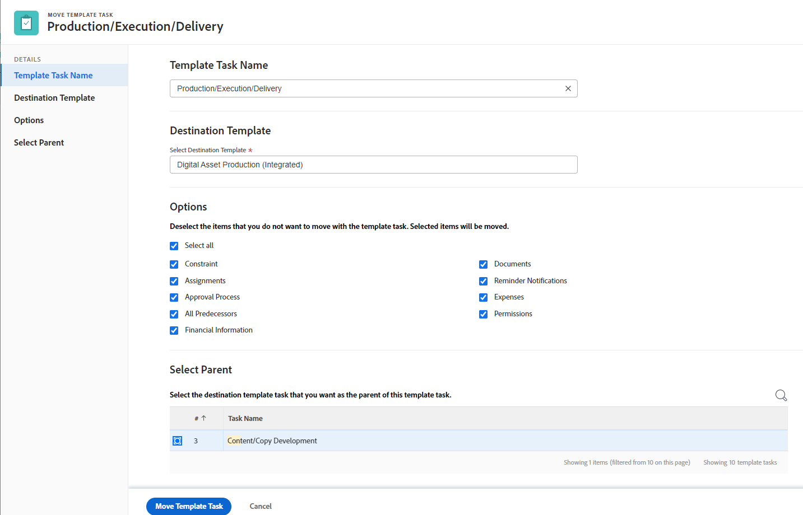

# Copiar e mover tarefas do modelo

Copiar e mover uma tarefa de modelo está disponível no ambiente Produção. No entanto, as etapas descritas nesta página referem-se à funcionalidade apenas no ambiente de Visualização. Essa funcionalidade estará disponível em Produção em 2 de março de 2023.

É possível copiar uma tarefa de modelo de um modelo para outro modelo, ou movê-la para outro modelo ou para outro lugar no mesmo modelo.

## Requisitos de acesso

Você deve ter o seguinte acesso para executar as etapas neste artigo:

<table style="table-layout:auto"> 
 <col> 
 <col> 
 <tbody> 
  <tr> 
   <td role="rowheader">Plano Adobe Workfront*</td> 
   <td> 
Qualquer Um
 </td> 
  </tr> 
  <tr> 
   <td role="rowheader">Licença da Adobe Workfront*</td> 
   <td> 
Plano 
 </td> 
  </tr> 
  <tr> 
   <td role="rowheader">Configurações de nível de acesso*</td> 
   <td> 
Editar acesso aos modelos
 
<b>Nota</b>

Caso ainda não tenha acesso, pergunte ao administrador do Workfront se ele definiu restrições adicionais em seu nível de acesso. Para obter informações sobre como um administrador do Workfront pode modificar seu nível de acesso, consulte <a href="../../../administration-and-setup/add-users/configure-and-grant-access/create-modify-access-levels.md" class="MCXref xref">Criar ou modificar níveis de acesso personalizados</a>.
 </td>
</tr> 
  <tr> 
   <td role="rowheader">Permissões de objeto</td> 
   <td> 
Gerenciar permissões para um modelo e para a tarefa de modelo 
 
Para obter informações sobre como solicitar acesso adicional, consulte <a href="../../../workfront-basics/grant-and-request-access-to-objects/request-access.md" class="MCXref xref">Solicitar acesso a objetos </a>.
 </td> 
  </tr> 
 </tbody> 
</table>

*Para descobrir qual plano, tipo de licença ou acesso você tem, entre em contato com o administrador da Workfront.

## Considerações para copiar ou mover tarefas de modelo

Considere o seguinte ao copiar uma tarefa de modelo:

* Os marcos não são transferidos para a tarefa de modelo copiada ou movida.

* Você pode copiar uma tarefa de modelo nas seguintes áreas da aplicação Web do Adobe Workfront:

   * No nível da tarefa do modelo, na **Ícone Mais**  à direita do nome da tarefa do template.

   * Em uma lista de tarefas de modelo.
* Você pode copiar ou mover tarefas de modelo, uma de cada vez, ou selecionando várias tarefas de modelo.

## Copiar tarefas do modelo

1. Vá para o template que contém a tarefa do modelo ou as tarefas do modelo que deseja copiar.
1. Clique em **Tarefas do modelo** no painel esquerdo.
1. Siga um destes procedimentos:
   * Clique no nome de uma tarefa de template para abri-la.
   * Selecione uma ou várias tarefas de modelo na lista.
1. (Condicional) Clique no botão **Mais** menu  na parte superior da lista de tarefas do modelo ou à direita do nome da tarefa do modelo, se você tiver aberto a tarefa, clique em **Copiar para** ou **Copiar**, dependendo de onde você está acessando a opção Copiar .
A caixa Copiar tarefa do modelo é aberta.
   
1. (Opcional) Renomeie a tarefa do modelo na função **Nome da tarefa do modelo** campo.

   >[!TIP]
   >
   >Este campo está esmaecido e não é editável ao selecionar para copiar várias tarefas de modelo em uma lista. Você pode passar o mouse sobre o campo Nome da tarefa do modelo e exibir uma lista de todas as tarefas do modelo selecionado.

1. Comece digitando o nome da variável **Modelo de destino** onde você deseja copiar a tarefa do modelo no **Selecionar modelo de destino** e, em seguida, selecione-o quando for exibido na lista.

   O nome do modelo atual é exibido por padrão. Se quiser copiar a tarefa do modelo no mesmo modelo, deixe este campo inalterado.

   >[!TIP]
   >
   >Você também pode começar a digitar o Número de referência ou inserir a ID do modelo. Isso pode ajudar a distinguir entre modelos com nomes idênticos.

1. (Condicional) Clique em **solicitar acesso** para solicitar acesso ao template de destino, se não tiver acesso ao template selecionado.
1. (Condicional) Continue copiando a tarefa do modelo para o modelo de destino selecionado sem solicitar acesso se tiver acesso para adicionar tarefas do modelo a uma das tarefas do modelo no modelo de destino.

1. Clique em **Opções** no painel esquerdo, desmarque os atributos da tarefa do modelo que você não deseja copiar com a tarefa do modelo. Todas as opções são selecionadas por padrão.

   >[!TIP]
   >
   >Desmarcar **Selecionar tudo** cancela a seleção de todas as opções.

   Desmarque as opções a seguir para não transferi-las para a tarefa de modelo copiada. A tabela a seguir descreve o que acontece quando as opções são desmarcadas:

   <table style="table-layout:auto"> 
    <col> 
    <col> 
    <tbody> 
    <tr> 
      <td role="rowheader">Selecionar tudo</td> 
      <td>Desmarque essa opção para remover todas as informações da tarefa de modelo ao copiá-la para seu novo local. </td> 
     </tr>
     <tr> 
      <td role="rowheader">Dt Restr</td> 
      <td> 
A restrição de tarefa do modelo é definida como Assim que possível ou O Mais tarde possível com base na configuração do Modo de agendamento do modelo.
 
 Quando selecionada, a restrição atual da tarefa do modelo é transferida para a tarefa do modelo copiado. 
 
      
<b>Nota</b>

   Ao copiar uma tarefa de modelo com restrições específicas de data para outro modelo e as datas de restrição da tarefa de modelo estiverem fora das datas do novo modelo, a Restrição da tarefa de modelo será alterada para Assim que possível ou Como mais tarde possível ou as datas Inicial ou Concluído planejado dos modelos serão ajustadas.

   A seguir estão exemplos de restrições específicas de data:
   <ul>
      <li> Precisa Iniciar Em</li>
      <li> Precisa Terminar Em</li>
      <li> Não Iniciar Antes De</li>
      <li> Não Iniciar Depois De</li>
      </ul>
     </td> 
     </tr> 
     <tr> 
      <td role="rowheader">Atribuições</td> 
      <td> 
Todas as atribuições são removidas da tarefa de modelo. 
 </td> 
     </tr> 
     <tr> 
      <td role="rowheader">Processo de aprovação</td> 
      <td>Todos os processos de aprovação são removidos da tarefa do template.</td> 
     </tr>

   <tr> 
      <td role="rowheader">Todos os antecessores</td> 
      <td> 
Isso significa que as dependências não serão transferidas para as tarefas do modelo copiado. 
 
Quando selecionados, os antecessores no grupo de tarefas de modelo copiado são preservados, outros são excluídos.
 </td> 
     </tr>
     <tr> 
      <td role="rowheader">Dados personalizados</td> 
      <td> 
Os valores dos campos personalizados são apagados e os formulários personalizados são transferidos para a tarefa de modelo copiado. 
 
Quando selecionados, os formulários e os valores dos campos personalizados são transferidos para a tarefa de modelo copiado. 
 </td> 
     </tr> 
     <tr> 
      <td role="rowheader">Informações financeiras</td> 
      <td>As informações financeiras da tarefa do modelo copiado são removidas e o Workfront atualiza a tarefa do modelo Tipo de Custo para Sem Custo e a tarefa do modelo Tipo de Receita como Não Faturável.
      </td> 
     </tr> 
     <tr> 
      <td role="rowheader">Documentos</td> 
      <td> 
Os documentos anexados à tarefa do template não são transferidos para a tarefa do template copiada. Isso inclui versões, provas e documentos vinculados.
 
<b>Nota</b>

   
Isso não inclui aprovações de documento. As aprovações de documentos nunca podem ser copiadas quando uma tarefa de modelo é copiada.
 </td> 
     </tr> 
     <tr> 
      <td role="rowheader">Notificações de Lembrete</td> 
      <td>Os lembretes da tarefa do modelo não são transferidos para a tarefa do modelo copiado. </td> 
     </tr> 
     <tr> 
      <td role="rowheader">Despesas</td> 
      <td>As despesas registradas na tarefa do modelo não são transferidas para a tarefa do modelo copiado. </td> 
     </tr>  
    </tbody> 
   </table>

(PERGUNTANDO SOBRE A ÚLTIMA LINHA: A TAREFA DO MODELO PARECE NÃO TER &quot;COMPARTILHAMENTO&quot;)

1. (Opcional) Clique em **Selecionar Pai** no painel esquerdo, selecione a tarefa do modelo no modelo de destino que deseja tornar-se o pai da tarefa do modelo copiado.

   >[!TIP]
   >
   >Ao selecionar para copiar várias tarefas de modelo em uma lista, todas as tarefas de modelo selecionadas se tornam filhos do pai selecionado e são adicionadas após as tarefas filho existentes.

   Selecione um pai seguindo um destes procedimentos:

   * Na lista de tarefas modelo, selecione um dos pais no plano modelo.
   * Clique no ícone de pesquisa  e procure por uma tarefa de modelo pai por nome.

   A tarefa do template deve aparecer na lista.

1. Selecione o botão de opção do pai depois de encontrá-lo.

   Se você não selecionar uma tarefa de modelo pai, as tarefas de modelo serão copiadas como tarefas de modelo principal em vez de subtarefas e serão colocadas no final da lista de tarefas de modelo no modelo de destino.

1. Clique em **Tarefa Copiar Modelo**.

   As tarefas do modelo copiado agora estão no modelo especificado e são subtarefas para a tarefa do modelo pai selecionado ou as últimas tarefas do modelo no modelo.

## Mover tarefas do modelo

Além de copiar tarefas de modelo, também é possível mover uma tarefa de modelo para outra tarefa de modelo no mesmo modelo ou para outro modelo.

1. Vá para o template que contém a tarefa do modelo ou as tarefas do modelo que você deseja mover.
1. Clique em **Tarefas do modelo** no painel esquerdo.
1. Siga um destes procedimentos:
   * Clique no nome de uma tarefa de template para abri-la.
   * Selecione uma ou várias tarefas de modelo na lista.
1. (Condicional) Clique no botão **Mais** menu  na parte superior da lista de tarefas do modelo ou à direita do nome da tarefa do modelo, se você tiver aberto a tarefa, clique em **Mover para** ou **Mover**, dependendo de onde você está acessando a opção Mover .
A caixa Tarefa Mover Modelo é aberta.
   

1. (Opcional) Renomeie a tarefa do modelo na função **Nome da tarefa do modelo** campo.

   >[!TIP]
   >
   >Este campo está esmaecido e não é editável ao selecionar para mover várias tarefas de modelo em uma lista. Você pode passar o mouse sobre o campo Nome da tarefa do modelo e uma lista de todas as tarefas do modelo selecionado é exibida.

1. Comece digitando o nome da variável **Modelo de destino** onde você deseja mover a tarefa do template no **Selecionar modelo de destino** e, em seguida, selecione-o quando for exibido na lista.

   >[!TIP]
   >
   >Você também pode começar a digitar o Número de referência ou inserir a ID do modelo. Isso pode ajudar a distinguir entre modelos com nomes idênticos.

1. (Condicional) Clique em **solicitar acesso** para solicitar acesso ao template, se não tiver acesso ao template de destino.
1. (Condicional) Continue movendo a tarefa do modelo para o modelo de destino selecionado sem solicitar acesso se tiver acesso para adicionar tarefas do modelo a uma das tarefas do modelo no modelo de destino.

1. Clique em **Opções** no painel esquerdo, desmarque os atributos da tarefa do modelo que você não deseja copiar com a tarefa do modelo. Todas as opções são selecionadas por padrão.

   >[!TIP]
   >
   >* A seção Options está disponível somente após selecionar um template de destino.
   >* Desmarcar **Selecionar tudo** cancela a seleção de todas as opções.

   Desmarque as opções a seguir para não transferir as informações para a tarefa de modelo movida. A tabela a seguir descreve o que acontece quando as opções são desmarcadas:

   <table style="table-layout:auto"> 
    <col> 
    <col> 
    <tbody> 
    <tr> 
      <td role="rowheader">Selecionar tudo</td> 
      <td>Desmarque essa opção para remover todas as informações da tarefa de modelo ao movê-la para seu novo local. </td> 
     </tr>
     <tr> 
      <td role="rowheader">Dt Restr</td> 
      <td> 
A restrição de tarefa do modelo é definida como Assim que possível ou O Mais tarde possível com base na configuração do Modo de agendamento do modelo.
 
 Quando selecionada, a restrição atual da tarefa de modelo é transferida para a tarefa de modelo movida. 

   
<b>Nota</b>

   Ao mover uma tarefa de modelo com restrições específicas de data para outro modelo e as datas de restrição da tarefa de modelo estiverem fora das datas do novo modelo, a Restrição de tarefa de modelo será alterada para Assim que possível ou Como mais tarde possível ou as datas Inicial ou Concluído planejado dos modelos serão ajustadas.

   A seguir estão exemplos de restrições específicas de data:
   <ul>
      <li> Início em</li>
      <li> Precisa Terminar Em</li>
      <li> Não Iniciar Antes De</li>
      <li> Não Iniciar Depois De</li>
      </ul>

   </td> 
     </tr> 
     <tr> 
      <td role="rowheader">Atribuições</td> 
      <td> 
Todas as atribuições são removidas da tarefa de modelo. 
 </td> 
     </tr> 
     <tr> 
      <td role="rowheader">Processo de aprovação</td> 
      <td>Todos os processos de aprovação são removidos da tarefa do template.</td> 
     </tr>

   <tr> 
      <td role="rowheader">Todos os antecessores</td> 
      <td> 
Isso significa que as dependências não serão transferidas com as tarefas de modelo movidas. 
 
Quando selecionados, os antecessores no grupo de tarefas de modelo movidas são preservados, outros são excluídos.
 </td> 
     </tr>
     <tr> 
      <td role="rowheader">Dados personalizados</td> 
      <td> 
Os valores dos campos personalizados são apagados e os formulários personalizados são transferidos com a tarefa de modelo movida. 
 
Quando selecionados, os formulários e os valores dos campos personalizados são transferidos com a tarefa de modelo movida. 
 </td> 
     </tr> 
     <tr> 
      <td role="rowheader">Informações financeiras</td> 
      <td>As informações financeiras da tarefa do modelo movido são removidas e o Workfront atualiza a tarefa do modelo Tipo de Custo para Sem Custo e a tarefa do modelo Tipo de Receita como Não Faturável.</td> 
     </tr> 
     <tr> 
      <td role="rowheader">Documentos</td> 
      <td> 
Os documentos anexados à tarefa do template não são transferidos com a tarefa do template movida. Isso inclui versões, provas e documentos vinculados.

   
<b>Nota</b>

   <ul><li>
      
Isso não inclui aprovações de documento. As aprovações de documento nunca podem ser movidas quando uma tarefa de modelo é movida.
 </li>
      <li>Se você optar por não mover os documentos com a tarefa modelo, eles serão excluídos e colocados na Lixeira por 30 dias. Um administrador pode restaurá-los e serão restaurados na tarefa de modelo movido.

   Se a tarefa do modelo for excluída depois de movida, os documentos restaurados serão colocados na área Documents da página do usuário do administrador que os restaura. </li> </ul>

   </td> 
     </tr> 
     <tr> 
      <td role="rowheader">Notificações de Lembrete</td> 
      <td>Os lembretes da tarefa do modelo não são transferidos para a tarefa do modelo movido. </td> 
     </tr> 
     <tr> 
      <td role="rowheader">Despesas</td> 
      <td>As despesas registradas na tarefa modelo não são transferidas com a tarefa modelo movida. </td> 
     </tr>  
    </tbody> 
   </table>

(PERGUNTANDO SOBRE A ÚLTIMA LINHA: A TAREFA DO MODELO PARECE NÃO TER &quot;COMPARTILHAMENTO&quot;)

1. (Opcional) Clique em **Selecionar Pai** no painel esquerdo, selecione a tarefa do modelo no modelo de destino que deseja tornar-se o pai da tarefa do modelo movido.

   >[!TIP]
   >
   >Ao selecionar para mover várias tarefas de modelo em uma lista, todas as tarefas de modelo selecionadas se tornam os filhos do pai selecionado e são adicionadas após as tarefas filho existentes.

   Selecione um pai seguindo um destes procedimentos:

   * Na lista de tarefas modelo, selecione um dos pais no plano modelo.
   * Clique no ícone de pesquisa  e procure por uma tarefa de modelo pai por nome.

   A tarefa do template deve aparecer na lista.

1. Selecione o botão de opção do pai depois de encontrá-lo.

   Se você não selecionar uma tarefa de modelo pai, as tarefas de modelo serão movidas como tarefas de modelo principal em vez de subtarefas e serão colocadas no final da lista de tarefas de modelo no modelo de destino.

1. Clique em **Tarefa Mover Modelo**.

   As tarefas de modelo movidas agora estão no modelo especificado e são subtarefas para a tarefa de modelo pai selecionada, ou as últimas tarefas de modelo no modelo.

