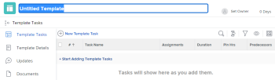

# Criar um modelo de projeto

<!-- Audited: 10/2025 -->

As informações destacadas nesta página se referem a funcionalidades ainda não disponíveis no geral. Ela está disponível somente no ambiente de Pré-visualização para todos os clientes. Os mesmos recursos também estarão disponíveis no ambiente de Produção para todos os clientes, a partir de uma semana da versão de Pré-visualização.

Para obter mais informações, consulte [Modernização da interface](/help/quicksilver/product-announcements/product-releases/interface-modernization/interface-modernization.md).

É possível criar e excluir modelos na área Modelos. Ao criar um novo modelo, você pode inserir as informações de todas as tarefas e das configurações futuras do projeto. Essas informações serão transferidas para qualquer projeto criado a partir do modelo.

>[!NOTE]
>
>Um modelo e suas tarefas não têm datas reais, mas uma indicação de qual dia (de quando o projeto futuro pode começar) uma tarefa pode começar e em qual dia a tarefa pode precisar ser concluída. Ao usar modelos para criar os projetos futuros, os projetos receberão datas reais. Para obter informações, consulte [Criar um projeto](../create-projects/create-project.md).

Você pode criar um novo modelo das seguintes maneiras:

* Do zero, conforme descrito neste artigo.
* Em projetos existentes, salvando um projeto como modelo.

  Para obter mais informações sobre como criar modelos a partir de projetos existentes, consulte [Salvar um projeto como um modelo](../../../manage-work/projects/manage-projects/save-project-as-template.md).

* Copiando-o de outro modelo.

  Para obter mais informações sobre como copiar um modelo existente, consulte [Copiar um modelo de projeto](../../../manage-work/projects/create-and-manage-templates/copy-template.md).

* Importando blueprints. Você precisa ser um administrador do Workfront para importar Blueprints. Para obter informações, consulte [Configurar um blueprint](../../../administration-and-setup/blueprints/configure-template-package.md).

## Requisitos de acesso

+++ Expanda para visualizar os requisitos de acesso para a funcionalidade neste artigo.

<table style="table-layout:auto"> 
 <col> 
 <col> 
 <tbody> 
  <tr> 
   <td role="rowheader">Pacote do Adobe Workfront</td> 
   <td> 
Qualquer
 </td> 
  </tr> 
  <tr> 
   <td role="rowheader">Licença do Adobe Workfront</td> 
   <td> 
Standard 

Plano
 
Você precisa ser um administrador do sistema para importar modelos de blueprints
 </td> 
  </tr> 
  <tr> 
   <td role="rowheader">Configurações de nível de acesso</td> 
   <td> 
Editar acesso a modelos
 </td> 
  </tr> 
  <tr> 
   <td role="rowheader">Permissões de objeto</td> 
   <td> 
Por padrão, você tem permissões de gerenciamento para os modelos que criar
  </td> 
  </tr> 
 </tbody> 
</table>

Para obter mais detalhes sobre as informações nesta tabela, consulte [Requisitos de acesso na documentação do Workfront](/help/quicksilver/administration-and-setup/add-users/access-levels-and-object-permissions/access-level-requirements-in-documentation.md).

+++

<!--Old:
<table style="table-layout:auto"> 
 <col> 
 <col> 
 <tbody> 
  <tr> 
   <td role="rowheader">Adobe Workfront plan</td> 
   <td> 
Any
 </td> 
  </tr> 
  <tr> 
   <td role="rowheader">Adobe Workfront license</td> 
   <td> 
New: Standard 

Or 

Current: Plan 
 
You must be a system administrator to import templates from Blueprints
 </td> 
  </tr> 
  <tr> 
   <td role="rowheader">Access level configurations*</td> 
   <td> 
Edit access to Templates
 </td> 
  </tr> 
  <tr> 
   <td role="rowheader">Object permissions</td> 
   <td> 
You have Manage permissions to the templates you create, by default
  </td> 
  </tr> 
 </tbody> 
</table>-->

## Criar um modelo

{{step1-to-templates}}

1. Clique em **Novo Modelo**.

   O modelo não tem título.

   

1. Especifique um nome para o novo modelo no cabeçalho do modelo e pressione **Enter.**
1. Clique na seção **Tarefas de modelo** no painel esquerdo.
1. Clique em **Começar a adicionar Modelos de Tarefa** para adicionar tarefas em linha

   Ou

   Clique em **Nova Tarefa de Modelo** para começar a adicionar tarefas ao seu modelo na caixa **Nova Tarefa de Modelo**.

   

   A caixa **Criar Tarefa de Modelo** é aberta na nova experiência.

1. (Condicional) Usando a nova experiência, atualize as informações nas seguintes áreas na caixa **Criar Tarefa de Modelo**:

   

   * Nome do Modelo de Tarefa
   * Visão geral
   * Atribuições
   * Finanças
   * Formulários personalizados
   * Documentos
   * Configurações

   

1. Clique em **Criar tarefa de modelo**

   Ou

   Clique em **Retornar à experiência antiga** na parte inferior da caixa **Criar Tarefa de Modelo**.
   A **Nova Tarefa de Modelo** abre na experiência antiga.

   >[!TIP]
   >
   >Na Produção, a experiência antiga é aberta por padrão.

1. Atualize as informações nas seguintes áreas na caixa **Nova Tarefa de Modelo**:

   * Visão geral
   * Finanças
   * Configurações
   * Atribuições
   * Formulários personalizados
   * Anexar documento

     Atualizar informações para uma tarefa de modelo é semelhante a editar tarefas em um projeto. Para obter mais informações, consulte [Editar tarefas](/help/quicksilver/manage-work/tasks/manage-tasks/edit-tasks.md). <!--should this be relinked at preview/ prod release to say it's the same as Edit template tasks??-->

   >[!NOTE]
   >
   >Não é possível adicionar tarefas recorrentes a um modelo.

1. Clique em uma das opções a seguir:

   * **Salvar Tarefa de Modelo** para salvar a tarefa de modelo atual e fecha a caixa Nova Tarefa de Modelo.
   * **Salvar Tarefa de Modelo e Iniciar Outra** para salvar a tarefa de modelo atual e abrir outra caixa **Nova Tarefa de Modelo** para adicionar outra tarefa.
   * **Cancelar** para fechar a caixa sem salvar a tarefa de modelo.
1. (Opcional) Após adicionar as tarefas de modelo, na seção Tarefas de Modelo, clique no ícone **Gráfico de Gantt** no canto superior direito da Lista de Tarefas para ver uma representação visual da lista de tarefas do modelo.

   >[!TIP]
   >
   >Não é possível editar tarefas diretamente neste Gráfico de Gantt.

1. Para adicionar informações ao novo modelo, clique no ícone **Mais** do menu  à esquerda do nome do modelo no cabeçalho e clique em **Editar**.

   Para obter informações sobre como editar um modelo, consulte [Editar modelos de projeto](../../../manage-work/projects/create-and-manage-templates/edit-templates.md).

   >[!NOTE]
   >
   >   A associação de um modelo de projeto a um grupo (ou a falta de um grupo) afeta como as preferências do projeto, da tarefa e do problema determinam determinadas configurações no modelo.
   >
   >Para obter mais informações, consulte a seção &quot;Como as preferências se aplicam a modelos e tarefas de modelo&quot; no artigo [Criar e modificar modelos de projeto de um grupo](../../../administration-and-setup/manage-groups/work-with-group-objects/create-and-modify-a-groups-templates.md).

1. Clique em **Salvar**.
1. (Opcional) Adicione os seguintes itens ao modelo

   * Documentos
   * Riscos
   * Processos de aprovação
   * Taxas de cobrança
   * Despesas
   * Detalhes da fila
   * Grupos de Tópicos e Tópicos de Fila

1. (Opcional) Adicione os seguintes itens às tarefas no modelo:

   * Documentos
   * Despesas
   * Aprovações

   Para obter informações, consulte a seção &quot;Adicionar mais itens a um modelo&quot; no artigo [Editar modelos de projeto](../../../manage-work/projects/create-and-manage-templates/edit-templates.md).

