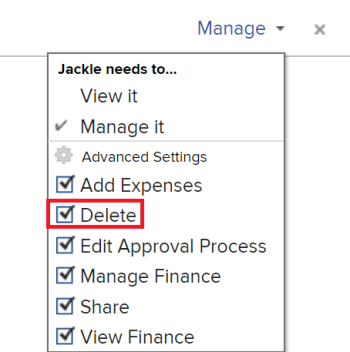

# Excluir modelos de projeto

Recomendamos desativar os modelos que não estão mais sendo usados, em vez de excluí-los para que você possa manter as informações de histórico sobre seus projetos ao longo do tempo. Para obter informações sobre como desativar um modelo, consulte [Editar modelos de projeto](../../../manage-work/projects/create-and-manage-templates/edit-templates.md).

>[!IMPORTANT]
>
>Quando você exclui um modelo, os projetos que estão usando esse modelo não são modificados de forma alguma. No entanto, você não pode mais ver o nome do modelo original no campo Modelo no projeto. Além disso, não é mais possível exibir os nomes das tarefas de modelo para as tarefas no projeto em uma exibição de tarefa. O campo Modelo do projeto e o campo Modelo de Tarefa das tarefas permanecem em branco após a exclusão do modelo originalmente associado ao projeto.

## Requisitos de acesso

Você deve ter o seguinte acesso para executar as etapas deste artigo:

<table style="table-layout:auto"> 
 <col> 
 <col> 
 <tbody> 
  <tr> 
   <td role="rowheader">plano do Adobe Workfront*</td> 
   <td> 
Qualquer
 </td> 
  </tr> 
  <tr> 
   <td role="rowheader">Licença da Adobe Workfront*</td> 
   <td> 
Plano 
 </td> 
  </tr> 
  <tr> 
   <td role="rowheader">Configurações de nível de acesso*</td> 
   <td> 
Editar acesso aos Modelos que incluem acesso a Excluir
 
  
 
Observação: se você ainda não tiver acesso, pergunte ao administrador do Workfront se ele definiu restrições adicionais em seu nível de acesso. Para obter informações sobre como um administrador do Workfront pode modificar seu nível de acesso, consulte <a href="../../../administration-and-setup/add-users/configure-and-grant-access/create-modify-access-levels.md" class="MCXref xref">Criar ou modificar níveis de acesso personalizados</a>.
 </td> 
  </tr> 
  <tr> 
   <td role="rowheader">Permissões de objeto</td> 
   <td> 
Gerenciar permissões para o modelo que inclui permissões para excluí-lo
 
  
 
Para obter informações sobre como solicitar acesso adicional, consulte <a href="../../../workfront-basics/grant-and-request-access-to-objects/request-access.md" class="MCXref xref">Solicitar acesso a objetos </a>.
 </td> 
  </tr> 
 </tbody> 
</table>

&#42;Para descobrir seu plano, tipo de licença ou acesso, entre em contato com o administrador do Workfront.

## Considerações para exclusão de modelos

* As tarefas adicionadas aos projetos quando o modelo foi anexado permanecem nos projetos. No entanto, as informações da tarefa de modelo associadas às tarefas são excluídas.
* O nome do modelo não é mais listado no **Modelo** no campo **Visão geral** do projeto.

* Você pode recuperar um modelo excluído recentemente da Lixeira. Para obter informações sobre como recuperar itens da Lixeira, consulte [Restaurar itens excluídos](../../../administration-and-setup/manage-workfront/manage-deleted-items/restore-deleted-items.md).

## Excluir um modelo

{{step1-to-templates}}

Isso abre uma lista de modelos

1. Selecione o modelo que deseja deletar clicando na caixa de seleção à esquerda do nome do modelo e, em seguida, clique em **Excluir > Sim, excluí-lo** para confirmar a exclusão.

   Ou

   Clique no nome de um template para acessá-lo e clique no link **Mais** menu  , depois **Excluir modelo > Sim, excluí-lo**.

   O modelo não está mais disponível para ser associado a um projeto.
