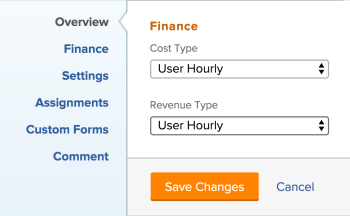

# Editar uma tarefa de modelo

<!--Audited: 11/2025-->

<!--take out production and preview references and new/ old experiences at release-->

<!--

 

The highlighted information on this page refers to functionality not yet generally available. It is available only in the Preview environment for all customers. The same features will also be available in the Production environment for all customers starting with a week from the Preview release.      

For more information, see [Interface modernization](/help/quicksilver/product-announcements/product-releases/interface-modernization/interface-modernization.md).  

 
-->

Após criar um modelo, você pode editar as informações das tarefas do modelo. As informações atualizadas em uma tarefa de modelo são associadas às tarefas do projeto depois de usar o modelo para criar um projeto ou anexar o modelo a um projeto.

Para obter informações sobre como criar um modelo, consulte [Criar um modelo de projeto](../../../manage-work/projects/create-and-manage-templates/create-template.md).

É possível editar uma tarefa de modelo por vez ou editar tarefas de modelo em massa.

>[!NOTE]
>
>Não é possível editar tarefas de modelo que pertençam a modelos diferentes em massa. Só é possível editar tarefas de modelo que pertençam ao mesmo modelo.

## Requisitos de acesso

+++ Expanda para visualizar os requisitos de acesso para a funcionalidade neste artigo.

<table style="table-layout:auto"> 
 <col> 
 <col> 
 <tbody> 
  <tr> 
   <td role="rowheader">Pacote do Adobe Workfront</td> 
   <td> 
Qualquer
 </td> 
  </tr> 
  <tr> 
   <td role="rowheader">Licença do Adobe Workfront</td> 
   <td> 
Standard

   
Plano 
</td> 
  </tr> 
  <tr> 
   <td role="rowheader">Configuração do nível de acesso</td> 
   <td> 
Editar acesso a modelos
  </td> 
  </tr> 
  <tr> 
   <td role="rowheader">Permissões de objeto </td> 
   <td> 
Gerenciar permissões de um modelo. 
 
Não é possível compartilhar uma tarefa de modelo. 
 </td> 
  </tr> 
 </tbody> 
</table>

Para obter mais informações, consulte [Requisitos de acesso na documentação do Workfront](/help/quicksilver/administration-and-setup/add-users/access-levels-and-object-permissions/access-level-requirements-in-documentation.md).

+++

<!--Old:

<table style="table-layout:auto"> 
 <col> 
 <col> 
 <tbody> 
  <tr> 
   <td role="rowheader">Adobe Workfront plan</td> 
   <td> 
Any
 </td> 
  </tr> 
  <tr> 
   <td role="rowheader">Adobe Workfront license*</td> 
   <td> 
Standard 

   
Plan 
 </td> 
  </tr> 
  <tr> 
   <td role="rowheader">Access level</td> 
   <td> 
Edit access to Templates
  </td> 
  </tr> 
  <tr> 
   <td role="rowheader">Object permissions </td> 
   <td> 
Manage permissions for a template. 
 
You cannot share a template task. 
 </td> 
  </tr> 
 </tbody> 
</table>-->

## Pré-requisitos

Antes de começar, você deve

* Criar um modelo.

  Para obter informações sobre como criar um modelo, consulte [Criar um modelo de projeto](../../../manage-work/projects/create-and-manage-templates/create-template.md).

## Editar modelos de tarefa

É possível editar um modelo de tarefa usando as áreas Editar Modelo de Tarefa ou Detalhes do Modelo de Tarefa.

{{step1-to-templates}}

1. Clique no nome de um template para abri-lo.
1. Clique em **Tarefas de modelo** no painel esquerdo.
1. Clique no nome de uma tarefa de modelo na lista para abrir a tarefa de modelo.
1. Para editar informações limitadas sobre a tarefa de modelo, faça o seguinte:
   1. (Opcional) Clique em **Atualizações** no painel esquerdo para adicionar atualizações à tarefa de modelo. As atualizações de modelos de tarefa não são transferidas para tarefas do projeto quando o modelo é usado para criar um projeto.
   1. (Opcional) Clique em **Documentos** no painel esquerdo para adicionar documentos à tarefa de modelo. Os documentos serão transferidos para as tarefas do projeto quando você usar o modelo para criar o projeto.
   1. (Condicional) Para editar informações limitadas sobre uma tarefa de modelo, clique em **Detalhes da Tarefa de Modelo** no painel esquerdo e vá para as áreas da seção Detalhes para editar as informações de cada área.
   1. (Opcional) Siga qualquer um destes procedimentos:
      * Clique no ícone **Recolher tudo**  para recolher todas as áreas.
      * Clique no ícone **Editar**  e selecione qualquer uma das áreas abaixo ou clique em **Editar tudo** para editar informações em todas as áreas:

         * Visão geral
         * Forms personalizado
Os nomes dos formulários de alfândega são exibidos somente se houver formulários personalizados anexados à tarefa de modelo.
         * Finanças

        >[!TIP]
        >
        >Para obter informações sobre todos os campos exibidos na área Detalhes, continue editando todos os campos usando a caixa Editar Tarefa de Modelo, conforme descrito abaixo.

   1. (Opcional) Clique na seção **Subtarefas** no painel esquerdo para adicionar filhos à tarefa de modelo. Adicionar subtarefas para tarefas de modelo é semelhante a adicionar subtarefas de tarefas de projeto. Para obter informações, consulte a seção &quot;Criar subtarefas a partir da seção de subtarefas de tarefas&quot; no artigo [Criar subtarefas](/help/quicksilver/manage-work/tasks/create-tasks/create-subtasks.md).
   1. (Opcional) Clique em **Despesas** no painel esquerdo e adicione despesas às tarefas do modelo. As despesas da tarefa de modelo transferem para tarefas de projeto futuras, quando o modelo é usado para criar um projeto.
   1. (Opcional) Clique em **Aprovações** no painel esquerdo para criar aprovações ou anexar aprovações globais ou de nível de grupo às tarefas de modelo. As aprovações são transferidas para tarefas futuras do projeto.
   1. (Opcional) Clique na seção **Predecessores** no painel esquerdo para adicionar predecessores às tarefas de modelo. Adicionar predecessoras de tarefas de modelo é semelhante a adicionar predecessoras de tarefas de projeto. Para obter informações, consulte [Criar uma relação predecessora usando a área Predecessoras](/help/quicksilver/manage-work/tasks/use-prdcssrs/create-predecessors-in-predecessors-area.md).

1. (Opcional) Para editar várias tarefas de modelo em massa, selecione várias tarefas de modelo e clique em **Editar** na parte superior da lista de modelos.
1. (Condicional) Para editar todas as informações sobre a tarefa de modelo ou sobre várias tarefas ao mesmo tempo, clique para selecioná-las em uma lista e clique no ícone **Editar**  na parte superior da lista.

   A caixa **Editar Tarefa de Modelo** é exibida.

   >[!TIP]
   >
   >Você também pode selecionar uma tarefa de modelo em uma lista e clicar em **Editar** à direita do nome da tarefa de modelo no cabeçalho, para abrir a caixa **Editar Tarefa de Modelo**.

   

   <!--1. (Conditional) In the Production environment, -->
1. Considere especificar informações em qualquer uma das seguintes seções:

   * [Visão geral](#overview)
   * [Finanças](#finance)
   * [Configurações](#settings)
   * [Atribuições](#assignments)
   * [Formulários personalizados](#custom-forms)
   * [Comentário](#comment)

<!--1. Continue editing the template task as described in the Edit a template task using the old experience section in this article (********add hashtag anchor here*******)-->

<!--1. (Conditional) In the Preview environment, click **Try new experience** in the upper-right corner of the **Edit Template Task** box , then continue editing the template task as described in the Edit a template task using the new experience section in this article (********add hashtag anchor here*******).
1. (Optional) Click **Switch back to old experience** at the bottom of the Edit Template Task box  
-->

<!--### Edit a template task using the old experience
(and make all the headers below "####")-->

### Visão geral {#overview}

1. Comece a editar uma tarefa de modelo conforme descrito acima.
1. Clique em **Visão geral**.

   

1. Atualize qualquer um dos itens a seguir:

   <table style="table-layout:auto"> 
    <col> 
    <col> 
    <tbody> 
     <tr> 
      <td role="rowheader"><strong>Nome</strong> </td> 
      <td>Especifique um nome para a tarefa de modelo. Este campo não é exibido ao editar tarefas de modelo em massa.</td> 
     </tr> 
     <tr> 
      <td role="rowheader"><strong>Descrição</strong> </td> 
      <td>Adicione mais informações sobre a tarefa de modelo.</td> 
     </tr> 
     <tr> 
      <td role="rowheader"><strong>URL</strong> </td> 
      <td>Especifique um link da Web relacionado às informações sobre a tarefa de modelo.</td> 
     </tr> 
     <tr> 
      <td role="rowheader"><strong>Prioridade</strong> </td> 
      <td> 
Este é um sinalizador visual para você que permite priorizar suas tarefas de modelo. 
 
Selecione entre as seguintes opções:
 
       <ul> 
        <li> 
<strong>Nenhum</strong> 
 </li> 
        <li> 
<strong>Baixo</strong> 
 </li> 
        <li> 
 <b>Normal</b>
 </li> 
        <li> 
<b>Alta</b> 
 </li> 
        <li> 
<b>Urgente</b> 
 </li> 
       </ul> 
Dependendo das Preferências do projeto selecionadas pelo administrador do Workfront, os nomes das prioridades podem ser diferentes para você. Para obter mais informações sobre como editar prioridades, consulte <a href="../../../administration-and-setup/customize-workfront/creating-custom-status-and-priority-labels/create-customize-priorities.md" class="MCXref xref">Criar e personalizar prioridades</a>.
 </td> 
     </tr> 
     <tr> 
      <td role="rowheader"><strong>Tipo de Duração</strong> </td> 
      <td> 
A tarefa futura criada a partir desse modelo terá esse Tipo de Duração.  O tipo de duração identifica a relação entre o seguinte:
 
- número de recursos atribuídos a uma tarefa
 
- o esforço total necessário para concluir a tarefa
 
- a duração total da tarefa. 
 
Os Tipos de duração permitem definir atribuições de recursos consistentes com base nas necessidades da tarefa. Para obter mais informações sobre o Tipo de Duração de uma tarefa, consulte <a href="../../../manage-work/tasks/taskdurtn/task-duration-and-duration-type.md" class="MCXref xref">Visão Geral da Duração da Tarefa e do Tipo de Duração</a>.
 
Selecione entre as seguintes opções:
 
       <ul> 
        <li> 
Atribuição calculada 
 </li> 
        <li> 
Trabalho Calculado 
 </li> 
        <li> 
Orientado pelo Esforço 
 </li> 
        <li> 
Simples   
 </li> 
       </ul> </td> 
     </tr> 
     <tr> 
      <td role="rowheader"><strong>Duração</strong> </td> 
      <td> 
Especifique a Duração das tarefas futuras, em minutos, horas, dias, semanas ou meses. A tarefa futura criada a partir desse modelo terá a Duração especificada aqui.
 
Por padrão, o Workfront mede a Duração em dias. Período permitido para que a tarefa permaneça incompleta antes de ser concluída. Você não pode especificar a Duração de uma tarefa quando o <strong>Tipo de Duração</strong> da tarefa é <strong>Simples</strong>, ou quando a <strong>Restrição de Tarefa</strong> é <strong>Datas Fixas</strong>.
 
<b>IMPORTANTE</b>
 
Normalmente, a Duração é a quantidade de tempo entre o Início planejado e as Datas de conclusão planejadas de uma tarefa de modelo e, por esse motivo, afeta a linha do tempo do modelo. Isso determina a linha do tempo do projeto futuro criado a partir do modelo. 
 </td> 
     </tr> 
     <tr> 
      <td role="rowheader"><strong>Horas planejadas</strong> </td> 
      <td> 
Especifique o número de Horas planejadas para a tarefa futura no projeto criado com este modelo. Essa é a quantidade de tempo real que os atribuídos da tarefa levariam para concluí-la. Você só pode especificar o número de Horas Planejadas para uma tarefa quando o <strong>Tipo de Duração</strong> está definido como <strong>Atribuição Calculada</strong>. 
 </td> 
     </tr>

   <tr> 
      <td role="rowheader"><strong>Restrição de Tarefa</strong> </td> 
      <td> 
A tarefa no projeto criado a partir deste modelo terá esta restrição. Restrições de Tarefa identificam quando uma tarefa deve ser concluída. 
 
Selecione entre as seguintes opções:
 
       <ul> 
        <li><strong>Datas Fixas</strong>. Especifique um <strong>Início Planejado</strong> e uma <strong>Data de Conclusão Planejada.</strong></li> 
        <li><strong>Deve Iniciar Em</strong>. Especifique uma <strong>Data de Início Planejada.</strong></li> 
        <li><strong>Deve Terminar Em</strong>. Especifique uma <strong>Data de conclusão planejada</strong>.</li> 
        <li><strong>O Mais Breve Possível</strong> </li> 
        <li><strong>O Mais Tarde Possível</strong> </li> 
        <li style="font-weight: bold;"><strong>Momento Mais Cedo Disponível</strong> </li> 
        <li style="font-weight: bold;"><strong>Último Horário Disponível</strong> </li> 
        <li>Não Iniciar Depois De. Especifique uma <strong>Data de Início Planejada</strong>.</li> 
        <li><strong>Não Iniciar Antes De</strong>. Especifique uma <strong>Data de Início Planejada</strong>.</li> 
        <li><strong>Não Terminar Depois De</strong>. Especifique uma <strong>Data de conclusão planejada</strong>.</li> 
        <li><strong>Não Terminar Antes De</strong>. Especifique uma <strong>Data de conclusão planejada</strong>.</li> 
       </ul> 
Para obter mais informações sobre Restrição de Tarefa, consulte <a href="../../../manage-work/tasks/task-constraints/task-constraint-overview.md" class="MCXref xref">Visão geral sobre Restrição de Tarefa</a>.
 </td> 
     </tr> 
     <tr> 
      <td role="rowheader">Dia de Início (Opcional e condicional) </td> 
      <td> 
 Você pode especificar o Dia de Início de uma tarefa de modelo somente quando a Restrição da Tarefa for uma das seguintes:
 
       <ul> 
        <li>Precisa Iniciar Em</li> 
        <li>Não Iniciar Antes De</li> 
        <li>Não Iniciar Depois De</li> 
        <li>Datas Fixas</li> 
       </ul> 
Corresponderá à data na linha do tempo do futuro projeto em que a tarefa será iniciada. Para todas as outras restrições, o Workfront calcula o dia de início com base na dependência de predecessora entre as tarefas. 
 </td> 
     </tr> 
     <tr> 
      <td role="rowheader"><strong>Dia de Término</strong> (Opcional e condicional) </td> 
      <td> 
 Você pode especificar o Dia de Término de uma tarefa de modelo somente quando a Restrição da Tarefa for uma das seguintes:
 
       <ul style="list-style-type: circle;"> 
        <li>Deve concluir em</li> 
        <li>Não concluir antes de</li> 
        <li>Concluir no máximo até</li> 
        <li>Datas Fixas</li> 
       </ul> 
Corresponderá à data na linha do tempo do projeto futuro em que a tarefa será concluída. Para todas as outras restrições, o Workfront calcula o Dia de conclusão com base na Duração e na dependência do antecessor. 
 </td> 
     </tr> 
    </tbody> 
   </table>

1. (Opcional) Continue editando as seções a seguir, dependendo das informações que você deseja modificar.

   Ou

   Clique em **Salvar alterações**.

### Finanças {#finance}

1. Comece a editar uma tarefa de modelo conforme descrito acima.
1. Clique em **Finanças**.

   

1. Atualize qualquer um dos itens a seguir:

   <table style="table-layout:auto"> 
    <col> 
    <col> 
    <tbody> 
     <tr> 
      <td role="rowheader"><strong>Tipo de Custo</strong> </td> 
      <td> 
Especifique o Tipo de Custo para a tarefa futura. Isso vai determinar como o Custo na tarefa é calculado, com base no número de horas nas tarefas. 
 
Selecione entre as seguintes opções:
 
       <ul> 
        <li> 
Sem Custo 
 </li> 
        <li> 
Horas Fixas 
 </li> 
        <li> 
Usuário por hora 
 </li> 
        <li> 
Função por Hora 
 </li> 
       </ul> 
Para obter mais informações sobre o rastreamento de custos, consulte <a href="../../../manage-work/projects/project-finances/track-costs.md" class="MCXref xref">Rastrear custos</a>.
 </td> 
     </tr> 
     <tr> 
      <td role="rowheader"><strong>Tipo de receita</strong> </td> 
      <td> 
Especifique o Tipo de Receita para a tarefa futura. Isso vai determinar como a Receita na tarefa é calculada, com base no número de horas nas tarefas.
 
Selecione entre as seguintes opções: 
 
       <ul> 
        <li> 
Não Faturável
 </li> 
        <li> 
Horas por Valor da Hora do Recurso
 </li> 
        <li> 
Horas por Valor da Hora do Perfil
 </li> 
        <li> 
Horas por Valor de Hora Fixo
 </li> 
        <li> 
Horas por Valor da Hora dos Recursos, com Teto
 </li> 
        <li> 
Horas por Valor da Hora do Perfil, com Teto
 </li> 
        <li> 
Horas por Valor da Hora do Recurso mais Taxa Fixa
 </li> 
        <li> 
Horas por Valor da Hora do Perfil mais Taxa Fixa
 </li> 
        <li> 
Receita com Valor Fixo
 </li> 
       </ul> 
Para obter mais informações sobre o rastreamento da receita, consulte <a href="../../../manage-work/projects/project-finances/billing-and-revenue-overview.md" class="MCXref xref">Visão geral de faturamento e receita</a>.
 </td> 
     </tr> 
    </tbody> 
   </table>

1. (Opcional) Continue editando as seções a seguir, dependendo das informações que você deseja modificar.

   Ou

   Clique em **Salvar alterações**.

### Configurações {#settings}

1. Comece a editar uma tarefa de modelo conforme descrito acima.
1. Clique em **Configurações**.

   

1. Atualize qualquer um dos itens a seguir:

   <table style="table-layout:auto"> 
    <col> 
    <col> 
    <tbody> 
   <tr> 
      <td role="rowheader">
<b>Marco</b>
</strong> </td> 
      <td> 
Escolha um marco para associar à tarefa de modelo selecionada.

   
<b>IMPORTANTE</b>

   
Você deve associar um caminho de etapas a um modelo para que este campo seja exibido. Para obter mais informações, consulte <a href="../create-and-manage-templates/edit-templates.md">Editar modelos de projeto</a>.
 
   </td> 
     </tr>
     <tr> 
      <td role="rowheader"><strong>Modo de Acompanhamento</strong> </td> 
      <td> 
Especifique como o status de progresso da futura tarefa será rastreado. 
 
Selecione entre as seguintes opções:
 
       <ul> 
        <li> 
<strong>O Usuário Deve Atualizar</strong> 
 </li> 
        <li> 
<strong>Assumir no Prazo</strong> 
 </li> 
        <li> 
<strong>Ignorar avisos de atrasos</strong> 
 </li> 
        <li> 
<strong>Preenchimento Automático</strong> 
 </li> 
        <li> 
<strong>Predecessora</strong> 
 </li> 
       </ul> 
Para obter mais informações sobre o Modo de Acompanhamento nas tarefas, consulte <a href="../../../manage-work/tasks/task-information/task-tracking-mode.md" class="MCXref xref">Visão geral do Modo de Acompanhamento de Tarefas</a>.
 </td> 
     </tr> 
     <tr> 
      <td role="rowheader"><strong>Processo de aprovação</strong> </td> 
      <td> 
Selecione o processo de aprovação que deseja associar à tarefa de modelo. O administrador do Workfront deve definir Processos de Aprovação de tarefas no nível do sistema antes que você possa associá-los a tarefas de modelo. Um usuário com acesso administrativo aos processos de Aprovação também pode criar processos de aprovação específicos do grupo. Para obter mais informações sobre como criar processos de aprovação, consulte <a href="../../../administration-and-setup/customize-workfront/configure-approval-milestone-processes/create-approval-processes.md" class="MCXref xref">Criar um processo de aprovação para itens de trabalho</a>.
 
Considere o seguinte ao adicionar processos de aprovação: 
 
       <ul> 
       <li>Somente os processos de aprovação ativos são exibidos na lista. </li> 
       <li> 
Os processos de aprovação específicos do grupo e de todo o sistema são exibidos na lista. Os processos de aprovação associados a um grupo diferente daquele do modelo não são exibidos na lista.
 
Importante: se o grupo associado ao modelo for alterado, o processo de aprovação específico do grupo se tornará um processo de aprovação de uso único. Para obter mais informações sobre como as alterações no grupo do projeto ou no processo de aprovação afetam as configurações de aprovação, consulte <a href="../../../administration-and-setup/customize-workfront/configure-approval-milestone-processes/how-changes-affect-group-approvals.md" class="MCXref xref">Como as alterações no grupo e no processo de aprovação afetam os processos de aprovação atribuídos</a>. 
 </li> 
       <li> 
Se você adicionou um processo de aprovação de uso único, ele é exibido como "&lt;Custom&gt;" neste campo. Para obter informações, consulte <a href="../../../review-and-approve-work/manage-approvals/associate-approval-with-work.md" class="MCXref xref">Associar um processo de aprovação novo ou existente ao trabalho</a>. 
 <!--
(NOTE: this will be valid only for Classic when they edit the Edit Template box in NWE)
--> </li> 
       <li> 
Quando tarefas de modelo de edição em massa, os seguintes cenários existem:
 
       <ul> 
       <li> 
Quando você seleciona tarefas de modelo do mesmo grupo de modelo, os processos de aprovação no nível do sistema e no nível do grupo são exibidos nesse campo.
 </li> 
       <li> 
Quando você seleciona tarefas de modelo de diferentes grupos de modelo, somente os processos de aprovação no nível do sistema são exibidos nesse campo.
 </li> 
       <li> 
Quando qualquer uma das tarefas de modelo tiver um processo de aprovação de uso único anexado, ela será substituída pelo processo de aprovação de nível de sistema ou de grupo selecionado. 
 </li> 
       </ul> </li> 
       </ul> </td> 
     </tr> 
     <tr> 
      <td role="rowheader"><strong>Notificações de Lembrete</strong> </td> 
      <td> 
Selecione quais Notificações de Lembrete você deseja anexar à tarefa de modelo. Elas serão anexadas às tarefas futuras no projeto criado a partir deste modelo. O administrador do sistema deve configurar Notificações de Lembrete antes de selecioná-las em uma tarefa. Para obter mais informações sobre como configurar Notificações de Lembrete, consulte <a href="../../../administration-and-setup/manage-workfront/emails/set-up-reminder-notifications.md" class="MCXref xref">Configurar notificações de lembrete</a>.
 </td> 
     </tr> 
    </tbody> 
   </table>

1. (Opcional) Continue editando as seções a seguir, dependendo das informações que você deseja modificar.

   Ou

   Clique em **Salvar alterações**.

### Atribuições {#assignments}

1. Comece a editar uma tarefa de modelo conforme descrito acima.
1. Clique em **Atribuições**.

   

1. Clique em **Adicionar responsável** para adicionar um novo responsável à tarefa de modelo. É possível atribuir usuários, funções ou equipes a uma tarefa. Você pode ter vários atribuídos em uma tarefa. As tarefas futuras terão os mesmos recursos atribuídos a ela quando criadas a partir desta tarefa de modelo.
1. (Opcional) Se você tiver vários atribuídos, selecione o botão de opção **Proprietário** para indicar qual usuário ou função é considerado o Proprietário da Tarefa ou o Atribuído Principal. O Workfront marca o primeiro usuário ou função de trabalho atribuída a uma tarefa de modelo como Proprietário ou Designado Principal.
1. (Condicional e opcional) Se a Restrição da sua Tarefa for Trabalho Calculado ou Orientado pelo Esforço, especifique a **Alocação %** (porcentagem de alocação) para cada destinatário. Quantidade de tempo do agendamento do destinatário que ele pode gastar nesta tarefa. Alterar a porcentagem de alocação para um destinatário irá alterar as Horas planejadas de uma tarefa.
1. (Condicional e opcional) Se a sua Restrição de tarefa for Simples, especifique as **Horas** de cada destinatário

   Ou

   Especifique o número total de **Horas planejadas** para a tarefa de modelo. Isso distribui o total de horas igualmente entre todos os atribuídos.

1. (Condicional e opcional) Se a Restrição da tarefa for Simples, especifique a **Duração** da tarefa de modelo em dias. Esta será a duração da tarefa criada a partir deste modelo.
1. (Opcional) Selecione uma função no menu suspenso **Função do destinatário**. Essa é a função que o destinatário pode desempenhar nessa tarefa futura. Somente as funções de trabalho associadas a cada destinatário em seu perfil são exibidas no menu suspenso.
1. (Opcional) Continue editando as seções a seguir, dependendo das informações que você deseja modificar.

   Ou

   Clique em **Salvar alterações**.

### Formulários personalizados {#custom-forms}

Você pode definir formulários personalizados para serem anexados automaticamente por padrão a tarefas quando as tarefas forem adicionadas a um projeto. Para obter informações sobre como configurar o projeto para incluir formulários de tarefa personalizados padrão, consulte a seção &quot;Tarefas&quot; no artigo [Editar projetos](../../../manage-work/projects/manage-projects/edit-projects.md).

Você também pode adicionar formulários personalizados às tarefas futuras de um projeto quando o projeto for criado a partir de um modelo, adicionando os formulários personalizados às tarefas de modelo.

1. Comece a editar uma tarefa de modelo conforme descrito acima.
1. Clique em **Forms Personalizado**.

   

1. Selecione o(s) formulário(s) personalizado(s) que deseja associar à tarefa de modelo.

   Você deve criar os formulários personalizados antes que eles estejam disponíveis para seleção neste campo.
Somente formulários personalizados ativos são exibidos na lista.
Para obter mais informações sobre a criação de formulários personalizados, consulte [Criar um formulário personalizado](/help/quicksilver/administration-and-setup/customize-workfront/create-manage-custom-forms/form-designer/design-a-form/design-a-form.md).
Você pode adicionar até dez formulários personalizados a uma tarefa de modelo.
Os formulários são adicionados automaticamente às tarefas criadas a partir do modelo.
1. (Condicional e opcional) Se você anexou um formulário personalizado à tarefa de modelo, edite quaisquer campos no formulário. Você deve especificar todos os campos obrigatórios antes de poder salvar a tarefa de modelo.

   >[!NOTE]
   >
   >Dependendo de como o administrador do Workfront definiu as permissões para as seções no formulário personalizado, nem todos podem exibir ou editar os mesmos campos em um determinado formulário personalizado. As permissões para editar campos em uma seção de um formulário personalizado dependem das permissões que você tem na tarefa de modelo ou na tarefa futura.\
   >Para obter informações sobre como configurar permissões em seções de um formulário personalizado, consulte [Compartilhar um formulário personalizado](../../../administration-and-setup/customize-workfront/create-manage-custom-forms/share-access-to-a-custom-form.md).\
   >Para obter informações sobre como definir permissões de tarefa, consulte [Compartilhar uma tarefa](../../../workfront-basics/grant-and-request-access-to-objects/share-a-task.md).\
   >Para obter informações sobre como definir permissões de modelo, consulte [Compartilhar um modelo](../../../workfront-basics/grant-and-request-access-to-objects/share-a-template.md).

1. (Opcional) Continue editando a seção a seguir, dependendo das informações que você deseja modificar.

   Ou

   Clique em **Salvar alterações**.

### Comentário {#comment}

1. Comece a editar uma tarefa de modelo conforme descrito acima.
1. Clique em **Comentário**.

   

1. Especifique um comentário que deseja exibir no fluxo de atualizações da tarefa de modelo no campo disponível. Este comentário é visível para todos com acesso de Exibição ao modelo e à tarefa de modelo e com acesso para exibir Notas.
1. Clique em **Salvar alterações**.

   Quando você ou outro usuário cria um projeto a partir desse modelo, todas as configurações aplicadas às tarefas do modelo se tornam as configurações para as tarefas do projeto.

<!--

 

### Edit a template task using the new experience

Consider specifying information in any of the following sections:

   * [Template task name](#template-task-name)
   * [Overview](#overview-1)
   * [Assignments](#assignments-1)
   * [Finance](#finance-1)
   * [Custom Forms](#custom-forms-1)
   * [Settings](#settings-1)
   * [Comment](#comment-1)

#### Template Task Name

1. Begin editing a template task as described above.
1. In the Edit Template Task box, click **Template Task Name** and add a name for the template task. 

   This view is not available when editing template tasks in bulk. 

1. (Optional) Continue editing the following sections, depending on the information you want to modify.

   Or

   Click **Save**. 

#### Overview {#overview-1}

1. Begin editing a template task as described above.
1. In the **Edit Template Task** box, click **Overview** in the left panel. 

   

1. Update any of the following:

   <table style="table-layout:auto"> 
    <col> 
    <col> 
    <tbody> 
     <tr> 
      <td role="rowheader"><strong>Description</strong> </td> 
      <td>Add additional information about the template task.</td> 
     </tr> 
     <tr> 
      <td role="rowheader"><strong>Priority</strong> </td> 
      <td> 
This is a visual flag for you which allows you to prioritize your template tasks. 
 
Select from the following options:
 
       <ul> 
        <li> 
<strong>None</strong> 
 </li> 
        <li> 
<strong>Low</strong> 
 </li> 
        <li> 
 <b>Normal</b>
 </li> 
        <li> 
<b>High</b> 
 </li> 
        <li> 
<b>Urgent</b> 
 </li> 
       </ul> 
Depending on the Project Preferences selected by your Workfront administrator, the names of priorities might be different for you. For more information about editing priorities, see <a href="../../../administration-and-setup/customize-workfront/creating-custom-status-and-priority-labels/create-customize-priorities.md" class="MCXref xref">Create and customize priorities</a>.
 </td> 
     </tr> 
     <tr> 
      <td role="rowheader"><strong>Task Constraint</strong> </td> 
      <td> 
The task on the project created from this template will have this constraint. Task Constraints identify when a task must be completed. 
 
Select from the following options:
 
       <ul> 
        <li><strong>Fixed Dates</strong>. Specify a <strong>Planned Start</strong> and a <strong>Planned Completion Date.</strong></li> 
        <li><strong>Must Start On</strong>. Specify a <strong>Planned Start Date.</strong></li> 
        <li><strong>Must Finish On</strong>. Specify a <strong>Planned Completion Date</strong>.</li> 
        <li><strong>As Soon as Possible</strong> </li> 
        <li><strong>As Late as Possible</strong> </li> 
        <li style="font-weight: bold;"><strong>Earliest Available Time</strong> </li> 
        <li style="font-weight: bold;"><strong>Latest Available Time</strong> </li> 
        <li>Start No Later Than. Specify a <strong>Planned Start Date</strong>.</li> 
        <li><strong>Start No Earlier Than</strong>. Specify a <strong>Planned Start Date</strong>.</li> 
        <li><strong>Finish No Later Than</strong>. Specify a <strong>Planned Completion Date</strong>.</li> 
        <li><strong>Finish No Earlier Than</strong>. Specify a <strong>Planned Completion Date</strong>.</li> 
       </ul> 
For more information on Task Constraint, see <a href="../../../manage-work/tasks/task-constraints/task-constraint-overview.md" class="MCXref xref">Task Constraint overview</a>.
 </td> 
     </tr> 
     <tr> 
      <td role="rowheader">Start Day (Optional and conditional) </td> 
      <td> 
 You can specify the Start Day of a template task only when the Task&nbsp;Constraint is one of the following:
 
       <ul> 
        <li>Must Start On</li> 
        <li>Start No&nbsp;Earlier Than</li> 
        <li>Start No Later Than</li> 
        <li>Fixed Dates</li> 
       </ul> 
This will correspond to the date within the timeline of the future project when the task will start. For all other constraints, Workfront calculates the Start Day based on predecessor dependency between the tasks. 
 </td> 
     </tr> 
     <tr> 
      <td role="rowheader"><strong>Completion Day</strong> (Optional and conditional) </td> 
      <td> 
 You can specify the Completion Day of a template task only when the Task Constraint is one of the following:
 
       <ul style="list-style-type: circle;"> 
        <li>Must Finish On</li> 
        <li>Finish No Earlier Than</li> 
        <li>Finish No Later Than</li> 
        <li>Fixed Dates</li> 
       </ul> 
This will correspond to the date within the timeline of the future project when the task will complete. For all other constraints, Workfront calculates the Completion Day based on Duration and predecessor dependency. 
 </td> 
     </tr> 
     <tr> 
      <td role="rowheader"><strong>URL</strong> </td> 
      <td>Specify a web link that relates to the information about the template task.</td> 
     </tr> 

     <tr> 
      <td role="rowheader"><strong>Work Effort</strong> </td> 
      <td>Choose from the following options:
      <ul><li>Small</li>
      <li>Medium</li>
      <li>Large</li></ul>

      
<b>IMPORTANT</b>

      
The Work Effort field displays when editing a template task only when you select the <b>Use Work Effort to automatically calculate task Planned Hours</b> setting when editing the template.

      </td> 
     </tr> 
     </tbody> 
   </table>

1. (Optional) Continue editing the following sections, depending on the information you want to modify.

   Or

   Click **Save**.

#### Assignments {#assignments-1}

1. Begin editing a template task as described above.
1. In the **Edit Template Task** box, click **Assignments** in the left panel.

   

1. In the Search people, role, or teams field, start typing the name of an assignee, then select it when it displays in the list

   Or

   Click **Assign to me** to assign the template task to yourself.
1. Consider updating the following information: 

<table style="table-layout:auto"> 
    <col> 
    <col> 
    <tbody> 

<tr> 
      <td role="rowheader"><strong>Duration Type</strong> </td> 
      <td> 
The future task created from this template will have this Duration Type.  The Duration Type identifies the relationship between the following:
 
      <ul>
      <li>
Number of resources assigned to a task
 </li>
      <li>
The total effort required to complete the task
</li> 
      <li>
The total duration of the task 
</li></ul> 
Using Duration Types, you can set consistent resource assignments based on the needs of the task. For more information about the Duration Type of a task, see <a href="../../../manage-work/tasks/taskdurtn/task-duration-and-duration-type.md" class="MCXref xref">Overview of Task Duration and Duration Type</a>.
 
Select from the following options:
 
       <ul> 
        <li> 
Calculated Assignment 
 </li> 
        <li> 
Calculated Work 
 </li> 
        <li> 
Effort Driven 
 </li> 
        <li> 
Simple   
 </li> 
       </ul> </td> 
     </tr> 
     <tr> 
      <td role="rowheader"><strong>Duration</strong> </td> 
      <td> 
Specify the Duration of the future tasks, in minutes, hours, days, weeks, or months. The future task created from this template will have the Duration specified here.
 
By default, Workfront measures Duration in days. This is the amount of time that you allow for the task to remain incomplete, before it must be completed. You cannot specify the Duration of a task when the <strong>Duration Type</strong> of the task is <strong>Simple</strong>, or when the <strong>Task Constraint</strong> is <strong>Fixed Dates</strong>.
 
<b>IMPORTANT</b>
 
Duration is typically the amount of time between the Planned Start and the Planned Completion Dates of a template task, and for this reason, it affects the timeline of the template. This determines the timeline of the future project created from the template. 
 </td> 
     </tr> 
     <tr> 
      <td role="rowheader"><strong>Planned Hours</strong> </td> 
      <td> 
Specify the number of Planned Hours for the future task on the project created with this template. This is the amount of actual time it would take the assignees of the task to complete it. You can only specify the number of Planned Hours for a task when the <strong>Duration Type</strong> is set to <strong>Calculated Assignment</strong>. 
 </td> 
     </tr> 
  </tbody> 
   </table>

1. (Optional) Continue editing the following sections, depending on the information you want to modify.

   Or

   Click **Save**.

#### Finance {#finance-1}

1. Begin editing a template task as described above.
1. In the **Edit Template Task** box, click **Finance** in the left panel.

   

1. Update any of the following:

   <table style="table-layout:auto"> 
    <col> 
    <col> 
    <tbody> 
     <tr> 
      <td role="rowheader"><strong>Cost Type</strong> </td> 
      <td> 
Specify the Cost Type for the future task. This is going to determine how the Cost on the task is calculated, based on the number of hours on the tasks. 
 
Select from the following options:
 
       <ul> 
        <li> 
No Cost 
 </li> 
        <li> 
Fixed Hourly 
 </li> 
        <li> 
User Hourly 
 </li> 
        <li> 
Role Hourly 
 </li> 
       </ul> 
For more information about tracking costs, see <a href="../../../manage-work/projects/project-finances/track-costs.md" class="MCXref xref">Track costs</a>.
 </td> 
     </tr> 
     <tr> 
      <td role="rowheader"><strong>Revenue Type</strong> </td> 
      <td> 
Specify the Revenue Type for the future task. This is going to determine how the Revenue on the task is calculated, based on the number of hours on the tasks.
 
Select from the following options: 
 
       <ul> 
        <li> 
Not Billable
 </li> 
        <li> 
User Hourly
 </li> 
        <li> 
Role Hourly
 </li> 
        <li> 
Fixed Hourly
 </li> 
        <li> 
User Hourly w/Cap
 </li> 
        <li> 
Role Hourly w/Cap
 </li> 
        <li> 
User Hourly Plus Fixed
 </li> 
        <li> 
Role Hourly Plus Fixed
 </li> 
        <li> 
Fixed Revenue
 </li> 
       </ul> 
For more information about tracking revenue, see <a href="../../../manage-work/projects/project-finances/billing-and-revenue-overview.md" class="MCXref xref">Overview of Billing and Revenue</a>.
 </td> 
     </tr> 
    </tbody> 
   </table>

1. (Optional) Continue editing the following sections, depending on the information you want to modify.

   Or

   Click **Save**.

#### Custom Forms {#custom-forms}

You can define custom forms to be automatically attached by default to tasks when the tasks are added to a project. For information about setting up the project to include default task custom forms, see the "Tasks" section in the article [Edit projects](../../../manage-work/projects/manage-projects/edit-projects.md).

You can also add custom forms to the future tasks of a project when the project is created from a template, by adding the custom forms to the template tasks. 

1. Begin editing a template task as described above.
1. In the **Edit Template Task** box, click **Custom Forms** in the left panel.

   

1. Select the custom form or forms that you want to associate with the template task. 

   You must build the custom forms before they are available to select in this field. 
   Only active custom forms display in the list. 

   For more information about building custom forms, see [Create a custom form](/help/quicksilver/administration-and-setup/customize-workfront/create-manage-custom-forms/form-designer/design-a-form/design-a-form.md). 

   You can add up to ten custom forms to a template task. 
   The forms are automatically added to the tasks created from the template. 
1. (Conditional and optional) If you attached a custom form to the template task, edit any fields on the form. You must specify all required fields before you can save the template task.

   >[!NOTE]
   >
   >Depending on how your Workfront administrator set the permissions for the sections in your custom form, not everyone can view or edit the same fields on a given custom form. The permissions to edit fields within a section of a custom form depend on the permissions you have on the template task or the future task.   
   >For information about setting permissions on sections of a custom form, see [Share a custom form](../../../administration-and-setup/customize-workfront/create-manage-custom-forms/share-access-to-a-custom-form.md).   
   >For information about setting task permissions, see [Share a task](../../../workfront-basics/grant-and-request-access-to-objects/share-a-task.md).   
   >For information about setting template permissions, see [Share a template](../../../workfront-basics/grant-and-request-access-to-objects/share-a-template.md).

1. (Optional) Continue editing the following section, depending on the information you want to modify.

   Or

   Click **Save**.

#### Settings {#settings-1}

1. Begin editing a template task as described above.
1. In the **Edit Template Task Box**, click **Settings** in the left panel.

   

1. Update any of the following:

   <table style="table-layout:auto"> 
    <col> 
    <col> 
    <tbody> 
   <tr> 
      <td role="rowheader">
<b>Milestone</b>
</strong> </td> 
      <td> 
Choose a milestone to associate with the selected template task.

      
   
<b>IMPORTANT</b>

   
You must associate a milestone path with a template for this field to display. For more information, see <a href="../create-and-manage-templates/edit-templates.md">Edit project templates</a>.
 
   </td> 
     </tr>
     <tr> 
      <td role="rowheader"><strong>Tracking Mode</strong> </td> 
      <td> 
Specify how the progress status of the future task will be tracked. 
 
Select from the following options:
 
       <ul> 
        <li> 
<strong>User Must Update</strong> 
 </li> 
        <li> 
<strong>Assume on Time</strong> 
 </li> 
        <li> 
<strong>Ignore Late Warnings</strong> 
 </li> 
        <li> 
<strong>Autocomplete</strong> 
 </li> 
        <li> 
<strong>Predecessor</strong> 
 </li> 
       </ul> 
For more information about the Tracking Mode on tasks, see <a href="../../../manage-work/tasks/task-information/task-tracking-mode.md" class="MCXref xref">Task Tracking Mode overview</a>.
 </td> 
     </tr> 
     <tr> 
      <td role="rowheader"><strong>Reminder Notifications</strong> </td> 
      <td> 
Select which Reminder Notifications you would like to attach to the template task. They will be attached to the future tasks on the project created from this template. Your system administrator must configure Reminder Notifications before you can select them on a task. For more information about configuring Reminder Notifications, see <a href="../../../administration-and-setup/manage-workfront/emails/set-up-reminder-notifications.md" class="MCXref xref">Set up reminder notifications</a>.
 </td> 
     </tr> 
     <tr> 
      <td role="rowheader"><strong>Approval Process</strong> </td> 
      <td> 
Select the approval process you want to associate with the template task. Your Workfront administrator must define system-level task Approval Processes before you can associate them with template tasks. A user with administrative access to Approval processes can also create group-specific approval processes. For more information about creating approval processes, see <a href="../../../administration-and-setup/customize-workfront/configure-approval-milestone-processes/create-approval-processes.md" class="MCXref xref">Create an approval process for work items</a>.
 
Consider the following when adding approval processes: 
 
       <ul> 
       <li>Only active approval processes display in the list. </li> 
       <li> 
System-wide and group-specific approval processes display in the list. Approval processes associated with a group other than that of the template do not display in the list.
 
Important: If the group associated with the template changes, the group-specific approval process becomes a single-use approval process. For more information about how changes to the group of the project or changes in the approval process affect approval settings, see <a href="../../../administration-and-setup/customize-workfront/configure-approval-milestone-processes/how-changes-affect-group-approvals.md" class="MCXref xref">How group and approval process changes affect assigned approval processes</a>. 
 </li> 
       <li> 
If you added a single-use approval process, it displays as "&lt;Custom&gt;" in this field. For information, see <a href="../../../review-and-approve-work/manage-approvals/associate-approval-with-work.md" class="MCXref xref">Associate a new or existing approval process with work</a>. 
  </li> 
       <li> 
When bulk-editing template tasks, the following scenarios exist:
 
       <ul> 
       <li> 
When you select template tasks from the same template group, both system-level and group-level approval processes display in this field.
 </li> 
       <li> 
When you select template tasks from different template groups, only system-level approval processes display in this field.
 </li> 
       <li> 
When any of the template tasks has a single-use approval process attached, it is replaced by the system-level or group-level approval process you select. 
 </li> 
       </ul> </li> 
       </ul> </td> 
     </tr> 
     
    </tbody> 
   </table>

1. (Optional) Continue editing the following sections, depending on the information you want to modify.

   Or

   Click **Save**.

#### Comment {#comment-1}

1. Begin editing a template task as described above.
1. In the **Edit Template Task** box, click **Comment** in the left panel.

   

1. In the **Add an update to the template task** area, specify a comment that you want to display in the updates stream of the template task in the available field. This comment is visible for everyone with View access to the template and the template task and with access to view Notes.
1. Click **Save**.

   When you or another user creates a project from this template, all settings you applied to template tasks become the settings for the project tasks.

-->