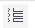

# Editar uma tarefa de modelo

<!--Audited: 09/2024-->

Após criar um modelo, você pode editar as informações das tarefas do modelo. As informações atualizadas em uma tarefa de modelo são associadas às tarefas do projeto depois de usar o modelo para criar um projeto ou anexar o modelo a um projeto.

Para obter informações sobre como criar um modelo, consulte [Criar um modelo de projeto](../../../manage-work/projects/create-and-manage-templates/create-template.md).

Você pode editar tarefas de modelo ou editar tarefas de modelo em massa.

>[!NOTE]
>
>Não é possível editar tarefas de modelo que pertençam a modelos diferentes em massa. Só é possível editar tarefas de modelo que pertençam ao mesmo modelo.

## Requisitos de acesso

+++ Expanda para visualizar os requisitos de acesso para a funcionalidade neste artigo.

Você deve ter o seguinte acesso para executar as etapas deste artigo:

<table style="table-layout:auto"> 
 <col> 
 <col> 
 <tbody> 
  <tr> 
   <td role="rowheader">plano do Adobe Workfront</td> 
   <td> 
Qualquer
 </td> 
  </tr> 
  <tr> 
   <td role="rowheader">Licença da Adobe Workfront*</td> 
   <td> 
Novo: Padrão 

   
Atual: Plano 
 </td> 
  </tr> 
  <tr> 
   <td role="rowheader">Nível de acesso</td> 
   <td> 
Editar acesso a modelos
  </td> 
  </tr> 
  <tr> 
   <td role="rowheader">Permissões de objeto </td> 
   <td> 
Gerenciar permissões de um modelo. 
 
Contribute ou permissões mais altas para a tarefa de modelo.
 </td> 
  </tr> 
 </tbody> 
</table>

*Para obter mais informações, consulte [Requisitos de acesso na documentação do Workfront](/help/quicksilver/administration-and-setup/add-users/access-levels-and-object-permissions/access-level-requirements-in-documentation.md).

+++

## Pré-requisitos

Antes de começar, você deve

* Criar um modelo.

  Para obter informações sobre como criar um modelo, consulte [Criar um modelo de projeto](../../../manage-work/projects/create-and-manage-templates/create-template.md).

## Editar tarefa de modelo

É possível editar um modelo de tarefa usando as áreas Editar Modelo de Tarefa ou Detalhes do Modelo de Tarefa. As etapas a seguir descrevem a edição de uma tarefa na caixa Editar Tarefa de Modelo.

{{step1-to-templates}}

1. Clique no nome de um template para abri-lo.
1. Clique em **Tarefas de modelo** no painel esquerdo.
1. Clique no nome de uma tarefa de modelo na lista para abrir a tarefa de modelo.
1. (Opcional) Para editar várias tarefas de modelo em massa, selecione várias tarefas de modelo e clique em **Editar** na parte superior da lista de modelos.
1. (Condicional) Para editar informações limitadas sobre uma tarefa de modelo, clique em **Detalhes da Tarefa de Modelo** no painel esquerdo e vá para as áreas da seção Detalhes para editar as informações de cada área.
1. (Opcional) Clique no ícone  de **Recolher tudo** para recolher todas as áreas.
1. Para editar informações na seção Detalhes, clique no ícone  de **Editar** e selecione qualquer uma das áreas abaixo ou clique em **Editar tudo** para editar informações em todas as áreas:

   * Visão geral
   * Formulários personalizados

     Os nomes dos formulários de alfândega são exibidos somente se houver formulários personalizados anexados ao objeto.

   * Finanças

   >[!TIP]
   >
   >Para obter informações sobre todos os campos exibidos na área Detalhes, continue editando todos os campos usando a caixa Editar Tarefa de Modelo, conforme descrito abaixo.

1. (Condicional) Para editar todas as informações sobre a tarefa de modelo, clique no menu **Mais**  ao lado do nome da tarefa de modelo e clique em **Editar**.

   A caixa **Editar Tarefa de Modelo** é exibida.

   >[!TIP]
   >
   >Você também pode selecionar uma tarefa de modelo em uma lista e clicar em Editar para abrir a caixa Editar tarefa de modelo.

   

1. Considere especificar informações em qualquer uma das seguintes seções:

   * [Visão geral](#overview)
   * [Finanças](#finance)
   * [Configurações](#settings)
   * [Atribuições](#assignments)
   * [Formulários personalizados](#custom-forms)
   * [Comentário](#comment)

### Visão geral {#overview}

1. Comece a editar uma tarefa de modelo conforme descrito acima.
1. Clique em **Visão geral**.

   

1. Atualize qualquer um dos itens a seguir:

   <table style="table-layout:auto"> 
    <col> 
    <col> 
    <tbody> 
     <tr> 
      <td role="rowheader"><strong>Nome</strong> </td> 
      <td>Especifique um nome para a tarefa de modelo. Este campo não é exibido ao editar tarefas de modelo em massa.</td> 
     </tr> 
     <tr> 
      <td role="rowheader"><strong>Descrição</strong> </td> 
      <td>Adicione mais informações sobre a tarefa de modelo.</td> 
     </tr> 
     <tr> 
      <td role="rowheader"><strong>URL</strong> </td> 
      <td>Especifique um link da Web relacionado às informações sobre a tarefa de modelo.</td> 
     </tr> 
     <tr> 
      <td role="rowheader"><strong>Prioridade</strong> </td> 
      <td> 
Este é um sinalizador visual para você que permite priorizar suas tarefas de modelo. 
 
Selecione entre as seguintes opções:
 
       <ul> 
        <li> 
<strong>Nenhum</strong> 
 </li> 
        <li> 
<strong>Baixo</strong> 
 </li> 
        <li> 
 <b>Normal</b>
 </li> 
        <li> 
<b>Alta</b> 
 </li> 
        <li> 
<b>Urgente</b> 
 </li> 
       </ul> 
Dependendo das Preferências do projeto selecionadas pelo administrador do Workfront, os nomes das prioridades podem ser diferentes para você. Para obter mais informações sobre como editar prioridades, consulte <a href="../../../administration-and-setup/customize-workfront/creating-custom-status-and-priority-labels/create-customize-priorities.md" class="MCXref xref">Criar e personalizar prioridades</a>.
 </td> 
     </tr> 
     <tr> 
      <td role="rowheader"><strong>Tipo de Duração</strong> </td> 
      <td> 
A tarefa futura criada a partir desse modelo terá esse Tipo de Duração.  O tipo de duração identifica a relação entre o seguinte:
 
- número de recursos atribuídos a uma tarefa
 
- o esforço total necessário para concluir a tarefa
 
- a duração total da tarefa. 
 
Os Tipos de duração permitem definir atribuições de recursos consistentes com base nas necessidades da tarefa. Para obter mais informações sobre o Tipo de Duração de uma tarefa, consulte <a href="../../../manage-work/tasks/taskdurtn/task-duration-and-duration-type.md" class="MCXref xref">Visão Geral da Duração da Tarefa e do Tipo de Duração</a>.
 
Selecione entre as seguintes opções:
 
       <ul> 
        <li> 
Atribuição calculada 
 </li> 
        <li> 
Trabalho Calculado 
 </li> 
        <li> 
Orientado pelo Esforço 
 </li> 
        <li> 
Simples   
 </li> 
       </ul> </td> 
     </tr> 
     <tr> 
      <td role="rowheader"><strong>Duração</strong> </td> 
      <td> 
Especifique a Duração das tarefas futuras, em minutos, horas, dias, semanas ou meses. A tarefa futura criada a partir desse modelo terá a Duração especificada aqui.
 
Por padrão, o Workfront mede a Duração em dias. Período permitido para que a tarefa permaneça incompleta antes de ser concluída. Você não pode especificar a Duração de uma tarefa quando o <strong>Tipo de Duração</strong> da tarefa é <strong>Simples</strong>, ou quando a <strong>Restrição de Tarefa</strong> é <strong>Datas Fixas</strong>.
 
<b>IMPORTANTE</b>
 
Normalmente, a Duração é a quantidade de tempo entre o Início planejado e as Datas de conclusão planejadas de uma tarefa de modelo e, por esse motivo, afeta a linha do tempo do modelo. Isso determina a linha do tempo do projeto futuro criado a partir do modelo. 
 </td> 
     </tr> 
     <tr> 
      <td role="rowheader"><strong>Horas planejadas</strong> </td> 
      <td> 
Especifique o número de Horas planejadas para a tarefa futura no projeto criado com este modelo. Essa é a quantidade de tempo real que os atribuídos da tarefa levariam para concluí-la. Você só pode especificar o número de Horas Planejadas para uma tarefa quando o <strong>Tipo de Duração</strong> está definido como <strong>Atribuição Calculada</strong>. 
 </td> 
     </tr>

   <tr> 
      <td role="rowheader"><strong>Restrição de Tarefa</strong> </td> 
      <td> 
A tarefa no projeto criado a partir deste modelo terá esta restrição. Restrições de Tarefa identificam quando uma tarefa deve ser concluída. 
 
Selecione entre as seguintes opções:
 
       <ul> 
        <li><strong>Datas Fixas</strong>. Especifique um <strong>Início Planejado</strong> e uma <strong>Data de Conclusão Planejada.</strong></li> 
        <li><strong>Deve Iniciar Em</strong>. Especifique uma <strong>Data de Início Planejada.</strong></li> 
        <li><strong>Deve Terminar Em</strong>. Especifique uma <strong>Data de conclusão planejada</strong>.</li> 
        <li><strong>O Mais Breve Possível</strong> </li> 
        <li><strong>O Mais Tarde Possível</strong> </li> 
        <li style="font-weight: bold;"><strong>Momento Mais Cedo Disponível</strong> </li> 
        <li style="font-weight: bold;"><strong>Último Horário Disponível</strong> </li> 
        <li>Não Iniciar Depois De. Especifique uma <strong>Data de Início Planejada</strong>.</li> 
        <li><strong>Não Iniciar Antes De</strong>. Especifique uma <strong>Data de Início Planejada</strong>.</li> 
        <li><strong>Não Terminar Depois De</strong>. Especifique uma <strong>Data de conclusão planejada</strong>.</li> 
        <li><strong>Não Terminar Antes De</strong>. Especifique uma <strong>Data de conclusão planejada</strong>.</li> 
       </ul> 
Para obter mais informações sobre Restrição de Tarefa, consulte <a href="../../../manage-work/tasks/task-constraints/task-constraint-overview.md" class="MCXref xref">Visão geral sobre Restrição de Tarefa</a>.
 </td> 
     </tr> 
     <tr> 
      <td role="rowheader">Dia de Início (Opcional e condicional) </td> 
      <td> 
 Você pode especificar o Dia de Início de uma tarefa de modelo somente quando a Restrição da Tarefa for uma das seguintes:
 
       <ul> 
        <li>Precisa Iniciar Em</li> 
        <li>Não Iniciar Antes De</li> 
        <li>Não Iniciar Depois De</li> 
        <li>Datas Fixas</li> 
       </ul> 
Corresponderá à data na linha do tempo do futuro projeto em que a tarefa será iniciada. Para todas as outras restrições, o Workfront calcula o dia de início com base na dependência de predecessora entre as tarefas. 
 </td> 
     </tr> 
     <tr> 
      <td role="rowheader"><strong>Dia de Término</strong> (Opcional e condicional) </td> 
      <td> 
 Você pode especificar o Dia de Término de uma tarefa de modelo somente quando a Restrição da Tarefa for uma das seguintes:
 
       <ul style="list-style-type: circle;"> 
        <li>Precisa Terminar Em</li> 
        <li>Não Terminar Antes De</li> 
        <li>Não Terminar Depois De</li> 
        <li>Datas Fixas</li> 
       </ul> 
Corresponderá à data na linha do tempo do projeto futuro em que a tarefa será concluída. Para todas as outras restrições, o Workfront calcula o Dia de conclusão com base na Duração e na dependência do antecessor. 
 </td> 
     </tr> 
    </tbody> 
   </table>

1. (Opcional) Continue editando as seções a seguir, dependendo das informações que você deseja modificar.

   Ou

   Clique em **Salvar alterações**.

### Finanças {#finance}

1. Comece a editar uma tarefa de modelo conforme descrito acima.
1. Clique em **Finanças**.

   

1. Atualize qualquer um dos itens a seguir:

   <table style="table-layout:auto"> 
    <col> 
    <col> 
    <tbody> 
     <tr> 
      <td role="rowheader"><strong>Tipo de Custo</strong> </td> 
      <td> 
Especifique o Tipo de Custo para a tarefa futura. Isso vai determinar como o Custo na tarefa é calculado, com base no número de horas nas tarefas. 
 
Selecione entre as seguintes opções:
 
       <ul> 
        <li> 
Sem Custo 
 </li> 
        <li> 
Horas Fixas 
 </li> 
        <li> 
Usuário por hora 
 </li> 
        <li> 
Função por Hora 
 </li> 
       </ul> 
Para obter mais informações sobre o rastreamento de custos, consulte <a href="../../../manage-work/projects/project-finances/track-costs.md" class="MCXref xref">Rastrear custos</a>.
 </td> 
     </tr> 
     <tr> 
      <td role="rowheader"><strong>Tipo de receita</strong> </td> 
      <td> 
Especifique o Tipo de Receita para a tarefa futura. Isso vai determinar como a Receita na tarefa é calculada, com base no número de horas nas tarefas.
 
Selecione entre as seguintes opções: 
 
       <ul> 
        <li> 
Não Faturável
 </li> 
        <li> 
Horas por Valor da Hora do Recurso
 </li> 
        <li> 
Horas por Valor da Hora do Perfil
 </li> 
        <li> 
Horas por Valor de Hora Fixo
 </li> 
        <li> 
Horas por Valor da Hora dos Recursos, com Teto
 </li> 
        <li> 
Horas por Valor da Hora do Perfil, com Teto
 </li> 
        <li> 
Horas por Valor da Hora do Recurso mais Taxa Fixa
 </li> 
        <li> 
Horas por Valor da Hora do Perfil mais Taxa Fixa
 </li> 
        <li> 
Receita com Valor Fixo
 </li> 
       </ul> 
Para obter mais informações sobre o rastreamento da receita, consulte <a href="../../../manage-work/projects/project-finances/billing-and-revenue-overview.md" class="MCXref xref">Visão geral de faturamento e receita</a>.
 </td> 
     </tr> 
    </tbody> 
   </table>

1. (Opcional) Continue editando as seções a seguir, dependendo das informações que você deseja modificar.

   Ou

   Clique em **Salvar alterações**.

### Configurações {#settings}

1. Comece a editar uma tarefa de modelo conforme descrito acima.
1. Clique em **Configurações**.

   

1. Atualize qualquer um dos itens a seguir:

   <table style="table-layout:auto"> 
    <col> 
    <col> 
    <tbody> 
   <tr> 
      <td role="rowheader">
<b>Marco</b>
</strong> </td> 
      <td> 
Escolha um marco para associar à tarefa de modelo selecionada.

   
<b>IMPORTANTE</b>

   
Você deve associar um caminho de etapas a um modelo para que este campo seja exibido. Para obter mais informações, consulte <a href="../create-and-manage-templates/edit-templates.md">Editar modelos de projeto</a>.
 
   </td> 
     </tr>
     <tr> 
      <td role="rowheader"><strong>Modo de Acompanhamento</strong> </td> 
      <td> 
Especifique como o status de progresso da futura tarefa será rastreado. 
 
Selecione entre as seguintes opções:
 
       <ul> 
        <li> 
<strong>O Usuário Deve Atualizar</strong> 
 </li> 
        <li> 
<strong>Assumir no Prazo</strong> 
 </li> 
        <li> 
<strong>Ignorar avisos de atrasos</strong> 
 </li> 
        <li> 
<strong>Preenchimento Automático</strong> 
 </li> 
        <li> 
<strong>Predecessora</strong> 
 </li> 
       </ul> 
Para obter mais informações sobre o Modo de Acompanhamento nas tarefas, consulte <a href="../../../manage-work/tasks/task-information/task-tracking-mode.md" class="MCXref xref">Visão geral do Modo de Acompanhamento de Tarefas</a>.
 </td> 
     </tr> 
     <tr> 
      <td role="rowheader"><strong>Processo de aprovação</strong> </td> 
      <td> 
Selecione o processo de aprovação que deseja associar à tarefa de modelo. O administrador do Workfront deve definir Processos de Aprovação de tarefas no nível do sistema antes que você possa associá-los a tarefas de modelo. Um usuário com acesso administrativo aos processos de Aprovação também pode criar processos de aprovação específicos do grupo. Para obter mais informações sobre como criar processos de aprovação, consulte <a href="../../../administration-and-setup/customize-workfront/configure-approval-milestone-processes/create-approval-processes.md" class="MCXref xref">Criar um processo de aprovação para itens de trabalho</a>.
 
Considere o seguinte ao adicionar processos de aprovação: 
 
       <ul> 
       <li>Somente os processos de aprovação ativos são exibidos na lista. </li> 
       <li> 
Os processos de aprovação específicos do grupo e de todo o sistema são exibidos na lista. Os processos de aprovação associados a um grupo diferente daquele do modelo não são exibidos na lista.
 
Importante: se o grupo associado ao modelo for alterado, o processo de aprovação específico do grupo se tornará um processo de aprovação de uso único. Para obter mais informações sobre como as alterações no grupo do projeto ou no processo de aprovação afetam as configurações de aprovação, consulte <a href="../../../administration-and-setup/customize-workfront/configure-approval-milestone-processes/how-changes-affect-group-approvals.md" class="MCXref xref">Como as alterações no grupo e no processo de aprovação afetam os processos de aprovação atribuídos</a>. 
 </li> 
       <li> 
Se você adicionou um processo de aprovação de uso único, ele é exibido como "&lt;Custom&gt;" neste campo. Para obter informações, consulte <a href="../../../review-and-approve-work/manage-approvals/associate-approval-with-work.md" class="MCXref xref">Associar um processo de aprovação novo ou existente ao trabalho</a>. 
 <!--
(NOTE: this will be valid only for Classic when they edit the Edit Template box in NWE)
--> </li> 
       <li> 
Quando tarefas de modelo de edição em massa, os seguintes cenários existem:
 
       <ul> 
       <li> 
Quando você seleciona tarefas de modelo do mesmo grupo de modelo, os processos de aprovação no nível do sistema e no nível do grupo são exibidos nesse campo.
 </li> 
       <li> 
Quando você seleciona tarefas de modelo de diferentes grupos de modelo, somente os processos de aprovação no nível do sistema são exibidos nesse campo.
 </li> 
       <li> 
Quando qualquer uma das tarefas de modelo tiver um processo de aprovação de uso único anexado, ela será substituída pelo processo de aprovação de nível de sistema ou de grupo selecionado. 
 </li> 
       </ul> </li> 
       </ul> </td> 
     </tr> 
     <tr> 
      <td role="rowheader"><strong>Notificações de Lembrete</strong> </td> 
      <td> 
Selecione quais Notificações de Lembrete você deseja anexar à tarefa de modelo. Elas serão anexadas às tarefas futuras no projeto criado a partir deste modelo. O administrador do sistema deve configurar Notificações de Lembrete antes de selecioná-las em uma tarefa. Para obter mais informações sobre como configurar Notificações de Lembrete, consulte <a href="../../../administration-and-setup/manage-workfront/emails/set-up-reminder-notifications.md" class="MCXref xref">Configurar notificações de lembrete</a>.
 </td> 
     </tr> 
    </tbody> 
   </table>

1. (Opcional) Continue editando as seções a seguir, dependendo das informações que você deseja modificar.

   Ou

   Clique em **Salvar alterações**.

### Atribuições {#assignments}

1. Comece a editar uma tarefa de modelo conforme descrito acima.
1. Clique em **Atribuições**.

   

1. Clique em **Adicionar responsável** para adicionar um novo responsável à tarefa de modelo. É possível atribuir usuários, funções ou equipes a uma tarefa. Você pode ter vários atribuídos em uma tarefa. As tarefas futuras terão os mesmos recursos atribuídos a ela quando criadas a partir desta tarefa de modelo.
1. (Opcional) Se você tiver vários atribuídos, selecione o botão de opção **Proprietário** para indicar qual usuário ou função é considerado o Proprietário da Tarefa ou o Atribuído Principal. O Workfront marca o primeiro usuário ou função de trabalho atribuída a uma tarefa de modelo como Proprietário ou Designado Principal.
1. (Condicional e opcional) Se a Restrição da sua Tarefa for Trabalho Calculado ou Orientado pelo Esforço, especifique a **Alocação %** (porcentagem de alocação) para cada destinatário. Quantidade de tempo do agendamento do destinatário que ele pode gastar nesta tarefa. Alterar a porcentagem de alocação para um destinatário irá alterar as Horas planejadas de uma tarefa.
1. (Condicional e opcional) Se a sua Restrição de tarefa for Simples, especifique as **Horas** de cada destinatário

   Ou

   Especifique o número total de **Horas planejadas** para a tarefa de modelo. Isso distribui o total de horas igualmente entre todos os atribuídos.

1. (Condicional e opcional) Se a Restrição da tarefa for Simples, especifique a **Duração** da tarefa de modelo em dias. Esta será a duração da tarefa criada a partir deste modelo.
1. (Opcional) Selecione uma função no menu suspenso **Função do destinatário**. Essa é a função que o destinatário pode desempenhar nessa tarefa futura. Somente as funções de trabalho associadas a cada destinatário em seu perfil são exibidas no menu suspenso.
1. (Opcional) Continue editando as seções a seguir, dependendo das informações que você deseja modificar.

   Ou

   Clique em **Salvar alterações**.

### Formulários personalizados {#custom-forms}

Você pode definir formulários personalizados para serem anexados automaticamente por padrão a tarefas quando as tarefas forem adicionadas a um projeto. Para obter informações sobre como configurar o projeto para incluir formulários de tarefa personalizados padrão, consulte a seção &quot;Tarefas&quot; no artigo [Editar projetos](../../../manage-work/projects/manage-projects/edit-projects.md).

Você também pode adicionar formulários personalizados às tarefas futuras de um projeto quando o projeto for criado a partir de um modelo, adicionando os formulários personalizados às tarefas de modelo.

1. Comece a editar uma tarefa de modelo conforme descrito acima.
1. Clique em **Forms Personalizado**.

   

1. Selecione o(s) formulário(s) personalizado(s) que deseja associar à tarefa de modelo.

   Você deve criar os formulários personalizados antes que eles estejam disponíveis para seleção neste campo.
Somente formulários personalizados ativos são exibidos na lista.
Para obter mais informações sobre a criação de formulários personalizados, consulte [Criar um formulário personalizado](/help/quicksilver/administration-and-setup/customize-workfront/create-manage-custom-forms/form-designer/design-a-form/design-a-form.md).
Você pode adicionar até dez formulários personalizados a uma tarefa de modelo.
Os formulários são adicionados automaticamente às tarefas criadas a partir do modelo.
1. (Condicional e opcional) Se você anexou um formulário personalizado à tarefa de modelo, edite quaisquer campos no formulário. Você deve especificar todos os campos obrigatórios antes de poder salvar a tarefa de modelo.

   >[!NOTE]
   >
   >Dependendo de como o administrador do Workfront definiu as permissões para as seções no formulário personalizado, nem todos podem exibir ou editar os mesmos campos em um determinado formulário personalizado. As permissões para editar campos em uma seção de um formulário personalizado dependem das permissões que você tem na tarefa de modelo ou na tarefa futura.\
   >Para obter informações sobre como configurar permissões em seções de um formulário personalizado, consulte [Compartilhar um formulário personalizado](../../../administration-and-setup/customize-workfront/create-manage-custom-forms/share-access-to-a-custom-form.md).\
   >Para obter informações sobre como definir permissões de tarefa, consulte [Compartilhar uma tarefa](../../../workfront-basics/grant-and-request-access-to-objects/share-a-task.md).\
   >Para obter informações sobre como definir permissões de modelo, consulte [Compartilhar um modelo](../../../workfront-basics/grant-and-request-access-to-objects/share-a-template.md).

1. (Opcional) Continue editando a seção a seguir, dependendo das informações que você deseja modificar.

   Ou

   Clique em **Salvar alterações**.

### Comentário {#comment}

1. Comece a editar uma tarefa de modelo conforme descrito acima.
1. Clique em **Comentário**.

   

1. Especifique um comentário que deseja exibir no fluxo de atualizações da tarefa de modelo no campo disponível. Este comentário é visível para todos com acesso de Exibição ao modelo e à tarefa de modelo e com acesso para exibir Notas.
1. Clique em **Salvar alterações**.

   Quando você ou outro usuário cria um projeto a partir desse modelo, todas as configurações aplicadas às tarefas do modelo se tornam as configurações para as tarefas do projeto.
