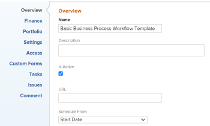
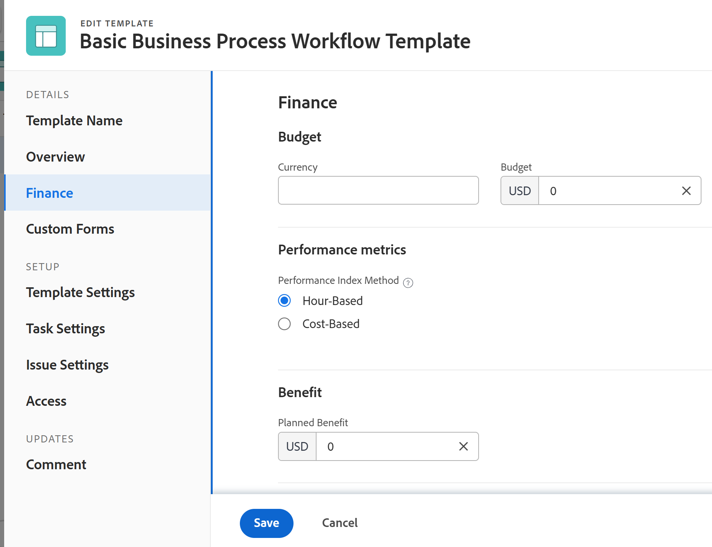

# Editar modelos de projeto

<!--drafted
The highlighted information on this page refers to functionality not yet generally available. It is available only in the Preview environment. 
-->

<!--
<The Resource Pools part also duplicates in the "Working with Resource Pools" article

-->

Você pode editar modelos de projeto para refletir as alterações nos processos e configurações do projeto. Depois de atualizar e salvar as alterações em um modelo, as novas alterações ficam visíveis em novos projetos quando os projetos são criados usando o modelo. As alterações feitas no modelo não refletem no projeto que está usando esse modelo no momento.

## Requisitos de acesso

Você deve ter o seguinte acesso para executar as etapas deste artigo:

<table style="table-layout:auto"> 
 <col> 
 <col> 
 <tbody> 
  <tr> 
   <td role="rowheader">plano do Adobe Workfront*</td> 
   <td> 
Qualquer 
 </td> 
  </tr> 
  <tr> 
   <td role="rowheader">Licenças da Adobe Workfront*</td> 
   <td> 
Plano 
 </td> 
  </tr> 
  <tr> 
   <td role="rowheader">Nível de acesso*</td> 
   <td> 
Editar acesso a modelos
 
Se você ainda não tiver acesso, pergunte ao administrador do Workfront se ele definiu restrições adicionais em seu nível de acesso. Para obter informações sobre o acesso a modelos, consulte <a href="../../../administration-and-setup/add-users/configure-and-grant-access/grant-access-templates.md" class="MCXref xref">Conceder acesso aos modelos</a>. Para obter informações sobre como um administrador do Workfront pode alterar seu nível de acesso, consulte <a href="../../../administration-and-setup/add-users/configure-and-grant-access/create-modify-access-levels.md" class="MCXref xref">Criar ou modificar níveis de acesso personalizados</a>. 
 </td> 
  </tr> 
  <tr> 
   <td role="rowheader">Permissões de objeto</td> 
   <td> 
    <ul> 
     <li> 
Contribuir com permissões para um modelo para editá-lo na guia Detalhes do modelo
 </li> 
     <li> 
Gerenciar permissões de um modelo para editá-lo na caixa Editar modelo
 </li> 
    </ul> 
 Para obter informações sobre permissões de modelo, consulte <a href="../../../workfront-basics/grant-and-request-access-to-objects/share-a-template.md" class="MCXref xref">Compartilhar um modelo</a>. 
 
Para obter informações sobre como solicitar acesso adicional, consulte <a href="../../../workfront-basics/grant-and-request-access-to-objects/request-access.md" class="MCXref xref">Solicitar acesso a objetos </a>.
 </td> 
  </tr> 
 </tbody> 
</table>

*Para descobrir que plano, tipo de licença ou acesso você tem, entre em contato com o administrador do Workfront.

## Editar um modelo {#edit-a-template}

<!--
Editing a template differs depending on what environment you choose. 

### Edit a template in the Production environment {#edit-a-template-in-the-production-environment} 

1. Go to the template you want to edit.
1. (Conditional) To edit limited information about the template,  click **Template Details** in the left panel, then go to the areas listed in the left panel to edit information for each area. 
1. To edit information in the Details section, click the **Edit** icon , then select from any of the areas below, or click **Edit all** to edit information in all areas:

   * Overview
   * Custom Forms

     Names of customs forms display only if there are custom forms attached to the object.
   
   * Finance

   >[!TIP]
   >
   >For information about all fields that display in the Details area, continue with editing all fields using the Edit Template box below.

1. (Conditional) To edit all information about the template, click the **More** menu  next to the name of the template, then click **Edit**.

   The **Edit Template** box opens. The sections in this box contain the same fields available in  the Template Details section .

1. Consider editing information in any of the following sections:

   * [Overview](#overview) 
   * [Finance](#finance) 
   * [Portfolio](#portfolio) 
   * [Settings](#settings) 
   * [Access](#access) 
   * [Custom Forms](#custom-forms) 
   * [Tasks](#tasks) 
   * [Issues](#issues) 
   * [Comment](#comment)

### Overview {#overview}

1. Begin editing your template as described above.
1. In the **Edit Template** box, click **Overview**.

   

1. Update the following fields:

   <table style="table-layout:auto"> 
    <col> 
    <col> 
    <tbody> 
     <tr> 
      <td role="rowheader"><strong>Name</strong></td> 
      <td>Specify a name for the template.</td> 
     </tr> 
     <tr> 
      <td role="rowheader"><strong>Description</strong></td> 
      <td>Add additional information about the template.</td> 
     </tr> 
     <tr> 
      <td role="rowheader"><strong>Is Active</strong></td> 
      <td>
Select this checkbox if you want the template to be active. Other users can find this template and attach it to projects when creating projects. Deselect this checkbox if you want to deactivate templates that are no longer used. Deactivated templates cannot be attached to projects. This is enabled by default. 

<b>TIP</b>
      
      You can deactivate a template from the template header as described in the [Activate or deactivate a template](#activate-or-deactivate-a-template) section in this article.
</td> 
     </tr> 
     <tr> 
      <td role="rowheader"><strong>URL</strong></td> 
      <td>Specify a web link that relates to information about this template.</td> 
     </tr> 
     <tr> 
      <td role="rowheader"><strong>Schedule From</strong></td> 
      <td>
Specify whether the project using this template is scheduled from the <strong>Start Date</strong>, or from the <strong>Completion Date</strong>. This selection determines the planned dates of the future tasks on the project using this template. 

Select from the following: 
 
       <ul> 
        <li>
<strong>Schedule From Start Date</strong>: The Start Date of the template is actually the Start Day. When you schedule a template from Start Date, Adobe Workfront calculates the Completion Day of the template based on the Duration of all the template tasks. The Start Day of the template becomes the Planned Start Date of the future project.
</li> 
        <li>
<strong>Schedule from Completion Date</strong>: The Completion Date of the template is actually the Completion Day. When you schedule a template from Completion Date, Workfront calculates the Start Day of the template based on the Duration of all the template tasks. The Completion Day of the template becomes the Planned Completion Date of the future project. 
</li> 
       </ul>
For more information about the Start and Completion Days of template tasks, see <a href="../../../manage-work/projects/create-and-manage-templates/overview-of-start-completion-day-on-template.md" class="MCXref xref">Overview of Start and Completion Days in a template</a>. 

The Schedule From setting for templates is similar to that of projects. Your Workfront administrator selects the default Schedule From setting for the projects in your system. For information about setting project defaults, see <a href="../../../administration-and-setup/set-up-workfront/configure-system-defaults/set-project-preferences.md" class="MCXref xref">Configure system-wide project preferences</a>.
</td> 
     </tr> 
     <tr> 
      <td role="rowheader"><strong>Condition Type</strong></td> 
      <td>
Select between the following Condition Types:
 
       <ul> 
        <li><strong>Manual:</strong> The project owner sets the Condition of the project on the project manually. <strong></strong></li> 
        <li><strong>Progress Status:</strong> Workfront automatically sets the Condition of the future project based on the Progress Status of tasks on the Critical Path. For more information about understanding Progress Status, see <a href="../../../manage-work/tasks/task-information/task-progress-status.md" class="MCXref xref">Task Progress Status overview</a>.</li> 
       </ul></td> 
     </tr> 
     <tr> 
      <td role="rowheader"><strong>Priority</strong></td> 
      <td>
This is just a visual flag for you which allows you to prioritize your future projects. Select from the following options:
 
       <ul> 
        <li>
<strong>None</strong>
</li> 
        <li>
<strong>Low</strong>
</li> 
        <li>
<strong>Normal</strong>
</li> 
        <li>
<strong>High</strong>
</li> 
        <li>
<strong>Urgent</strong>
</li> 
       </ul>

Depending on the Project Preferences selected by your Workfront administrator, the names of priorities might be different for you. For more information about editing priorities, see <a href="../../../administration-and-setup/customize-workfront/creating-custom-status-and-priority-labels/create-customize-priorities.md" class="MCXref xref">Create and customize priorities</a>.

</td> 
     </tr> 
     <tr> 
      <td role="rowheader"><strong>Template Owner</strong></td> 
      <td>
The user who is designated as the Template Owner must be a Workfront active user. 

Consider the following about the user designated as the Template Owner: 
 
       <ul> 
        <li>They are automatically given Manage permissions to the template. </li> 
        <li>They are added to the project team and are automatically given Manage permissions to the project created from the template. </li> 
        <li>They become the Project Owner, when the project is created from this template. </li> 
       </ul></td> 
     </tr> 
     <tr> 
      <td role="rowheader"><strong>Template Sponsor</strong></td> 
      <td>
The user specified in this field becomes the Project Sponsor, when the template is added to the project. This user is added to the project team and is automatically given view permissions to the project. The user who is designated as the Template Sponsor must be a Workfront active user. 
</td> 
     </tr> 
     <tr> 
      <td role="rowheader"><strong>Resource Manager</strong></td> 
      <td>
The specified users are automatically given manage permissions to the future projects and can assign resources to the tasks and issues of the projects. You can specify more than one Resource Manager. 
</td> 
     </tr> 
     <tr data-mc-conditions="QuicksilverOrClassic.Quicksilver"> 
      <td role="rowheader"><strong>Group</strong></td> 
      <td>
In the drop-down list, select the group that you want to be associated with projects created from the template. It can be a group of any level. 

You can make sure you are selecting the right group by hovering over it and clicking the information icon  that displays next to it. This displays a tooltip listing information about the group, such as the hierarchy of groups above it and its administrators.
 
<b>NOTES</b>
      
    <ul> 
    <li>
In the Projects area on a group's page, when someone creates a project using a template that doesn't have a group selected, the system associates the currently open group with the project.

This is different from other areas where the system associates a user's Home Group with the project when the user creates the project using a template that doesn't have a group selected.

    </li> 
      <li>
If a user selects a template that has a group selected while creating a project—or while converting a task or issue to a project—the user can choose a different group for the project.
</li> 
      <li>Though this field is available in templates only in the new Adobe Workfront experience, you can see it in lists and reports both there and in Adobe Workfront Classic. </li> 
      </ul> 
</td> 
     </tr> 
     <tr> 
      <td role="rowheader"><strong>Company</strong></td> 
      <td>
Specify the Company that you want to associate with the template. Only active companies display in the list.
</td> 
     </tr> 
    </tbody> 
   </table>

1. (Optional) Continue editing the following sections, depending on the information you want to modify.

   Or

   Click **Save Changes**.

### Finance {#finance}

1. Begin editing your template as described above.
1. In the **Edit Template** box, click **Finance**.

   

1. Update the following fields:

   <table style="table-layout:auto"> 
    <col> 
    <col> 
    <tbody> 
     <tr> 
      <td role="rowheader"><strong>Performance Index Method</strong></td> 
      <td>
Specify whether the Earned Value metrics of the future project are calculated using hours or costs. For more information about the Performance Index Method, see <a href="../../../manage-work/projects/project-finances/set-pim.md" class="MCXref xref">Set the Performance Index Method (PIM)</a>. 
</td> 
     </tr> 
     <tr> 
      <td role="rowheader"><strong>Budget</strong></td> 
      <td>
Specify a Budget for the projects that are created from this template.
</td> 
     </tr> 
     <tr> 
      <td role="rowheader"><strong>Fixed Cost</strong></td> 
      <td>
Specify the Fixed Cost for the projects that are created from this template. This is different than the Labor Cost which comes from the hours on the project and the Expense Cost which comes from the amount of expenses on the project. The Fixed Cost of a project is taken into account when calculating the Net Value of a project and it is part of the Budgeted Cost.
</td> 
     </tr> 
     <tr> 
      <td role="rowheader"><strong>Fixed Revenue</strong></td> 
      <td>
Specify the Fixed Revenue for the projects that are created from this template.
</td> 
     </tr> 
     <tr> 
      <td role="rowheader"><strong>Template Currency</strong></td> 
      <td>
Specify the currency for the future project, if it is different than the default currency of your system. This field is not visible if you have only the default currency in the system. For more information about currency, see <a href="../../../administration-and-setup/manage-workfront/exchange-rates/set-up-exchange-rates.md" class="MCXref xref">Set up exchange rates</a>.
</td> 
     </tr> 
     <tr> 
      <td role="rowheader"><strong>Require time to be approved for this project</strong></td> 
      <td>
Select this option to require the Project Owner of the future project created from this template to approve time logged on the project. If you are using Billing Records and you select this option, only the approved hours on the project appear as available billable hours for the Billing Records. Approving time on the project is independent of approving timesheets. For more information about requiring time to be approved on a project, see <a href="../../../manage-work/projects/manage-projects/require-time-approval-for-projects.md" class="MCXref xref">Require time to be approved for a project</a>.
</td> 
     </tr> 
    </tbody> 
   </table>

1. (Optional) Continue editing the following sections, depending on the information you want to modify.

   Or

   Click **Save Changes**.

### Portfolio {#portfolio}

1. Begin editing your template as described above.
1. In the **Edit Template** box, click **Portfolio**.

   

1. Update the following fields:

   <table style="table-layout:auto">
    <col> 
    <tbody> 
     <tr> 
      <td role="rowheader"><strong>Portfolio</strong></td> 
      <td>
Specify a Portfolio for the projects that are created from this template. You must create a Portfolio first, before it appears in the drop-down list. 

Only active portfolios display in the list. For more information about creating portfolios, see <a href="../../../manage-work/portfolios/create-and-manage-portfolios/create-portfolios.md" class="MCXref xref">Create a portfolio </a>.
</td> 
     </tr> 
     <tr> 
      <td role="rowheader"><strong>Program</strong></td> 
      <td>
If you selected a Portfolio for the template, specify a <strong>Program</strong> for the future project. Some Portfolios might not have Programs. You must create a Program first, before it appears in this drop-down list. Only active programs display in the list.

For more information about creating programs, see <a href="../../../manage-work/portfolios/create-and-manage-programs/create-program.md" class="MCXref xref">Create a program</a>.
</td> 
     </tr> 
     <tr> 
      <td role="rowheader"><strong>Planned Benefit</strong></td> 
      <td>
Specify the Planned Benefit of the projects that are created from this template. The Planned Benefit is used in the Business Case of the project and the Portfolio Optimizer. 

For more information about the Planned Benefit of a project, see <a href="../../../manage-work/projects/project-finances/project-planned-benefit.md" class="MCXref xref">Overview of project Planned Benefit</a>. The Planned Benefit of a project is taken into account when the Net Value of a project is calculated. 

For more information about using the Portfolio Optimizer, see <a href="../../../manage-work/portfolios/portfolio-optimizer/manage-projects-in-portfolio-optimizer.md" class="MCXref xref">Manage projects in the Portfolio Optimizer</a> 
</td> 
     </tr> 
    </tbody> 
   </table>

1. (Optional) Continue editing the following sections, depending on the information you want to modify.

   Or

   Click **Save Changes**.

### Settings {#settings}

1. Begin editing your template as described above.
1. In the **Edit Template** box, click **Settings**.

   

1. Update the following fields: 

   <table style="table-layout:auto"> 
    <col> 
    <col> 
    <tbody> 
     <tr> 
      <td role="rowheader"><strong>Milestone Path</strong> </td> 
      <td> 
Select a Milestone Path for the template. Only active milestone paths display in the list. For more information about Milestone Paths, see <a href="../../../administration-and-setup/customize-workfront/configure-approval-milestone-processes/create-milestone-path.md" class="MCXref xref">Create a milestone path</a>.
 </td> 
     </tr> 
     <tr> 
      <td role="rowheader"><strong>Completion Mode</strong> </td> 
      <td> 
Controls how the future project will be marked as Complete.  Select from the following options:
 
       <ul> 
        <li> 
<strong>Automatic</strong>: The project is marked Complete when all the tasks and issues are completed.
 </li> 
        <li> 
<strong>Manual</strong>: You have to manually select the Complete status for the project, when all the tasks and issues are completed. 
 </li> 
       </ul> </td> 
     </tr> 
     <tr> 
      <td role="rowheader"><strong>Summary Completion Mode</strong> </td> 
      <td> 
Controls how the parent tasks on the future project are marked as Complete.  Select from the following options:
 
       <ul> 
        <li> 
<strong>Automatic</strong>: The parent tasks are marked Complete and they update their percent complete automatically, as the children tasks are completed and the percent complete of the children is updated. 
 </li> 
        <li> 
<strong>Manual</strong>: You have to manually update the percent complete and the status of the parent tasks, independently of what changes are made to the children tasks. 
 </li> 
       </ul> </td> 
     </tr> 
     <tr> 
      <td role="rowheader"><strong>Update Type</strong> </td> 
      <td> 
Controls when the changes you make to the timeline of the future project are saved on the project. 
 
       <b>EXAMPLE </b> 
        
The following changes to the project trigger an update to the timeline of the project:
 
        <ul> 
         <li> 
update the dates of tasks
 </li> 
         <li> 
change predecessor relationships 
 </li> 
         <li> 
change parent-child relationships
 </li> 
         <li> 
add or remove assignments in addition to changing the task constraint or duration type.
 </li> 
        </ul> 
       
 
Select from the following options: 
 
       <ul> 
        <li> 
<strong>Automatic and On Change</strong> (Default setting): The future project timeline is updated each time a change occurs in the project or in another project that the timeline is dependent on (On Change). The project timeline is also updated each night (Automatic). This is the recommended setting for this field because it ensures that the project timeline is always up to date. When you perform an action on a task or project that triggers a timeline recalculation, all available dates are immediately displayed, allowing you to continue working. On projects with more than 100 tasks, dates that require longer recalculations display briefly as a question mark (between 1 and 5 seconds, or up to a minute for large projects). This indicates that the recalculation is not yet finished, and the dates are subject to change. 
 </li> 
       </ul> 
       <ul> 
        <li> 
<strong>Change Only</strong>: The project timeline is updated each time a change occurs in the project or in another project that the timeline is dependent on. You might want to select this option if changes rarely occur in the project or in other projects that the timeline is dependent on. 
 </li> 
       </ul> 
       <ul> 
        <li> 
<strong>Automatic Only</strong>: The project timeline is updated each night; it is not updated immediately after changes are made. You might want to select this option if many changes occur each day in the project or in other projects that the timeline is dependent on. However, be aware that you chose this setting, as the project will not update at the same time that the changes are made. 
 </li> 
       </ul> 
       <ul> 
        <li> 
<strong>Manual Only</strong>: The project timeline is updated only when you select the option to Recalculate Timelines, as described in <a href="../../../manage-work/projects/manage-projects/recalculate-project-timeline.md" class="MCXref xref">Recalculate project timelines</a>. 
 </li> 
       </ul> 
You might want to select this option if you are making many changes to the project at one time, and you want the timeline recalculation to occur after all of the changes have been made (rather than after each individual change).
 </td> 
     </tr> 
     <tr> 
      <td role="rowheader"><strong>Schedule</strong> </td> 
      <td> 
Select a schedule for your template. This will become the schedule of the project that is created from this template. This should be the same schedule assigned to most people that are working on the project. You must create a schedule before you can assign it to a template. For more information about creating schedules, see <a href="../../../administration-and-setup/set-up-workfront/configure-timesheets-schedules/create-schedules.md" class="MCXref xref">Create a schedule</a>.  If you have not created custom schedules in your system, the Default Schedule is selected. 
 </td> 
     </tr> 
     <tr> 
      <td role="rowheader"><strong>User Time Off</strong> </td> 
      <td> 
Determines whether the time off of the Primary Assignee of a task adjusts the task planned dates. When you attach the template to an existing project, and the template has a different setting for this field than the project, the setting on the project remains unchanged. The default option for this setting for a new template is the same as the system-level project preference. 
 
For information about the project preferences at the System level, see <a href="../../../administration-and-setup/set-up-workfront/configure-system-defaults/set-project-preferences.md" class="MCXref xref">Configure system-wide project preferences</a>. 
 
For information about how this setting affects the task dates on a project, see <a href="../../../manage-work/projects/manage-projects/edit-projects.md" class="MCXref xref">Edit projects</a>. Select from the following options: 
 
       <ul> 
        <li> 
<strong>Consider user time off in task durations</strong>: When selecting this option, the planned dates of the tasks on the project created from this template adjust according to the time off of the Primary Assignee of the task, if the time off occurs during the duration of the task. 
 </li> 
        <li> 
<strong>Ignore user time off in task durations</strong>: When selecting this option, the planned dates of the tasks on the project created from this template remain as originally planned, even if the Primary Assignee of the task has time off during the duration of the task. 
 </li> 
       </ul> </td> 
     </tr> 
     <tr> 
      <td role="rowheader"><strong>Resource Leveling Mode</strong> </td> 
      <td> 
Select from the following options: 
 
       <ul> 
        <li> 
<strong>Manual</strong>: you must manually level your resources on the project created from this template (this is the default setting)
 </li> 
        <li> 
<strong>Automatic:</strong> Workfront levels the resources on the future project.  For more information about Resource Leveling, see <a href="../../../manage-work/gantt-chart/use-the-gantt-chart/level-resources-in-gantt.md" class="MCXref xref">Level Resources in the Gantt Chart </a>. 
 </li> 
       </ul> </td> 
     </tr> 
     <tr> 
      <td role="rowheader"><strong>Risk</strong> </td> 
      <td> 
Define the level of risk of the projects created from this template. The risk is just an indicator of how risky a project can be. You can prioritize the execution of your projects based on the level of risk. Consider selecting from the following levels of risk: 
 
       <ul> 
        <li> 
<strong>Very Low</strong> 
 </li> 
        <li> 
<strong>Low</strong> 
 </li> 
        <li> 
<strong>Medium</strong> 
 </li> 
        <li> 
<strong>High</strong> 
 </li> 
        <li> 
<strong>Very High</strong> 
 </li> 
       </ul> </td> 
     </tr> 
     <tr> 
      <td role="rowheader"><strong>Resource Pools</strong> </td> 
      <td> 
Specify the resource pools associated with the template. Resource pools are collections of users that are needed at the same time for the completion of a project. For more information about resource pools, see <a href="../../../resource-mgmt/resource-planning/resource-pools/work-with-resource-pools.md" class="MCXref xref"> Resource pools overview </a>.
 
 
<b>NOTE</b> 
      
      When you edit templates in bulk, only the resource pools that are common to all the templates selected appear in this field. If the templates selected have no shared resource pools, this field will be empty. The resource pools you specify here will overwrite the templates' individual resource pools.
 
 </td> 
     </tr> 
     <tr> 
      <td role="rowheader"><strong>Approval Process</strong> </td> 
      <td> 
Select the approval process you want to associate with the template. Your Workfront administrator or a user with administrative access to Approval Processes must define system-level or group-level project approval processes before you can associate them with a template. For more information about creating approval processes, see <a href="../../../administration-and-setup/customize-workfront/configure-approval-milestone-processes/create-approval-processes.md" class="MCXref xref">Create an approval process for work items</a>.
 
Consider the following when adding approval processes: 
 
      <ul> 
      <li>Only active approval processes display in the list. </li> 
      <li> 
System-wide and group-specific approval processes display in the list. An approval process associated with a group other than that of the template does not display in the list.
 
<b>IMPORTANT</b> 
      
      If the group associated with the template changes, the group-specific approval process becomes a single-use approval process. For more information about how changes to the group of the project or changes in the approval process affect approval settings, see <a href="../../../administration-and-setup/customize-workfront/configure-approval-milestone-processes/how-changes-affect-group-approvals.md">How group and approval process changes affect assigned approval processes</a>. 
 </li> 
      <li> 
If you added a single-use approval process, it displays as "Custom" in this field. For information, see <a href="../../../review-and-approve-work/manage-approvals/associate-approval-with-work.md" class="MCXref xref">Associate a new or existing approval process with work</a>. 
 
      </li> 
      <li> 
When bulk-editing templates, the following scenarios exist:
 
      <ul> 
         <li> 
When you select templates from the same group, both system-level and group-level approval processes display in this field.
 </li> 
         <li> 
When you select templates from different groups, only system-level approval processes display in this field.
 </li> 
         <li> 
When any of the templates has a single-use approval process attached, it is replaced by the system-level you select. 
 </li> 
      </ul> </li> 
      </ul> </td> 
     </tr> 
     <tr> 
      <td role="rowheader"><strong>Filter Hour Types</strong> </td> 
      <td> 
Consider the following:
 
Select <strong>No</strong> to make all project-specific hour types available on the future project. (This is the default selection)
 
Or
 
Select <strong>Yes</strong> to make only a subset of the project-specific hour types available on the future project, then select the hour types you want to make available. (Hold the Shift key to select multiple hour types.)
 
If you select this option, only the hour types you select are made available to select when logging hours on the project (or on tasks and issues within the project). You must select at least one hour type; if you select this option and you do not select any hour types, all hour types are made available on the project.
 
The same hour type selections must be made at the individual user level in order for the user to see these hour type options on the project. 
 
For more information about defining hour types at the user level, see the section <a href="../../../timesheets/create-and-manage-timesheets/log-time.md#understa" class="MCXref xref">Log time</a> in <a href="../../../timesheets/create-and-manage-timesheets/log-time.md" class="MCXref xref">Log time</a>.
 </td> 
     </tr> 
     <tr> 
      <td role="rowheader"><strong>Reminder Notification</strong> </td> 
      <td>Select the Reminder Notification that should be associated with the future project. You must configure Reminder Notifications for projects for this field to appear during editing a template.  For more information about configuring Reminder Notifications, see <a href="../../../administration-and-setup/manage-workfront/emails/set-up-reminder-notifications.md" class="MCXref xref">Set up reminder notifications</a>.</td> 
     </tr> 
    </tbody> 
   </table>

1. (Optional) Continue editing the following sections, depending on the information you want to modify.  
   Or
1. Click **Save Changes**.

### Access {#access}

1. Begin editing your template as described above.
1. In the **Edit Template** box, click **Access**.

   

   The Access you specify for your template will become the Access of users associated with the project when the template is used to create a project.

   Specify the following **Access** information for the template:

   <table style="table-layout:auto"> 
    <col> 
    <col> 
    <tbody> 
     <tr> 
      <td role="rowheader"><strong>When someone is assigned to a task</strong> </td> 
      <td> 
Select from <strong>View</strong>, <strong>Contribute,</strong> or <strong>Manage</strong> access to a task. The user assigned to a task is automatically granted this access to the task. 
 </td> 
     </tr> 
     <tr> 
      <td role="rowheader"><strong>Also grant access to the project</strong> </td> 
      <td> 
 Select from <strong>View</strong>, <strong>Contribute</strong>, or <strong>Manage</strong> access to the project. The user assigned to a task is automatically granted this access to the project, as well. 
 </td> 
     </tr> 
     <tr> 
      <td role="rowheader"><strong>When someone is assigned to an issue</strong> </td> 
      <td> 
Select from <strong>View</strong>, <strong>Contribute,</strong> or <strong>Manage</strong> access to an issue. The user assigned to an issue is automatically granted this access to the issue. 
 </td> 
     </tr> 
     <tr> 
      <td role="rowheader"><strong>Also grant access to the project</strong> </td> 
      <td> 
 Select from <strong>View</strong>, <strong>Contribute</strong>, or <strong>Manage</strong> access to the project. The user assigned to an issue is automatically granted this access to the project, as well. 
 </td> 
     </tr> 
     <tr> 
      <td role="rowheader"><strong>When someone submits a request: Give them access</strong> </td> 
      <td> 
 Select from <strong>View</strong>, <strong>Contribute</strong>, or <strong>Manage</strong> access to the request. When they submit a request to the project, they are granted this access to the request they submitted. For more information, see <a href="../../../workfront-basics/grant-and-request-access-to-objects/share-an-issue.md" class="MCXref xref">Share an issue </a>.
 </td> 
     </tr> 
     <tr> 
      <td role="rowheader"><strong>People from the same company will inherit the same permissions for all requests</strong> </td> 
      <td> 
Select this field if you want people from the same company to have the same access to all the requests on the project, whether they submitted them or not.
 </td> 
     </tr> 
     <tr> 
      <td role="rowheader"><strong>When someone is given access to this project: Give them access to ...</strong> </td> 
      <td> 
Select the access options that you want users to have on the project, if the project is shared with them. Select the specific options for their access, if they are designated as <strong>Viewers</strong>, <strong>Contributors</strong>, or <strong>Managers</strong> when sharing the project with them. 
 </td> 
     </tr> 
    </tbody> 
   </table>

1. (Optional) Continue editing the following sections, depending on the information you want to modify.

   Or

   Click **Save Changes**.

### Custom Forms {#custom-forms}

1. Begin editing your template as described above.
1. In the **Edit Template** box, click **Custom Forms**.

   

1. Select the custom form or forms that you want to associate with the template. You must build the custom forms before they are available to select in this field.

   Only active custom forms display in the list. For more information about building custom forms, see [Create or edit a custom form](../../../administration-and-setup/customize-workfront/create-manage-custom-forms/create-or-edit-a-custom-form.md).

   You can add up to ten custom forms to a template.

   The forms will be added to the project that is created from this template. 

1. (Optional) Continue editing the following section, depending on the information you want to modify.

   Or

   Click **Save Changes**.

### Tasks {#tasks}

You can define the defaults that will be associated with all the new tasks when you add them to a project that is created from the template.

For information about how these settings affect creating new tasks, see [Create tasks overview](../../../manage-work/tasks/create-tasks/create-tasks-overview.md).

1. Begin editing your template as described above.
1. In the **Edit Template** box, click **Tasks**.

   

1. In the **Task Default Approval Process** box, select the Approval Process you want to associate with all new tasks when you add them to a project created from this template. You must create an Approval Process for tasks before you can associate it with tasks. Only active approval processes display in the list. For more information about creating Approval Processes, see [Creating Approval Processes](../../../administration-and-setup/customize-workfront/configure-approval-milestone-processes/create-approval-processes.md).
1. In the **Task Default Custom Forms** box, select the custom form or forms that you want to associate with all new tasks when you add them to a project created from this template. You must build the custom forms before they are available to select in this field. Only active custom forms display in the list. For more information about building custom forms, see [Creating Custom Forms](../../../administration-and-setup/customize-workfront/create-manage-custom-forms/create-or-edit-a-custom-form.md). You can associate up to ten custom forms with a task.
1. (Optional) **Select Use Work Effort to automatically calculate task Planned Hours** if you want to enable managing task effort by using&nbsp;Work Effort instead of Planned Hours in the project created from the template.
1. (Conditional and optional) If you selected Use Work Effort to automatically calculate task Planned Hours, click the drop-down menu to update the percentage for each level of Work Effort. The following percentage values are the defaults:
 
   | Work Effort level |Percentage value|
   |---|---|
   | Small |25% |
   | Medium |50% |
   | Large |75% |

  For information about using Work Effort to manage the effort on tasks on projects, see [Work Effort overview](../../../manage-work/tasks/task-information/work-effort.md).

1. (Optional) Continue editing the following section, depending on the information you want to modify.

   Or

   Click **Save Changes**.

### Issues {#issues}

By editing issue settings, you can prevent users from adding issues inline in the future project created from the template.

1. Begin editing your template as described above.
1. In the **Edit Template** box, click **Issues**.

   

1. (Optional) Deselect the **Allow users to add issues inline** option. It is enabled by default.

   When disabling this option users cannot add issues inline to the project or the tasks in the Issues section, when the project is created from the template.

   >[!TIP]
   >
   >Disable this option if you want to enforce users to complete the New Issue Fields or the custom forms associated with new issues.

   When disabling this option, users with permissions to add issues to the project created from the template can do so by using the New Issue button or a request queue associated with the project.

   For more information about configuring issue settings on projects, see the [Issue Settings](../../../manage-work/projects/manage-projects/edit-projects.md#issue) section in the article [Edit projects](../../../manage-work/projects/manage-projects/edit-projects.md).

   For information about creating issues on projects, see [Create issues](../../../manage-work/issues/manage-issues/create-issues.md). 

1. (Optional) Continue editing the following section, depending on the information you want to modify.

   Or

   Click **Save Changes**.

### Comment {#comment}

1. Begin editing your template as described above.
1. In the **Edit Template** box, click **Comment**.

   

1. Specify a comment that you want to display in the updates stream of the template in the available field.

   This comment is visible for everyone with View access to the template and with access to view Notes.

1. Click **Save Changes**.

   Your changes will be submitted for this template.

   Now, when you use this template to create a project all these settings will transfer to the new project.

   <!--drafted section below for the edit template story: 
   remove this tag and add the Preview blurb at the top of this article in yellow, if it's not already there. Keep the "div class" tags below until 23.1 production: 

### Edit a template in the Preview environment {#edit-a-template-in-the-preview-environment}
-->

1. Vá para o template que deseja editar.
1. (Condicional) Para editar informações limitadas sobre o modelo, clique em **Detalhes do modelo** no painel esquerdo, vá para as áreas listadas no painel esquerdo para editar as informações de cada área.
1. Para editar informações na seção Detalhes, clique no link **Editar** ícone , selecione uma das áreas abaixo ou clique em **Editar tudo** para editar informações em todas as áreas:

   * Visão geral
   * Formulários personalizados

   Os nomes dos formulários de alfândega são exibidos somente se houver formulários personalizados anexados ao objeto.

   * Finanças

   >[!TIP]
   >
   >Para obter informações sobre todos os campos exibidos na área Detalhes, continue editando todos os campos usando a caixa Editar modelo abaixo.

1. (Condicional) Para editar todas as informações sobre o modelo, clique no link **Mais** menu  ao lado do nome do modelo e clique em **Editar**.

   A variável **Editar modelo** é aberta. As seções nesta caixa contêm os mesmos campos disponíveis na seção Detalhes do Modelo .

1. Considere a edição de informações em qualquer uma das seguintes seções:

   * [Nome do modelo](#template-name)
   * [Visão geral](#overview-preview)
   * [Finanças](#finance-preview)
   * [Formulários personalizados](#custom-forms-preview)
   * [Configurações do projeto](#project-settings)
   * [Configurações de tarefas](#task-settings)
   * [Configurações do problema](#issue-settings)
   * [Access](#access-preview)

### Nome do Modelo{#template-name}

1. Comece a editar o template conforme descrito acima.
1. No **Editar modelo** clique em **Nome do modelo**.
1. (Opcional) Continue editando as seções a seguir, dependendo das informações que você deseja modificar

   Ou

   Clique em **Salvar**.

### Visão geral {#overview-preview}

1. Comece a editar o template conforme descrito acima.
1. No **Editar modelo** clique em **Visão geral**.

   

1. Atualize os seguintes campos:

   <table style="table-layout:auto"> 
       <col> 
       <col> 
       <tbody> 
         <tr> 
         <td role="rowheader"><strong>Descrição</strong></td> 
         <td>Adicione mais informações sobre o template.</td> 
       </tr> 
         <tr> 
         <td role="rowheader"><strong>Prioridade</strong></td> 
         <td>
Este é apenas um sinalizador visual para você, que permite priorizar seus projetos futuros. Selecione entre as seguintes opções:
 
         <ul> 
         <li>
<strong>Nenhum(a)</strong>
</li> 
         <li>
<strong>Baixa</strong>
</li> 
         <li>
<strong>Normal</strong>
</li> 
         <li>
<strong>Alta</strong>
</li> 
         <li>
<strong>Urgente</strong>
</li> 
         </ul>

Dependendo das Preferências do projeto selecionadas pelo administrador do Workfront, os nomes das prioridades podem ser diferentes para você. Para obter mais informações sobre edição de prioridades, consulte <a href="../../../administration-and-setup/customize-workfront/creating-custom-status-and-priority-labels/create-customize-priorities.md" class="MCXref xref">Criar e personalizar prioridades</a>.

</td> 
       </tr> 
       <tr> 
       <td role="rowheader"><strong>URL</strong></td> 
         <td>Especifique um link da Web relacionado às informações sobre este modelo.</td> 
       </tr>
       <tr> 
       <td role="rowheader"><strong>Tipo de condição</strong></td> 
       <td>
Selecione entre os seguintes Tipos de Condição:
 
         <ul> 
         <li><strong>Manual:</strong> O proprietário do projeto define a Condição do projeto no projeto manualmente. <strong></strong></li> 
         <li><strong>Status do progresso:</strong> O Workfront define automaticamente a Condição do projeto futuro com base no Status de progresso das tarefas no Caminho crítico. Para obter mais informações sobre como entender o Status do Progresso, consulte <a href="../../../manage-work/tasks/task-information/task-progress-status.md" class="MCXref xref">Visão geral do status de progresso da tarefa</a>.</li> 
       </ul>
         </td> 
         </tr> 
       <tr> 
         <td role="rowheader"><strong>Modo de cronograma</strong></td> 
         <td>
Especificar se o projeto que está usando este modelo está agendado na <strong>Data de início</strong>, ou do <strong>Data de Término</strong>. Esta seleção determina as datas planejadas das tarefas futuras no projeto usando este modelo. 

Selecione entre as seguintes opções: 
 
       <ul> 
       <li>
<strong>Agendar a Partir da Data de Início</strong>: a data de início do modelo é, na verdade, o dia de início. Ao agendar um modelo a partir da Data inicial, o Adobe Workfront calcula o Dia de conclusão do modelo com base na Duração de todas as tarefas do modelo. O dia de início do modelo se torna a Data de início planejada do projeto futuro.
</li> 
       <li>
<strong>Programação a partir da data de conclusão</strong>: a data de conclusão do modelo é o dia de conclusão. Ao programar um modelo a partir da Data de conclusão, o Workfront calcula o Dia de início do modelo com base na Duração de todas as tarefas do modelo. O Dia de conclusão do modelo se torna a Data de conclusão planejada do projeto futuro. 
</li> 
       </ul>
Para obter mais informações sobre os Dias de Início e Término das tarefas do modelo, consulte <a href="../../../manage-work/projects/create-and-manage-templates/overview-of-start-completion-day-on-template.md" class="MCXref xref">Visão Geral dos Dias de Início e Término em um modelo</a>. 

A configuração Agendar de dos modelos é semelhante à dos projetos. O administrador do Workfront seleciona a configuração padrão Agendar de para os projetos do seu sistema. Para obter informações sobre como configurar os padrões do projeto, consulte <a href="../../../administration-and-setup/set-up-workfront/configure-system-defaults/set-project-preferences.md" class="MCXref xref">Configurar preferências de projeto em todo o sistema</a>.
</td> 
       </tr>

   <tr> 
         <td role="rowheader"><strong>Portfólio</strong></td> 
         <td>
Especifique um Portfolio para os projetos criados a partir deste modelo. Você deve criar um Portfolio primeiro, antes que ele apareça na lista suspensa. 

Somente portfólios ativos são exibidos na lista. Para obter mais informações sobre como criar portfólios, consulte <a href="../../../manage-work/portfolios/create-and-manage-portfolios/create-portfolios.md" class="MCXref xref">Criar um portfólio </a>.
</td> 
       </tr> 
       <tr> 
         <td role="rowheader"><strong>Programa</strong></td> 
         <td>
Se você selecionou um Portfolio para o modelo, especifique um <strong>Programa</strong> para o projeto futuro. Alguns Portfolio podem não ter programas. Você deve criar um Programa primeiro, antes que ele apareça nesta lista suspensa. Somente programas ativos são exibidos na lista.

Para obter mais informações sobre a criação de programas, consulte <a href="../../../manage-work/portfolios/create-and-manage-programs/create-program.md" class="MCXref xref">Criar um programa</a>.
</td> 
       </tr>  
       <tr data-mc-conditions="QuicksilverOrClassic.Quicksilver"> 
         <td role="rowheader"><strong>Grupo</strong></td> 
         <td>
Na lista suspensa, selecione o grupo que deseja associar aos projetos criados a partir do modelo. Pode ser um grupo de qualquer nível. 

Você pode verificar se está selecionando o grupo correto ao passar o mouse sobre ele e clicar no ícone de informações  que é exibido ao lado dele. Uma dica de ferramenta que lista informações sobre o grupo, como a hierarquia de grupos acima dele e seus administradores.
 
<b>NOTAS</b>

   <ul> 
       <li>
Na área Projetos da página de um grupo, quando alguém cria um projeto usando um modelo que não tem um grupo selecionado, o sistema associa o grupo aberto no momento ao projeto.

Isso é diferente de outras áreas onde o sistema associa o Grupo inicial de um usuário ao projeto quando o usuário cria o projeto usando um modelo que não tem um grupo selecionado.
</li> 
       <li>
Se um usuário selecionar um modelo que tenha um grupo selecionado ao criar um projeto ou ao converter uma tarefa ou problema em um projeto, ele poderá escolher um grupo diferente para o projeto.
</li> 
       <li>Embora esse campo esteja disponível em modelos somente na nova experiência do Adobe Workfront, você pode vê-lo em listas e relatórios lá e no Adobe Workfront Classic. </li> 
         </ul> 
</td> 
       </tr> 
       <tr> 
         <td role="rowheader"><strong>Empresa</strong></td> 
         <td>
Especifique a Empresa que deseja associar ao modelo. Somente empresas ativas são exibidas na lista.
</td> 
       </tr> 
       <tr> 
         <td role="rowheader"><strong>Proprietário do modelo</strong></td> 
         <td>
O usuário designado como Proprietário do Modelo deve ser um usuário ativo do Workfront. 

Considere o seguinte sobre o usuário designado como o Proprietário do modelo: 
 
         <ul> 
         <li>Eles recebem automaticamente permissões Gerenciar para o modelo. </li> 
         <li>Eles são adicionados à equipe do projeto e recebem automaticamente permissões de gerenciamento para o projeto criado a partir do modelo. </li> 
         <li>Eles se tornam o Proprietário do projeto quando o projeto é criado a partir desse modelo. </li> 
         <li> Se o usuário designado como Proprietário do modelo tiver acesso limitado aos modelos ou projetos por meio de seu nível de acesso, as permissões de Gerenciamento no modelo e nos projetos serão limitadas. Por exemplo, se eles tiverem somente o acesso de Visualização para modelos ou projetos em seu nível de acesso, eles receberão automaticamente permissões de Visualização no modelo e no projeto quando forem designados como o Proprietário do modelo.</li>
         </ul></td> 
       </tr> 
       <tr> 
         <td role="rowheader"><strong>Patrocinador do modelo</strong></td> 
         <td>
O usuário especificado nesse campo se torna o Patrocinador do projeto quando o modelo é adicionado ao projeto. Este usuário é adicionado à equipe do projeto e recebe automaticamente permissões de exibição para o projeto. O usuário designado como Patrocinador do modelo deve ser um usuário ativo do Workfront. 
</td> 
       </tr> 
       <tr> 
         <td role="rowheader"><strong>Gerenciador de Recursos</strong></td> 
         <td>
Os usuários especificados recebem automaticamente permissões de gerenciamento para os projetos futuros e podem atribuir recursos às tarefas e problemas dos projetos. Você pode especificar mais de um Gerenciador de recursos. 
</td> 
       </tr> 
      </table>

1. (Opcional) Continue editando as seções a seguir, dependendo das informações que você deseja modificar.

   Ou

   Clique em **Salvar**.

### Finanças {#finance-preview}

1. Comece a editar o template conforme descrito acima.
1. No **Editar modelo** clique em **Finanças**.

   

1. Atualize os seguintes campos:

   <table style="table-layout:auto"> 
       <col> 
       <col> 
       <tbody>
       <tr> 
         <td role="rowheader"><strong> Moeda</strong></td> 
         <td>
Especifique a moeda para o projeto futuro, se for diferente da moeda padrão do sistema. Esse campo não estará visível se você só tiver a moeda padrão no sistema. Para obter mais informações sobre moeda, consulte <a href="../../../administration-and-setup/manage-workfront/exchange-rates/set-up-exchange-rates.md" class="MCXref xref">Configurar taxas de câmbio</a>.
</td> 
       </tr>
       <tr> 
       <td role="rowheader"><strong>Orçamento</strong></td> 
       <td>
Especifique um Orçamento para os projetos criados a partir deste modelo.
</td> 
       </tr>  
       <tr> 
         <td role="rowheader"><strong>Método Índice de desempenho</strong></td> 
         <td>
Escolha como o Workfront calculará as métricas de Valor agregado do projeto futuro. Escolha entre as seguintes opções:
         <ul>
         <li>Baseado em Hora</li>
         <li>Baseado em Custo</li>
         </ul>

   Para obter mais informações sobre o Método Índice de desempenho, consulte <a href="../../../manage-work/projects/project-finances/set-pim.md" class="MCXref xref">Definir o PIM (Método de Índice de Desempenho)</a>. 
</td>
   </tr> 
         <tr> 
         <td role="rowheader"><strong>Benefício Planejado</strong></td> 
         <td>
Especifique o Benefício Planejado dos projetos criados com base neste modelo. O Benefício Planejado é usado no Business Case do projeto e no Otimizador de Portfolio. 

Para obter mais informações sobre o Benefício Planejado de um projeto, consulte <a href="../../../manage-work/projects/project-finances/project-planned-benefit.md" class="MCXref xref">Visão Geral do Benefício Planejado do projeto</a>. O Benefício Planejado de um projeto é considerado quando o Valor Líquido de um projeto é calculado. 

Para obter mais informações sobre o uso do Otimizador de Portfolio, consulte <a href="../../../manage-work/portfolios/portfolio-optimizer/manage-projects-in-portfolio-optimizer.md" class="MCXref xref">Gerenciar projetos no Portfolio Otimizer</a> 
</td> 
       </tr> 
       <tr> 
         <td role="rowheader"><strong>Custo Fixo</strong></td> 
         <td>
Especifique o Custo Fixo dos projetos criados a partir deste modelo. Isso é diferente do Custo de mão de obra que vem das horas no projeto e do Custo de despesa que vem da quantidade de despesas no projeto. O Custo Fixo de um projeto é considerado ao calcular o Valor Líquido de um projeto e faz parte do Custo Orçado.
</td> 
       </tr> 
       <tr> 
       <td role="rowheader"><strong>Receita com Valor Fixo</strong></td> 
       <td>
Especifique a Receita fixa para os projetos criados a partir deste modelo.
</td> 
       </tr> 
       <tr> 
       <td role="rowheader"><strong>Exigir que o tempo seja aprovado para este projeto</strong></td> 
       <td>
Selecione esta opção para exigir que o Proprietário do projeto futuro criado a partir deste modelo aprove as horas registradas no projeto. Se você estiver usando Registros de cobrança e selecionar essa opção, somente as horas aprovadas no projeto aparecerão como horas faturáveis disponíveis para os Registros de cobrança. A aprovação de horas no projeto é independente da aprovação de folhas de horas. Para obter mais informações sobre a exigência de tempo para aprovação em um projeto, consulte <a href="../../../manage-work/projects/manage-projects/require-time-approval-for-projects.md" class="MCXref xref">Exigir que o tempo seja aprovado para um projeto</a>.
</td> 
       </tr> 
       </tbody> 
      </table>

1. (Opcional) Continue editando as seções a seguir, dependendo das informações que você deseja modificar.

   Ou

   Clique em **Salvar**.

### Formulários personalizados {#custom-forms-preview}

1. Comece a editar o template conforme descrito acima.
1. No **Editar modelo** clique em **Forms personalizado**.

   

   Os nomes dos formulários personalizados já anexados ao modelo são exibidos no painel esquerdo.

1. Clique dentro do **Adicionar formulário personalizado** e selecione os formulários personalizados que deseja associar ao modelo. Você deve criar os formulários personalizados antes que eles estejam disponíveis para seleção neste campo.

   Somente formulários personalizados ativos são exibidos na lista. Para obter mais informações sobre a criação de formulários personalizados, consulte [Criar ou editar um formulário personalizado](../../../administration-and-setup/customize-workfront/create-manage-custom-forms/create-or-edit-a-custom-form.md).

   Você pode adicionar até dez formulários personalizados a um modelo.

   Os formulários serão adicionados ao projeto criado a partir deste modelo.

1. (Opcional) Atualize as informações em qualquer um dos campos nos formulários personalizados. As informações serão transferidas para os projetos que serão criados a partir do modelo.

1. (Opcional) Clique no link **x** ícone à direita do nome de um formulário personalizado e clique em **Remover** para removê-lo do template.

1. (Opcional) Continue editando a seção a seguir, dependendo das informações que você deseja modificar.

   Ou

   Clique em **Salvar**.

### Parâmetros do projeto {#project-settings}

1. Comece a editar o template conforme descrito acima.
1. No **Editar modelo** clique em **Configurações do projeto**.

   

1. Atualize os seguintes campos:

   <table style="table-layout:auto"> 
       <col> 
       <col> 
       <tbody> 
       <tr> 
       <td role="rowheader"><strong>Caminho de Etapas</strong> </td> 
       <td> 
Selecione um Caminho de Etapas para o modelo. Somente os caminhos de etapas ativos são exibidos na lista. Para obter mais informações sobre Caminhos de Etapas, consulte <a href="../../../administration-and-setup/customize-workfront/configure-approval-milestone-processes/create-milestone-path.md" class="MCXref xref">Criar um caminho de etapas</a>.
 </td> 
       </tr> 
       <tr> 
         <td role="rowheader"><strong>Modo de conclusão</strong> </td> 
         <td> 
Controla como o projeto futuro será marcado como Concluído.  Selecione entre as seguintes opções:
 
         <ul> 
         <li> 
<strong>Automático</strong>: o projeto é marcado como Concluído quando todas as tarefas e problemas são concluídos.
 </li> 
         <li> 
<strong>Manual</strong>: é necessário selecionar manualmente o status Concluído para o projeto quando todas as tarefas e problemas estiverem concluídos. 
 </li> 
         </ul> </td> 
       </tr> 
       <tr> 
       <td role="rowheader"><strong>Modo de conclusão em resumo</strong> </td> 
       <td> 
Controla como as tarefas pai no projeto futuro são marcadas como Concluídas.  Selecione entre as seguintes opções:
 
       <ul> 
       <li> 
<strong>Automático</strong>: as tarefas pai são marcadas como Concluídas e atualizam seu percentual concluído automaticamente, à medida que as tarefas filho são concluídas e o percentual concluído dos filhos é atualizado. 
 </li> 
       <li> 
<strong>Manual</strong>: é necessário atualizar manualmente o percentual concluído e o status das tarefas pai, independentemente de quais alterações são feitas nas tarefas filho. 
 </li> 
       </ul> </td> 
       </tr> 
       <tr> 
         <td role="rowheader"><strong>Tipo de atualização</strong> </td> 
         <td> 
Controla quando as alterações feitas na linha do tempo do projeto futuro são salvas no projeto. 
 
         <b>EXEMPLO </b> 
         
As seguintes alterações no projeto acionam uma atualização na linha do tempo do projeto:
 
         <ul> 
         <li> 
atualizar as datas das tarefas
 </li> 
         <li> 
alterar relacionamentos de predecessores 
 </li> 
         <li> 
alterar relações pai-filho
 </li> 
         <li> 
adicionar ou remover atribuições além de alterar a restrição ou o tipo de duração da tarefa.
 </li> 
         </ul> 
         
 
Selecione entre as seguintes opções: 
 
         <ul> 
         <li> 
<strong>Automático e Mediante alteração</strong> (Configuração padrão): a linha do tempo do projeto futuro é atualizada sempre que uma alteração ocorre no projeto ou em outro projeto do qual a linha do tempo depende (Na alteração). A linha do tempo do projeto também é atualizada todas as noites (Automático). Essa é a configuração recomendada para esse campo, pois garante que a linha do tempo do projeto esteja sempre atualizada. Quando você executa uma ação em uma tarefa ou projeto que aciona um recálculo de linha do tempo, todas as datas disponíveis são exibidas imediatamente, permitindo que você continue trabalhando. Em projetos com mais de 100 tarefas, as datas que exigem recálculos mais longos são exibidas brevemente como um ponto de interrogação (entre 1 e 5 segundos ou até um minuto para projetos grandes). Isso indica que o recálculo ainda não foi concluído e as datas estão sujeitas a alterações. 
 </li> 
         </ul> 
         <ul> 
         <li> 
<strong>Somente Alteração</strong>: a linha do tempo do projeto é atualizada sempre que uma alteração ocorre no projeto ou em outro projeto do qual a linha do tempo depende. Você pode selecionar essa opção se alterações raramente ocorrerem no projeto ou em outros projetos dos quais a linha do tempo depende. 
 </li> 
         </ul> 
         <ul> 
         <li> 
<strong>Somente automática</strong>: a linha do tempo do projeto é atualizada todas as noites; ela não é atualizada imediatamente após a realização de alterações. Você pode selecionar essa opção se muitas alterações ocorrerem todos os dias no projeto ou em outros projetos dos quais a linha do tempo depende. No entanto, lembre-se de que você escolheu essa configuração, pois o projeto não será atualizado ao mesmo tempo em que as alterações são feitas. 
 </li> 
         </ul> 
         <ul> 
         <li> 
<strong>Somente manual</strong>: A linha do tempo do projeto é atualizada somente quando você seleciona a opção Recalcular Linhas do Tempo, conforme descrito em <a href="../../../manage-work/projects/manage-projects/recalculate-project-timeline.md" class="MCXref xref">Recalcular linhas do tempo do projeto</a>. 
 </li> 
         </ul> 
Você pode selecionar essa opção se estiver fazendo muitas alterações ao projeto de uma vez e quiser que o recálculo da linha do tempo ocorra após todas as alterações terem sido feitas (em vez de após cada alteração individual).
 </td> 
       </tr> 
       <tr> 
         <td role="rowheader"><strong>Agendar</strong> </td> 
         <td> 
Selecione um agendamento para o seu modelo. Isso se tornará o agendamento do projeto criado a partir desse modelo. Deve ser o mesmo agendamento atribuído à maioria das pessoas que estão trabalhando no projeto. Você deve criar um agendamento antes de atribuí-lo a um modelo. Para obter mais informações sobre a criação de cronogramas, consulte <a href="../../../administration-and-setup/set-up-workfront/configure-timesheets-schedules/create-schedules.md" class="MCXref xref">Criar um agendamento</a>.  Se você não tiver criado agendamentos personalizados em seu sistema, o Agendamento padrão será selecionado. 
 </td> 
       </tr> 
       <tr> 
         <td role="rowheader"><strong>Tempo de folga do usuário</strong> </td> 
         <td> 
Determina se o tempo de folga do Destinatário principal de uma tarefa ajusta as datas planejadas da tarefa. Quando você anexa o modelo a um projeto existente e o modelo tem uma configuração para esse campo diferente do projeto, a configuração no projeto permanece inalterada. A opção padrão para essa configuração para um novo modelo é a mesma que a preferência de projeto no nível do sistema. 
 
Para obter informações sobre as preferências do projeto no nível do Sistema, consulte <a href="../../../administration-and-setup/set-up-workfront/configure-system-defaults/set-project-preferences.md" class="MCXref xref">Configurar preferências de projeto em todo o sistema</a>. 
 
Para obter informações sobre como essa configuração afeta as datas da tarefa em um projeto, consulte <a href="../../../manage-work/projects/manage-projects/edit-projects.md" class="MCXref xref">Editar projetos</a>. Selecione entre as seguintes opções: 
 
         <ul> 
         <li> 
<strong>Considerar o tempo de folga do usuário nas durações de tarefas</strong>: ao selecionar essa opção, as datas planejadas das tarefas no projeto criado a partir desse modelo se ajustam de acordo com o tempo livre do Principal responsável da tarefa, se o tempo livre ocorrer durante a duração da tarefa. 
 </li> 
         <li> 
<strong>Ignorar o tempo de folga do usuário nas durações de tarefas</strong>: ao selecionar essa opção, as datas planejadas das tarefas no projeto criado a partir desse modelo permanecem como planejadas originalmente, mesmo que o Principal responsável da tarefa tenha uma folga durante a duração da tarefa. 
 </li> 
         </ul> </td> 
       </tr> 
       <tr> 
         <td role="rowheader"><strong>Modo de Nivelamento de Recursos</strong> </td> 
         <td> 
Selecione entre as seguintes opções: 
 
         <ul> 
         <li> 
<strong>Manual</strong>: você deve nivelar manualmente os recursos no projeto criado a partir desse modelo (essa é a configuração padrão)
 </li> 
         <li> 
<strong>Automático:</strong> A Workfront nivela os recursos no projeto futuro.  Para obter mais informações sobre o Nivelamento de Recursos, consulte <a href="../../../manage-work/gantt-chart/use-the-gantt-chart/level-resources-in-gantt.md" class="MCXref xref">Nivelar Recursos no Gráfico de Gantt </a>. 
 </li> 
         </ul> </td> 
       </tr> 
       <tr> 
         <td role="rowheader"><strong>Risco</strong> </td> 
         <td> 
Defina o nível de risco dos projetos criados a partir deste modelo. O risco é apenas um indicador do quão arriscado um projeto pode ser. Você pode priorizar a execução de seus projetos com base no nível de risco. Considere selecionar entre os seguintes níveis de risco: 
 
         <ul> 
         <li> 
<strong>Muito baixo</strong> 
 </li> 
         <li> 
<strong>Baixa</strong> 
 </li> 
         <li> 
<strong>Medium</strong> 
 </li> 
         <li> 
<strong>Alta</strong> 
 </li> 
         <li> 
<strong>Muito alto</strong> 
 </li> 
         </ul> </td> 
       </tr> 
       <tr> 
         <td role="rowheader"><strong>Conjuntos de recursos</strong> </td> 
         <td> 
Especifique os conjuntos de recursos associados ao modelo. Conjuntos de recursos são coleções de usuários que são necessárias ao mesmo tempo para a conclusão de um projeto. Para obter mais informações sobre conjuntos de recursos, consulte <a href="../../../resource-mgmt/resource-planning/resource-pools/work-with-resource-pools.md" class="MCXref xref"> Visão geral dos conjuntos de recursos </a>.
 
 
<b>Nota</b>

   Ao editar modelos em massa, somente os conjuntos de recursos comuns a todos os modelos selecionados aparecem nesse campo. Se os modelos selecionados não tiverem conjuntos de recursos compartilhados, esse campo estará vazio. Os conjuntos de recursos especificados aqui substituirão os conjuntos de recursos individuais dos modelos.
 
 </td>
   </tr>
       <tr> 
         <td role="rowheader"><strong>Filtrar tipo de horas</strong> </td> 
         <td> 
Considere o seguinte:
 
Selecionar <strong>Não</strong> para disponibilizar todos os tipos de horas específicos do projeto no projeto futuro. (Esta é a seleção padrão)
 
Ou
 
Selecionar <strong>Sim</strong> para disponibilizar somente um subconjunto dos tipos de hora específicos do projeto no projeto futuro, selecione os tipos de hora que deseja disponibilizar. (Mantenha pressionada a tecla Shift para selecionar vários tipos de horas.)
 
Se você selecionar essa opção, somente os tipos de horas selecionados serão disponibilizados para seleção ao registrar horas no projeto (ou em tarefas e problemas no projeto). Você deve selecionar pelo menos um tipo de hora; se você selecionar essa opção e não selecionar nenhum tipo de hora, todos os tipos de hora serão disponibilizados no projeto.
 
As mesmas seleções de tipo de hora devem ser feitas no nível do usuário individual para que o usuário veja essas opções de tipo de hora no projeto. 
 
Para obter mais informações sobre como definir tipos de horas no nível do usuário, consulte a seção <a href="../../../timesheets/create-and-manage-timesheets/log-time.md#understa" class="MCXref xref">Registrar tempo</a> in <a href="../../../timesheets/create-and-manage-timesheets/log-time.md" class="MCXref xref">Registrar tempo</a>.
 </td> 
       </tr> 
       <tr> 
         <td role="rowheader"><strong>Processo de aprovação</strong> </td> 
         <td> 
Selecione o processo de aprovação que deseja associar ao modelo. O administrador do Workfront ou um usuário com acesso administrativo aos Processos de aprovação deve definir processos de aprovação de projeto no nível do sistema ou no nível do grupo antes de ser associado a um modelo. Para obter mais informações sobre como criar processos de aprovação, consulte <a href="../../../administration-and-setup/customize-workfront/configure-approval-milestone-processes/create-approval-processes.md" class="MCXref xref">Criar um processo de aprovação para itens de trabalho</a>.
 
Considere o seguinte ao adicionar processos de aprovação: 
 
         <ul> 
         <li>Somente os processos de aprovação ativos são exibidos na lista. </li> 
         <li> 
Os processos de aprovação específicos do grupo e de todo o sistema são exibidos na lista. Um processo de aprovação associado a um grupo diferente daquele do modelo não é exibido na lista.
 
<b>IMPORTANTE</b>

   Se o grupo associado ao modelo for alterado, o processo de aprovação específico do grupo se tornará um processo de aprovação de uso único. Para obter mais informações sobre como as alterações no grupo do projeto ou no processo de aprovação afetam as configurações de aprovação, consulte <a href="../../../administration-and-setup/customize-workfront/configure-approval-milestone-processes/how-changes-affect-group-approvals.md">Como as alterações no grupo e no processo de aprovação afetam os processos de aprovação atribuídos</a>. 
 </li>
   <li> 
Se você adicionou um processo de aprovação de uso único, ele é exibido como "Personalizado" neste campo. Para obter informações, consulte <a href="../../../review-and-approve-work/manage-approvals/associate-approval-with-work.md" class="MCXref xref">Associar um processo de aprovação novo ou existente ao trabalho</a>. 
 
         </li> 
         <li> 
Quando você edita modelos em massa, os seguintes cenários existem:
 
         <ul> 
            <li> 
Quando você seleciona modelos do mesmo grupo, os processos de aprovação de nível de sistema e de grupo são exibidos nesse campo.
 </li> 
            <li> 
Ao selecionar modelos de grupos diferentes, somente os processos de aprovação no nível do sistema são exibidos nesse campo.
 </li> 
            <li> 
Quando qualquer um dos modelos tiver um processo de aprovação de uso único anexado, ele será substituído pelo nível do sistema selecionado. 
 </li> 
         </ul> </li> 
         </ul> </td> 
       </tr> 
       <tr> 
         <td role="rowheader"><strong>Notificação de lembrete</strong> </td> 
         <td>Selecione a Notificação de lembrete que deve ser associada ao projeto futuro. Você deve configurar Notificações de lembrete para que os projetos deste campo apareçam durante a edição de um modelo.  Para obter mais informações sobre como configurar Notificações de lembrete, consulte <a href="../../../administration-and-setup/manage-workfront/emails/set-up-reminder-notifications.md" class="MCXref xref">Configurar notificações de lembrete</a>.</td> 
       </tr> 
       </tbody> 
      </table>

1. (Opcional) Continue editando as seções a seguir, dependendo das informações que você deseja modificar.\
   Ou
1. Clique em **Salvar**.

### Configurações da tarefa {#task-settings}

Você pode definir os padrões que serão associados a todas as novas tarefas quando adicioná-los a um projeto criado a partir do modelo.

Para obter informações sobre como essas configurações afetam a criação de novas tarefas, consulte [Visão geral da criação de tarefas](../../../manage-work/tasks/create-tasks/create-tasks-overview.md).

1. Comece a editar o template conforme descrito acima.
1. No **Editar modelo** clique em **Configurações da tarefa**.

   

1. No **Processo padrão de aprovação de tarefas** , selecione o Processo de Aprovação que deseja associar a todas as novas tarefas ao adicioná-las a um projeto criado a partir desse modelo. Você deve criar um Processo de Aprovação para tarefas antes de associá-lo a tarefas. Somente os processos de aprovação ativos são exibidos na lista. Para obter mais informações sobre como criar Processos de Aprovação, consulte [Criando processos de aprovação](../../../administration-and-setup/customize-workfront/configure-approval-milestone-processes/create-approval-processes.md).
1. No **Forms Personalizado Padrão de Tarefa** , selecione o(s) formulário(s) personalizado(s) que deseja associar a todas as novas tarefas quando adicioná-las a um projeto criado a partir deste modelo. Você deve criar os formulários personalizados antes que eles estejam disponíveis para seleção neste campo. Somente formulários personalizados ativos são exibidos na lista. Para obter mais informações sobre a criação de formulários personalizados, consulte [Criação de Forms personalizado](../../../administration-and-setup/customize-workfront/create-manage-custom-forms/create-or-edit-a-custom-form.md). Você pode associar até dez formulários personalizados a uma tarefa.
1. (Opcional) Selecione **Use o esforço do trabalho para calcular automaticamente as Horas Planejadas das tarefas** se quiser permitir o gerenciamento do esforço da tarefa usando o Esforço de trabalho em vez das Horas planejadas no projeto criado a partir do modelo.
1. (Condicional e opcional) Se você selecionou Usar esforço do trabalho para calcular automaticamente as Horas planejadas das tarefas, clique no menu suspenso para atualizar a porcentagem para cada nível de esforço do trabalho. Os seguintes valores percentuais são os padrões:

   | Nível de esforço de trabalho | Valor percentual |
   |---|---|
   | Pequena | 25% |
   | Média | 50% |
   | Grande | 75% |

   Para obter informações sobre como usar o Esforço de trabalho para gerenciar o esforço em tarefas em projetos, consulte [Visão geral do esforço de trabalho](../../../manage-work/tasks/task-information/work-effort.md).

1. (Opcional) Continue editando a seção a seguir, dependendo das informações que você deseja modificar.

   Ou

   Clique em **Salvar**.

### Configurações do problema {#issue-settings}

Ao editar configurações de problemas, você pode impedir que os usuários adicionem problemas em linha no projeto futuro criado a partir do modelo.

1. Comece a editar o template conforme descrito acima.
1. No **Editar modelo** clique em **Configurações do problema**.

   

1. (Opcional) Desmarque a opção **Permitir que os usuários adicionem problemas em linha** opção. Ela é ativada por padrão.

   Ao desabilitar essa opção, os usuários não podem adicionar problemas em linha ao projeto ou às tarefas na seção Problemas, quando o projeto é criado a partir do modelo.

   >[!TIP]
   >
   >Desative essa opção se quiser forçar os usuários a preencherem os Campos de novo problema ou os formulários personalizados associados a novos problemas.

   Ao desabilitar essa opção, os usuários com permissões para adicionar problemas ao projeto criado a partir do modelo podem fazer isso usando o botão Novo problema ou uma fila de solicitações associada ao projeto.

   Para obter mais informações sobre a definição de configurações de problemas em projetos, consulte [Configurações do problema](../../../manage-work/projects/manage-projects/edit-projects.md#issue) no artigo [Editar projetos](../../../manage-work/projects/manage-projects/edit-projects.md).

   Para obter informações sobre como criar problemas em projetos, consulte [Criar problemas](../../../manage-work/issues/manage-issues/create-issues.md).

1. (Opcional) Continue editando a seção a seguir, dependendo das informações que você deseja modificar.

   Ou

   Clique em **Salvar**.

### Acesso {#access-preview}

1. Comece a editar o template conforme descrito acima.
1. No **Editar modelo** clique em **Access**.

   

   O Acesso especificado para seu modelo se tornará o Acesso de usuários associados ao projeto quando o modelo for usado para criar um projeto.

   Especifique o seguinte **Access** informações para o modelo:

   <table style="table-layout:auto"> 
       <col> 
       <col> 
       <tbody> 
       <tr> 
         <td role="rowheader"><strong>Quando alguém é designado a uma tarefa</strong> </td> 
         <td> 
Selecionar de <strong>Exibir</strong>, <strong>Contribuir,</strong> ou <strong>Gerenciar</strong> acesso a uma tarefa. O usuário atribuído a uma tarefa recebe automaticamente esse acesso à tarefa. 
 </td> 
       </tr> 
       <tr> 
         <td role="rowheader"><strong>Conceder acesso ao projeto também</strong> </td> 
         <td> 
 Selecionar de <strong>Exibir</strong>, <strong>Contribute</strong>ou <strong>Gerenciar</strong> acesso ao projeto. O usuário atribuído a uma tarefa também recebe automaticamente esse acesso ao projeto. 
 </td> 
       </tr> 
       <tr> 
         <td role="rowheader"><strong>Quando alguém é designado a um problema</strong> </td> 
         <td> 
Selecionar de <strong>Exibir</strong>, <strong>Contribuir,</strong> ou <strong>Gerenciar</strong> acesso a um problema. O usuário atribuído a um problema recebe automaticamente esse acesso ao problema. 
 </td> 
       </tr> 
       <tr> 
         <td role="rowheader"><strong>Conceder acesso ao projeto também</strong> </td> 
         <td> 
 Selecionar de <strong>Exibir</strong>, <strong>Contribute</strong>ou <strong>Gerenciar</strong> acesso ao projeto. O usuário atribuído a um problema também recebe automaticamente esse acesso ao projeto. 
 </td> 
       </tr> 
       <tr> 
         <td role="rowheader"><strong>Quando alguém enviar uma solicitação: conceda acesso a ela</strong> </td> 
         <td> 
 Selecionar de <strong>Exibir</strong>, <strong>Contribute</strong>ou <strong>Gerenciar</strong> acesso à solicitação. Quando enviam uma solicitação para o projeto, eles recebem esse acesso à solicitação enviada. Para obter mais informações, consulte <a href="../../../workfront-basics/grant-and-request-access-to-objects/share-an-issue.md" class="MCXref xref">Compartilhar um problema </a>.
 </td> 
       </tr> 
       <tr> 
         <td role="rowheader"><strong>As pessoas da mesma empresa herdarão as mesmas permissões para todas as solicitações</strong> </td> 
         <td> 
Selecione este campo se desejar que as pessoas da mesma empresa tenham o mesmo acesso a todas as solicitações do projeto, sejam elas enviadas ou não.
 </td> 
       </tr> 
       <tr> 
         <td role="rowheader"><strong>Quando é concedido acesso a alguém a este projeto: conceda-lhe acesso a ...</strong> </td> 
         <td> 
Selecione as opções de acesso que você deseja que os usuários tenham no projeto, se o projeto for compartilhado com eles. Selecione as opções específicas para seu acesso, se elas forem designadas como <strong>Visualizadores</strong>, <strong>Colaboradores</strong>ou <strong>Gerentes</strong> ao compartilhar o projeto com eles. 
 </td> 
       </tr> 
       </tbody> 
      </table>

1. (Opcional) Continue editando as seções a seguir, dependendo das informações que você deseja modificar.

   Ou

   Clique em **Salvar**.

   Suas alterações serão enviadas para este modelo.

   Agora, quando você usa esse modelo para criar um projeto, todas essas configurações serão transferidas para o novo projeto.

## Editar modelos em massa

É possível editar modelos em massa e atualizar todas as informações ao mesmo tempo.

Para editar modelos em massa:

1. Clique em **Menu principal** ícone  no canto superior direito do Adobe Workfront.

1. Clique em **Modelos**.
1. Selecione vários modelos na lista.
1. Clique em **Editar**.

   A variável **Editar Modelos** é aberta.

   

1. Clique nas seções à esquerda para editar todos os modelos selecionados.

   Para obter mais informações sobre edição de informações em modelos, consulte [Editar um modelo](#edit-a-template) neste artigo.

1. Clique em **Salvar alterações**.

   Todas as alterações feitas agora estão visíveis em todos os modelos selecionados.

## Adicionar tarefas a um modelo

Depois de criar seu modelo e editar as informações dele, você pode adicionar tarefas a ele.

Adicionar tarefas a um modelo é semelhante a adicionar tarefas a um projeto.

Para obter mais informações sobre como adicionar tarefas a um projeto, consulte [Criar tarefas em um projeto](../../../manage-work/tasks/create-tasks/create-tasks-in-project.md).

Quando você adiciona tarefas a um modelo, a Duração do modelo e os Dias de Início e Término do modelo são alterados de acordo. Para obter informações sobre os Dias de Início e Término do modelo e das tarefas do modelo, consulte [Visão Geral dos Dias de Início e Término em um modelo](../../../manage-work/projects/create-and-manage-templates/overview-of-start-completion-day-on-template.md).

## Adicionar mais itens a um modelo

Depois de criar seu modelo e editar as informações dele, você pode adicionar mais itens a ele. Os itens adicionados estarão disponíveis para o projeto quando você o criar a partir do modelo.

Adicionar os seguintes itens a um modelo é idêntico a adicioná-los a um projeto:

* Documentos
* Riscos

  Para obter mais informações sobre como criar riscos, consulte a [Criar e editar riscos em projetos](../../../manage-work/projects/define-a-business-case/create-edit-risks-on-projects.md#create)  no artigo [Criar e editar riscos em projetos](../../../manage-work/projects/define-a-business-case/create-edit-risks-on-projects.md).

* Processos de aprovação

  Para obter informações sobre como associar processos de aprovação a trabalho, consulte [Associar um processo de aprovação novo ou existente ao trabalho](../../../review-and-approve-work/manage-approvals/associate-approval-with-work.md).

* Preços

  Para obter mais informações sobre substituição de taxas de faturamento de um projeto, consulte [Visão geral da substituição de Taxas de cobrança de função de trabalho e do cálculo de Receita em um projeto](../../../manage-work/projects/project-finances/override-role-billing-rates-and-calculate-project-revenue.md).

* Despesas

  Para obter mais informações sobre como adicionar despesas, consulte [Gerenciar despesas do projeto](../../../manage-work/projects/project-finances/manage-project-expenses.md).

* Grupos de Tópicos e Tópicos de Fila

  Para obter mais informações sobre como adicionar Grupos de tópicos e Tópicos da fila a um projeto ou modelo, consulte [Criar uma fila de solicitações](../../../manage-work/requests/create-and-manage-request-queues/create-request-queue.md).

É possível adicionar os seguintes itens às tarefas no modelo:

* Documentos
* Despesas

  Para obter mais informações sobre como adicionar despesas, consulte [Gerenciar despesas do projeto](../../../manage-work/projects/project-finances/manage-project-expenses.md).

* Aprovações

  Para obter mais informações sobre como associar aprovações a trabalho, consulte [Associar um processo de aprovação novo ou existente ao trabalho](../../../review-and-approve-work/manage-approvals/associate-approval-with-work.md).

## Ativar ou desativar um modelo

Você pode desativar um modelo se quiser que os usuários não possam encontrá-lo e criar projetos com base nele. Não é possível anexar um modelo desativado aos projetos nem usá-lo para criar um projeto.

Os modelos desativados não afetam os projetos existentes que foram criados usando-os.

Para desativar um modelo:

1. Vá para um modelo ativo e clique no botão **Mais**  ao lado do nome do modelo e clique em **Desativar**.

   

   O modelo não está mais ativo e os usuários não podem mais encontrá-lo para criar projetos a partir dele.
1. (Opcional) Para ativar o modelo, clique no link **Mais**  ao lado do nome do modelo e clique em **Ativar**.

   O modelo agora está ativo e pode ser anexado a projetos ou usado para criar projetos.