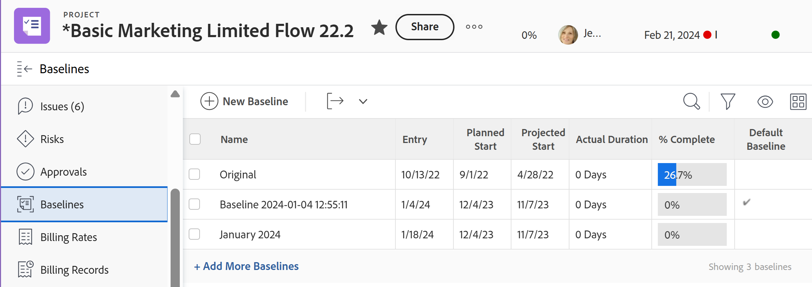

# Criar linhas de base do projeto

Uma linha de base é um instantâneo de projeto que representa informações fundamentais incluídas no plano de projeto inicial ou em qualquer momento durante a vida do projeto.

Você pode usar a linha de base para comparar essas informações do plano atual com o plano original ou qualquer outro ponto no tempo, para identificar tarefas problemáticas, escopo e outras tendências ao longo do tempo.

## Requisitos de acesso

<!--
drafted for P&P:

<table style="table-layout:auto"> 
 <col> 
 <col> 
 <tbody> 
  <tr> 
   <td role="rowheader">Adobe Workfront plan*</td> 
   <td> 
Any
 </td> 
  </tr> 
  <tr> 
   <td role="rowheader">Adobe Workfront license*</td> 
   <td> 
Current license: Standard 
 
   Or
   
Legacy license: Plan 
 
   </td> 
  </tr> 
  <tr> 
   <td role="rowheader">Access level*</td> 
   <td> 
Edit access to Projects
 
<b>NOTE</b>
   
   If you still don't have access, ask your Workfront administrator if they set additional restrictions in your access level. For information about access to projects, see <a href="../../../administration-and-setup/add-users/configure-and-grant-access/grant-access-projects.md" class="MCXref xref">Grant access to projects</a>. For information on how a Workfront administrator can change your access level, see <a href="../../../administration-and-setup/add-users/configure-and-grant-access/create-modify-access-levels.md" class="MCXref xref">Create or modify custom access levels</a>. 
 </td> 
  </tr> 
  <tr> 
   <td role="rowheader">Object permissions</td> 
   <td> 
View permissions to the project or higher to view baselines
 
Manage permissions to the project to create baselines
 
 For information about project permissions, see <a href="../../../workfront-basics/grant-and-request-access-to-objects/share-a-project.md" class="MCXref xref">Share a project in Adobe Workfront</a>.
 
For information on requesting additional access, see <a href="../../../workfront-basics/grant-and-request-access-to-objects/request-access.md" class="MCXref xref">Request access to objects </a>.
 </td> 
  </tr> 
 </tbody> 
</table>
-->

Você deve ter o seguinte acesso para executar as etapas neste artigo:

<table style="table-layout:auto"> 
 <col> 
 <col> 
 <tbody> 
  <tr> 
   <td role="rowheader">Plano Adobe Workfront*</td> 
   <td> 
Qualquer Um
 </td> 
  </tr> 
  <tr> 
   <td role="rowheader">Licença da Adobe Workfront*</td> 
   <td> 
Plano 
 </td> 
  </tr> 
  <tr> 
   <td role="rowheader">Nível de acesso*</td> 
   <td> 
Editar acesso a Projetos
 
<b>OBSERVAÇÃO</b>
   Caso ainda não tenha acesso, pergunte ao administrador do Workfront se ele definiu restrições adicionais em seu nível de acesso. Para obter informações sobre o acesso a projetos, consulte <a href="../../../administration-and-setup/add-users/configure-and-grant-access/grant-access-projects.md" class="MCXref xref">Conceder acesso aos projetos</a>. Para obter informações sobre como um administrador do Workfront pode alterar seu nível de acesso, consulte <a href="../../../administration-and-setup/add-users/configure-and-grant-access/create-modify-access-levels.md" class="MCXref xref">Criar ou modificar níveis de acesso personalizados</a>. 
 </td> 
  </tr> 
  <tr> 
   <td role="rowheader">Permissões de objeto</td> 
   <td> 
Exibir permissões para o projeto ou superior para exibir linhas de base
 
Gerenciar permissões do projeto para criar linhas de base
 
 Para obter informações sobre permissões de projeto, consulte <a href="../../../workfront-basics/grant-and-request-access-to-objects/share-a-project.md" class="MCXref xref">Compartilhar um projeto no Adobe Workfront</a>.
 
Para obter informações sobre como solicitar acesso adicional, consulte <a href="../../../workfront-basics/grant-and-request-access-to-objects/request-access.md" class="MCXref xref">Solicitar acesso a objetos </a>.
 </td> 
  </tr> 
 </tbody> 
</table>

&#42;Para descobrir qual plano, tipo de licença ou acesso você tem, entre em contato com o administrador da Workfront.

## Considerações para trabalhar com linhas de base

* Você pode capturar um instantâneo do progresso em um projeto várias vezes durante a vida útil do projeto, criando várias linhas de base.
* É possível exibir as informações incluídas nas linhas de base de um projeto criando uma linha de base ou criando um relatório de Linha de Base.
* Quando você cria uma linha de base, as informações da tarefa também são capturadas nas tarefas da linha de base dessa linha de base.
* Você pode exibir as informações das tarefas da linha de base criando um relatório de Tarefa da Linha de Base.

>[!IMPORTANT]
>
>Uma linha de base captura um instantâneo do nome, datas e informações financeiras do projeto. A linha de base não inclui os valores de campos personalizados no projeto. Para obter informações sobre informações financeiras incluídas na linha de base, consulte [Finanças dos projetos incluídos nas linhas de base dos projetos](../../../manage-work/projects/project-finances/project-finances-included-in-project-baselines.md).

## Criar uma linha de base

Você pode criar uma linha de base das seguintes maneiras:

* **Automaticamente**: O administrador do Workfront ou um administrador de grupo define a preferência do projeto para o Workfront criar automaticamente uma linha de base quando um projeto se tornar Atual. Quando esta configuração é ativada, uma linha de base é criada quando o status do projeto se torna Atual. Quando esta configuração não estiver ativada, você deve criar manualmente linhas de base.

   Para obter mais informações sobre como configurar as preferências do projeto e configurar a criação automática da linha de base, consulte [Configurar preferências de projeto em todo o sistema](../../../administration-and-setup/set-up-workfront/configure-system-defaults/set-project-preferences.md).

   >[!CAUTION]
   >
   >Ativar essa configuração cria automaticamente uma linha de base para um projeto sempre que o status de um projeto for alterado para Atual. A primeira linha de base criada é a padrão. Você deve criar manualmente todas as outras linhas de base durante a vida do projeto .

* **Manualmente**: Você pode criar novas linhas de base para o projeto, conforme necessário, conforme o andamento do projeto. Você pode comparar linhas de base para ver como o projeto avançou ao longo do tempo.

Para criar uma linha de base:

1. Navegue até um projeto.
1. No painel esquerdo, clique em **Linhas de base**.

   Ou

   Clique em **Mostrar mais**, depois clique em **Linhas de base**.

   

1. Clique em **Nova linha de base.**
1. Especifique o nome da linha de base.
1. (Opcional) Se esta for a primeira linha de base, você pode escolher a linha de base como padrão.
1. Clique em **Salvar**.

   Por padrão, as seguintes informações são exibidas sobre a linha de base criada por você:

   * Nome da linha de base
   * Data de entrada da linha de base
   * Data Inicial Planejada do projeto quando a linha de base foi criada
   * Data Inicial Projetada do projeto quando a linha de base foi criada
   * Duração real do projeto quando a linha de base foi criada
   * % Concluído do projeto quando a linha de base foi criada
   * Indicador de linha de base padrão que mostra se uma linha de base é a linha de base padrão do projeto

      >[!TIP]
      >
      >Não é possível exibir informações de duas linhas de base ao mesmo tempo na mesma exibição ou relatório. Você só pode exibir informações de uma determinada linha de base e da linha de base Padrão no mesmo relatório. Você pode modificar qual linha de base considera como a linha de base padrão a qualquer momento durante a vida do projeto.

1. (Opcional) Clique na seta suspensa ao lado de Exibir e, em seguida, **Personalizar exibição** para adicionar campos à visualização e comparar informações adicionais entre linhas de base.

## Criar um relatório de Linha de Base ou de Tarefa de Linha de Base

Para exibir informações da linha de base, também é possível criar um relatório de Linha de Base ou de Tarefa da Linha de Base. Isso permite exibir qualquer número de campos sobre as linhas de base ou tarefas de linha de base para compará-las em uma visualização.

>[!TIP]
>
>É necessário criar uma linha de base antes de criar um relatório de Linha de Base ou de Tarefa de Linha de Base.

Para obter informações sobre como criar um relatório, consulte [Criar um relatório personalizado](../../../reports-and-dashboards/reports/creating-and-managing-reports/create-custom-report.md).

Recomendamos adicionar um agrupamento Nome do projeto ao seu relatório Linha de base ou Linha de base para facilitar a leitura.

Para obter informações sobre como criar um agrupamento, consulte [Criar agrupamentos no Adobe Workfront](../../../reports-and-dashboards/reports/reporting-elements/create-groupings.md).
