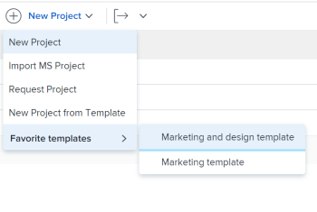

# Criar um projeto usando um modelo

Você pode usar modelos como uma estrutura para criar novos projetos. Se você tiver projetos que se repetem com frequência, usar modelos para a linha do tempo geral do novo projeto evita que você tenha que criar os mesmos projetos repetidamente.

Os modelos fornecem uma maneira de capturar todos os processos, informações e configurações repetíveis associados aos projetos. Todas as informações associadas a um modelo são transferidas para o projeto. Isso inclui tarefas, atribuições, durações, documentos, detalhes financeiros, riscos e formulários personalizados.

>[!TIP]
>
>O status de um novo projeto criado a partir de um modelo corresponde ao status definido pelo administrador do Workfront na área principal Preferências do projeto ou por um administrador de grupo (ou administrador do Workfront) na área Preferências do projeto de um grupo. Para obter informações sobre como configurar as preferências do projeto, consulte [Configurar preferências de projeto em todo o sistema](../../../administration-and-setup/set-up-workfront/configure-system-defaults/set-project-preferences.md) ou [Configurar preferências de projeto para um grupo](../../../administration-and-setup/manage-groups/create-and-manage-groups/configure-project-preferences-group.md).

Você tem as seguintes opções para criar um projeto a partir de um modelo:

* Criar um projeto a partir de um modelo na área Projetos
* Criar um projeto a partir de um modelo no nível do modelo
* Anexar um modelo a um projeto existente

   Para obter mais informações, consulte [Anexar um modelo a um projeto](../../../manage-work/projects/create-and-manage-templates/attach-template-to-project.md).

* Criar um projeto a partir de um modelo na área Grupos

## Requisitos de acesso

<!--drafted for P&P:

<table style="table-layout:auto"> 
 <col> 
 <col> 
 <tbody> 
  <tr> 
   <td role="rowheader">Adobe Workfront plan*</td> 
   <td> 
Any 
 </td> 
  </tr> 
  <tr> 
   <td role="rowheader">Workfront license*</td> 
   <td> 
Current license: Standard 

   Or
   
Legacy license: Plan 

    </td> 
  </tr> 
  <tr> 
   <td role="rowheader">Access level configurations*</td> 
   <td> 
Edit access to Projects and to Templates
 
<b>NOTE</b>
   
   If you still don't have access, ask your Workfront administrator if they set additional restrictions in your access level. For information about access to projects, see <a href="../../../administration-and-setup/add-users/configure-and-grant-access/grant-access-projects.md" class="MCXref xref">Grant access to projects</a>. For information on how a Workfront administrator can change your access level, see <a href="../../../administration-and-setup/add-users/configure-and-grant-access/create-modify-access-levels.md" class="MCXref xref">Create or modify custom access levels</a>. 
 </td> 
  </tr> 
  <tr> 
   <td role="rowheader">Object permissions</td> 
   <td> 
View permissions to a template
 
When you create a project you automatically receive Manage permissions to the project 
 
 For information about project permissions, see <a href="../../../workfront-basics/grant-and-request-access-to-objects/share-a-project.md" class="MCXref xref">Share a project in Adobe Workfront</a>.
 
For information on requesting additional access, see <a href="../../../workfront-basics/grant-and-request-access-to-objects/request-access.md" class="MCXref xref">Request access to objects </a>.
 </td> 
  </tr> 
 </tbody> 
</table>
-->

Você deve ter o seguinte acesso para executar as etapas neste artigo:

<table style="table-layout:auto"> 
 <col> 
 <col> 
 <tbody> 
  <tr> 
   <td role="rowheader">Plano Adobe Workfront*</td> 
   <td> 
Qualquer Um 
 </td> 
  </tr> 
  <tr> 
   <td role="rowheader">Visão geral das licenças do Workfront*</td> 
   <td> 
Plano 
 </td> 
  </tr> 
  <tr> 
   <td role="rowheader">Nível de acesso*</td> 
   <td> 
Editar acesso a Projetos e Modelos
 
<b>Nota</b>

Caso ainda não tenha acesso, pergunte ao administrador do Workfront se ele definiu restrições adicionais em seu nível de acesso. Para obter informações sobre o acesso a projetos, consulte <a href="../../../administration-and-setup/add-users/configure-and-grant-access/grant-access-projects.md" class="MCXref xref">Conceder acesso aos projetos</a>. Para obter informações sobre como um administrador do Workfront pode alterar seu nível de acesso, consulte <a href="../../../administration-and-setup/add-users/configure-and-grant-access/create-modify-access-levels.md" class="MCXref xref">Criar ou modificar níveis de acesso personalizados</a>. 
 </td>
</tr> 
  <tr> 
   <td role="rowheader">Permissões de objeto</td> 
   <td> 
Exibir permissões para um modelo
 
Ao criar um projeto, você recebe automaticamente as permissões Gerenciar do projeto 
 
 Para obter informações sobre permissões de projeto, consulte <a href="../../../workfront-basics/grant-and-request-access-to-objects/share-a-project.md" class="MCXref xref">Compartilhar um projeto no Adobe Workfront</a>.
 
Para obter informações sobre como solicitar acesso adicional, consulte <a href="../../../workfront-basics/grant-and-request-access-to-objects/request-access.md" class="MCXref xref">Solicitar acesso a objetos </a>.
 </td> 
  </tr> 
 </tbody> 
</table>

&#42;Para descobrir qual plano, tipo de licença ou acesso você tem, entre em contato com o administrador da Workfront.

## Criar um projeto a partir de um modelo na área Projetos

Você pode criar um projeto na área Projetos no Menu principal ou na área Projetos de um portfólio ou de um programa.

1. Siga um destes procedimentos:

   * Clique no botão **Menu principal** , clique em **Projetos**, em seguida expanda **Novo projeto**.
   * Vá para um portfólio e expanda **Novo projeto**.

      >[!TIP]
      >
      >Ao criar um projeto usando um modelo de um portfólio, o campo Portfolio do novo projeto é atualizado para exibir o portfólio do qual você escolheu criar o projeto. Isso substitui o campo Portfolio no template, se ele for especificado.

   * Vá para um programa e expanda **Novo projeto**.

      >[!TIP]
      >
      >Ao criar um projeto usando um modelo de um programa, o campo Programa dos novos projetos é atualizado para exibir o Programa do qual você escolheu criar o projeto. O campo Portfolio do template é atualizado para exibir o portfólio do programa escolhido para criar o projeto. Isso substitui os campos Programa e Portfolio no modelo, se forem especificados.

   * Se você for um administrador de grupo, também poderá criar um projeto na seção Projetos de um grupo que você gerencia. Para obter mais informações, consulte [Criar e modificar projetos de um grupo](../../../administration-and-setup/manage-groups/work-with-group-objects/create-and-modify-a-groups-projects.md).

      >[!TIP]
      >
      >Quando você cria um projeto usando um modelo de um grupo, o grupo a partir do qual você cria o projeto é exibido no campo Grupo do novo projeto somente quando o campo Grupo do modelo não é especificado. Se o campo Grupo de modelo for especificado, o campo Grupo do novo projeto será o do modelo.
   <!--
   
(this, above, is hyperlinked to the classic version of this article; the Milestone View steps are similar to creating a project in Classic than to the way you do it in NWE)

   -->

   

1. Clique no nome de um template no **Modelos favoritos** lista

   

   Ou

   Faça o seguinte:

   1. Selecionar **Novo projeto a partir de modelo**.
   1. No **Modelos de pesquisa** , comece digitando o nome de um modelo e clique nele quando ele for exibido na lista.
   1. Revise os detalhes do modelo à direita.

      Os detalhes do modelo incluem:

      * Duração do modelo
      * Proprietário do modelo
      * O número de tarefas de nível superior que inclui os nomes das três principais tarefas
      * O número de todas as tarefas no modelo
      * Os nomes dos formulários personalizados do modelo
   1. (Opcional) Passe o mouse sobre o nome de um modelo e clique no botão **Favoritos** **ícone**  para marcá-lo como favorito para uso futuro.

      Ou

      Expanda o **Modelos favoritos** e selecione um modelo na lista suspensa.

      >[!TIP]
      >
      >É possível ter até 40 itens do Workfront marcados como favoritos. Isso inclui modelos e outros itens.

   1. Clique em **Usar modelo** quando você selecionou um template.

   

   >[!NOTE]
   >
   >Se você tiver a Exibição de marco aplicada à lista de projetos, clique no nome de um modelo na **Novo na seção Modelo**.
   >
   >
   >   >

1. O **Novo projeto** será aberta.

   

1. Se um campo já estiver preenchido no modelo, ele será preenchido previamente no campo **Novo projeto** caixa. Você pode editar os valores pré-preenchidos para corresponder melhor ao seu projeto. Para obter mais informações, consulte [Editar projetos](../../../manage-work/projects/manage-projects/edit-projects.md).
1. Clique em **Criar projeto**.

   Todos os detalhes definidos no modelo serão associados automaticamente ao projeto recém-criado se você não os tiver alterado na etapa anterior.

## Criar um projeto a partir de um modelo na área Modelos

Em vez de começar na área Projetos , você pode criar um projeto a partir de um modelo começando com o modelo.

 

1. No **Menu principal**, clique em **Modelos**.

1. Clique no nome de um template que deseja usar.
1. Clique no botão **Mais** menu , depois clique em **Criar projeto.**

   

   O **Novo projeto** será aberta.

1. Especifique um nome para o projeto, analise cada seção e faça as alterações necessárias.

   

   Se um campo já estiver preenchido no modelo, ele será preenchido previamente no campo **Novo projeto** caixa. Você pode editar os valores pré-preenchidos para corresponder melhor ao seu projeto. Para obter mais informações, consulte [Editar projetos](../../../manage-work/projects/manage-projects/edit-projects.md).

1. Clique em **Criar projeto.**

   Todos os detalhes definidos no modelo serão associados automaticamente ao projeto recém-criado se você não os tiver alterado na etapa anterior.
