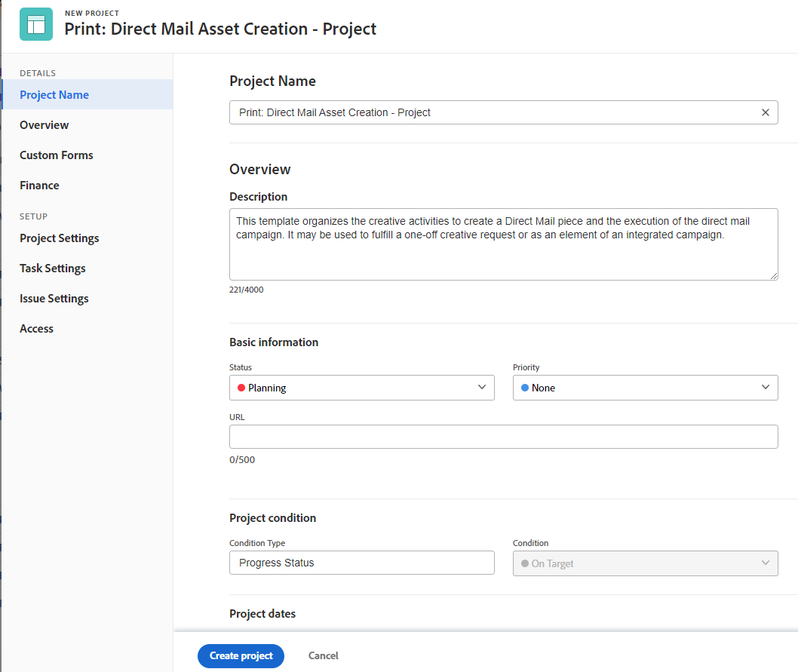

# Criar um projeto usando um modelo

<!-- Audited: 10/2025 -->

Você pode usar modelos como uma estrutura para criar projetos no Adobe Workfront. Se você tiver projetos que se repetem com frequência, usar modelos para a linha do tempo geral do novo projeto evita que você tenha que criar os mesmos projetos repetidamente.

Os modelos fornecem uma maneira de capturar processos, informações e configurações repetíveis associados aos seus projetos. As informações associadas a um modelo são transferidas para o projeto. Isso inclui tarefas, atribuições, durações, documentos, detalhes financeiros, riscos e formulários personalizados.

>[!TIP]
>
>O Workfront define o Grupo e o Status do novo projeto da seguinte maneira:
>
>* O status padrão de um novo projeto criado a partir de um modelo corresponde ao status definido pelo administrador do Workfront na área principal Preferências do projeto, ou por um administrador de grupo (ou administrador do Workfront) na área Preferências do projeto de um grupo. Para obter informações sobre como configurar as preferências do projeto, consulte [Configurar preferências do projeto do sistema](../../../administration-and-setup/set-up-workfront/configure-system-defaults/set-project-preferences.md) ou [Configurar preferências do projeto para um grupo](../../../administration-and-setup/manage-groups/create-and-manage-groups/configure-project-preferences-group.md).
>
>* O Grupo do novo projeto é o Grupo do modelo. Se o modelo não estiver associado a um Grupo, o Grupo do projeto será o Grupo inicial do usuário que cria o projeto.
>
>* Os status disponíveis para um novo projeto correspondem aos status do Grupo do projeto, que é o Grupo do modelo ou o Grupo inicial do usuário que cria o projeto.

Você tem as seguintes opções para criar um projeto a partir de um modelo:

* Crie um projeto com base em um modelo na área Projetos
* Criar um projeto a partir de um modelo no nível do modelo
* Anexar um modelo a um projeto existente

  Para obter informações, consulte [Anexar um modelo a um projeto](../../../manage-work/projects/create-and-manage-templates/attach-template-to-project.md).

* Crie um projeto com base em um modelo na área Grupos

## Requisitos de acesso

+++ Expanda para visualizar os requisitos de acesso para a funcionalidade neste artigo.

<table style="table-layout:auto"> 
 <col> 
 <col> 
 <tbody> 
  <tr> 
   <td role="rowheader">Pacote do Adobe Workfront</td> 
   <td> 
Qualquer
 </td> 
  </tr> 
  <tr> 
   <td role="rowheader">Licença do Workfront</td> 
   <td> 
Standard

        
Plano
 </td> 
  </tr> 
  <tr> 
   <td role="rowheader">Configuração do nível de acesso</td> 
   <td> 
Editar acesso a projetos e modelos

   
Editar o acesso a portfólios e programas, se o modelo usado contiver um Portfolio e um programa
  
   </td> 
  </tr> 
  <tr> 
   <td role="rowheader">Permissões de objeto</td> 
   <td> 
Exibir permissões para um modelo
 
  
Se o modelo usado contiver um Portfolio e um Programa, você deverá ter permissões de Gerenciamento para o portfólio e o programa para criar o projeto 
 
   
Ao criar um projeto, você recebe automaticamente permissões de gerenciamento para o projeto.
</td> 
  </tr> 
 </tbody> 
</table>

Para obter mais informações, consulte [Requisitos de acesso na documentação do Workfront](/help/quicksilver/administration-and-setup/add-users/access-levels-and-object-permissions/access-level-requirements-in-documentation.md).

+++

<!--Old:

<table style="table-layout:auto"> 
 <col> 
 <col> 
 <tbody> 
  <tr> 
   <td role="rowheader">Adobe Workfront plan</td> 
   <td> 
Any 
 </td> 
  </tr> 
  <tr> 
   <td role="rowheader">Workfront license*</td> 
   <td> 
New: Standard

        
or

        
Current: Plan 
 </td> 
  </tr> 
  <tr> 
   <td role="rowheader">Access level</td> 
   <td> 
Edit access to Projects and to Templates

   
   
edit access to Portfolios and Programs, if the template you use contains a Portfolio and a Program

   
   </td> 
  </tr> 
  <tr> 
   <td role="rowheader">Object permissions</td> 
   <td> 
View permissions to a template
 
  
If the template you use contains a Portfolio and a Program, you must have Manage permissions to the portfolio and program to create the project 
 
   
When you create a project, you automatically receive Manage permissions to the project.
</td> 
  </tr> 
 </tbody> 
</table>-->

## Crie um projeto com base em um modelo na área Projetos

Você pode criar um projeto na área Projetos do menu principal, ou na área Projetos de um portfólio ou programa.

>[!NOTE]
>
>O administrador do sistema ou do grupo pode modificar a interface usando um modelo de layout. Nesse caso, alguns dos nomes das seções e áreas mencionadas nas etapas a seguir podem ser diferentes na instância do Workfront.

1. Siga um destes procedimentos:

   * Clique no ícone **[!UICONTROL Menu Principal]**  no canto superior esquerdo ou no ícone **[!UICONTROL Menu Principal]**  no canto superior direito do Adobe Workfront, se disponível, clique em **Projetos** e expanda **Novo Projeto**.
   * Vá para um portfólio e expanda **Novo projeto**.

     >[!TIP]
     >
     >Ao criar um projeto usando um modelo de um portfólio, o campo Portfolio do novo projeto é atualizado para exibir o portfólio escolhido para criar o projeto. Isso substitui o campo Portfolio no modelo, se for especificado.

   * Vá para um programa e expanda **Novo Projeto**.

     >[!TIP]
     >
     >Ao criar um projeto usando um modelo de um programa, o campo Programa dos novos projetos é atualizado para exibir o Programa escolhido para criar o projeto. O campo Portfolio das atualizações de modelo para exibir o portfólio do programa escolhido para criar o projeto. Isso substituirá os campos Program e Portfolio no modelo, se eles forem especificados.

   * Se você for um administrador de grupo, também poderá criar um projeto na seção Projetos de um grupo gerenciado. Para obter mais informações, consulte [Criar e modificar projetos de um grupo](../../../administration-and-setup/manage-groups/work-with-group-objects/create-and-modify-a-groups-projects.md).

     >[!TIP]
     >
     >Ao criar um projeto usando um modelo de um grupo, o grupo do qual você cria o projeto é exibido no campo Grupo do novo projeto somente quando o campo Grupo do modelo não é especificado. Se o campo Grupo do modelo for especificado, o campo Grupo do novo projeto será o do modelo.

   <!--
   
(this, above, is hyperlinked to the classic version of this article; the Milestone View steps are similar to creating a project in Classic than to the way you do it in NWE)

   -->

   

1. Clique no nome de um modelo na lista **Modelos favoritos**.

   

   Ou

   Faça o seguinte:

   1. Clique em **Novo projeto do modelo**.
   1. No campo **Pesquisar Modelos**, comece digitando o nome de um modelo e clique nele quando ele for exibido na lista.
   1. Revise os detalhes do modelo à direita.

      Os detalhes do template incluem o seguinte:

      * Duração do modelo
      * Proprietário do modelo
      * O número de tarefas de nível superior, que inclui os nomes das três principais tarefas
      * O número de todas as tarefas no modelo
      * Os nomes dos formulários personalizados do modelo

   1. (Opcional) Passe o mouse sobre o nome de um modelo no painel esquerdo e clique no **ícone de** Favoritos ****  para marcá-lo como favorito para uso futuro.

      Ou

      Expanda a lista **Modelos favoritos** e selecione um modelo na lista suspensa.

      >[!TIP]
      >
      >É possível marcar até 40 itens do Workfront como favoritos. Isso inclui modelos e outros itens.

   1. Clique em **Usar modelo** quando tiver selecionado um modelo.

      

      <!--no longer available, after unshimming - Oct 2025:
      >[!NOTE]
      >
      >If you have the Milestone View applied to the list of projects, click the name of a template in the **New from Template section**.
      >
      >
      >
      >
      -->

   A caixa **Novo Projeto** é aberta.

   

1. (Condicional) Se um campo já estiver preenchido no modelo, ele será preenchido na caixa **Novo projeto**.

   Edite os valores pré-preenchidos para que correspondam melhor ao seu projeto.

   Para obter mais informações, consulte [Editar projetos](../../../manage-work/projects/manage-projects/edit-projects.md).
1. Clique em **Criar projeto**.

   Todos os detalhes definidos no modelo são associados automaticamente ao projeto recém-criado se você não os alterou na etapa anterior.

## Crie um projeto a partir de um modelo na área Modelos

Em vez de começar na área Projetos, você pode criar um projeto a partir de um modelo começando pelo modelo.

{{step1-to-templates}}

1. Clique no nome de um modelo que deseja usar.
1. Clique no **Mais** ícone  do menu à direita do nome do modelo no cabeçalho e clique em **Criar projeto**.

   

   A caixa **Novo Projeto** é aberta.

1. Insira um nome para o projeto. O Workfront usa o nome do modelo para nomear o novo projeto.

1. Revise cada seção na caixa **Novo projeto** e faça as alterações necessárias.

   

   Se um campo já estiver preenchido no modelo, ele será preenchido na caixa **Novo projeto**. É possível editar os valores pré-preenchidos para melhor corresponder ao seu projeto.

   Para obter informações, consulte [Editar projetos](../../../manage-work/projects/manage-projects/edit-projects.md).

1. Clique em **Criar projeto**.

   Todos os detalhes definidos no modelo são associados automaticamente ao projeto recém-criado se você não os alterou na etapa anterior.
