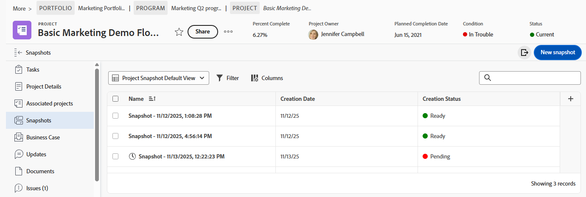
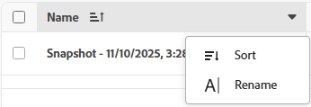

# Criar e exibir instantâneos do projeto

{{highlighted-preview-article-level}}

Os gerentes de projeto geralmente precisam comparar os dados anteriores de um projeto com o status atual para tomar decisões informadas e ver como seus projetos mudaram com o tempo.

As capturas de imagem no Adobe Workfront oferecem uma maneira de ver essas diferenças entre as capturas de imagem (feitas em uma data e hora específicas) e os dados atuais do projeto de forma rápida e precisa, ajudando você a gerenciar os projetos com mais eficiência e a tomar melhores decisões. As comparações de instantâneos mostram lado a lado como o projeto evoluiu.

## Requisitos de acesso

+++ Expanda para visualizar os requisitos de acesso da funcionalidade neste artigo.

<table style="table-layout:auto"> 
 <col> 
 <col> 
 <tbody> 
  <tr> 
   <td>Pacote do Adobe Workfront</td> 
   <td> 
Workflow Ultimate
 </td> 
  </tr> 
  <tr> 
   <td>Licença do Adobe Workfront</td> 
    <td>Padrão</td> 
  </tr> 
  <tr> 
   <td>Configuração do nível de acesso</td> 
   <td>Editar acesso a projetos</td> 
  </tr> 
  <tr> 
   <td>Permissões de objeto</td> 
   <td>Ao exibir um instantâneo, é possível exibir todos os campos que você tem permissão para exibir no projeto original </td> 
  </tr> 
 </tbody> 
</table>

Para obter mais informações, consulte [Requisitos de acesso na documentação do Workfront](/help/quicksilver/administration-and-setup/add-users/access-levels-and-object-permissions/access-level-requirements-in-documentation.md).

+++

## Criar um instantâneo

1. Ir para um projeto.
1. No painel esquerdo, clique em **Instantâneos**.

   

1. Clique em **Novo instantâneo**.
1. Digite um nome para o instantâneo na caixa de diálogo **Novo instantâneo** e clique em **Salvar**.

   O nome do snapshot aparece na lista.

   >[!NOTE]
   >
   >Quando você cria um snapshot, ele não está disponível para visualização imediatamente. Com base nos dados executados em segundo plano, pode levar até 4 horas para ficar pronto. O Status de Criação é **Pendente** quando o instantâneo ainda não está disponível e **Pronto** quando você pode exibi-lo.

## Exibir um único snapshot

1. Vá para um projeto e clique em **Instantâneos** no painel esquerdo.
1. Clique no nome de um instantâneo na lista para abri-lo. O status deve ser **Pronto** antes que você possa abri-lo.

   >[!TIP]
   >
   >As navegações estruturais na parte superior da tela vinculam-se novamente ao projeto e ajudam a identificar se você está visualizando um instantâneo.

   O instantâneo exibe os seguintes itens como eles existiam no momento em que o instantâneo foi criado:

   * A hierarquia de tarefas e subtarefas no projeto
   * Detalhes do projeto e quaisquer formulários personalizados anexados aos detalhes
   * Projetos associados e sua hierarquia
   * Problemas
   * Preços
   * Registros de cobrança
   * Despesas <!--* Bookings (on its own line of course when they get released)-->
   * Equipe do projeto (guia People )

   Você pode personalizar qualquer lista no instantâneo filtrando, classificando, adicionando e removendo colunas ou aplicando uma visualização. KPIs divididos em fase no tempo estão disponíveis para serem adicionados à exibição de instantâneo. Para obter mais informações, consulte [Personalizar listas de instantâneos](#customize-snapshot-lists) neste artigo.

## Comparar snapshots

1. Vá para um projeto e clique em **Instantâneos** no painel esquerdo.
1. Selecione uma opção para comparar instantâneos:

   * Para comparar dois ou mais instantâneos entre si, marque as caixas de seleção ao lado dos instantâneos na lista e clique em **Comparar** na barra de ações na parte inferior da tela.
   * Para comparar instantâneos com o projeto atual, marque as caixas de seleção ao lado dos instantâneos na lista e clique em **Comparar com atual** na barra de ações na parte inferior da tela.

     >[!NOTE]
     >
     >O status de cada instantâneo que você deseja comparar deve ser **Pronto**.

1. Na tela Comparação, expanda cada instantâneo e o projeto atual para ver a hierarquia abaixo.

   

1. Você pode personalizar a comparação classificando, adicionando e removendo colunas ou aplicando uma exibição. Para obter mais informações, consulte [Personalizar listas de instantâneos](#customize-snapshot-lists) neste artigo.

## Exportar instantâneos

Você pode exportar a lista de todos os instantâneos ou uma comparação de instantâneos no formato .xlsx ou .csv. Todas as colunas exibidas são incluídas no arquivo exportado.

1. Clique no ícone **Exportar**  na lista de instantâneos ou comparação de instantâneos.
1. Selecione o formato do arquivo de exportação.

   O arquivo é salvo no computador. Talvez seja solicitado que você escolha o local.

1. (Opcional) Abra a lista exportada usando o aplicativo apropriado.

## Personalizar listas de instantâneos

Você pode personalizar a lista de todos os snapshots, bem como de qualquer lista contida em um snapshot ou comparação, filtrando, classificando, adicionando e removendo colunas ou aplicando uma view.

Para obter mais informações sobre personalizações de lista, consulte [Usar listas aprimoradas](/help/quicksilver/workfront-basics/navigate-workfront/use-lists/enhanced-lists.md).

### Filtrar itens em uma lista

Os filtros ajudam a reduzir a quantidade de informações exibidas na lista.

1. Clique em **Filtro** acima da lista.
1. Na caixa Filtro, clique em **Adicionar condição**.
1. Selecione um campo para filtrar.
1. Selecione um modificador de filtro, como &quot;Tem qualquer um de&quot;, &quot;Não tem nenhum de&quot;, &quot;É antes&quot; ou &quot;É depois de&quot;. As opções do modificador são diferentes dependendo do tipo de campo pelo qual você está filtrando.
1. Selecione o valor ou os valores do campo. Dependendo do tipo de campo pelo qual você está filtrando, talvez seja solicitado que você selecione o item em uma lista, pesquise por ele ou use um calendário para selecionar um intervalo de datas.

   

   O filtro é aplicado automaticamente à lista.

1. Clique em **Adicionar condição** para adicionar outra condição ao filtro.

   É possível unir vários filtros por um conector AND ou OR.

1. Quando o filtro for aplicado, você poderá abrir as opções **Filtro** novamente para alterar as opções de filtro ou limpar todos os filtros.

   Um indicador é exibido no botão **Filtro** quando um filtro é aplicado à lista.

   

### Classificar em uma lista

Para classificar colunas individuais:

1. Passe o mouse sobre a coluna, clique na seta para baixo e selecione **Classificar**.

   Um ícone ao lado de um nome de coluna indica que a lista é classificada pelos valores dessa coluna e a direção da classificação.

   

### Personalizar colunas em uma lista

Você pode ocultar, exibir e reordenar colunas em uma lista.

1. Clique em **Colunas** acima da lista.

   

1. Use os botões para exibir ou ocultar colunas na lista.
1. Para reordenar as colunas, clique no ícone **Arrastar**  e mova uma coluna para o local desejado. Mover colunas altera a lista automaticamente.

   >[!NOTE]
   >
   >O campo principal é a primeira coluna na lista. Ela é fixada na primeira posição e não é possível alterar sua coluna. Se o número de colunas for grande, o campo principal é congelado à esquerda e, ao rolar a tela horizontalmente, você sempre o verá.
   >
   >O ícone ao lado de um nome de campo mostra o tipo de campo, como texto ou campo de data.

   Um indicador é exibido no botão **Colunas** quando as colunas estão ocultas. O indicador não aparece ao reordenar as colunas.

   

### Adicionar e remover colunas com o Gerenciador de colunas

Você pode usar o Gerenciador de colunas em algumas listas aprimoradas para adicionar e remover facilmente colunas na lista. Você pode adicionar ou remover campos personalizados e do sistema que já existem na Workfront como colunas.

1. Clique no ícone **+** no canto superior direito da tabela para abrir a caixa **Gerenciador de colunas**.

   

1. Procure um campo de objeto existente na coluna **Disponível** e clique em **+** à direita do nome do campo para adicioná-lo à coluna **Selecionado**.
1. Clique em **-** à direita de um campo na coluna **Selecionado** para removê-lo da lista.
1. Clique em **Salvar**.

   A lista atualiza as colunas de acordo com as escolhas feitas.

### Aplicar uma visualização a uma lista

Para aplicar ou criar uma view:

1. Clique na lista suspensa **Exibições** e selecione uma exibição existente para aplicá-la à lista

   OR

   Clique em **Novo modo de exibição** para criar um.

   

1. (Condicional) Para adicionar um novo modo de exibição, insira um nome para o modo de exibição e clique em **Criar**.
1. (Opcional) Oculte, exiba ou reorganize as colunas. Para obter mais informações, consulte [Personalizar colunas em uma lista](#customize-columns-in-a-list).
1. (Opcional) Filtre a lista. Para obter mais informações, consulte [Filtrar itens em uma lista](#filter-items-in-a-list).

As alterações nas exibições são salvas automaticamente. Na próxima vez que você aplicar essa visualização, as configurações de coluna e filtro permanecerão da maneira definida. Para obter mais informações sobre exibições, consulte [Usar listas aprimoradas](/help/quicksilver/workfront-basics/navigate-workfront/use-lists/enhanced-lists.md).

