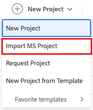

# Importar um projeto do Microsoft Project

<!-- Audited: 10/2025 -->

Você pode importar projetos do Microsoft Project para o Adobe Workfront e gerenciar todos os seus projetos em um único aplicativo. Toda vez que você importa um projeto do Microsoft Project, um novo projeto é criado no Workfront.

>[!IMPORTANT]
>
>Nem todos os campos do Projeto do Microsoft são transferidos para o Workfront.
>
>Para obter mais informações sobre a compatibilidade de campos entre o Workfront e o Microsoft Project, consulte [Mapear campos do Microsoft Project para projetos do Adobe Workfront](../../../manage-work/projects/manage-projects/map-ms-project-fields-to-workfront.md).

## Requisitos de acesso

+++ Expanda para visualizar os requisitos de acesso da funcionalidade neste artigo. 

<table style="table-layout:auto"> 
 <col> 
 <col> 
 <tbody> 
  <tr> 
   <td role="rowheader">Pacote do Adobe Workfront</td> 
   <td> 
Qualquer
 </td> 
  </tr> 
  <tr> 
   <td role="rowheader">Licença do Adobe Workfront</td> 
   <td> 
Padrão
 
    
Plano

   </td> 
  </tr> 
  <tr> 
   <td role="rowheader">Configuração do nível de acesso</td> 
   <td> 
Editar acesso a projetos
 
   
Se você adicionar um projeto a um portfólio ou programa, deverá ter acesso para Editar a Portfólios e Programas.

   </td> 
  </tr> 
  <tr> 
   <td role="rowheader">Permissões de objeto</td> 
   <td> 
Ao criar um projeto, você recebe automaticamente permissões de gerenciamento para o projeto

   
Se você adicionar um projeto a um portfólio ou programa, deverá ter permissões de Gerenciamento para o portfólio e o programa.

   </td> 
    </td> 
  </tr> 
 </tbody> 
</table>

Para obter mais detalhes sobre as informações contidas nesta tabela, consulte [Requisitos de acesso na documentação do Workfront](/help/quicksilver/administration-and-setup/add-users/access-levels-and-object-permissions/access-level-requirements-in-documentation.md).

+++

<!--
old permissions model: 

<table style="table-layout:auto"> 
 <col> 
 <col> 
 <tbody> 
  <tr> 
   <td role="rowheader">Adobe Workfront plan</td> 
   <td> 
Any
 </td> 
  </tr> 
  <tr> 
   <td role="rowheader">Adobe Workfront license</td> 
   <td> 
New: Standard 
 
   Or
   
Current: Plan 

   </td> 
  </tr> 
  <tr> 
   <td role="rowheader">Access level</td> 
   <td> 
Edit access to Projects
 </td> 
  </tr> 
  <tr> 
   <td role="rowheader">Object permissions</td> 
   <td> 
When you create a project you automatically receive Manage permissions to the project 
 </td> 
  </tr> 
 </tbody> 
</table>

-->

## Criar um projeto a partir de um MS Project

Você pode criar um projeto na área **Projetos** do **Menu Principal**, ou na área **Projetos** de um portfólio ou programa.

1. Faça logon no Microsoft Project e abra um projeto do qual deseja importar no Workfront.
1. Clique em **Arquivo**, depois em **Salvar como** para salvar o projeto como um arquivo .xml.

1. Faça login no Workfront.
1. Siga um destes procedimentos:

   * Clique no ícone **[!UICONTROL Menu Principal]**  no canto superior esquerdo e, em seguida, clique em **Projetos** e expanda **Novo Projeto**.
   * Vá para um portfólio e expanda **Novo projeto**.
   * Vá para um programa e expanda **Novo Projeto**.
   * Se você for um administrador de grupo, poderá criar um projeto na seção **Projetos** de um grupo que gerencia. Para obter mais informações, consulte [Criar e modificar projetos de um grupo](../../../administration-and-setup/manage-groups/work-with-group-objects/create-and-modify-a-groups-projects.md).

1. Clique em **Importar projeto MS**.

   

   A caixa **Importar Arquivo MS** é aberta.

1. Clique em **Selecionar arquivo** e procure o arquivo .xml em seu computador que você exportou do Microsoft Project.
1. Importar o arquivo selecionado. O Workfront inicia o processo de importação e cria um novo projeto com base no arquivo exportado do Microsoft Project.

   >[!NOTE]
   >
   >O Workfront tem uma limitação de tempo de 15 minutos para uploads de arquivos. Se o upload do arquivo demorar mais que isso, recomendamos dividir o projeto em projetos menores e importá-los separadamente. Depois de importadas para o Workfront, mova as tarefas de um projeto para outro para combiná-las em um projeto. Para obter informações sobre como mover tarefas, consulte [Mover tarefas](../../../manage-work/tasks/manage-tasks/move-tasks.md).

   Após a conclusão do processo de importação, você é direcionado para a nova página do projeto que exibe uma confirmação de que a importação foi concluída com êxito.

   >[!CAUTION]
   >
   >Se sua instância do Workfront tiver acesso ao armazenamento em nuvem do Workfront e do Adobe para documentos, importar um projeto do MS Project criará um projeto de armazenamento herdado do Workfront, mesmo quando o administrador do Workfront tiver tornado o armazenamento em nuvem do Adobe o padrão para o seu sistema.
   >
   >Para obter mais informações, consulte [Visão geral do gerenciamento de documentos para projetos e objetos relacionados](/help/quicksilver/manage-work/projects/manage-projects/manage-documents-on-projects.md).

1. (Opcional) Continue editando o projeto no Workfront. Para obter informações sobre como editar projetos, consulte [Editar projetos](../../../manage-work/projects/manage-projects/edit-projects.md).

   >[!NOTE]
   >
   >O status de um novo projeto criado a partir de um modelo corresponde ao status definido pelo administrador do Workfront na área **Preferências do projeto** ou por um administrador de grupo na área **Preferências do projeto do grupo**. Para obter informações sobre como configurar preferências de projeto, consulte [Configurar preferências de projeto do sistema](../../../administration-and-setup/set-up-workfront/configure-system-defaults/set-project-preferences.md).
