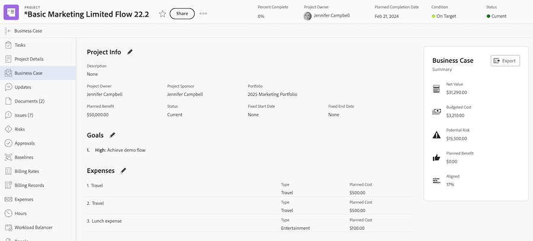

# Criar metas do Business Case

<!-- Audited: 6/2025 -->

Como parte da criação de um Business Case, você pode criar um conjunto de metas para definir os objetivos de um projeto. Essas metas são usadas para comunicar a finalidade da conclusão de um projeto ao Gerente do Portfolio ou ao Patrocinador do projeto.

<!--

(NOTE: below snippet: NWE only, not classic)

-->

>[!TIP]
>
>Você pode criar metas estratégicas para sua organização que não estejam conectadas ao Business Case individual de um projeto. Você deve ter acesso às Metas do Adobe Workfront para criar metas estratégicas. Você pode conectá-los a projetos fora do Business Case. Para obter informações sobre como criar metas usando as Metas do Workfront, consulte [Visão geral das Metas do Adobe Workfront](../../../workfront-goals/goal-management/wf-goals-overview.md).

Considere o seguinte ao criar metas do Business Case para seus projetos:

* As metas do Business Case são específicas do projeto. Não é possível copiar metas de um projeto para outro nem estabelecer metas no nível do sistema; elas devem ser definidas no nível de cada projeto.
* O administrador do Adobe Workfront ou do grupo deve ativar a seção Metas do projeto antes que ela seja exibida no Business Case. Para obter informações sobre como habilitar campos de Business Case para projetos, consulte [Configurar preferências de projeto do sistema](../../../administration-and-setup/set-up-workfront/configure-system-defaults/set-project-preferences.md).

* Metas não são uma seção obrigatória no Business Case do projeto.

  Um projeto pode receber uma pontuação para ser priorizado no Portfolio Otimizer, mesmo se a seção Metas não estiver definida.

  Para obter mais informações sobre a pontuação do Portfolio Otimizer, consulte [Aplicar um cartão de pontuação a um projeto e gerar uma Pontuação de Alinhamento](../../../manage-work/projects/define-a-business-case/apply-scorecard-to-project-to-generate-alignment-score.md).

* Você não pode relatar metas do Business Case.

## Requisitos de acesso

+++ Expanda para visualizar os requisitos de acesso para a funcionalidade neste artigo.

<table style="table-layout:auto"> 
 <col> 
 </col> 
 <col> 
 </col> 
 <tbody> 
  <tr> 
   <td role="rowheader">
plano do Adobe Workfront*
</td> 
   <td> 
Atual: Prime ou superior

   
Herdados: Pro ou superior
  </td> 
  </tr> 
  <tr> 
   <td role="rowheader">
Licença da Adobe Workfront*
</td>
   <td> 
   
Atual: Padrão
 
   
Herdados: plano 
 
   </td> 
  </tr> 
  <tr> 
   <td role="rowheader">Configurações de nível de acesso</td> 
   <td> 
Editar acesso a projetos
 </td> 
  </tr> 
  <tr> 
   <td role="rowheader">
Permissões de objeto
</td> 
   <td> 
Gerenciar permissões ou superiores para o projeto
 </td> 
  </tr> 
 </tbody> 
</table>

*Para obter mais detalhes sobre as informações nesta tabela, consulte [Requisitos de acesso na documentação da Workfront](/help/quicksilver/administration-and-setup/add-users/access-levels-and-object-permissions/access-level-requirements-in-documentation.md).

+++

## Adicionar uma meta ao Business Case de um projeto

{{step1-to-projects}}

1. Na lista de projetos, selecione o projeto para o qual deseja definir metas de Business Case.

1. No painel esquerdo, clique em **Business Case**. A seção **Business Case** é exibida.

   

1. Na seção **Metas**, clique em **Editar Metas**.

1. No primeiro campo, insira a descrição da meta.

1. No menu suspenso **Importância**, selecione o nível de importância (ou prioridade) para esta meta:

   * Muito alta
   * Alta
   * Médio
   * Baixa
   * Muito baixa

   

   >[!NOTE]
   >
   >Você não pode personalizar os níveis de importância das metas.

1. (Opcional) Para adicionar outra meta, clique em **Adicionar Outra Meta** e repita as etapas de 5 a 6.

1. Clique em **Salvar**.
