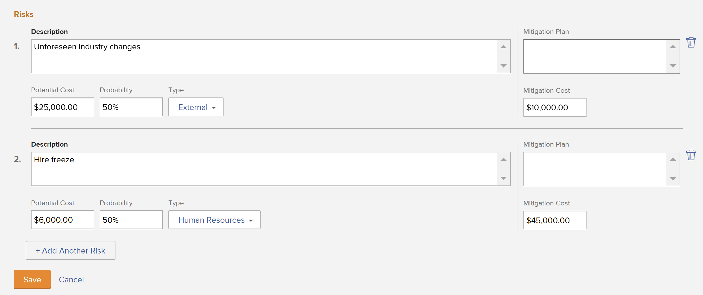

# Criar e editar riscos em projetos

<!--Audited: 01/2025-->

Os riscos são eventos ou fatores possíveis que impedem a conclusão de um projeto no prazo ou dentro do orçamento. Os riscos podem ser registrados como parte da criação do Business Case de um projeto ou usando a guia Riscos. Os riscos são criados somente em um projeto. Não é possível associar riscos a tarefas ou problemas.

Os riscos podem ser associados ao custo, mas o Custo Efetivo do Risco não afeta o Custo Efetivo do Projeto.

>[!NOTE]
>
>Este artigo define os riscos associados ao projeto à medida que você os define no Business Case do projeto ou à medida que os adiciona na guia Riscos do projeto. Para obter informações sobre o campo Risco disponível ao editar um projeto, consulte [Editar projetos](../../../manage-work/projects/manage-projects/edit-projects.md).

## Requisitos de acesso

Você deve ter o seguinte acesso para executar as etapas deste artigo:

+++ Expanda para visualizar os requisitos de acesso para a funcionalidade neste artigo.

<table style="table-layout:auto"> 
 <col> 
 <col> 
 <tbody> 
  <tr> 
   <td role="rowheader">plano do Adobe Workfront</td> 
   <td> 
Qualquer
 </td> 
  </tr> 
  <tr> 
   <td role="rowheader">Licença da Adobe Workfront*</td> 
   <td> 
Novo: Padrão 

   
Atual: Plano 
 </td> 
  </tr> 
  <tr> 
   <td role="rowheader">Configurações de nível de acesso</td> 
   <td> 
Editar acesso a Projetos e Dados Financeiros
 </td> 
  </tr> 
  <tr> 
   <td role="rowheader">Permissões de objeto</td> 
   <td> 
 Gerencie permissões que incluem Gerenciar finanças no projeto para o qual você deseja criar ou editar riscos 
 </td> 
  </tr> 
 </tbody> 
</table>

*Para obter informações, consulte [Requisitos de acesso na documentação do Workfront](/help/quicksilver/administration-and-setup/add-users/access-levels-and-object-permissions/access-level-requirements-in-documentation.md).

+++

## Criar e editar riscos no Business Case

Você pode criar riscos como parte do planejamento do Business Case de um projeto. Posteriormente, você pode editá-los no Business Case, quando ocorrerem alterações em sua probabilidade, plano de mitigação ou custo, por exemplo. Para obter informações sobre como criar um Business Case, consulte [Criar um Business Case para um projeto](../../../manage-work/projects/define-a-business-case/create-business-case.md).

O administrador do Workfront ou de grupo deve habilitar a seção **Riscos** no Business Case, na área Preferências do Projeto, antes que você possa exibi-lo no nível do projeto, na seção Business Case. Para obter informações sobre como definir preferências de projeto, consulte [Configurar preferências de projeto do sistema](../../../administration-and-setup/set-up-workfront/configure-system-defaults/set-project-preferences.md).

Criar e editar riscos no Business Case é idêntico.

Para criar ou editar um risco no Business Case:

1. Vá para o projeto para o qual deseja criar riscos.
1. Clique em **Business Case** no painel esquerdo.
1. Na seção **Riscos**, clique em **Editar Riscos**.
1. Insira ou edite as seguintes informações:

   * **Descrição:** descreva o risco.

   * **Custo Potencial**: indique o custo estimado se o risco ocorrer.

   * **Probabilidade**: indique a probabilidade do risco ocorrer como um valor percentual.

   * **Tipo:** indique a categoria em que o risco se enquadra.
   * **Plano de Mitigação**: atualize a descrição do plano para reduzir o risco.

   * **Custo de Mitigação**: indique o custo do plano de mitigação que você deve colocar em prática para evitar que o risco ocorra.

   

1. (Opcional) Clique em **Adicionar outro risco** para adicionar outros riscos.
1. Clique em **Salvar**.

## Criar e editar riscos na área Riscos

Além de criar e editar riscos no Business Case, você pode fazer isso usando a seção **Riscos** de um projeto.

* [Criar riscos na área Riscos](#create-risks-in-the-risks-area)
* [Editar riscos na área Riscos](#edit-risks-in-the-risks-area)

### Criar riscos na área Riscos {#create-risks-in-the-risks-area}

1. Vá para o projeto para o qual deseja criar riscos.
1. Clique em **Riscos** no painel esquerdo.

   

1. Clique em **Começar a adicionar riscos** e crie riscos editando suas informações em linha.

   Ou

   Clique em **Novo Risco**. A caixa de diálogo **Novo Risco** é aberta.

1. Insira as seguintes informações:

   * **Descrição**: descrever o risco.
   * **Tipo de Risco**: indicar a categoria em que o risco se enquadra.\
     O administrador do Workfront define os Tipos de risco disponíveis em seu ambiente. Para obter informações sobre como definir Tipos de Risco, consulte o artigo [Editar e criar tipos de risco](../../../administration-and-setup/set-up-workfront/configure-system-defaults/edit-create-risk-types.md).

   * **Probabilidade**: indique a probabilidade do risco ocorrer como um valor percentual.
   * **Custo Potencial**: indique o custo estimado se o risco ocorrer.
   * **Custo de Mitigação**: indique o custo do plano de mitigação que você deve colocar em prática para evitar que o risco ocorra.
   * **Custo Real**: indique o custo real do risco se ele tiver ocorrido.
   * **Plano de Mitigação**: atualize a descrição do plano para reduzir o risco.

1. (Condicional) Clique em **Enter** se estiver criando o risco embutido.

   Ou

   Clique em **Salvar** se estiver editando as informações na caixa de diálogo **Novo Risco**.

1. (Opcional) Selecione um **Status** diferente para o risco, no menu suspenso **Status**, ao aplicar a exibição **Padrão** para a lista de riscos.

   Por padrão, o Status de um risco é **Identificado**.

### Editar riscos na área Riscos {#edit-risks-in-the-risks-area}

É possível editar riscos durante a vida útil de um projeto, quando ocorrem alterações em sua probabilidade, custo potencial ou status, por exemplo.

É possível editar um risco de cada vez ou editar vários riscos em massa.

Para editar riscos:

1. Navegue até um projeto para o qual deseja editar os riscos existentes.
1. Clique em **Riscos** no painel esquerdo.
1. Inicie a edição em linha dos campos para os riscos que você vê na lista para editar um risco de cada vez.

   Ou

   Selecione um ou vários riscos e clique em **Editar** para editar vários riscos ao mesmo tempo.

   >[!NOTE]
   >
   >Você está aplicando as mesmas informações a todos os riscos selecionados ao editar vários riscos ao mesmo tempo. As informações associadas a cada risco antes das alterações são substituídas em uma edição em massa.

1. Se você clicou em **Editar**, a caixa de diálogo **Editar Risco** será aberta.

   Considere editar os seguintes campos:

   * **Descrição**: edite a descrição do risco.
   * **Tipo de Risco**: indicar a categoria em que o risco se enquadra.
   * **Probabilidade**: indique a probabilidade do risco ocorrer como um valor percentual.
   * **Custo Potencial**: indique o custo estimado se o risco ocorrer.
   * **Custo de Mitigação**: indique o custo do plano de mitigação que você deve colocar em prática para evitar que o risco ocorra.
   * **Custo Real**: indique o custo real do risco se ele tiver ocorrido.
   * **Plano de Mitigação**: atualize a descrição do plano para reduzir o risco.

1. Clique em **Salvar alterações**.
1. (Opcional) Edite o **Status** para um risco, no menu suspenso **Status**, ao aplicar a exibição **Padrão** para a lista de riscos.

   >[!NOTE]
   >
   >Não é possível editar o **Status** dos riscos na caixa de diálogo **Editar Risco**. Você só pode fazer isso em uma edição em linha.
