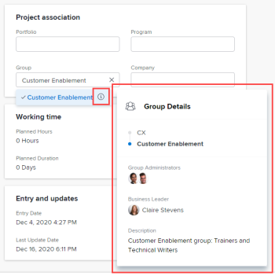
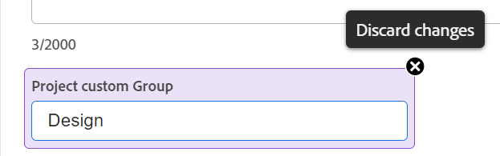

# Editar projetos

<!--Audited: 07/2024-->

<!--The highlighted information on this page refers to functionality not yet generally available. It is available only in the Preview environment for all customers. After the monthly releases to Production, the same features are also available in the Production environment for customers who enabled fast releases.    

For information about fast releases, see [Enable or disable fast releases for your organization](/help/quicksilver/administration-and-setup/set-up-workfront/configure-system-defaults/enable-fast-release-process.md).    -->

<!--

***Linked to many articles,

The Resource Pools part also duplicates in the "Working with Resource Pools" article 

The Update Type section is also documented in Selecting the Project Update Type article

Keep the reference link to the other article that also documents the Update Type) 

(NOTE 2: information described here also exists in these articles:

** Project Overview area

**Manage project Finance area

If you need to update just one field, check to see if that field is also listed there and update in both places.)

-->

Você pode editar um projeto no Adobe Workfront sempre que necessário. Recomendamos que você edite os projetos minimamente depois que seu status for alterado para Atual, para evitar confusão enviando notificações sobre as alterações para toda a equipe de projeto.

Idealmente, você deve editar um projeto quando ele estiver no status Planejando. Para obter informações sobre a equipe de criação, consulte [Visão geral da Equipe de Criação](../../../manage-work/projects/planning-a-project/project-team-overview.md).

## Requisitos de acesso

+++ Expanda para visualizar os requisitos de acesso para a funcionalidade neste artigo.

<table style="table-layout:auto"> 
 <col> 
 <col> 
 <tbody> 
  <tr> 
   <td role="rowheader">plano do Adobe Workfront</td> 
   <td> 
Qualquer
 </td> 
  </tr> 
  <tr> 
   <td role="rowheader">Licença da Adobe Workfront*</td> 
   <td>
Novo: Padrão 
 
   Ou
   
Atual: Plano 
 </td> 
  </tr> 
  <tr> 
   <td role="rowheader">Configurações de nível de acesso</td> 
   <td> 
Editar acesso a projetos
 </td> 
  </tr> 
  <tr> 
   <td role="rowheader">Permissões de objeto</td> 
   <td> 
     
Gerenciar permissões para um projeto 
 
     </td> 
  </tr> 
 </tbody> 
</table>

*Para obter mais detalhes sobre as informações nesta tabela, consulte [Requisitos de acesso na documentação da Workfront](/help/quicksilver/administration-and-setup/add-users/access-levels-and-object-permissions/access-level-requirements-in-documentation.md).

+++

## Limitações para editar projetos

Existem algumas limitações que podem impedir a edição de projetos.

Considere o seguinte ao editar projetos:

* Não é possível editar projetos que estejam em um Processo de Aprovação, exceto para registrar o tempo e alterar o Status.
* Você pode anexar documentos ou modelos a um projeto com status Concluído, Inativo ou Pendente de Aprovação somente se o administrador do Workfront ou um administrador de grupo tiver ativado essa funcionalidade na área Preferências do projeto. Para obter informações sobre como definir preferências de projeto, consulte [Configurar preferências de projeto do sistema](../../../administration-and-setup/set-up-workfront/configure-system-defaults/set-project-preferences.md).
* Você só pode editar as seguintes informações em um projeto com status Desativado ou Concluído:

   * Modificar despesas existentes.
   * Adicionar, remover ou editar formulários personalizados.

## Editar um projeto

Ao editar um projeto, você pode modificar as informações e configurações do projeto, bem como as tarefas e problemas do projeto.

Algumas configurações mencionadas neste artigo podem ser modificadas do status padrão pelo seu estado no template do qual o projeto foi criado.

Para obter informações sobre como editar modelos, consulte [Editar modelos de projeto](../../../manage-work/projects/create-and-manage-templates/edit-templates.md).

Para obter informações sobre como criar um projeto a partir de um modelo, consulte [Criar um projeto usando um modelo](/help/quicksilver/manage-work/projects/create-projects/create-project-from-template.md).

{{step1-to-projects}}

1. (Opcional) Clique em **Projetos dos quais sou proprietário** ou **Projetos dos quais sou proprietário** no canto superior direito para exibir projetos dos quais você é o proprietário ou projetos e dos quais você faz parte da equipe de criação.

   

   >[!NOTE]
   >
   >Se você for um administrador de grupo, poderá ver e editar os projetos do seu grupo na área Grupos e na área Projetos. Para obter mais informações, consulte [Criar e modificar projetos de um grupo](../../../administration-and-setup/manage-groups/work-with-group-objects/create-and-modify-a-groups-projects.md).

1. Clique no nome do projeto que deseja editar para abrir a página do projeto.

1. (Opcional) Para editar informações limitadas sobre um projeto, clique em **Detalhes do projeto** no painel esquerdo. Se quiser editar todas as informações sobre o projeto, prossiga para a Etapa 5. <!--accurate?!-->

   

   >[!NOTE]
   >
   >Dependendo de como o administrador do Workfront ou o administrador de Grupo modificou o Modelo de layout, os campos na área Detalhes do projeto podem ser reorganizados ou não ser exibidos. Para obter informações, consulte [Personalizar o modo de exibição de Detalhes usando um modelo de layout](../../../administration-and-setup/customize-workfront/use-layout-templates/customize-details-view-layout-template.md).

   Para editar informações na seção Detalhes, faça o seguinte:

   1. (Opcional) Clique no ícone **Recolher Tudo**  no canto superior direito para recolher todas as áreas.
   1. (Opcional e condicional) Quando uma área for recolhida, clique na **seta apontando para a direita**  ao lado de cada área para expandir a área que você deseja editar.
   1. Para obter mais informações sobre como editar informações na guia Detalhes do projeto, consulte os seguintes artigos:

      * [Gerenciar informações na área de Visão Geral do projeto](../../../manage-work/projects/manage-projects/understand-project-overview-area.md)
      * [Gerenciar informações na área de finanças do projeto](../../../manage-work/projects/project-finances/manage-project-finance-area.md)

   1. (Opcional) Para anexar um formulário personalizado, comece digitando o nome de um formulário no campo **Adicionar formulário personalizado**, selecione-o quando ele for exibido na lista e clique em **Salvar alterações**.
   1. (Opcional) Clique no ícone **Exportar**  para exportar as informações de Visão geral e formulários personalizados para um arquivo do PDF e clique em **Exportar**. Selecione entre as seguintes opções:

      * Selecionar tudo (é exibido somente quando há pelo menos um formulário personalizado anexado)
      * Visão geral
      * O nome de um ou vários formulários personalizados

      O arquivo PDF é baixado no computador.

      

      Para obter mais informações, consulte [Exportar detalhes de formulários e objetos personalizados](../../../workfront-basics/work-with-custom-forms/export-custom-forms-details.md).

   Para obter informações sobre os campos visíveis na seção Detalhes do projeto, continue editando o projeto na caixa Editar projeto, conforme descrito abaixo.
1. Para editar todas as informações sobre o projeto, clique no menu **Mais**  ao lado do nome do projeto e clique em **Editar**.

   Ou

   Em uma lista de projetos, selecione um ou vários projetos e clique no **ícone Editar**  na parte superior da lista.

   Para obter mais informações sobre como editar projetos em massa, consulte a seção [Editar projetos em massa](#edit-projects-in-bulk) neste artigo.

   A caixa **Editar Projeto** é aberta.

   >[!IMPORTANT]
   >
   >Você deve ter Permissões de gerenciamento no projeto para ver a opção Editar.

   Todos os campos de projeto estão disponíveis na caixa Editar projeto e são agrupados pelas áreas listadas no painel esquerdo.

   >[!NOTE]
   >
   >Dependendo de como o administrador do Workfront ou do Administrador de grupo modificou o Modelo de layout, as áreas no painel esquerdo da caixa Editar projeto ou quaisquer campos listados nessas áreas podem ser reorganizados ou não serão exibidos. Para obter informações, consulte [Personalizar o modo de exibição de Detalhes usando um modelo de layout](../../../administration-and-setup/customize-workfront/use-layout-templates/customize-details-view-layout-template.md).

1. (Condicional) Se você clicou no menu **Mais** e depois em **Editar**, atualize as informações em qualquer uma das seguintes áreas listadas no painel esquerdo:

   * [Nome do projeto](#project-name)
   * [Visão geral](#overview)
   * [Formulários personalizados](#custom-forms)
   * [Finanças](#finance)
   * [Configurações do projeto](#project-settings)
   * [Configurações da tarefa](#task-settings)
   * [Configurações de Problema](#issue-settings)
   * [Acesso](#access)
   * [Pastas vinculadas](#linked-folders-conditional-availability) (disponibilidade condicional)
     <!--* [Comment](#comment)-->

   >[!NOTE]
   >
   >Dependendo de como o administrador do Workfront configura nosso Modelo de layout para a área Detalhes do projeto, as seções e os campos na caixa Editar projeto podem ser diferentes em seu ambiente. Para obter informações, consulte [Personalizar o modo de exibição de Detalhes usando um modelo de layout](../../../administration-and-setup/customize-workfront/use-layout-templates/customize-details-view-layout-template.md).

### Nome do Projeto {#project-name}

1. Comece a editar seu projeto conforme descrito acima.
1. Clique em **Nome do projeto** no painel esquerdo.

   

1. Atualize o nome do projeto.

   Não é possível editar o nome do projeto ao editar projetos em massa.

### Visão geral {#overview}

1. Comece a editar seu projeto conforme descrito acima.
1. Clique em **Visão geral** no painel esquerdo.

   

1. Atualize as seguintes informações sobre o projeto:

   <table style="table-layout:auto"> 
      <col> 
      <col> 
      <tbody> 
      <tr> 
         <td role="rowheader"><strong>Descrição</strong> </td> 
         <td> 
Inclua informações adicionais sobre o projeto.
 </td> 
      </tr> 
      <tr> 
         <td role="rowheader"><strong>Status</strong> </td> 
         <td> 
Selecione o status do projeto. Não é possível marcar um projeto como Concluído antes que todas as tarefas e problemas sejam concluídos. Para obter informações sobre status de projeto, consulte <a href="../../../administration-and-setup/customize-workfront/creating-custom-status-and-priority-labels/project-statuses.md" class="MCXref xref">Acessar a lista de status de projeto do sistema</a>
 </td> 
      </tr> 
      <tr> 
         <td role="rowheader"><strong>Prioridade</strong> </td> 
         <td> 
 
Este é apenas um sinalizador visual para você que permite priorizar seus projetos.
 
Dependendo das Preferências do projeto selecionadas pelo administrador do Workfront, os nomes das prioridades podem ser diferentes para você. Para obter mais informações sobre como editar prioridades, consulte <a href="../../../administration-and-setup/customize-workfront/creating-custom-status-and-priority-labels/create-customize-priorities.md" class="MCXref xref">Criar e personalizar prioridades</a>
 
 </td> 
      </tr> 
      <tr> 
         <td role="rowheader"><strong>URL</strong> </td> 
         <td> 
Especifique um link da Web relacionado às informações sobre este projeto.
 </td> 
      </tr> 
      <tr> 
         <td role="rowheader"><strong>Tipo de Condição</strong> </td> 
         <td> 
Selecione entre os seguintes Tipos de Condição: 
         <ul> 
         <li><strong>Manual:</strong> o proprietário do projeto define a condição no projeto manualmente.</li> 
         <li><strong>Status do Progresso:</strong> O Workfront define automaticamente a condição com base no Status do Progresso das tarefas no Caminho Crítico. Para obter mais informações sobre como entender o Status de Progresso, consulte <a href="../../../manage-work/tasks/task-information/task-progress-status.md" class="MCXref xref">Visão geral do Status de Progresso da Tarefa</a>.</li> 
         </ul>
O administrador do Workfront ou um administrador de grupo seleciona o padrão de como a condição dos projetos é calculada para o seu sistema ou grupo. Para obter informações sobre como definir padrões de projeto, consulte <a href="../../../administration-and-setup/set-up-workfront/configure-system-defaults/set-project-preferences.md" class="MCXref xref">Configurar preferências de projeto do sistema</a>. 

 </td> 
      </tr> 
      <tr> 
         <td role="rowheader"><strong>Condição</strong> </td> 
         <td> 
 
(Exibido somente depois que você selecionar <strong>Manual</strong> para o <strong>Tipo de Condição</strong>): selecione uma Condição para indicar como o projeto está indo. 
 
Para obter informações sobre como as Condições do projeto podem ser definidas automática ou manualmente, consulte <a href="../../../manage-work/projects/manage-projects/project-condition-and-condition-type.md" class="MCXref xref">Visão Geral da Condição do Projeto e do Tipo de Condição</a>
 
 </td> 
      </tr> 
      <tr> 
         <td role="rowheader"><strong>Modo de cronograma</strong> </td> 
         <td> 
Especifique se o projeto está agendado a partir da Data inicial ou da Data de conclusão. Essa seleção determina as datas planejadas das tarefas no projeto. 
         <ul> 
         <li><strong>Data de Início</strong>: a primeira tarefa do projeto tem a mesma Data de Início Planejada que o projeto por padrão. Para obter informações sobre a Data de Início Planejada da tarefa, consulte <a href="../../../manage-work/tasks/task-information/task-planned-start-date.md" class="MCXref xref">Visão Geral da Data de Início Planejada da tarefa</a>. O cronograma do projeto é calculado a partir da Data inicial e a Data de conclusão do projeto é calculada pelo sistema, com base na duração de todas as tarefas. </li> 
         <li><strong>Data de conclusão</strong>: a última tarefa do projeto tem a mesma Data de conclusão planejada que o projeto. A linha do tempo do projeto é calculada a partir da Data de conclusão e a Data inicial do projeto é calculada pelo sistema, subtraindo a duração de todas as tarefas da Data de conclusão do projeto. </li> 
         </ul>
O administrador do Workfront ou um administrador de grupo seleciona a configuração padrão Modo de Agendamento para o seu sistema ou grupo. Para obter informações sobre como definir padrões de projeto, consulte <a href="../../../administration-and-setup/set-up-workfront/configure-system-defaults/set-project-preferences.md" class="MCXref xref">Configurar preferências de projeto do sistema</a>.

 </td> 
      </tr> 
      <tr> 
         <td role="rowheader"><strong>Data e hora de início planejadas</strong> </td> 
         <td> 
 
Especifique a data ao selecionar <strong>Agendar a Partir da Data de Início</strong>.  
 
Este campo é somente leitura quando você seleciona <strong>Agendar a partir da Data de Término</strong>. 
 
 </td> 
      </tr> 
      <tr> 
         <td role="rowheader"><strong>Data e hora de conclusão planejadas</strong> </td> 
         <td> 
Especifique a data ao selecionar <strong>Agendar a partir da Data de Término</strong>. 
 
Este campo é somente leitura quando você seleciona <strong>Agendar a partir da Data de Início</strong>. 
 </td> 
      </tr> 
      <tr> 
         <td role="rowheader"><strong>Portfólio</strong></td> 
         <td>Indique uma Portfolio à qual o projeto pertence. Você deve criar um Portfolio primeiro, antes que ele apareça na lista suspensa. Somente portfólios ativos podem ser associados a um projeto. Para obter mais informações sobre como criar portfólios, consulte <a href="../../../manage-work/portfolios/create-and-manage-portfolios/create-portfolios.md" class="MCXref xref">Criar um portfólio </a>.
         
<b>Nota</b>

         
Você deve ter permissões de gerenciamento no portfólio para poder adicioná-lo ou removê-lo do projeto.

      </td> 
      </tr> 
      <tr> 
         <td role="rowheader"><strong>Programa</strong></td> 
         <td> 
Se você selecionou um Portfolio para o projeto, especifique um Programa para o projeto. Alguns portfólios podem não ter programas. Você deve criar um Programa primeiro, antes que ele apareça nesta lista suspensa. Somente programas ativos podem ser associados a um projeto. 
 
Para obter mais informações sobre como criar programas, consulte <a href="../../../manage-work/portfolios/create-and-manage-programs/create-program.md" class="MCXref xref">Criar um programa</a>.
 
      
<b>Nota</b>

         
Você deve ter permissões de gerenciamento no programa para poder adicioná-lo ou removê-lo no projeto.
   
      </td> 
      </tr> 
      <tr> 
         <td role="rowheader"><strong>Grupo</strong></td> 
         <td> 
 
Especifique o nome do grupo associado ao projeto. 
Este campo é obrigatório. Você não pode ter um projeto que não esteja associado a um grupo. 
 
Você pode verificar se está selecionando o grupo correto passando o cursor do mouse sobre ele e clicando no ícone de informações  que é exibido ao lado dele. Uma dica de ferramenta que lista informações sobre o grupo, como a hierarquia de grupos acima dele e seus administradores.
 Por padrão, um dos grupos a seguir é associado automaticamente a um projeto quando ele é criado, a menos que você especifique um grupo diferente:
 
         <ul> 
         <li> 
Quando o projeto é criado a partir da área Projetos, o Grupo Padrão do criador do projeto é associado ao projeto. 
 
Isso também ocorre quando o projeto é criado a partir da seção Projetos em um portfólio ou programa.
 </li> 
         <li> 
Quando o projeto é criado a partir da página principal de um grupo na área Configuração, esse grupo é associado ao projeto.
 </li> 
         </ul> 
 
  
 
         
<b>NOTAS</b>

         <ul>
         <li>
Se o projeto, suas tarefas ou problemas estiverem associados a um status personalizado em nível de grupo, alterar o Grupo do projeto pode fazer com que o Status do projeto, das tarefas ou dos problemas seja alterado para corresponder ao novo grupo.
</li>
         <li>
Se o projeto, suas tarefas ou problemas já estiverem associados a um processo de aprovação em nível de grupo usando status personalizados em nível de grupo, alterar o grupo pode criar um conflito entre os status de aprovação do grupo anterior e os existentes no nível do sistema.

         
Considere remover os processos de aprovação em nível de grupo no projeto, ou suas tarefas ou problemas, antes de atualizar o grupo.

         
Para obter informações sobre como criar processos de aprovação de nível de grupo, consulte <a href="../../../administration-and-setup/manage-groups/work-with-group-objects/create-and-modify-groups-approval-processes.md" class="MCXref xref">Processos de aprovação de nível de grupo</a>.

         
Para obter informações sobre como criar um status personalizado em nível de grupo, consulte <a href="../../../administration-and-setup/manage-groups/manage-group-statuses/create-or-edit-a-group-status.md" class="MCXref xref">Criar ou editar um status de grupo</a>
</li></ul> </td> 
      </tr> 
      <tr> 
         <td role="rowheader"><strong>Empresa</strong> </td> 
         <td> 
Especifique uma empresa associada ao projeto. Você deve criar uma empresa antes de associá-la a um projeto. Somente empresas ativas podem ser associadas a um projeto. Para obter informações sobre como criar empresas, consulte <a href="../../../administration-and-setup/set-up-workfront/organizational-setup/create-and-edit-companies.md" class="MCXref xref">Criar e editar empresas</a>.
 </td> 
      </tr> 
      <tr> 
         <td role="rowheader"><strong>Proprietário do projeto</strong> </td> 
         <td> 
Comece digitando o nome de um usuário para adicioná-lo ao projeto e, em seguida, selecione-o quando ele for exibido na lista. O usuário é adicionado à equipe do projeto e recebe automaticamente permissões de gerenciamento para o projeto. O usuário designado como Proprietário do projeto deve ser um usuário ativo do Workfront.

         </td> 
      </tr> 
      <tr> 
         <td role="rowheader"><strong>Patrocinador do projeto</strong> </td> 
         <td> 
Comece digitando o nome de um usuário para adicioná-lo ao projeto e, em seguida, selecione-o quando ele for exibido na lista. O usuário é adicionado à equipe do projeto e recebe automaticamente permissões de Exibição para o projeto. O usuário designado como Patrocinador do projeto deve ser um usuário ativo do Workfront. 
 </td> 
      </tr> 
      <tr> 
         <td role="rowheader"><strong>Gerenciador de Recursos</strong> </td> 
         <td> 
 Comece digitando os nomes dos usuários para adicioná-los ao projeto e, em seguida, selecione-os quando eles forem exibidos na lista. Os usuários são adicionados à equipe do projeto e recebem automaticamente permissões de Gerenciamento para o projeto e podem atribuir recursos às tarefas e problemas no projeto. Os usuários mantêm permissões de Gerenciamento no projeto mesmo quando são removidos do campo Gerenciador de recursos. Você pode especificar mais de um Gerenciador de recursos. 
 </td> 
      </tr>

   <tr> 
         <td role="rowheader"><strong>Originador de Problema Convertido</strong> </td> 
         <td> 
 Por padrão, esse campo é preenchido automaticamente com o nome do usuário que criou o problema do qual o projeto foi convertido. Você pode atualizar esse nome com qualquer outro nome de usuário no Workfront.  
 </td> 
      </tr>

   </tbody> 
      </table>

   >[!TIP]
   >
   >Ao atualizar os campos Proprietário do projeto, Patrocinador do projeto e Gerente de recursos, observe o avatar, a Função principal do usuário ou o endereço de email dele para distinguir entre usuários com nomes idênticos.
   >
   >Os usuários devem ser associados a pelo menos uma função de trabalho para visualizá-la à medida que forem adicionados.
   >
   >Você deve ter a configuração Exibir informações de contato ativada no seu nível de acesso para que os usuários visualizem os emails dos usuários. Para obter informações, consulte [Conceder acesso aos usuários](../../../administration-and-setup/add-users/configure-and-grant-access/grant-access-other-users.md).

1. (Opcional) Continue editando as seções a seguir, dependendo das informações que você deseja modificar

   Ou

   Clique em **Salvar**.

### Formulários personalizados {#custom-forms}

Dependendo do seu nível de acesso e da sua permissão no projeto, os seguintes cenários existem:

* Se você não tiver permissões Editar formulário personalizado no projeto, não poderá editar os campos em nenhum dos formulários personalizados anexados. Você só pode exibir os campos nos formulários personalizados anexados ao projeto.
* Se você tiver acesso de Visualização (e não de Edição) a uma seção em um formulário personalizado, não poderá editar os campos nessa seção.
* Se você não tiver acesso a uma seção em um dos formulários personalizados anexados ao projeto, a seção não será exibida na caixa Editar projeto.

Ao selecionar mais de um projeto para editá-los em massa, os seguintes cenários existem:

* Se você não tiver permissões Editar formulário personalizado em pelo menos um dos projetos selecionados, não poderá editar os campos em nenhum dos formulários personalizados anexados. Você só pode exibir os campos nos formulários personalizados anexados
* Se você tiver acesso de Visualização (e não de Edição) a uma seção em um formulário personalizado, não poderá editar os campos nessa seção. Você só pode exibir os campos nessa seção.
* Se você não tiver acesso a uma seção em um dos formulários personalizados anexados a pelo menos um dos projetos, a seção não será exibida na caixa Editar projetos.
* Se você tiver campos obrigatórios em qualquer um dos formulários personalizados anexados a todos os projetos e selecionar um campo sem editá-lo, descarte as alterações nesse campo ou adicione informações a ele antes de salvar os projetos selecionados. Se você não selecionar um campo obrigatório, poderá salvar os projetos selecionados mesmo se o campo obrigatório estiver em branco.

Para obter informações sobre o acesso a formulários personalizados, consulte os seguintes artigos:

* [Compartilhar um formulário personalizado](../../../administration-and-setup/customize-workfront/create-manage-custom-forms/share-access-to-a-custom-form.md)
* [Organizar e visualizar um formulário](/help/quicksilver/administration-and-setup/customize-workfront/create-manage-custom-forms/form-designer/design-a-form/organize-a-form.md)

Para editar informações sobre formulários personalizados ao editar um projeto:

1. Comece a editar seu projeto conforme descrito acima.
1. Clique em **Forms Personalizado** no painel esquerdo.

   

1. Clique na caixa **Adicionar formulário personalizado** e selecione um formulário na lista para anexá-lo ao projeto. Por padrão, os primeiros 40 formulários são exibidos em ordem alfabética. Se você não vir o formulário na lista, comece digitando o nome dele, em seguida, selecione-o quando ele aparecer na lista.

   >[!NOTE]
   >
   >Você deve criar os formulários personalizados antes que eles estejam disponíveis para seleção neste campo. Somente formulários personalizados ativos são exibidos na lista. Para obter mais informações sobre a criação de formulários personalizados, consulte [Criar um formulário personalizado](/help/quicksilver/administration-and-setup/customize-workfront/create-manage-custom-forms/form-designer/design-a-form/design-a-form.md). Você pode adicionar até dez formulários personalizados a um projeto.

1. (Condicional) Se você anexou um formulário personalizado ao projeto, edite os campos no formulário. Você deve especificar todos os campos obrigatórios antes de salvar o projeto.
1. (Opcional) Clique no ícone **X** à direita do nome de um formulário personalizado para removê-lo e clique em **Remover**.
1. (Opcional) Continue editando as seções a seguir, dependendo das informações que você deseja modificar

   Ou

   Clique em **Salvar**.

### Finanças {#finance}

Dependendo do seu nível de acesso e da sua permissão no projeto, os seguintes cenários existem:

* Se você tiver o acesso de Visualização de Dados Financeiros e permissões de Visualização de Finanças no projeto, poderá apenas visualizar os campos na seção de Finanças. Não é possível editar os campos nesta seção.
* Se você tiver acesso para Editar aos Dados Financeiros e Gerenciar Finanças no projeto, poderá atualizar os campos desta seção.

Ao selecionar mais de um projeto para editá-los em massa e no, os seguintes cenários existem:

* Se você selecionar pelo menos um projeto no qual tenha permissões de Exibir finanças (em vez de Gerenciar finanças), poderá exibir somente os campos desta seção para todos os projetos selecionados. Não é possível editar os campos em massa na seção Finanças.
* Se você selecionar pelo menos um projeto sem permissões financeiras, esta seção não será exibida.

Para editar campos na área Finanças:

1. Comece a editar seu projeto conforme descrito acima.
1. Clique em **Finanças** no painel esquerdo.

   

1. Atualize as seguintes informações financeiras do projeto:

   <table style="table-layout:auto"> 
    <col> 
    <col> 
    <tbody> 
     <tr data-mc-conditions=""> 
      <td role="rowheader"><strong>Moeda</strong> </td> 
      <td> 
 
Especifique a moeda do projeto, se for diferente da moeda padrão do sistema. Não é possível alterar a moeda de um projeto se já houver informações financeiras sobre o projeto. Esse campo não estará visível se você só tiver a moeda padrão no sistema. 
 
Para obter mais informações sobre moeda, consulte <a href="../../../administration-and-setup/manage-workfront/exchange-rates/set-up-exchange-rates.md" class="MCXref xref">Configurar taxas de câmbio</a>. 
 
 </td> 
     </tr> 
     <tr> 
      <td role="rowheader"><strong>Orçamento</strong> </td> 
      <td> Especifique um Orçamento para o projeto. </td> 
     </tr> 
     <tr> 
      <td role="rowheader"><strong>Método de Índice de Desempenho</strong> </td> 
      <td> 
Selecione <b>Baseado em Hora</b> ou <b>Baseado em Custo</b> para indicar se as métricas de Valor Agregado do projeto (como Índice de Desempenho de Custo ou Custo Efetivo Estimado) são calculadas usando horas ou custos. 
 
Para obter mais informações sobre o Método de Índice de Desempenho, consulte <a href="../../../manage-work/projects/project-finances/set-pim.md" class="MCXref xref">Definir o PIM (Método de Índice de Desempenho)</a>. 
 
O administrador do Workfront  ou um administrador de grupo  seleciona a configuração padrão Método de Índice de Desempenho para o seu sistema ou grupo. Para obter informações sobre como definir padrões de projeto, consulte <a href="../../../administration-and-setup/set-up-workfront/configure-system-defaults/set-project-preferences.md" class="MCXref xref">Configurar preferências de projeto do sistema</a>.
 </td> 
     </tr> 
     <tr> 
      <td role="rowheader"><strong>Estimativa na Conclusão</strong> </td> 
      <td> 
 
Especifique como o Workfront deve calcular a EAC (Estimativa no Término). 

      Selecione entre as seguintes opções: 
      <ul><li><b>Calcular no nível do projeto</b></li>
      <li><b>Extrair de tarefas/subtarefas</b></li> </ul>
      
Para obter mais informações sobre como é calculada a EAC (Estimativa no término) <a href="../../../manage-work/projects/project-finances/calculate-eac.md" class="MCXref xref">Calcular a EAC (Estimativa no término)</a>.
 
O administrador do Workfront ou do grupo seleciona a configuração padrão Estimar na conclusão para o seu sistema ou grupo. Para obter informações sobre como definir padrões de projeto, consulte <a href="../../../administration-and-setup/set-up-workfront/configure-system-defaults/set-project-preferences.md" class="MCXref xref">Configurar preferências de projeto do sistema</a>.
 
 </td> 
     </tr> 
     <tr> 
      <td role="rowheader"><strong>Benefício Planejado</strong> </td> 
      <td> 
Estime qual é o benefício planejado do projeto. Isso é usado no Business Case do projeto e no Portfolio Otimizer. Para obter mais informações sobre o Benefício Planejado de um projeto, consulte <a href="../../../manage-work/projects/project-finances/project-planned-benefit.md" class="MCXref xref">Visão Geral do Benefício Planejado do projeto</a>. O Benefício Planejado de um projeto é considerado quando o Valor Líquido de um projeto é calculado. 
 
Para obter mais informações, consulte <a href="../../../manage-work/portfolios/portfolio-optimizer/manage-projects-in-portfolio-optimizer.md" class="MCXref xref">Gerenciar projetos no Portfolio Otimizer</a>. 
 </td> 
     </tr> 
     <tr> 
      <td role="rowheader"><strong>Benefício Efetivo</strong> </td> 
      <td> 
Estimativa do Benefício Efetivo do projeto. Esse é um valor na moeda que representa o benefício que sua empresa ou departamento ganharia após a conclusão desse projeto. 
 </td> 
     </tr> 
      <tr> 
      <td role="rowheader"><strong>Custo Fixo</strong> </td> 
      <td> 
Especifique o Custo Fixo do projeto. Isso é diferente do Custo de mão de obra que vem das horas no projeto e do Custo de despesa que vem da quantidade de despesas no projeto. O Custo Fixo de um projeto é considerado ao calcular o Valor Líquido de um projeto e faz parte do Custo Orçado. 
 </td> 
     </tr> 
     <tr> 
      <td role="rowheader"><strong>Receita fixa</strong> </td> 
      <td> 
Especifique a Receita Fixa do projeto. 
 </td> 
     </tr> 
    </tbody> 
   </table>

1. (Opcional) Continue editando as seções a seguir, dependendo das informações que você deseja modificar.

   Ou

   Clique em **Salvar**.

### Parâmetros do projeto {#project-settings}

1. Comece a editar seu projeto conforme descrito acima.
1. Clique em **Configurações do projeto** no painel esquerdo.

   

1. Atualize as seguintes informações:

   <table style="table-layout:auto"> 
      <col> 
      <col> 
      <tbody> 
      <tr> 
      <td role="rowheader"><strong>Caminho de Etapas</strong> </td> 
       <td> 
Selecione um Caminho de Etapas para o projeto. Somente os caminhos de etapas ativos são exibidos na lista.
 
Para obter mais informações sobre Caminhos de Etapas, consulte <a href="../../../administration-and-setup/customize-workfront/configure-approval-milestone-processes/create-milestone-path.md" class="MCXref xref">Criar um caminho de etapas</a>.
 </td> 
      </tr> 
      <tr> 
      <td role="rowheader"><strong>Modo de conclusão</strong> </td> 
      <td> 
Controla como o projeto é marcado como Concluído. Selecione entre as seguintes opções: 
       <ul> 
       <li>
<strong>Automático</strong>: o projeto é marcado como Concluído quando todas as tarefas e problemas são concluídos.

O status do projeto é alterado automaticamente para Concluído somente quando o status do projeto é Atual quando as tarefas são concluídas. 
</li> 
       <li><strong>Manual</strong>: você precisa selecionar manualmente o status Concluído para o projeto quando todas as tarefas e problemas forem concluídos.</li> 
       </ul>
 </td> 
       </tr> 
       <tr> 
       <td role="rowheader"><strong>Modo de conclusão em resumo</strong></td> 
       <td> 
Controla como as tarefas pai são marcadas como Concluídas. Selecione entre as seguintes opções: 
       <ul> 
       <li><strong>Automático</strong>: as tarefas pai estão marcadas como Concluídas e atualizam sua porcentagem concluída automaticamente, à medida que as tarefas filho são concluídas e a porcentagem concluída dos filhos é atualizada. </li> 
       <li><strong>Manual</strong>: você precisa atualizar manualmente a porcentagem concluída e o status das tarefas pai, independentemente de quais alterações são feitas nas tarefas filho. Isso permite marcar uma tarefa pai como concluída mesmo quando as subtarefas estão incompletas. </li> 
       </ul>
 </td> 
       </tr> 
       <tr> 
       <td role="rowheader"><strong>Tipo de atualização</strong></td> 
       <td> 
Controla quando as alterações feitas na linha do tempo do projeto são salvas no projeto ou nas tarefas pai. Por exemplo, as seguintes alterações no projeto acionam uma atualização na linha do tempo do projeto: 
       <ul> 
       <li>Atualizar as datas das tarefas</li> 
       <li>Alterar relações predecessoras de tarefas</li> 
       <li>
Alterar relações pai-filho, adicionando ou removendo atribuições, além de alterar a restrição ou o tipo de duração da tarefa.

Quando as tarefas são atualizadas, seus objetos principais (tarefas principais ou o projeto) são atualizados no momento indicado pelo Tipo de Atualização. 

Se os objetos pai não forem atualizados imediatamente após a alteração ao selecionar "Automático e Ao Alterar" ou "Alterar Somente" Tipo de Atualização, atualize a página

Selecione entre as seguintes opções: 

- <strong>Automático e Mediante alteração</strong> (Configuração padrão): a linha do tempo do projeto é atualizada sempre que ocorre uma alteração no projeto ou em outro projeto do qual o projeto depende (Mediante alteração). A linha do tempo do projeto também é atualizada todas as noites (Automático).

Essa é a configuração recomendada para esse campo porque garante que o projeto esteja sempre atualizado.

Quando você executa uma ação em uma tarefa ou projeto que aciona um recálculo de linha do tempo, todas as datas disponíveis são exibidas imediatamente, permitindo que você continue trabalhando. Em projetos com mais de 100 tarefas, as datas que exigem recálculos mais longos são exibidas brevemente como um ponto de interrogação (entre 1 e 5 segundos ou até um minuto para projetos grandes). Isso indica que o recálculo ainda não foi concluído e as datas estão sujeitas a alterações.

- <strong>Somente Alteração</strong>: a linha de tempo do projeto é atualizada sempre que ocorre uma alteração no projeto ou em outro projeto do qual o projeto depende. Você pode selecionar essa opção se alterações raramente ocorrerem no projeto ou em outros projetos dos quais a linha do tempo depende.

- <strong>Somente Automático</strong>: a linha do tempo do projeto é atualizada todas as noites; a linha do tempo não é atualizada imediatamente após as alterações serem feitas.

Você pode selecionar essa opção se muitas alterações ocorrerem todos os dias no projeto ou em outros projetos dos quais a linha do tempo depende. No entanto, lembre-se de que você escolheu essa configuração, pois o projeto não será atualizado ao mesmo tempo em que as alterações são feitas.

- <strong>Somente manual</strong>: a linha do tempo do projeto é atualizada somente quando você seleciona a opção Recalcular Linha do Tempo. Para obter mais informações sobre o recálculo manual da linha de tempo do projeto, consulte <a href="../../../manage-work/projects/manage-projects/recalculate-project-timeline.md" class="MCXref xref">Recalcular linhas de tempo do projeto</a>. 

Você pode selecionar essa opção se estiver fazendo muitas alterações ao projeto de uma vez e quiser que o recálculo da linha do tempo ocorra após todas as alterações terem sido feitas (em vez de após cada alteração individual).
</li> 
       </ul>
 </td> 
       </tr> 
       <tr> 
       <td role="rowheader"><strong>Agendar</strong> </td> 
       <td> 
Selecione um cronograma para o seu projeto. Deve ser o mesmo agendamento atribuído à maioria das pessoas que estão trabalhando no projeto. Você deve criar um cronograma antes de atribuí-lo a um projeto ou usuário. Se você não tiver criado agendamentos personalizados em seu sistema, o Agendamento padrão será selecionado.
 
Para obter mais informações sobre como criar agendas, consulte <a href="../../../administration-and-setup/set-up-workfront/configure-timesheets-schedules/create-schedules.md" class="MCXref xref">Criar uma agenda</a>. 
 </td> 
       </tr> 
       <tr> 
       <td role="rowheader"><strong>Tempo de folga do usuário</strong> </td> 
       <td> 
Determina se o tempo de folga do Destinatário principal de uma tarefa ajusta as datas planejadas da tarefa no projeto. 

O administrador do Workfront ou um administrador de grupo seleciona o padrão para esta configuração para seu sistema ou seu grupo. Para obter informações sobre como definir padrões de projeto, consulte <a href="../../../administration-and-setup/set-up-workfront/configure-system-defaults/set-project-preferences.md" class="MCXref xref">Configurar preferências de projeto do sistema</a>. 

Selecione entre as seguintes opções: - <strong>Considere o tempo de folga do usuário nas durações da tarefa</strong>: ao selecionar esta opção, as datas planejadas das tarefas se ajustam de acordo com o tempo de folga do Atribuidor principal da tarefa, se o tempo de folga ocorrer durante a duração da tarefa. 

Por exemplo, se uma tarefa com uma restrição O Mais Breve Possível estiver programada para iniciar em 1º de junho e terminar em 3 de junho, e o Destinatário principal tiver 2 de junho marcado para Folga, quando essa seleção estiver ativada, as datas planejadas da tarefa serão de 1º de junho a 4 de junho. Dependendo da Restrição da Tarefa, existem os seguintes cenários: 
 
       <ul> 
       <li>Para restrições de tarefa relacionadas ao planejamento a partir de uma data inicial (Assim que Possível, Primeiro Horário Disponível, Não Iniciar Antes De, Não Iniciar Depois De, Deve Iniciar Em), a Data Inicial Planejada não é alterada, mas a Data de Conclusão Planejada é alterada.</li> 
       <li>Para restrições de tarefa relacionadas ao planejamento a partir de uma data de conclusão (O Mais Tarde Possível, Último Tempo Disponível, Não Terminar Antes De, Não Terminar Depois De, Deve Terminar Em), a Data de Conclusão Planejada não é alterada, mas a Data Inicial Planejada é alterada.</li> 
       <li>Para tarefas com uma restrição de Datas Fixas, nem a Data de Início Planejada nem a Data de Conclusão são alteradas. </li> 
       </ul>
A duração da tarefa não é alterada ao selecionar essa configuração. Somente as datas planejadas mudam, dependendo da Restrição da Tarefa. Para obter informações sobre a restrição da tarefa, consulte <a href="../../../manage-work/tasks/task-constraints/task-constraint-overview.md" class="MCXref xref">Visão geral da Restrição da Tarefa</a>. 

- <strong>Ignorar o tempo de folga do usuário nas durações de tarefa</strong>: ao selecionar esta opção, as datas planejadas das tarefas no projeto permanecem como planejadas originalmente, mesmo que o Principal Atribuidor da tarefa tenha um tempo de folga durante a duração da tarefa. 

Considere o seguinte ao selecionar opções para essa configuração:
 
       <ul> 
       <li>
A opção padrão para essa configuração para um novo projeto é a mesma que a preferência de projeto no nível do sistema. 

Para obter informações sobre as preferências do projeto no nível do Sistema, consulte <a href="../../../administration-and-setup/set-up-workfront/configure-system-defaults/set-project-preferences.md" class="MCXref xref">Configurar preferências do projeto do sistema</a>. 
</li> 
       <li>Ao anexar um modelo a um projeto existente, a configuração no projeto é atualizada para corresponder à do modelo. </li> 
       <li>
O Workfront decide quais datas da tarefa planejada ajustar de acordo com o valor de Restrição da Tarefa da tarefa. Dependendo do que for, o Início planejado ou a Data de conclusão planejada, ou ambos, podem ser afetados ou podem até permanecer os mesmos. Por exemplo, se uma tarefa tiver uma Restrição de Datas Fixas, as datas não são ajustadas quando o Destinatário Principal tem folga, mesmo quando <strong>Considerar folga do usuário nas durações da tarefa</strong> é selecionado. 
</li> 
       </ul></td> 
      </tr> 
      <tr> 
       <td role="rowheader"><strong>Modo de Nivelamento de Recursos</strong> </td> 
       <td> 
 
Selecione entre as seguintes opções:
 
- <strong>Manual</strong>: você deve nivelar manualmente seus recursos (esta é a configuração padrão)
 
- <strong>Automático</strong>: o Workfront nivela seus recursos.
 
Para obter mais informações sobre o Nivelamento de Recursos, consulte <a href="../../../manage-work/gantt-chart/use-the-gantt-chart/level-resources-in-gantt.md" class="MCXref xref">Nivelar Recursos no Gráfico de Gantt </a>.
 
 </td> 
      </tr> 
      <tr> 
       <td role="rowheader"><strong>Risco</strong> </td> 
       <td> 
 
Defina o nível de risco do seu projeto. O risco é apenas um indicador do quão arriscado um projeto pode ser. Você pode priorizar a execução de seus projetos com base no nível de risco.
 
 
Considere selecionar entre os seguintes níveis de risco:
 
- Muito Baixo
 
- Baixa
 
- MEDIUM
 
- Alta
 
- Muito Alto
 
Os níveis de riscos que você indicar aqui não podem ser personalizados.
 
Eles não estão relacionados aos riscos potenciais que podem ocorrer durante a vida de um projeto e que você deve registrar na guia Riscos do projeto ou no Business Case. Para obter informações sobre riscos de projeto em potencial, consulte <a href="../../../administration-and-setup/set-up-workfront/configure-system-defaults/edit-create-risk-types.md" class="MCXref xref">Editar e criar tipos de risco</a>. 
 
 
 </td> 
      </tr> 
      <tr> 
       <td role="rowheader"><strong>Conjuntos de Recursos</strong> </td> 
       <td> 
 
Especifique os Conjuntos de recursos associados ao projeto. Conjuntos de recursos são coleções de usuários que são necessárias ao mesmo tempo para a conclusão de um projeto e permitem o orçamento do projeto no Planejador de recursos. Para obter mais informações sobre Pools de Recursos, consulte <a href="../../../resource-mgmt/resource-planning/resource-pools/work-with-resource-pools.md" class="MCXref xref"> Visão geral dos pools de recursos </a>. 
 
Ao editar projetos em massa, somente os Conjuntos de recursos comuns a todos os projetos selecionados aparecem nesse campo. Se os projetos selecionados não tiverem Conjuntos de recursos compartilhados, esse campo estará vazio. Os Conjuntos de recursos que você especificar aqui substituirão os Conjuntos de recursos individuais dos projetos.
 
 </td> 
      </tr> 
      <tr> 
       <td role="rowheader"> <strong>Permitir que taxas de cobrança no nível da empresa substituam taxas de cobrança no nível do projeto</strong></td> 
       <td>Selecione esta opção para permitir que taxas de cobrança no nível da empresa substituam taxas de função de trabalho históricas, a menos que essas taxas estejam marcadas como faturadas. Ativar essa opção substitui taxas de funções de trabalho históricas, a menos que estejam marcadas como faturadas.  Para obter mais informações, consulte <a href="../../../manage-work/projects/project-finances/override-project-level-with-company-level-billing-rates.md" class="MCXref xref">Substituir Taxas de Cobrança no Nível do Projeto por Taxas de Cobrança no Nível da Empresa</a>.</td> 
      </tr> 
      <tr> 
       <td role="rowheader"><strong>Exigir que o tempo seja aprovado para este projeto</strong></td> 
       <td> 
 Selecione esta opção para exigir que o Proprietário do projeto aprove as horas registradas no projeto. Se você estiver usando Registros de cobrança e selecionar essa opção, somente as horas aprovadas no projeto aparecerão como horas faturáveis disponíveis para os Registros de cobrança. A aprovação de horas no projeto é independente da aprovação de folhas de horas. 
 
Para obter mais informações sobre a exigência de tempo para aprovação em um projeto, consulte <a href="../../../manage-work/projects/manage-projects/require-time-approval-for-projects.md" class="MCXref xref">Exigir tempo para aprovação em um projeto</a>.
 </td> 
      </tr> 
      <tr> 
       <td role="rowheader"><strong>Filtrar Tipos de Horas</strong> e <strong>Tipos de Horas</strong></td> 
       <td> 
 
Selecione entre as seguintes opções:
 
       <ul> 
       <li> 
Selecione <strong>Não</strong> para disponibilizar todos os tipos de horas específicos do projeto. (Esta é a seleção padrão)
 
Ou
 </li> 
       <li>Selecione <strong>Sim</strong> para disponibilizar no projeto apenas um subconjunto dos tipos de horas específicos do projeto e, em seguida, selecione os tipos de horas que deseja disponibilizar no campo <b>Tipos de Horas</b>.</li> 
       
<b>DICA</b>

       
O campo <b>Tipos de Hora</b> não é editável ao selecionar <b>Não</b>.
 
       
Se você selecionar essa opção, somente os tipos de horas selecionados serão disponibilizados para seleção ao registrar horas no projeto (ou em tarefas e problemas no projeto). Você deve selecionar pelo menos um tipo de hora; se você selecionar essa opção e não selecionar nenhum tipo de hora, todos os tipos de hora serão disponibilizados no projeto.
 </ul>

   
As mesmas seleções de tipo de hora devem ser feitas no nível do usuário individual para que o usuário veja essas opções de tipo de hora no projeto. Para obter mais informações sobre como definir tipos de horas no nível do usuário, consulte <a href="../../../timesheets/create-and-manage-timesheets/log-time.md" class="MCXref xref">Log time</a>. 
 
 </td> 
      </tr> 
      <tr data-mc-conditions=""> 
       <td role="rowheader"><strong>Notificação de Lembrete</strong> </td> 
       <td> 
 
Selecione a Notificação de lembrete que deve ser associada ao projeto. Você deve configurar Notificações de lembrete para que os projetos sejam exibidos durante a edição de um projeto. Para obter mais informações sobre como configurar Notificações de Lembrete, consulte <a href="../../../administration-and-setup/manage-workfront/emails/set-up-reminder-notifications.md"><a href="../../../administration-and-setup/manage-workfront/emails/set-up-reminder-notifications.md" class="MCXref xref">Configurar notificações de lembrete</a> .</a>
 
 </td> 
      </tr> 
      <tr data-mc-conditions=""> 
       <td role="rowheader"><strong>Processo de aprovação</strong></td> 
       <td> 
Selecione o processo de aprovação que deseja associar ao projeto. O administrador do Workfront deve definir Processos de aprovação no nível do sistema antes que você possa associá-los a projetos. Um usuário com acesso administrativo aos processos de Aprovação também pode criar processos de aprovação específicos do grupo. Para obter mais informações sobre como criar processos de aprovação, consulte <a href="../../../administration-and-setup/customize-workfront/configure-approval-milestone-processes/create-approval-processes.md" class="MCXref xref">Criar um processo de aprovação para itens de trabalho</a>.
 
Considere o seguinte ao adicionar processos de aprovação: 
 
       <ul> 
       <li>Somente os processos de aprovação ativos são exibidos na lista. </li> 
       <li> 
Os processos de aprovação específicos do grupo e de todo o sistema são exibidos na lista. Um processo de aprovação associado a um grupo diferente daquele do projeto não é exibido na lista.
 
Se o grupo associado ao projeto mudar, o processo de aprovação específico do grupo se tornará um processo de aprovação de uso único. Para obter mais informações sobre como as alterações no grupo do projeto ou no processo de aprovação afetam as configurações de aprovação, consulte <a href="../../../administration-and-setup/customize-workfront/configure-approval-milestone-processes/how-changes-affect-group-approvals.md" class="MCXref xref">Como as alterações no grupo e no processo de aprovação afetam os processos de aprovação atribuídos</a>. 
 </li> <!--(NOTE: this bullet stays here although the sections it might appear in are QS only, so we can use the snippet for both Qs and classic)-->
       
Quando você edita projetos em massa, os seguintes cenários existem:
 
       <ul> 
       <li> 
Quando você seleciona projetos do mesmo grupo, os processos de aprovação de nível de sistema e de grupo são exibidos nesse campo.
 </li> 
       <li> 
Ao selecionar projetos de grupos diferentes, somente os processos de aprovação no nível do sistema são exibidos nesse campo.
 </li> 
       <li> 
Quando qualquer um dos projetos tiver um processo de aprovação de uso único anexado, ele será substituído pelo processo de aprovação no nível do sistema ou do grupo selecionado. 
 </li> 
      </ul> </td> 
      </tr> 
      <tr> 
      </tr> 
      </tbody> 
      </table>

1. (Opcional) Continue editando as seções a seguir, dependendo das informações que você deseja modificar.

   Ou

   Clique em **Salvar**.

### Configurações da tarefa {#task-settings}

Você pode definir os padrões que serão associados a todas as novas tarefas ao adicioná-los ao projeto.

Para obter informações sobre como essas configurações afetam a criação de novas tarefas, consulte a seção [Padrões de tarefas ao adicionar tarefas a um projeto](../../../manage-work/tasks/create-tasks/create-tasks-overview.md#understa) no artigo [Visão geral da criação de tarefas](../../../manage-work/tasks/create-tasks/create-tasks-overview.md).

1. Comece a editar seu projeto conforme descrito acima.
1. Clique em **Configurações da tarefa** no painel esquerdo.

   

1. Na caixa **Processo de Aprovação Padrão de Tarefa**, selecione o Processo de Aprovação de tarefa que deseja associar a todas as novas tarefas ao adicioná-las ao projeto.

   O administrador do Workfront (ou um usuário com acesso administrativo aos processos de Aprovação) deve criar um processo de aprovação no nível do sistema ou do grupo para uma tarefa antes de associá-la a um projeto. Somente os processos de aprovação ativos são exibidos na lista. Para obter informações sobre como criar processos de aprovação, consulte [Criar um processo de aprovação para itens de trabalho](../../../administration-and-setup/customize-workfront/configure-approval-milestone-processes/create-approval-processes.md). Para obter informações sobre como as alterações no grupo do projeto ou no processo de aprovação afetam as configurações de aprovação, consulte [Como as alterações no grupo e no processo de aprovação afetam os processos de aprovação atribuídos](../../../administration-and-setup/customize-workfront/configure-approval-milestone-processes/how-changes-affect-group-approvals.md).

   Quando você edita projetos em massa, os seguintes cenários existem:

   * Quando você seleciona vários projetos do mesmo grupo, os processos de aprovação de tarefas específicos do sistema e do grupo são exibidos nesse campo.
   * Quando você seleciona vários projetos de grupos diferentes, somente os processos de aprovação de tarefa no nível do sistema são exibidos nesse campo.

1. Na caixa **Forms Personalizado Padrão de Tarefa**, selecione o(s) formulário(s) personalizado(s) que deseja associar a todas as novas tarefas ao adicioná-las ao projeto. Você deve criar os formulários personalizados antes que eles estejam disponíveis para seleção neste campo. Somente formulários personalizados ativos são exibidos na lista. Para obter mais informações sobre a criação de formulários personalizados, consulte [Criar um formulário personalizado](/help/quicksilver/administration-and-setup/customize-workfront/create-manage-custom-forms/form-designer/design-a-form/design-a-form.md). Você pode associar até dez formulários personalizados a uma tarefa.
1. (Opcional) Selecione **Usar Esforço de trabalho para calcular automaticamente as Horas Planejadas da tarefa** se desejar habilitar o gerenciamento do esforço da tarefa usando o Esforço de trabalho em vez das Horas Planejadas.

   

1. (Condicional e opcional) Se você selecionou Usar esforço do trabalho para calcular automaticamente as Horas planejadas da tarefa, clique no menu suspenso de cada nível de esforço e selecione uma porcentagem para cada nível. Os seguintes valores percentuais são padrões:

   | Tamanho | Percentagem |
   |---|---|
   | Pequena | 25% |
   | Média | 50% |
   | Grande | 75% |

   >[!TIP]
   >
   >Quando o Tipo de atualização do projeto é definido como Automático e você seleciona essa configuração, as Horas planejadas das tarefas são atualizadas de acordo com a Duração da tarefa e a porcentagem do Esforço de trabalho, se forem definidas como zero. Para obter mais informações sobre como usar o Esforço de trabalho para planejar o esforço para uma tarefa, consulte [Visão geral do Esforço de trabalho](../../../manage-work/tasks/task-information/work-effort.md).

1. (Opcional) Continue editando as seções a seguir, dependendo das informações que você deseja modificar.

   Ou

   Clique em **Salvar**.

### Configurações do problema {#issue-settings}

1. Comece a editar seu projeto conforme descrito acima.
1. Clique em **Configurações do problema** no painel esquerdo.

   

1. (Opcional) Desmarque a opção **Permitir que os usuários adicionem problemas em linha**. Ela é selecionada por padrão.

   Ao desmarcar essa opção, os usuários não podem adicionar problemas em linha ao projeto ou às tarefas na seção Problemas.

   >[!TIP]
   >
   >Desmarque essa opção se quiser forçar os usuários a preencherem os Campos de novo problema ou os formulários personalizados associados a novos problemas. Permitir que os usuários insiram problemas em linha permite que eles ignorem os campos Novo problema e formulários personalizados ao criar problemas. Para obter informações sobre como configurar campos e formulários personalizados para novos problemas, consulte [Criar uma fila de solicitações](../../../manage-work/requests/create-and-manage-request-queues/create-request-queue.md).

   Ao desmarcar essa opção, os usuários com permissões para adicionar problemas ao projeto ou às tarefas podem fazer isso das seguintes maneiras:

   * Clique em Novo problema na parte superior da lista de problemas na seção Problemas do projeto ou das tarefas.
   * Quando o projeto é configurado como uma fila de solicitações, eles podem inserir uma nova solicitação na área Solicitações.

   >[!NOTE]
   >
   >Ao editar projetos em massa, essa configuração será ativada se pelo menos um projeto tiver essa opção ativada e estiver desativada se todos os projetos selecionados tiverem essa opção desativada.

   <!--drafted for bulk edit projects: the statement above needs to be corrected when the new UI for bulk edit projects is updated; not sure if we'll need to describe this at all or we can cover this in  a "Considerations" mini section inside the Editing in bulk section below- ??? -->

1. (Opcional) Continue editando as seções a seguir, dependendo das informações que você deseja modificar.

   Ou

   Clique em **Salvar**.

### Acesso {#access}

1. Comece a editar seu projeto conforme descrito acima.
1. Clique em **Acessar** no painel esquerdo.

   

1. Especifique as seguintes informações de **Acesso** para o projeto:

   <table style="table-layout:auto"> 
    <col> 
    <col> 
    <tbody> 
     <tr data-mc-conditions=""> 
      <td role="rowheader"><strong>Quando alguém é designado a uma tarefa</strong></td> 
      <td>
Selecione o acesso de <strong>Exibir</strong>, <strong>Contribute</strong> ou <strong>Gerenciar</strong> a uma tarefa. O usuário atribuído a uma tarefa recebe automaticamente esse acesso à tarefa.
</td> 
     </tr> 
     <tr data-mc-conditions=""> 
      <td role="rowheader"><strong>Conceder acesso ao projeto também</strong></td> 
      <td>
Selecione o acesso do <strong>View</strong>, <strong>Contribute</strong> ou <strong>Manage</strong> ao projeto. O usuário atribuído a uma tarefa também recebe automaticamente esse acesso ao projeto. 
</td> 
     </tr> 
     <tr data-mc-conditions=""> 
      <td role="rowheader"><strong>Quando alguém é designado a um problema</strong></td> 
      <td>
Selecione o acesso de <strong>Visualização</strong>, <strong>Contribute,</strong> ou <strong>Gerenciar</strong> a um problema. O usuário atribuído a um problema recebe automaticamente esse acesso ao problema. Para obter mais informações, consulte <a href="../../../workfront-basics/grant-and-request-access-to-objects/share-an-issue.md" class="MCXref xref">Compartilhar um problema </a>. 
</td> 
     </tr> 
     <tr data-mc-conditions=""> 
      <td role="rowheader"><strong>Conceder acesso ao projeto também</strong></td> 
      <td>
Selecione o acesso do <strong>View</strong>, <strong>Contribute</strong> ou <strong>Manage</strong> ao projeto. O usuário atribuído a um problema também recebe automaticamente esse acesso ao projeto. 
</td> 
     </tr> 
     <tr data-mc-conditions=""> 
      <td role="rowheader"><strong>Quando alguém enviar uma solicitação: conceda acesso a ela</strong></td> 
      <td>
Selecione o acesso de <strong>Visualização</strong>, <strong>Contribute</strong> ou <strong>Gerenciar</strong> à solicitação. Quando o projeto também está em uma fila de solicitações e um usuário envia uma solicitação para o projeto, ele recebe esse acesso à solicitação que enviou. Para obter informações sobre como configurar um projeto como uma fila de solicitações, consulte <a href="../../../manage-work/requests/create-and-manage-request-queues/create-request-queue.md" class="MCXref xref">Criar uma fila de solicitações</a>. 
</td> 
     </tr> 
     <tr data-mc-conditions=""> 
      <td role="rowheader"><strong>As pessoas da mesma empresa herdarão as mesmas permissões para todas as solicitações.</strong></td> 
      <td>
Selecione este campo se desejar que as pessoas da mesma empresa tenham o mesmo acesso a todas as solicitações do projeto, sejam elas enviadas ou não. 
</td> 
     </tr> 
     <tr> 
      <td role="rowheader"><strong>Quando é concedido acesso a alguém a este projeto: indique o acesso padrão para ...</strong></td> 
      <td>
Selecione as opções de acesso que você deseja que os usuários tenham no projeto, se o projeto for compartilhado com eles. Selecione as opções específicas para seu acesso se forem designadas como <strong>Visualizadores</strong>, <strong>Colaboradores</strong> ou <strong>Gerentes</strong> ao compartilhar o projeto com eles. 

O acesso <strong>Excluir</strong> no nível de permissão <strong>Gerenciar</strong> determina se os usuários podem excluir o próprio projeto. Os usuários com acesso de <strong>Gerenciar</strong> ao projeto podem excluir tarefas e problemas dentro do projeto, independentemente dessa opção estar selecionada, se tiverem permissões de <strong>Gerenciar</strong> para as tarefas e problemas. 
</td> 
     </tr> 
    </tbody> 
   </table>

1. Clique em **Salvar**.

### Pastas vinculadas (disponibilidade condicional) {#linked-folders}

A funcionalidade Pasta vinculada cria automaticamente pastas no Adobe Experience Manager Assets e conecta essas pastas ao Workfront.

Esta seção será exibida somente se todos os itens a seguir se aplicarem:

* Sua organização foi migrada para o Adobe Admin Console
* Sua organização habilitou e configurou uma integração com o Adobe Experience Manager
* O modelo usado para criar este projeto habilitou e configurou pastas vinculadas.

Para obter instruções sobre como editar pastas vinculadas, consulte [Editar valores de fluxo de trabalho em um projeto](/help/quicksilver/documents/adobe-workfront-for-experience-manager-assets-essentials/use-aem-workflows.md#edit-workflow-values-in-a-project) no artigo [Usar fluxos de trabalho na integração com o Experience Manager Assets](/help/quicksilver/documents/adobe-workfront-for-experience-manager-assets-essentials/use-aem-workflows.md).

>[!NOTE]
>
>Como as pastas vinculadas são criadas quando o projeto é criado, a edição do fluxo de trabalho da pasta vinculada em um projeto existente não é eficaz. A edição desses valores ao criar um projeto funciona conforme esperado.

<!--

### Comment

1. Begin editing your project as described above.
1. Click **Comment** in the left panel.

   

1. Add a comment in the space provided. Workfront adds the comment in the Updates area of the project. For more information about updating work, see [Update work](/help/quicksilver/workfront-basics/updating-work-items-and-viewing-updates/update-work.md).
1. Click **Save**. 

-->

## Editar um projeto no cabeçalho do projeto (limitado)

É possível editar uma quantidade limitada de informações no cabeçalho do projeto.

O administrador do sistema ou do grupo pode personalizar os campos exibidos no cabeçalho do projeto.

Os campos a seguir são incluídos no cabeçalho do projeto, por padrão.

* Nome do projeto
* Percentual concluído
* Proprietário do projeto
* Data e hora de conclusão planejadas

  >[!NOTE]
  >
  >Você pode editar esse campo somente quando o projeto é agendado a partir da Data de conclusão. Quando o projeto é agendado a partir da Data inicial, a Workfront calcula a Data e a hora de conclusão planejadas com base na duração das tarefas.

* Condição

  >[!NOTE]
  >
  >Você pode editar esse campo somente quando o Tipo de condição do projeto é Manual. Quando o Tipo de condição é definido como Status de progresso, o Workfront calcula a condição com base no progresso das tarefas. Para obter informações, consulte [Visão Geral da Condição e do Tipo de Condição do Projeto](../../../manage-work/projects/manage-projects/project-condition-and-condition-type.md).

* Status
* Tome decisões de aprovação se você estiver definido como aprovador em um processo de aprovação atual

## Editar projetos em massa

É possível editar projetos em massa e atualizar informações de todos os projetos selecionados ao mesmo tempo.

Leve em consideração o seguinte ao editar projetos em massa:

* As informações que você está alterando em todos os projetos selecionados substituem as informações existentes sobre projetos individuais, exceto para o campo Gerenciador de recursos.

  Adicionar um novo gerenciador de recursos ao editar projetos em massa adiciona esse gerenciador a todos os projetos selecionados. Se outros gerentes de recursos estiverem associados aos projetos selecionados, eles permanecerão nos projetos, além do adicionado por meio da edição em massa.

* Quando você seleciona projetos com valores diferentes para o mesmo campo, o campo exibe um indicador &quot;Vários valores&quot; na caixa Editar projetos. Os campos que são caixas de seleção, botões de opção e alternadores têm um indicador de &quot;Vários valores&quot; ao lado deles.

  

* Além do indicador &quot;Valores múltiplos&quot;, quando as opções escolhidas são diferentes em pelo menos um dos projetos selecionados, os campos com várias opções são exibidos de uma das seguintes maneiras:

   * Os campos de caixa de seleção têm uma linha em vez de uma caixa de seleção para a opção marcada para alguns, mas não para todos os projetos selecionados.

     

   * Os campos do tipo alternância são exibidos esmaecidos, com a opção no meio ativada para alguns projetos selecionados, mas não para todos.

  

   * Os campos do tipo botão de opção que têm algumas opções selecionadas, mas não todas, exibem todos os botões de opção como vazios.

     

* Ao atualizar uma opção em um campo de várias opções (como um campo exibido como um conjunto de alternâncias ou caixas de seleção), todas as outras opções devem corresponder entre os projetos selecionados.

  >[!IMPORTANT]
  >
  >Por exemplo, você pode ter um campo de caixa de seleção com três caixas de seleção (Opção 1, Opção 2 e Opção 3) e a Opção 1 está desmarcada para todos os projetos, e as Opções 2 e 3 estão marcadas para alguns e desmarcadas para outros projetos selecionados. Se quiser marcar a Opção 1 para todos os projetos, você também deverá fazer com que as Opções 2 e 3 correspondam a todos os projetos selecionados antes de salvar suas alterações. Portanto, você deve selecioná-las ou desmarcá-las para que possam corresponder a todos os projetos selecionados. Se não alterar nenhuma das opções, você poderá salvar o campo como está e os projetos manterão sua seleção atual para todas as opções.

* Quando você seleciona vários projetos que pertencem a grupos diferentes, os status exibidos no campo Status são status de nível do sistema e não de nível de grupo.

Para editar projetos em massa:

{{step1-to-projects}}

1. Selecione vários projetos na lista.
1. Clique no ícone **Editar**  na parte superior da lista.
A caixa de diálogo **Editar Projetos** é aberta.

   

Dependendo de como o administrador do Workfront ou do Administrador de grupo modificou o Modelo de layout, as áreas no painel esquerdo da caixa Editar projeto ou quaisquer campos listados nessas áreas podem ser reorganizados ou não serão exibidos. Para obter informações, consulte [Personalizar o modo de exibição de Detalhes usando um modelo de layout](../../../administration-and-setup/customize-workfront/use-layout-templates/customize-details-view-layout-template.md).

1. Clique em **Visão geral** para editar as informações gerais sobre os projetos selecionados.  Para obter mais informações sobre como editar a área de Visão geral, consulte a seção [Visão geral](#overview) neste artigo.

   >[!TIP]
   >
   >Os campos editados são exibidos com um plano de fundo roxo-claro.

1. Clique em **Forms Personalizado** para editar, adicionar ou substituir formulários personalizados associados aos projetos selecionados.

   Os formulários personalizados anexados a todos os projetos selecionados são exibidos na subseção **Formulários personalizados em comum** da área **Forms personalizado**.

   

   >[!TIP]
   >
   >   Os nomes dos formulários comuns a todos os projetos selecionados são exibidos no painel esquerdo da caixa Editar projetos.

1. Comece digitando o nome de um formulário personalizado no campo **Adicionar formulário personalizado**.

   

   Os formulários personalizados já anexados aos projetos selecionados são exibidos na subseção **Formulários anexados** do campo **Adicionar formulário personalizado**.

   Outros formulários personalizados que podem ser associados a projetos, mas que não estão anexados a nenhum dos projetos selecionados, são exibidos na subseção **Forms para adicionar** do campo **Adicionar formulário personalizado**.

1. Clique para selecionar formulários personalizados adicionais no **Adicionar formulário personalizado** ou **Forms para adicionar** subseções quando ele for exibido na lista.

   Quando um formulário personalizado já estiver anexado a alguns dos projetos selecionados, há uma indicação ao lado do nome do formulário sobre quantos projetos já têm o formulário anexado ao adicionar um formulário.

1. (Opcional) Clique no ícone **x** à direita do nome de um formulário personalizado e clique em **Remover** para removê-lo de todos os projetos selecionados.

   >[!CAUTION]
   >
   >A remoção de formulários personalizados faz com que todas as informações de campo personalizado existentes nos formulários sejam perdidas. Isso não pode ser recuperado.

   Para obter mais informações sobre edição de formulários personalizados, consulte a seção [Forms Personalizado](#custom-forms) neste artigo.

1. Clique em **Finanças** para editar as informações financeiras de todos os projetos selecionados.
Para obter mais informações sobre como editar a área Finanças, consulte a seção [Finanças](#finance) neste artigo.
1. Clique em **Configurações do projeto** para editar as configurações de todos os projetos selecionados.
Para obter mais informações sobre como editar a área Configurações do Projeto, consulte a seção [Configurações do Projeto](#project-settings) neste artigo.
1. Clique em **Configurações da tarefa** para editar as configurações da tarefa para todos os projetos selecionados.
Para obter mais informações sobre como editar a área Configurações da Tarefa, consulte a seção [Configurações da Tarefa](#task-settings) neste artigo.
1. Clique em **Configurações de problema** para editar as configurações de problema de todos os projetos selecionados.
Para obter mais informações sobre como editar a área Configurações de Problema, consulte a seção [Configurações de Problema](#issue-settings) neste artigo.
1. Clique em **Acessar** para editar as configurações de acesso de todos os projetos selecionados.
Para obter mais informações sobre como editar a área de Acesso, consulte a seção [Acesso](#access) neste artigo.
   <!--1. Click **Comment**, then add a comment in the space provided. Workfront adds the comment in the **Updates** area of each project. For information about updating work, see [Update work](/help/quicksilver/workfront-basics/updating-work-items-and-viewing-updates/update-work.md).-->
1. (Opcional) Para remover qualquer informação adicionada na caixa Editar projetos, passe o mouse sobre um campo editado e clique no ícone descartar **x**, no canto superior direito do campo.

   

1. (Opcional) Clique em **Cancelar** na parte inferior da página **Editar projetos** para remover todas as alterações feitas em todos os projetos.
1. Clique em **Salvar**.

<!-- Old information for how to bulk edit in classic/ before project bulk edit redesign: 

### Edit projects in bulk in the Production environment

To edit projects in bulk:

1. Click the **Main Menu** icon  in the upper-right corner of Adobe Workfront.

1. Click **Projects**.  
1. Select several projects in the list.
1. Click **Edit**.

   The **Edit Projects** dialog box opens.

   

1. Specify the information on all selected projects in the following sections:

   * **Overview**

     For information, see the [Overview](#overview) section in this article.
   
   * **Finance**

     For information, see the [Finance](#finance) section in this article.
   
   * **Portfolio**

     For information, see the "Project association" section in the [Overview](#overview) section in this article.
   
   * **Settings**

     For information, see the [Project Settings](#project-settings) section in this article.
   
   * **Access**

     For information, see the [Access](#access) section in this article.
   
   * **Custom Forms**

     For information, continue with step 7 below.

     <!--   
     
(NOTE:&nbsp;make sure this stays accurate)
   
     

   * **Tasks**

     For information, see the [Task Settings](#task-settings) section in this article.
   
   * **Issues**

     For information, see the   [Issue Settings](#issue-settings) section in this article.
   
   * **Comment**

     For information, continue with step 9 below.

     <!--   
     
(NOTE: ensure this step stays accurate)
   
     

1. (Optional) In the Settings area, select any of the following options:

   * **Recalculate Costs and Revenues**: Select this option to recalculate Costs and Revenues on all projects selected.
   * **Recalculate Timelines**: Select this option to recalculate the Timelines of all projects selected.
   * **Recalculate Scorecards**: Select this option to recalculate the Scorecard values for all projects selected.

   

1. Click **Custom Forms** to edit the custom forms attached to all the projects selected.

   If the projects selected do not have any common custom forms, no forms are listed in this section.

   You can edit only the fields on the forms that are attached to all projects selected and which you have permissions to edit. 

1. (Optional) In the Custom Forms section, select the **Recalculate Custom Expressions** option to ensure that all Calculated Custom Fields that are on the Custom Forms attached to the projects selected are up to date.

   >[!IMPORTANT]
   >
   >We recommend not to select more than 500 projects at a time when you recalculate custom expressions.

1. (Optional) Click **Comment**, then select the Post an update to each project box and specify a comment that you want to display in the updates stream of the project in the available field and do one of the following:

   * Click the **People** icon  to tag a user who will be notified about your comment.
   * Click the **Lock** icon  to restrict your comment only to people within your company.

   This comment is visible for everyone with View access to the project and with access to view Notes.

1. Click **Save Changes**.

   All changes you made are now visible on all the selected projects.

-->