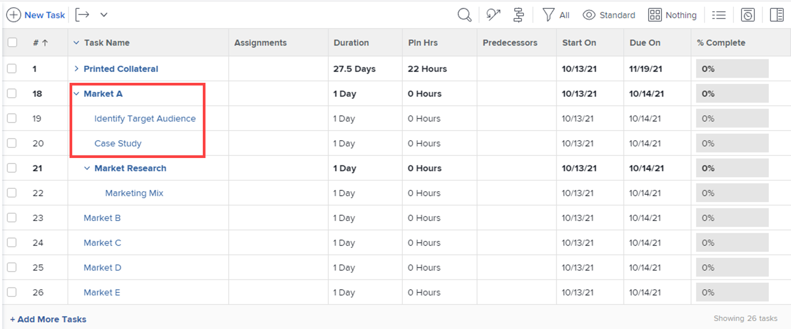

# Gerenciar um projeto na visualização Agile

<!-- Audited: 2/2024 -->

Você pode aproveitar a funcionalidade ágil para o seu projeto sem os desafios administrativos que normalmente acompanham as práticas ágeis (como gerenciar um backlog da equipe ou criar iterações).

Se você quiser trabalhar em um ambiente ágil que use um backlog de equipe e permita criar iterações de tarefas no backlog, siga as instruções em [Trabalhe em um ambiente ágil](../../../agile/work-in-an-agile-environment/work-in-an-agile-environment.md).

## Requisitos de acesso

+++ Expanda para visualizar os requisitos de acesso para a funcionalidade neste artigo.

Você deve ter o seguinte acesso para executar as etapas deste artigo:

<table style="table-layout:auto"> 
 <col> 
 <col> 
 <tbody> 
  <tr> 
   <td role="rowheader">plano do Adobe Workfront</td> 
   <td> 
Qualquer
 </td> 
  </tr> 
  <tr> 
   <td role="rowheader">Licença do Adobe Workfront</td> 
   <td> 
Atual: revisão ou superior
 
   
Novo: Colaborador ou superior
 </td> 
  </tr> 
  <tr> 
   <td role="rowheader">Configuração do nível de acesso</td> 
   <td> 
Editar acesso às seguintes áreas:
 
    <ul> 
     <li> 
Projetos
 </li> 
     <li> 
Relatórios, painéis, calendários
 </li> 
     <li> 
Filtros, Visualizações, Agrupamentos
 </li> 
    </ul> </td> 
  </tr> 
  <tr> 
   <td role="rowheader">Permissões de objeto</td> 
   <td> 
Exibir permissões para o projeto
  </td> 
  </tr> 
 </tbody> 
</table>

Para obter mais detalhes sobre as informações nesta tabela, consulte [Requisitos de acesso na documentação do Workfront](/help/quicksilver/administration-and-setup/add-users/access-levels-and-object-permissions/access-level-requirements-in-documentation.md).

+++

## Entender projetos Agile

>[!NOTE]
>
>Esta seção se aplica somente à visualização Agile herdada, não à visualização de quadro de um projeto.

* [Funcionalidade Agile em um projeto](#agile-functionality-in-a-project)
* [Diferenças ao usar a visualização Agile em um projeto ou em uma iteração](#differences-when-using-the-agile-view-on-a-project-versus-on-an-iteration)

### Funcionalidade Agile em um projeto {#agile-functionality-in-a-project}

A seguinte funcionalidade ágil está disponível ao gerenciar um projeto em uma visualização ágil:

* Status de Término\
  Para obter informações mais detalhadas sobre o status de conclusão, consulte [Visão geral do status de conclusão da iteração](../../../agile/use-scrum-in-an-agile-team/burndown/iteration-completion-status-overview.md).

* Storyboard\
  Para obter informações mais detalhadas sobre o storyboard, consulte o [Quadro Scrum](../../../agile/use-scrum-in-an-agile-team/scrum-board/scrum-board.md) seção.

Há algumas diferenças ao usar visualizações ágeis em um projeto em vez de trabalhar em um ambiente puramente ágil (com registros pendentes e iterações). Para obter mais informações, consulte [Diferenças ao usar a visualização Agile em um projeto ou em uma iteração](#differences-when-using-the-agile-view-on-a-project-versus-on-an-iteration) neste artigo.

### Diferenças ao usar a visualização Agile em um projeto ou em uma iteração {#differences-when-using-the-agile-view-on-a-project-versus-on-an-iteration}

* [As tarefas e subtarefas seguem diferentes regras de exibição em uma visualização Agile do projeto e no storyboard de uma iteração](#tasks-and-subtasks-follow-different-display-rules-on-the-story-board)
* [Os registros pendentes e as iterações não são usados na visualização Agile](#backlogs-and-iterations-are-not-used)
* [A ordem das tarefas é mantida na visualização Agile e não pode ser reordenada](#task-order-is-maintained-in-the-agile-view-and-cannot-be-reordered)
* [As tarefas são medidas apenas em Horas planejadas em uma lista de projetos](#tasks-are-measured-only-in-planned-hours)
* [A Equipe Agile não é usada em uma visualização Agile](#the-agile-team-is-not-used)
* [Cada usuário no projeto pode visualizar o projeto em uma visualização Agile diferente](#each-user-on-the-project-can-view-the-project-in-a-different-agile-view)

#### As tarefas e subtarefas seguem diferentes regras de exibição em uma visualização Agile do projeto e no storyboard de uma iteração {#tasks-and-subtasks-follow-different-display-rules-on-the-story-board}

* As tarefas que não têm uma tarefa pai nem uma subtarefa são sempre exibidas como um único cartão de matéria no storyboard da exibição Agile.\
  Por exemplo, essas tarefas aparecem da seguinte maneira na exibição de lista do projeto:

  

  Essas tarefas aparecem da seguinte maneira na exibição ágil do projeto:

  

* As tarefas pai que têm subtarefas são sempre exibidas na variável **Histórias** coluna do storyboard da exibição Agile. As subtarefas são exibidas na raia da tarefa pai.\
  Por exemplo, essas tarefas aparecem da seguinte maneira na exibição de lista do projeto:

  \
  Essas tarefas aparecem da seguinte maneira na exibição ágil do projeto:

  

* Subtarefas de segundo nível (subtarefas de subtarefas) são exibidas como um cartão cinza suspenso da tarefa pai imediata.
* Subtarefas de terceiro nível (subtarefas de subtarefas de subtarefas) nunca são exibidas na exibição Agile.

#### Os registros pendentes e as iterações não são usados na visualização Agile {#backlogs-and-iterations-are-not-used}

Ao visualizar um projeto em uma visualização ágil, os seguintes componentes ágeis não são usados:

* **Backlog:** Nenhuma lista de pendências é usada porque qualquer tarefa no projeto é exibida automaticamente como histórias.
* **Iterações:** Em vez de criar iterações para definir as datas em que o trabalho será realizado, os dias atualmente designados na linha do tempo do projeto se tornam os dias úteis.

#### A ordem das tarefas é mantida na visualização Agile e não pode ser reordenada {#task-order-is-maintained-in-the-agile-view-and-cannot-be-reordered}

A ordem em que as tarefas aparecem em um projeto é mantida ao exibi-lo em um storyboard ágil.

Não é possível reordenar tarefas no projeto ao visualizar o projeto em uma exibição ágil. Como a modificação da ordem da tarefa pode afetar outras tarefas que possam ter dependências, você deve exibir o projeto em uma exibição padrão para modificar a ordem da tarefa.

#### As tarefas são medidas apenas em Horas planejadas em uma lista de projetos {#tasks-are-measured-only-in-planned-hours}

As tarefas em um projeto são sempre medidas em Horas planejadas.

Em uma iteração, as tarefas (histórias) podem ser medidas em horas ou pontos.

#### A Equipe Agile não é usada em uma visualização Agile {#the-agile-team-is-not-used}

Como as equipes ágeis concluem o trabalho nas iterações atribuídas a elas, as equipes ágeis não são usadas ao visualizar um projeto em uma visualização ágil.

Em vez disso, os usuários do projeto basicamente se tornam a equipe ágil desse projeto.

#### Cada usuário no projeto pode visualizar o projeto em uma visualização Agile diferente {#each-user-on-the-project-can-view-the-project-in-a-different-agile-view}

Diferentemente de uma iteração ágil, os usuários de um projeto podem personalizar a exibição ágil para eles mesmos, enquanto outros usuários usam uma exibição ágil diferente.

Em uma iteração ágil, as informações disponíveis no storyboard de agile (como colunas de status disponíveis) são determinadas no nível da equipe.

Para obter informações sobre como personalizar uma visualização ágil, consulte [Criar ou personalizar uma visualização Agile](/help/quicksilver/reports-and-dashboards/reports/reporting-elements/create-edit-views.md#create-or-customize-an-agile-view) in [Criar ou editar exibições no no Adobe Workfront](/help/quicksilver/reports-and-dashboards/reports/reporting-elements/create-edit-views.md).

## Exibir um projeto na exibição Agile

1. Vá para o projeto que deseja visualizar em uma visualização Agile, na lista de tarefas ou na lista de problemas.
1. Clique em **Exibição do painel** ícone .

   A exibição de quadro do projeto é exibida por padrão.

   

   <!--(Legacy agile view only) If you previously viewed the project in a custom agile view, the project is displayed in that view rather than in the default agile view.-->

1. (Opcional) Clique em **Configurar** para definir opções para as colunas e cartões.

   Para obter mais informações, consulte [Gerenciar colunas do quadro](/help/quicksilver/agile/get-started-with-boards/manage-board-columns.md) e [Personalizar quais campos são exibidos em um cartão](/help/quicksilver/agile/get-started-with-boards/customize-fields-on-card.md). Observe que você não pode definir políticas de coluna na exibição de quadro de um projeto.

1. (Opcional) Clique em **Usar ágil legado** para usar a visualização ágil herdada em vez da visualização de quadro.

1. (Opcional - somente visualização ágil herdada) Se você tiver criado uma visualização ágil personalizada ou se outro usuário tiver criado uma visualização ágil personalizada e a compartilhou com você, você poderá visualizá-la em vez da visualização ágil padrão.

   Clique em **Exibir** e clique na exibição ágil personalizada que deseja visualizar.

   A exibição ágil personalizada será usada na próxima vez que você clicar no botão **Agile** ícone.

   Para obter informações sobre como criar uma nova visualização ágil, consulte [Criar e personalizar visualizações Agile](#create-and-customize-agile-views), abaixo.

   O projeto é exibido na visualização ágil personalizada.

1. (Condicional - somente visualização Agile herdada) Se as tarefas no seu projeto estiverem usando status diferentes de &quot;Novo&quot;, &quot;Em andamento&quot; ou &quot;Concluído&quot; (os status padrão da visualização Agile), você deverá adicionar os status adicionais à visualização Agile para que todas as tarefas nesses status sejam exibidas.

   Se as tarefas tiverem um status que não seja exibido no storyboard Agile, a própria tarefa não será exibida no storyboard Agile (no entanto, o Percentual concluído dessas tarefas ainda contribuirá para o Percentual concluído de qualquer tarefa pai e o Percentual concluído do projeto geral).

   Para adicionar status à exibição ágil, crie uma nova exibição ágil ou personalize uma exibição ágil existente, conforme descrito em [Criar e personalizar visualizações Agile](#create-and-customize-agile-views), abaixo.

1. (Opcional) Para retornar à exibição em lista, clique no link **Lista** ícone.

## Criar e personalizar visualizações Agile {#create-and-customize-agile-views}

>[!NOTE]
>
>Esta seção se aplica somente à visualização Agile herdada, não à visualização de quadro de um projeto.

Assim como com as exibições padrão no Workfront, você pode personalizar Exibições ágeis existentes ou criar novas exibições ágeis do zero. Diferentemente das exibições padrão, não é possível criar novas Exibições ágeis com base em exibições ágeis existentes.

Para obter mais informações sobre como criar e personalizar exibições ágeis, consulte [Criar ou personalizar uma visualização Agile](/help/quicksilver/reports-and-dashboards/reports/reporting-elements/create-edit-views.md#create-or-customize-an-agile-view) no artigo [Criar ou editar exibições no no Adobe Workfront](/help/quicksilver/reports-and-dashboards/reports/reporting-elements/create-edit-views.md).

## Compartilhar uma visualização Agile existente

>[!NOTE]
>
>Esta seção se aplica somente à visualização Agile herdada, não à visualização de quadro de um projeto.

É possível compartilhar uma visualização Agile que você criou ou que tem permissões no da mesma maneira que você compartilha qualquer outra visualização, filtro ou agrupamento.

Para obter mais informações, consulte [Compartilhar um filtro, uma exibição ou um agrupamento](../../../reports-and-dashboards/reports/reporting-elements/share-filter-view-grouping.md).

## Remover uma visualização Agile existente

>[!NOTE]
>
>Esta seção se aplica somente à visualização Agile herdada, não à visualização de quadro de um projeto.

É possível remover uma exibição Agile da mesma maneira que remove qualquer outra exibição, filtro ou agrupamento.

Para obter mais informações, consulte [Remover filtros, visualizações e agrupamentos](/help/quicksilver/reports-and-dashboards/reports/reporting-elements/remove-filters-views-groupings.md).
