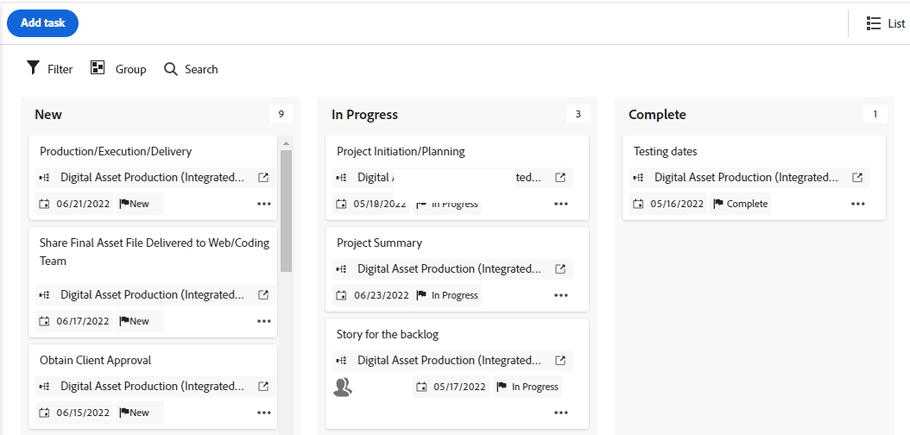

# Gerenciar um projeto ágil na visualização de quadro

<!-- Audited: 11/2025 -->

Você pode aproveitar a funcionalidade Agile para o seu projeto sem os desafios administrativos que normalmente acompanham as práticas Agile (como gerenciar um backlog da equipe ou criar iterações).

Você pode trabalhar em um ambiente Agile que use um backlog de equipe e permita criar iterações de tarefas no backlog.

Para obter informações, consulte [Trabalhar em um ambiente Agile](../../../agile/work-in-an-agile-environment/work-in-an-agile-environment.md).

## Requisitos de acesso

+++ Expanda para visualizar os requisitos de acesso da funcionalidade neste artigo.

Você deve ter o seguinte acesso para realizar as etapas descritas neste artigo:

<table style="table-layout:auto"> 
 <col> 
 <col> 
 <tbody> 
  <tr> 
   <td role="rowheader">Pacote do Adobe Workfront</td> 
   <td> 
Qualquer
 </td> 
  </tr> 
  <tr> 
   <td role="rowheader">Licença do Adobe Workfront</td> 
   <td> 
Leve ou superior

   
Revisar ou superior
 
    </td> 
  </tr> 
  <tr> 
   <td role="rowheader">Configurações de nível de acesso</td> 
   <td> 
Editar acesso às seguintes áreas:
 
    <ul> 
     <li> 
Projetos
 </li> 
     <li> 
Relatórios, painéis, calendários
 </li> 
     <li> 
Filtros, Visualizações, Agrupamentos
 </li> 
    </ul> </td> 
  </tr> 
  <tr> 
   <td role="rowheader">Permissões de objeto</td> 
   <td> 
Exibir permissões para o projeto
  </td> 
  </tr> 
 </tbody> 
</table>

Para obter mais detalhes sobre as informações contidas nesta tabela, consulte [Requisitos de acesso na documentação do Workfront](/help/quicksilver/administration-and-setup/add-users/access-levels-and-object-permissions/access-level-requirements-in-documentation.md).

+++

<!--
old:

<table style="table-layout:auto"> 
 <col> 
 <col> 
 <tbody> 
  <tr> 
   <td role="rowheader">Adobe Workfront plan</td> 
   <td> 
Any
 </td> 
  </tr> 
  <tr> 
   <td role="rowheader">Adobe Workfront license</td> 
   <td> 
Current: Review or higher
 
   
New: Contributor or higher
 </td> 
  </tr> 
  <tr> 
   <td role="rowheader">Access level configuration</td> 
   <td> 
Edit access to the following areas:
 
    <ul> 
     <li> 
Projects
 </li> 
     <li> 
Reports, Dashboards, Calendars
 </li> 
     <li> 
Filters, Views, Groupings
 </li> 
    </ul> </td> 
  </tr> 
  <tr> 
   <td role="rowheader">Object permissions</td> 
   <td> 
View permissions to the project
  </td> 
  </tr> 
 </tbody> 
</table>
-->

## Exibir um projeto na exibição de Quadro

Você pode exibir as tarefas ou os problemas em um projeto em uma exibição de Quadro em vez de em uma lista, para aproveitar a funcionalidade Ágil para o desenvolvimento do seu projeto.

1. Vá para o projeto que você deseja gerenciar de acordo com a metodologia Agile e clique em **Tarefas** ou **Problemas** no painel esquerdo.
1. Clique no ícone **Exibição do painel** .

   A exibição de quadro do projeto é exibida por padrão.

   

1. (Opcional) Clique em **Configurar** para definir opções para as colunas e cartões.

   Para obter mais informações, consulte [Gerenciar colunas do quadro](/help/quicksilver/agile/get-started-with-boards/manage-board-columns.md) e [Personalizar quais campos são exibidos em um cartão](/help/quicksilver/agile/get-started-with-boards/customize-fields-on-card.md). Observe que você não pode definir políticas de coluna na exibição de quadro de um projeto.

1. (Opcional) Para retornar ao modo de exibição de lista, clique no ícone **Lista** ícone .

   A lista de tarefas ou problemas é exibida.
