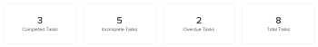
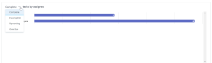

# Visão geral das métricas do projeto

As métricas do projeto fornecem uma visualização geral no formato do gráfico sobre o desempenho de um projeto.

## Requisitos de acesso

<table style="table-layout:auto"> 
 <col> 
 <col> 
 <tbody> 
  <tr> 
   <td role="rowheader">Plano Workfront*</td> 
   <td> 
Qualquer Um
 </td> 
  </tr> 
  <tr> 
   <td role="rowheader">Licença da Workfront*</td> 
   <td> 
Revisar ou superior 
 </td> 
  </tr> 
  <tr> 
   <td role="rowheader">Nível de acesso*</td> 
   <td> 
Visualizar o acesso a Projetos
 
<b>Nota</b>

Caso ainda não tenha acesso, pergunte ao administrador do Workfront se ele definiu restrições adicionais em seu nível de acesso. Para obter informações sobre o acesso a projetos, consulte <a href="../../../administration-and-setup/add-users/configure-and-grant-access/grant-access-projects.md" class="MCXref xref">Conceder acesso aos projetos</a>. Para obter informações sobre como um administrador do Workfront pode alterar seu nível de acesso, consulte <a href="../../../administration-and-setup/add-users/configure-and-grant-access/create-modify-access-levels.md" class="MCXref xref">Criar ou modificar níveis de acesso personalizados</a>. 
 </td>
</tr> 
  <tr> 
   <td role="rowheader">Permissões de objeto</td> 
   <td> 
Exibir permissões para um projeto
 
 Para obter informações sobre permissões de projeto, consulte <a href="../../../workfront-basics/grant-and-request-access-to-objects/share-a-project.md" class="MCXref xref">Compartilhar um projeto no Adobe Workfront</a>.
 
Para obter informações sobre como solicitar acesso adicional, consulte <a href="../../../workfront-basics/grant-and-request-access-to-objects/request-access.md" class="MCXref xref">Solicitar acesso a objetos </a>.
 </td> 
  </tr> 
 </tbody> 
</table>

*Para descobrir qual plano, tipo de licença ou acesso você tem, entre em contato com o administrador da Workfront.

## Pré-requisitos

Para acessar a área Métricas no painel esquerdo de um projeto, você deve:

* Tenha a opção Métricas do painel esquerdo ativada na área Projetos do modelo de layout.

   Para saber como um administrador ou administrador de grupo do Workfront pode personalizar o painel esquerdo com um modelo de layout, consulte [Personalizar o painel esquerdo usando um modelo de layout](../../../administration-and-setup/customize-workfront/use-layout-templates/customize-left-panel.md).

## Visão geral da área Métricas do projeto

As métricas do projeto fornecem uma visualização do que está acontecendo em um projeto, permitindo que você avalie rapidamente as necessidades e o status de um projeto.

Na área Métricas , é possível ver a integridade geral de um projeto, bem como:

* Onde o trabalho está ativo ou parado
* Quem tem itens de trabalho abertos atribuídos a eles
* Detalhes sobre tarefas ou problemas que estão vencidos ou perto da Data de Conclusão Planejada

Também é possível fazer drill-in em cada gráfico para examinar mais detalhadamente as tarefas ou os problemas em uma categoria específica.

Para saber mais sobre como analisar essas tarefas ou problemas, consulte [Exibir detalhes de métricas](#view-metrics-details).

>[!TIP]
>
>Para visualizar métricas em um nível mais alto para um grupo de projetos em um programa, portfólio etc., navegue até a área Análise aprimorada .\
>Para saber mais sobre a Análise aprimorada, consulte [Visão geral da análise aprimorada](../../../enhanced-analytics/enhanced-analytics-overview.md).

## KPIs do projeto

Os indicadores-chave de desempenho (KPIs) são exibidos na parte superior da área Métricas .

Esses KPIs são divididos nas seguintes categorias:

| Tarefas concluídas | **Tarefas concluídas** mostra o número de tarefas em um status Concluído. Esse número também inclui tarefas que têm um status personalizado que é igual a Concluído. |
|---|---|
| Tarefas incompletas | **Tarefas incompletas** mostra o número de tarefas que não estão em um status Concluído ou Fechado ou um status que é igual a Concluído. |
| Tarefas atrasadas | **Tarefas atrasadas** mostra o número de tarefas que ultrapassaram a Data de Conclusão Planejada e não estão em um status Concluído ou Fechado ou em um status que é igual a Concluído ou Fechado. |
| Total de tarefas | **Total de tarefas** mostra o número total de tarefas no projeto. |

>[!TIP]
>
>Para exibir uma lista de itens de trabalho para um KPI específico, clique nesse KPI. Nessa lista, você pode clicar em um item de trabalho específico para exibir mais detalhes em uma nova guia.\
>\
>Para obter mais informações, consulte [Exibir detalhes de métricas](#view-metrics-details).

## Gráfico de barras de tarefas ou de emissão

No gráfico de barras exibido abaixo dos KPIs do projeto, você pode verificar o status ou a prioridade dos itens de trabalho no projeto. A exibição de tarefa é selecionada por padrão.

Quando o status é selecionado neste gráfico, você pode exibir todos os status de tarefas ou problemas em um projeto. Cada status é agrupado em uma barra no gráfico. Todos os status padrão do sistema e personalizados são exibidos neste gráfico.

Quando a prioridade é selecionada neste gráfico, você pode exibir todas as prioridades de tarefas ou problemas em um projeto.

>[!TIP]
>
>Para exibir uma lista de itens de trabalho com status ou prioridade específica, clique em uma barra no gráfico. Nessa lista, você pode clicar em um item de trabalho específico para exibir mais detalhes em uma nova guia.\
>\
>Para obter mais informações, consulte [Exibir detalhes de métricas](#view-metrics-details).

## Gráfico de rosca

O gráfico de rosca localizado abaixo dos KPIs do projeto permite que você verifique a proporção de itens de trabalho concluídos em comparação a itens de trabalho incompletos em um projeto.

No menu suspenso acima do gráfico, é possível selecionar:

| Todas as tarefas | Selecionar **tarefas** mostra o número total de tarefas no projeto, bem como a proporção entre tarefas concluídas e incompletas. |
|---|---|
| Todos os problemas | Selecionar **problemas** mostra o número total de problemas no projeto, bem como a proporção entre problemas concluídos e incompletos. |

>[!TIP]
>
>Para exibir uma lista de itens de trabalho concluídos ou incompletos, clique nessa seção no gráfico de rosca. Nessa lista, você pode clicar em um item de trabalho específico para exibir mais detalhes em uma nova guia.\
>\
>Para obter mais informações, consulte [Exibir detalhes de métricas](#view-metrics-details).

## Gráfico de barras do destinatário

O gráfico de barras do destinatário mostra o número de tarefas atribuídas a cada pessoa no projeto. Esse número varia com base na categoria selecionada no menu suspenso.

Você pode optar por examinar as atribuições de tarefa de um projeto nas seguintes categorias:

| Completo | Selecionar **Concluído** mostra o número de tarefas atribuídas a cada usuário que foram concluídas. |
|---|---|
| Incompleto | Selecionar **Incompleto** mostra o número de tarefas atribuídas a cada usuário que ainda não foi concluído. |
| Breve | Selecionar **Em breve** mostra o número de tarefas atribuídas a cada usuário que ainda não atingiu a Data Inicial Planejada. |
| Atrasado | Selecionar **Vencimento** mostra o número de tarefas atribuídas a cada usuário que ultrapassaram a Data de Conclusão Planejada e ainda não foram concluídas. |

>[!TIP]
>
>Para exibir uma lista de itens de trabalho na categoria selecionada que são atribuídos a um usuário específico, clique na barra ao lado do nome do usuário no gráfico. Nessa lista, você pode clicar em um item de trabalho específico para exibir mais detalhes em uma nova guia.\
>\
>Para obter mais informações, consulte [Exibir detalhes de métricas](#view-metrics-details).

## Exibir detalhes de métricas {#view-metrics-details}

É possível interagir com os gráficos na área Métricas para observar diferentes aspectos de um gráfico ou examinar mais detalhadamente as tarefas e os problemas em um gráfico.

1. Vá para o projeto para o qual deseja visualizar as métricas.
1. No painel esquerdo, clique em **Mostrar mais** para exibir mais seções, clique em **Métricas**.\
   Os gráficos na área Métricas exibem informações de tarefas por padrão.\
   

1. (Condicional) Se uma seta suspensa for exibida em um gráfico, clique no botão **Seta suspensa** ícone  no gráfico e selecione a opção desejada no menu .\
   Para obter informações sobre as opções que aparecem nos menus de cada gráfico, consulte a seção relevante acima.

1. (Opcional) Para examinar mais detalhadamente as tarefas ou os problemas de qualquer métrica na página, faça o seguinte:

   1. Clique no elemento (como tarefas atribuídas a um usuário específico, problemas com alta prioridade ou todas as tarefas vencidas) para o qual você deseja visualizar os detalhes.

      Uma lista de tarefas ou problemas é exibida.

      

   1. Use as setas na parte inferior da lista para localizar a tarefa ou problema que deseja observar.

      Ou

      Selecione um número específico para exibir tarefas ou problemas em uma página específica.

      

   1. Selecione uma tarefa ou problema para exibir mais detalhes.

      A tarefa ou problema é aberto em uma nova guia.

1. (Opcional) Para exportar o painel de métricas do projeto para um arquivo .png, clique no link **Exportar** ícone , em seguida selecione **Exportar como PNG** no menu suspenso.

   >[!TIP]
   >
   >Ao exportar o painel, o arquivo exportado inclui apenas o que é exibido no momento no seu visor. Para incluir determinados itens no arquivo exportado, talvez seja necessário rolar para cima ou para baixo na página ou ajustar as configurações de zoom do navegador.
