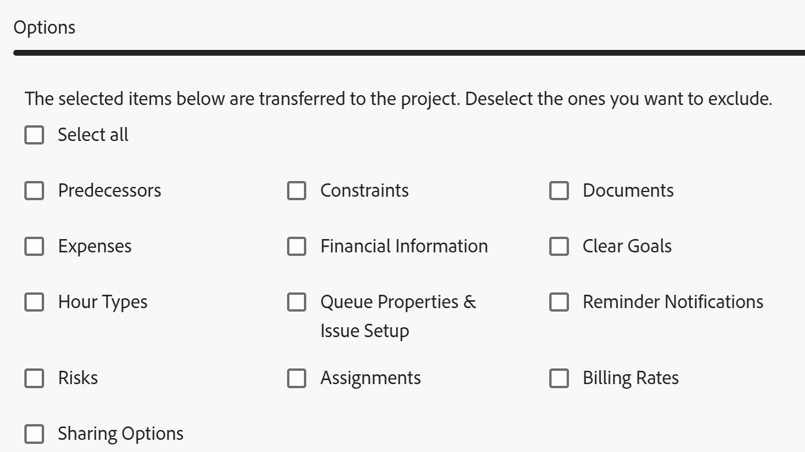
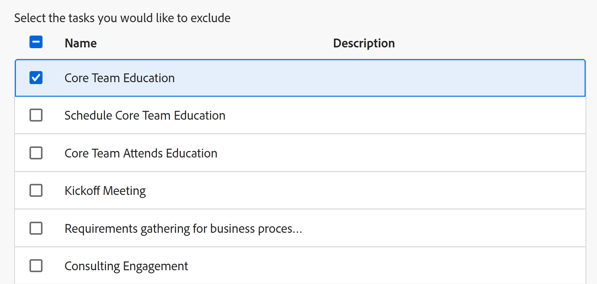

# Salvar um projeto como modelo

<!--Audited: 6/2025-->

<!--

(NOTE: Keep this the way it is in the Managing Projects area because the functionality in the UI is "Save as template" at the project level, so users see that in the UI; there is another article that this links to which is more in depth (step-by-step). This functionality needs to stay in both projects AND templates areas.)

-->

As informações destacadas nesta página se referem a funcionalidades ainda não disponíveis no geral. Ela está disponível somente no ambiente de Pré-visualização para todos os clientes. Os mesmos recursos também estarão disponíveis no ambiente de Produção para todos os clientes após uma semana da versão de Pré-visualização.

Para obter mais informações, consulte [Modernização da interface](/help/quicksilver/product-announcements/product-releases/interface-modernization/interface-modernization.md).

Se você decidir que um projeto ocorrerá novamente em algum momento no futuro, poderá criar um modelo a partir desse projeto existente. Em seguida, é possível usar o modelo novamente para criar projetos futuros que podem conter informações semelhantes ou compartilhar a mesma linha do tempo ou atribuições com o projeto existente.

## Requisitos de acesso

+++ Expanda para visualizar os requisitos de acesso para a funcionalidade neste artigo.

<table style="table-layout:auto"> 
 <col> 
 <col> 
 <tbody> 
  <tr> 
   <td role="rowheader">plano do Adobe Workfront</td> 
   <td> 
Qualquer 
 </td> 
  </tr> 
  <tr> 
   <td role="rowheader">Licença da Adobe Workfront*</td> 
   <td> 
Novo: Padrão 

   Ou 
   
Atual: Plano 
 
   </td> 
  </tr> 
  <tr> 
   <td role="rowheader">Configurações de nível de acesso</td> 
   <td> 
Editar acesso a modelos
 /td&gt; 
  </tr> 
  <tr> 
   <td role="rowheader">Permissões de objeto</td> 
   <td> 
Visualizar ou aumentar as permissões de um projeto 
 
Você obtém permissões de Gerenciamento para o modelo depois de salvar o projeto como um modelo
 </td> 
  </tr> 
 </tbody> 
</table>

*Para obter informações, consulte [Requisitos de acesso na documentação do Workfront](/help/quicksilver/administration-and-setup/add-users/access-levels-and-object-permissions/access-level-requirements-in-documentation.md).

+++

## Salvar um projeto como modelo

Salvar um projeto como um modelo difere nos ambientes Produção e Pré-visualização.

### Salvar um projeto como um modelo no ambiente de Produção

1. Vá para o projeto que deseja salvar como modelo.
1. Clique no menu **Mais**  e **Salvar como Modelo**.
1. Especifique as seguintes informações para o modelo:

   <table style="table-layout:auto"> 
    <col> 
    <col> 
    <tbody> 
     <tr> 
      <td role="rowheader">Nome</td> 
      <td>Especifique um nome para o modelo.</td> 
     </tr> 
     <tr> 
      <td role="rowheader">Descrição</td> 
      <td>Forneça uma descrição para o modelo.</td> 
     </tr> 
     <tr> 
      <td role="rowheader">Está ativo</td> 
      <td> 
Selecione entre as seguintes opções:
 
       <ul> 
        <li> 
<strong>Sim</strong>: outros usuários podem encontrar o modelo e anexá-lo aos projetos.
 </li> 
        <li><strong>Não</strong>: outros usuários não podem encontrar o modelo e não podem anexá-lo a projetos.</li> 
       </ul> </td> 
     </tr> 
     <tr> 
      <td role="rowheader">Formulários personalizados</td> 
      <td>Use a lista suspensa para selecionar qualquer formulário personalizado para anexar ao modelo. Se algum formulário personalizado já tiver sido associado ao projeto, todos os campos de dados desses formulários personalizados serão exibidos. Você pode incluir até 10 formulários personalizados em um único modelo.</td> 
     </tr> 
    </tbody> 
   </table>

1. Clique em **Gerenciar Forms** para remover ou reordenar os formulários. Para obter informações sobre como remover e reordenar formulários personalizados no modelo, consulte [Formulários personalizados](../../../administration-and-setup/customize-workfront/create-manage-custom-forms/create-and-manage-custom-forms.md).

   

1. Clique em **Próxima etapa.**
1. Na seção **Options**, marque a caixa de seleção ao lado de qualquer informação que você deseja apagar do modelo.

   

1. Clique em **Próxima etapa.**
1. Na seção **Excluir**, selecione as tarefas que deseja excluir do projeto.

   

1. Clique em **Concluir e Salvar Modelo.**

   Seu modelo agora aparece na lista de modelos disponíveis e pode ser anexado a um projeto existente ou usado para criar um novo.

### Salvar um projeto como modelo no ambiente de Pré-visualização

1. Vá para o projeto que deseja salvar como modelo.
1. Clique no menu **Mais**  e **Salvar como Modelo**.
1. Na seção **Salvar como Modelo**, especifique as seguintes informações para o modelo:

   <table style="table-layout:auto"> 
    <col> 
    <col> 
    <tbody> 
     <tr> 
      <td role="rowheader">Nome do Modelo</td> 
      <td>Especifique um nome para o modelo.</td> 
     </tr> 
     <tr> 
      <td role="rowheader">Descrição</td> 
      <td>Forneça uma descrição para o modelo.</td> 
     </tr> 
     <tr> 
      <td role="rowheader">Está ativo</td> 
      <td> 
Selecione entre as seguintes opções:
 
       <ul> 
        <li> 
<strong>Sim</strong>: outros usuários podem encontrar o modelo e anexá-lo aos projetos.
 </li> 
        <li><strong>Não</strong>: outros usuários não podem encontrar o modelo e não podem anexá-lo a projetos.</li> 
       </ul> </td> 
     </tr> 
     <tr> 
      <td role="rowheader">Formulários personalizados</td> 
      <td>Use a lista suspensa para selecionar qualquer formulário personalizado para anexar ao modelo. Se algum formulário personalizado já tiver sido associado ao projeto, todos os campos de dados desses formulários personalizados serão exibidos. Você pode incluir até 10 formulários personalizados em um único modelo.</td> 
     </tr> 
    </tbody> 
   </table>

1. Clique em **Forms Personalizado** no painel esquerdo para remover ou reordenar os formulários.

   Para reordenar os formulários, arraste e solte-os na ordem correta.
Para remover um formulário, selecione-o e clique em **Remover**. Clique em **Cancelar** para remover os formulários selecionados.

   

1. Atualizar informações nos formulários personalizados anexados, se necessário. As informações serão transferidas para o modelo.

1. Clique em **Opções** na seção do painel esquerdo e marque a caixa de seleção ao lado de qualquer informação que você deseja transferir para o modelo. Os itens desmarcados não são transferidos para o modelo. Todas as opções são desmarcadas, por padrão.

   

1. Clique em **Excluir** no painel esquerdo e selecione as tarefas que deseja excluir do projeto. Todas as tarefas são desmarcadas, por padrão.

   

1. Clique em **Concluir e Salvar Modelo.**

   Seu modelo agora aparece na lista de modelos disponíveis e pode ser anexado a um projeto existente ou usado para criar um novo.

