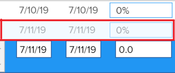

# Selecione o Tipo de Atualização do projeto

Ao selecionar um Tipo de atualização para um projeto, você pode controlar a frequência com que as alterações feitas na linha do tempo do projeto são salvas nas tarefas pai ou projeto.

Quando a linha do tempo do projeto é atualizada, ela é recalculada com base nas alterações feitas no projeto, em suas tarefas ou nas alterações feitas em outro projeto do qual a linha do tempo depende.

Por exemplo, as seguintes alterações nas tarefas no projeto acionam uma atualização na linha do tempo do projeto:

* Atualizar as datas das tarefas
* Alterar relações predecessoras de tarefas
* Altere os relacionamentos pai-filho, adicionando ou removendo atribuições além de alterar a restrição de tarefa ou o tipo de duração.

## Requisitos de acesso

<!-- drafted for P&P:

<table style="table-layout:auto"> 
 <col> 
 <col> 
 <tbody> 
  <tr> 
   <td role="rowheader">Adobe Workfront plan*</td> 
   <td> 
Any 
 </td> 
  </tr> 
  <tr> 
   <td role="rowheader">Adobe Workfront license*</td> 
   <td> 
Current license: Standard
 
   Or
   
Legacy license: Plan 
 </td> 
  </tr> 
  <tr> 
   <td role="rowheader">Access level configurations*</td> 
   <td> 
Edit access to Projects
 
<b>NOTE</b>
   
   If you still don't have access, ask your Workfront administrator if they set additional restrictions in your access level. For information on how a Workfront administrator can modify your access level, see <a href="../../../administration-and-setup/add-users/configure-and-grant-access/create-modify-access-levels.md" class="MCXref xref">Create or modify custom access levels</a>.
 </td> 
  </tr> 
  <tr> 
   <td role="rowheader">Object permissions</td> 
   <td> 
Manage permissions to a project
 
For information on requesting additional access, see <a href="../../../workfront-basics/grant-and-request-access-to-objects/request-access.md" class="MCXref xref">Request access to objects </a>.
 </td> 
  </tr> 
 </tbody> 
</table>
-->

Você deve ter o seguinte acesso para executar as etapas neste artigo:

<table style="table-layout:auto"> 
 <col> 
 <col> 
 <tbody> 
  <tr> 
   <td role="rowheader">Plano Adobe Workfront*</td> 
   <td> 
Qualquer Um 
 </td> 
  </tr> 
  <tr> 
   <td role="rowheader">Licença da Adobe Workfront*</td> 
   <td> 
Plano 
 </td> 
  </tr> 
  <tr> 
   <td role="rowheader">Configurações de nível de acesso*</td> 
   <td> 
Editar acesso a Projetos
 
<b>Nota</b>

Caso ainda não tenha acesso, pergunte ao administrador do Workfront se ele definiu restrições adicionais em seu nível de acesso. Para obter informações sobre como um administrador do Workfront pode modificar seu nível de acesso, consulte <a href="../../../administration-and-setup/add-users/configure-and-grant-access/create-modify-access-levels.md" class="MCXref xref">Criar ou modificar níveis de acesso personalizados</a>.
 </td>
</tr> 
  <tr> 
   <td role="rowheader">Permissões de objeto</td> 
   <td> 
Gerenciar permissões de um projeto
 
Para obter informações sobre como solicitar acesso adicional, consulte <a href="../../../workfront-basics/grant-and-request-access-to-objects/request-access.md" class="MCXref xref">Solicitar acesso a objetos </a>.
 </td> 
  </tr> 
 </tbody> 
</table>

&#42;Para descobrir qual plano, tipo de licença ou acesso você tem, entre em contato com o administrador da Workfront.

## Atualizar o tipo de atualização de um projeto

Quando as tarefas são atualizadas, seus objetos pai (tarefas pai ou projeto) são atualizados no momento indicado pelo Tipo de atualização.  Para especificar um Tipo de atualização para o seu projeto:

1. Vá para o projeto cujo Tipo de atualização você deseja especificar.
1. Clique no menu Mais  ao lado do nome do projeto, clique em **Editar** .

1. Clique em  **Projeto** **Configurações**.

   

1. No **Tipo de atualização** selecione se deseja que o Workfront calcule a linha do tempo do projeto automaticamente diariamente, quando houver uma alteração ou se deseja que o gerente do projeto a calcule manualmente.

   Selecione na lista abaixo as opções. 

   >[!IMPORTANT]
   >
   >Se a linha do tempo de um projeto for superior a 15 anos, a Workfront não calculará a linha do tempo automaticamente ou após a alteração. O Tipo de atualização de um projeto com mais de 15 anos é sempre Manual.

   * **Automático e On Change:** Esta é a configuração padrão. A linha do tempo do projeto é atualizada sempre que uma alteração ocorre no projeto ou em outro projeto do qual a linha do tempo depende. A linha do tempo do projeto também é atualizada todas as noites. \
      Essa é a configuração recomendada, pois garante que a linha do tempo do projeto esteja sempre atualizada.

      Quando você atualiza uma tarefa ou o projeto e aciona um recálculo de linha do tempo, todas as datas disponíveis são exibidas imediatamente, permitindo que você continue trabalhando. Em projetos com mais de 100 tarefas, as datas que exigem cálculos mais longos são esmaecidas.

      

      Isso indica que o recálculo ainda não foi concluído e que as datas estão sujeitas a alterações.

   * **Somente alteração:** A linha do tempo do projeto é atualizada sempre que ocorre uma alteração no projeto ou em outro projeto dependente da linha do tempo; atualizações programadas não ocorrem.\
      Você pode selecionar essa opção se estiver preocupado com o desempenho do sistema e se ocorrerem alterações raramente no projeto ou em outros projetos dependentes da linha do tempo.

   * **Somente Automático:** O calendário do projeto é atualizado todas as noites; ela não é atualizada imediatamente após a realização de alterações.\
      Você pode selecionar essa opção se estiver preocupado com o desempenho do sistema e se muitas alterações ocorrerem todos os dias no projeto ou em outros projetos dependentes da linha do tempo.

      >[!NOTE]
      >
      >Um projeto não recalcula automaticamente a cada noite se estiver no status de Planejamento. Ele só recalcula quando alterado.

   * **Somente Manual:** A linha do tempo do projeto é atualizada somente quando você seleciona a opção para **Recalcular Linhas do Tempo**, conforme descrito na seção &quot;Recálculo manual&quot; do artigo [Recalcular linhas do tempo do projeto](../../../manage-work/projects/manage-projects/recalculate-project-timeline.md).\
      Talvez você queira selecionar essa opção se estiver fazendo muitas alterações no projeto de uma vez e desejar que o recálculo da linha do tempo ocorra após todas as alterações terem sido feitas (em vez de após cada alteração individual).

1. Clique em **Salvar**.
