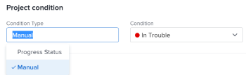

# Definir o tipo de condição de um projeto

Como um gerente de projeto, você pode determinar como a Condição de um projeto é calculada atualizando o Tipo de condição do projeto. A Condição do projeto é uma representação visual de como o projeto está progredindo.

## Requisitos de acesso

+++ Expanda para visualizar os requisitos de acesso da funcionalidade neste artigo. 

<table style="table-layout:auto"> 
 <col> 
 <col> 
 <tbody> 
  <tr> 
   <td role="rowheader">Pacote do Adobe Workfront</td> 
   <td> 
Qualquer
 </td> 
  </tr> 
  <tr> 
   <td role="rowheader">Licença do Adobe Workfront</td> 
   <td>
Padrão
 
   
Plano
 </td> 
  </tr> 
  <tr> 
   <td role="rowheader">Configurações de nível de acesso</td> 
   <td> 
Editar acesso a projetos
</td> 
  </tr> 
  <tr> 
   <td role="rowheader">Permissões de objeto</td> 
   <td> 
    <ul> 
     <li> 
Contribuir com permissões para um projeto para editar o Tipo de condição na área Detalhes do projeto 
 </li> 
     <li> 
Gerenciar permissões para um projeto para editar o Tipo de condição na caixa Editar projeto
 </li> 
    </ul> </td> 
  </tr> 
 </tbody> 
</table>

Para obter informações, consulte [Requisitos de acesso na documentação do Workfront](/help/quicksilver/administration-and-setup/add-users/access-levels-and-object-permissions/access-level-requirements-in-documentation.md).

+++

<!--
Old:

<table style="table-layout:auto"> 
 <col> 
 <col> 
 <tbody> 
  <tr> 
   <td role="rowheader">Adobe Workfront plan*</td> 
   <td> 
Any
 </td> 
  </tr> 
  <tr> 
   <td role="rowheader">Adobe Workfront license*</td> 
   <td> 
Plan 
 </td> 
  </tr> 
  <tr> 
   <td role="rowheader">Access level configurations*</td> 
   <td> 
Edit access to Projects
 
Note: If you still don't have access, ask your Workfront administrator if they set additional restrictions in your access level. For information about access to projects, see <a href="../../../administration-and-setup/add-users/configure-and-grant-access/grant-access-projects.md" class="MCXref xref">Grant access to projects</a>. For information on how a Workfront administrator can change your access level, see <a href="../../../administration-and-setup/add-users/configure-and-grant-access/create-modify-access-levels.md" class="MCXref xref">Create or modify custom access levels</a>. 
 </td> 
  </tr> 
  <tr> 
   <td role="rowheader">Object permissions</td> 
   <td> 
    <ul> 
     <li> 
Contribute permissions to a project to edit the Condition Type in the Project Details area 
 </li> 
     <li> 
Manage permissions to a project to edit the Condition Type in the Edit Project box
 </li> 
    </ul> 
 For information about project permissions, see <a href="../../../workfront-basics/grant-and-request-access-to-objects/share-a-project.md" class="MCXref xref">Share a project in Adobe Workfront</a>.
 
For information on requesting additional access, see <a href="../../../workfront-basics/grant-and-request-access-to-objects/request-access.md" class="MCXref xref">Request access to objects </a>.
 </td> 
  </tr> 
 </tbody> 
</table>
-->

## Definir o tipo de condição de um projeto

1. Vá para o projeto para o qual deseja atualizar o Tipo de condição.
1. Siga um destes procedimentos:

   * Clique no menu **Mais**  à direita do nome do projeto e clique em **Editar**.
   * Clique em **Detalhes do projeto** no painel esquerdo.

   

1. No campo **Tipo de Condição**, escolha uma das seguintes opções:

   * **Manual:** o proprietário do projeto define a Condição no projeto manualmente.

     Nesse caso, o proprietário do projeto pode atualizar a Condição do projeto no cabeçalho do projeto ou na seção Detalhes do projeto.

   * **Status do Progresso:** O Workfront define a Condição com base no Status do Progresso do projeto. Para obter informações sobre como o Status de Progresso é calculado, consulte [Visão geral do Status de Progresso do Projeto](../../../manage-work/projects/planning-a-project/project-progress-status.md).

1. Clique em **Salvar** ao modificar o Tipo de Condição na caixa Editar Projeto.

   Clique em **Salvar alterações** ao modificar o Tipo de Condição na seção Detalhes do Projeto.

