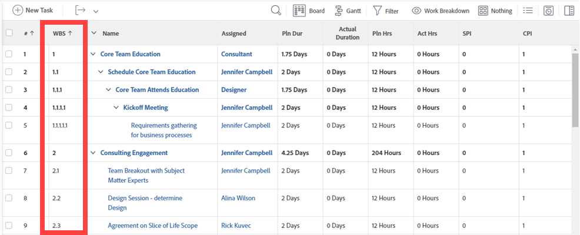

# Determinar a estrutura do detalhamento do trabalho em um projeto

Definir uma Estrutura de divisão de trabalho (WBS) para um projeto é um conjunto de atividades que descreve o plano do projeto. A WBS divide o resultado do projeto em elementos de trabalho gerenciáveis, que podem ser usados para definir marcos e organizar atribuições de trabalho.

Você deve ter uma licença de Plano com acesso de Edição a Projetos para criar a Estrutura de divisão de trabalho de um projeto. Pode ser necessário acesso adicional a outras áreas do Adobe Workfront, dependendo de quantas atividades você executa ao criar a WBS.

Recomendamos que você mantenha o projeto no status Planejamento enquanto faz alterações na Estrutura de divisão de trabalho, para evitar que as notificações sejam acionadas para os usuários na Equipe do projeto.

## Definir os materiais de entrega do projeto

O objetivo de um projeto é fornecer resultados tangíveis aos participantes internos e externos. Os resultados de um projeto são os resultados que você deseja alcançar ao concluir o projeto. Os resultados estão quase sempre associados a pelo menos um produto e todos os produtos devem estar associados a um projeto.

Os materiais de entrega do projeto podem ser bens de consumo, saída intelectual (como relatórios) ou serviços. Por exemplo, se o escopo do projeto for construir uma casa, alguns dos resultados podem incluir:

* criação de planos de arquitetura
* completar encanamento
* trabalho elétrico
* derramando a fundação
* trabalho de enquadramento
* fechando a venda da casa.

Dependendo do tamanho e do escopo, um projeto pode ser composto de vários materiais de entrega.

Depois de identificar os materiais de entrega, você pode começar a dividi-los em tarefas. As tarefas são o resultado obtido para fornecer o resultado geral do projeto. Ao definir suas tarefas, você leva em consideração os seguintes parâmetros:

* Tempo necessário para a conclusão.
* Orçamento necessário para concluir o trabalho.
* Recursos necessários para concluir o trabalho.
* Agendamento dos recursos com base na linha do tempo lógica das tarefas.

Ao definir tarefas, certifique-se de não planejar muito trabalho para uma tarefa individual. Se o trabalho necessário em uma tarefa for superior a 40 horas (uma semana típica de trabalho), talvez seja necessário dividir essa quantidade de trabalho em subtarefas. A conclusão de todas as subtarefas concluirá a tarefa principal.

Para definir resultados e materiais para distribuição da WBS no Workfront, recomendamos executar as seguintes atividades para criar uma exibição hierárquica das tarefas do projeto:

* Caso ainda não o tenha feito, crie um novo projeto.\
  Para obter informações sobre como criar um projeto, consulte o artigo [Criar um projeto](../../../manage-work/projects/create-projects/create-project.md).

* Crie tarefas para todos os itens de ação necessários para concluir cada resultado e produto.\
  Para obter informações sobre como criar tarefas, consulte o artigo [Criar tarefas em um projeto](../../../manage-work/tasks/create-tasks/create-tasks-in-project.md) .

* Nas tarefas que acabou de criar, identifique quais são os principais resultados e associe-os aos marcos.\
  Para obter informações sobre como criar tarefas de etapa, consulte os artigos [Criar um caminho de etapas](../../../administration-and-setup/customize-workfront/configure-approval-milestone-processes/create-milestone-path.md) e [Associar marcos a tarefas](../../../manage-work/tasks/manage-tasks/associate-milestones-with-tasks.md).

* Divida as tarefas com um escopo muito grande em subtarefas. Associe-os ao pai que define seu material para entrega.\
  Para obter informações sobre como criar subtarefas, consulte o artigo [Criar subtarefas](../../../manage-work/tasks/create-tasks/create-subtasks.md).

* Identificar relações de dependência entre subtarefas e entre marcos.\
  Em um relacionamento de dependência, o início de uma tarefa depende da conclusão de outra tarefa ou grupo de tarefas.\
  Para obter informações sobre dependências de tarefas, consulte os artigos [Visão geral das predecessoras da tarefa](../../../manage-work/tasks/use-prdcssrs/predecessors-overview.md) e [Criar uma relação de predecessora na lista de tarefas](../../../manage-work/tasks/use-prdcssrs/create-predecessors-on-task-list.md).

* Determine se, em algum momento da vida útil do projeto, são necessárias aprovações e revisões. Crie processos de aprovação para atender a essa necessidade.\
  Para obter informações sobre aprovações, consulte o artigo [Criar um processo de aprovação para itens de trabalho](../../../administration-and-setup/customize-workfront/configure-approval-milestone-processes/create-approval-processes.md).

## Estimar restrições de cronograma e plano de trabalho

Depois de criar o marco básico e a estrutura de tarefas do projeto, você pode estimar o tempo que levará para concluir o projeto geral definindo restrições e durações de tarefa.

Considere o seguinte:

* As restrições de tarefa definem quando o trabalho em uma tarefa deve começar ou terminar.

  Para obter informações sobre como definir restrições de tarefa, consulte o artigo [Visão geral de Restrição de Tarefa](../../../manage-work/tasks/task-constraints/task-constraint-overview.md).

* A Duração de uma tarefa é o período disponível para concluir uma tarefa. Ao estimar a duração, você pode desejar inserir um valor que considere a possibilidade de um atraso. Se projetos semelhantes tiverem sido concluídos no passado, talvez você tenha uma boa ideia de onde definir esse valor.

  Como duração é uma estimativa, certifique-se de definir valores de tempo otimistas para levar em conta fatores que podem afetar a tarefa, como clima, quedas de energia, dificuldades do fornecedor ou outros eventos imprevistos. Além disso, considere se há alguma tarefa predecessora ou de dependência associada e como elas podem colocar restrições no trabalho e afetar a conclusão da tarefa.

  Dependendo do Tipo de Duração da tarefa, você pode modificar a duração de uma tarefa durante a vida útil de um projeto, mas isso também afetará a linha do tempo do projeto. Para obter informações sobre a Duração de uma tarefa, consulte o artigo [Visão Geral da Duração da Tarefa e do Tipo de Duração](../../../manage-work/tasks/taskdurtn/task-duration-and-duration-type.md) .

## Atribuir tarefas

Depois de definir a duração e as restrições de cada tarefa, é possível determinar quem tem tempo e habilidades para realizar o trabalho. Você pode atribuir tarefas às seguintes entidades no Workfront:

* Usuários\
  Somente usuários com nível de acesso de Planejador ou Trabalhador podem ser atribuídos a tarefas. Embora seja possível atribuir tarefas a Solicitantes e Revisores, eles não podem concluí-las. Por esse motivo, não recomendamos atribuir tarefas a eles.

  Para obter informações sobre os níveis de acesso e como eles definem o que os usuários podem fazer com objetos do Workfront, consulte [Visão geral dos níveis de acesso](../../../administration-and-setup/add-users/access-levels-and-object-permissions/access-levels-overview.md).

* Função no trabalho
* Equipes

Para obter informações sobre atribuição de tarefas, consulte os artigos na [Atribuir tarefas](../../../manage-work/tasks/assign-tasks/assign-tasks-1.md) seção.

## Gerenciar recursos

O gerenciamento de recursos no Workfront permite determinar se há uma equipe adequada para concluir o projeto. Quando usuários são adicionados a um projeto, o Workfront mostra a utilização de cada usuário. Os gerentes de recursos podem ver o número total de horas que a pessoa está atribuída a outros projetos durante o período do projeto.

>[!NOTE]
>
>Desde que o projeto tenha um status de Planning, as tarefas atribuídas aos usuários não aparecerão em suas listas de tarefas.

No início de um ano fiscal ou trimestre, talvez você queira gerenciar seus recursos em um nível superior, em vários projetos, sem o conhecimento de uma Estrutura Analítica de Projeto específica.\
Para obter informações sobre como planejar o uso de seus recursos em um nível superior, consulte o artigo [Introdução ao planejamento de recursos](../../../resource-mgmt/resource-planning/get-started-resource-planning.md).

Quando você gerencia seus recursos no contexto da criação da Estrutura de divisão de trabalho de um projeto e garante que cada tarefa seja atribuída ao recurso correto, você está pronto para agendar seus recursos para o trabalho que precisa ser feito.\
Para obter informações sobre como agendar recursos, consulte os artigos no [O Balanceador de carga de trabalho](../../../resource-mgmt/workload-balancer/workload-balancer.md) seção.

## Estimar finanças do projeto

A Workfront calculará os custos planejados para cada tarefa e os custos gerais de um projeto. Os custos planejados de uma tarefa incluem todas as despesas da tarefa mais o custo do funcionário ou da função atribuída à tarefa. Taxas por hora para a tarefa, função e funcionário são atribuídas durante a tarefa, função e criação de usuário.

Para obter informações sobre as finanças do projeto, consulte a seção [Finanças do projeto](../../../manage-work/projects/project-finances/project-finances-overview.md) .

## Determinar pontos de aprovação para o projeto

Ao criar Processos de aprovação no Workfront, você pode estabelecer pontos de revisão para o projeto a fim de monitorar o progresso e possíveis áreas problemáticas. Por meio do processo de aprovação, os Proprietários do projeto podem discernir quais tarefas estão atrasadas e antecipadas, exibir trilhas de auditoria que listam quem alterou o status de uma tarefa e ver históricos de problemas, incluindo como os problemas foram resolvidos e quando foram fechados. Ao revisar um projeto, os Proprietários do projeto podem determinar quais etapas tomar e atualizar o plano do projeto, se necessário.

Para obter informações sobre aprovações, consulte o artigo [Criar um processo de aprovação para itens de trabalho](../../../administration-and-setup/customize-workfront/configure-approval-milestone-processes/create-approval-processes.md)

## Exibir sua WBS

Para entender a WBS de um projeto, você deseja exibir os seguintes elementos de tarefa:

* Sequência de tarefas e linha do tempo (datas de início e conclusão planejadas e duração da tarefa)
* Dependências predecessoras
* Relacionamento filho e pai
* Atribuições

Depois de concluir a WBS, você poderá exibi-la em uma lista de tarefas no nível do projeto ou em um relatório.

* [Exibir a WBS em uma lista de tarefas](#view-the-wbs-in-a-task-list)
* [Exibir a WBS em um relatório de tarefas](#view-the-wbs-in-a-task-report)

### Exibir a WBS em uma lista de tarefas {#view-the-wbs-in-a-task-list}

Você pode exibir a lista de tarefas no nível do projeto.

1. Vá para o projeto para o qual você deseja ver a Estrutura analítica de projeto.
1. Selecione o **Tarefas** guia.
1. (Opcional) Selecione **Nada** no **Agrupamento** menu suspenso.

   A Estrutura do detalhamento do trabalho não exibe o recuo das tarefas na WBS.

1. No **Exibir** e selecione a variável **Detalhamento do trabalho** exibição.

   A estrutura de Detalhamento do trabalho é exibida na segunda coluna da exibição selecionada.

   

### Exibir a WBS em um relatório de tarefas {#view-the-wbs-in-a-task-report}

Você pode criar um relatório de tarefa e exibir a WBS das tarefas ao executar um dos seguintes procedimentos:

* Aplicar a visualização Estrutura de detalhamento de trabalho existente ao relatório.
* Adicione a coluna Estrutura de divisão de trabalho a qualquer relatório personalizado.

>[!TIP]
>
>Recomendamos adicionar um Agrupamento de projeto para esclarecer a quais projetos as tarefas pertencem. O recuo das tarefas não é exibido em um relatório de tarefa.

Para obter informações sobre a criação de relatórios, consulte o artigo [Criar um relatório personalizado](../../../reports-and-dashboards/reports/creating-and-managing-reports/create-custom-report.md).

## Salvar a WBS de um projeto como um modelo

Se você trabalhar em outros projetos que seguem cronogramas de trabalho semelhantes à WBS que acabou de criar, convém salvar o projeto como um modelo. Um modelo economizará tempo e esforço ao criar projetos relacionados futuros.

Se sua organização tiver pouca rotatividade, considere aguardar até depois que as atribuições de usuário forem feitas para salvar o modelo. Independentemente de quando um projeto for salvo como um modelo, as atribuições de usuário ou tarefas específicas podem ser removidas durante a anexação do modelo a um novo projeto.

Os seguintes elementos de uma Estrutura de detalhamento de trabalho podem ser salvos em um modelo para uso futuro com outro projeto:

* Dependências predecessoras
* Atribuições (incluindo Proprietário do projeto, Patrocinador e Gerente de recursos)
* Processos de Aprovação
* Restrições de Tarefa
* Documentos
* Despesas e outras informações financeiras
* Metas
* Tipos de Hora
* Estrutura da fila de solicitações
* Notificações de Lembrete
* Riscos
* Preços
* Compartilhamento de informações
* Formulários personalizados

Para obter informações sobre como salvar projetos como modelos, consulte o artigo [Criar modelo a partir do projeto](../../../manage-work/projects/create-and-manage-templates/create-template-from-project.md) .
