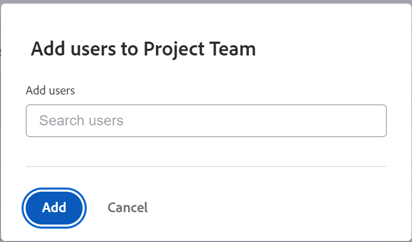

# Gerenciar a equipe do projeto

A Equipe do projeto consiste em usuários associados ao projeto. Os membros da Equipe do projeto são exibidos na seção Pessoas do projeto.

## Requisitos de acesso

<!--drafted for P&P:
<table style="table-layout:auto"> 
 <col> 
 <col> 
 <tbody> 
  <tr> 
   <td role="rowheader">Adobe Workfront plan*</td> 
   <td> 
Any
 </td> 
  </tr> 
  <tr> 
   <td role="rowheader">Adobe Workfront license*</td> 
   <td> 
Current license: Standard 

   Or
   
Legacy license: Plan 

    </td> 
  </tr> 
  <tr> 
   <td role="rowheader">Access level configurations*</td> 
   <td> 
Edit access to Projects
 
View or higher access to Users
 
<b>NOTE</b> 
   
   If you still don't have access, ask your Workfront administrator if they set additional restrictions in your access level. For information on how a Workfront administrator can modify your access level, see <a href="../../../administration-and-setup/add-users/configure-and-grant-access/create-modify-access-levels.md" class="MCXref xref">Create or modify custom access levels</a>.
 </td> 
  </tr> 
  <tr> 
   <td role="rowheader">Object permissions</td> 
   <td> 
View or higher permissions to the project
 
For information on requesting additional access, see <a href="../../../workfront-basics/grant-and-request-access-to-objects/request-access.md" class="MCXref xref">Request access to objects </a>.
 </td> 
  </tr> 
 </tbody> 
</table>
-->

Você deve ter o seguinte acesso para executar as etapas deste artigo:

<table style="table-layout:auto"> 
 <col> 
 <col> 
 <tbody> 
  <tr> 
   <td role="rowheader">plano do Adobe Workfront*</td> 
   <td> 
Qualquer
 </td> 
  </tr> 
  <tr> 
   <td role="rowheader">Licença da Adobe Workfront*</td> 
   <td> 
Plano 
 </td> 
  </tr> 
  <tr> 
   <td role="rowheader">Configurações de nível de acesso*</td> 
   <td> 
Editar acesso a projetos
 
Acesso de visualização ou superior aos usuários
 
<b>Nota</b>

Se você ainda não tiver acesso, pergunte ao administrador do Workfront se ele definiu restrições adicionais em seu nível de acesso. Para obter informações sobre como um administrador do Workfront pode modificar seu nível de acesso, consulte <a href="../../../administration-and-setup/add-users/configure-and-grant-access/create-modify-access-levels.md" class="MCXref xref">Criar ou modificar níveis de acesso personalizados</a>.
 </td>
</tr> 
  <tr> 
   <td role="rowheader">Permissões de objeto</td> 
   <td> 
Visualizar ou aumentar as permissões do projeto
 
Para obter informações sobre como solicitar acesso adicional, consulte <a href="../../../workfront-basics/grant-and-request-access-to-objects/request-access.md" class="MCXref xref">Solicitar acesso a objetos </a>.
 </td> 
  </tr> 
 </tbody> 
</table>

*Para descobrir que plano, tipo de licença ou acesso você tem, entre em contato com o administrador do Workfront.

## Adicionar usuários a uma Equipe do Projeto

Quando você adiciona usuários à equipe do projeto, eles obtêm permissões de Exibição no projeto e nas tarefas, problemas e documentos do projeto. Para obter mais informações, consulte o artigo [Visão geral da equipe do projeto](../../../manage-work/projects/planning-a-project/project-team-overview.md).

>[!TIP]
>
>Os usuários na Equipe do projeto não são adicionados automaticamente às ferramentas de gerenciamento de recursos do projeto.

Você pode adicionar usuários à equipe do projeto das seguintes maneiras:

* [Adicionar usuários automaticamente a uma equipe do projeto](#automatically-add-users-to-a-project-team)
* [Adicionar usuários manualmente a uma Equipe do Projeto](#manually-add-users-to-a-project-team)

### Adicionar usuários automaticamente a uma equipe do projeto {#automatically-add-users-to-a-project-team}

Os usuários que atendem às seguintes funções no projeto são adicionados automaticamente à equipe do projeto e aparecem na seção Pessoas quando o projeto é criado:

* O criador do projeto
* O proprietário do projeto
* O patrocinador do projeto

Os usuários também são adicionados automaticamente à equipe do projeto quando são atribuídos ao seguinte:

* Tarefas
* Problemas

### Adicionar usuários manualmente a uma Equipe do Projeto {#manually-add-users-to-a-project-team}

Se os usuários que não desempenham nenhuma função no projeto quiserem ser notificados sobre determinadas atualizações ou alterações durante a vida do projeto, você pode adicioná-las manualmente à equipe do projeto.

Para obter mais informações sobre quais notificações podem ser habilitadas para usuários na equipe do projeto, consulte [Tipos de notificação de eventos](../../../administration-and-setup/manage-workfront/emails/event-notifications-available-in-wf.md).

<!--drafted - this used to be the case, in the note below but this limitation was removed on Jan 5, 2023 - as a patch, not a release feature:

>[!IMPORTANT]
>
>You can add to the Project Team only users that belong to the Group associated with the project. You cannot add users that belong to the Subgroups of the project's group. 

-->

1. Vá para o projeto ao qual deseja adicionar usuários.

1. Clique em **Pessoas** no painel esquerdo. Talvez seja necessário clicar em **Mostrar mais** primeiro.

1. Clique em **Adicionar usuários**.

   A caixa de diálogo Adicionar usuários à equipe do projeto é exibida.

   

1. No **Adicionar usuários** comece digitando o nome de um usuário ativo do Workfront que deseja adicionar à equipe do projeto e clique no nome quando ele aparecer na lista suspensa.

   Repita esta etapa para adicionar vários usuários à equipe do projeto. Os usuários devem pertencer ao grupo associado ao projeto.

   >[!TIP]
   >
   >* Não é possível adicionar usuários adicionando suas equipes, grupos, empresas ou funções de trabalho.
   >* À medida que você adiciona os usuários, observe o avatar, a função principal do usuário e o endereço de email deles para distinguir entre usuários com nomes idênticos. Os usuários devem ser associados a pelo menos uma função de trabalho para visualizá-la à medida que forem adicionados.
   >
   >  Você deve ter a configuração Exibir informações de contato ativada no seu nível de acesso para que os usuários visualizem os emails dos usuários. Para obter informações, consulte [Conceder acesso aos usuários](../../../administration-and-setup/add-users/configure-and-grant-access/grant-access-other-users.md).

1. Clique em **Adicionar**.

   Os usuários ganham permissões de Visualização para o projeto e recebem notificações sobre o projeto como parte da equipe do projeto.

## Remover usuários de uma Equipe do Projeto

Quando você remove usuários de suas funções no projeto, eles permanecem como parte da equipe do projeto.

Se você remover um usuário da equipe do projeto e o usuário for atribuído a tarefas ou problemas no projeto, a atribuição do usuário será desfeita das tarefas e problemas que não foram concluídos. Nesse caso, as tarefas e problemas retornam à área Trabalho não atribuído no Balanceador de carga de trabalho.

Os usuários atribuídos a tarefas concluídas e problemas permanecem atribuídos mesmo após serem removidos da equipe do projeto.

Para obter mais informações sobre como remover usuários da equipe do projeto, consulte [Remover usuários dos projetos](../../../manage-work/projects/manage-projects/remove-users-from-projects.md).
