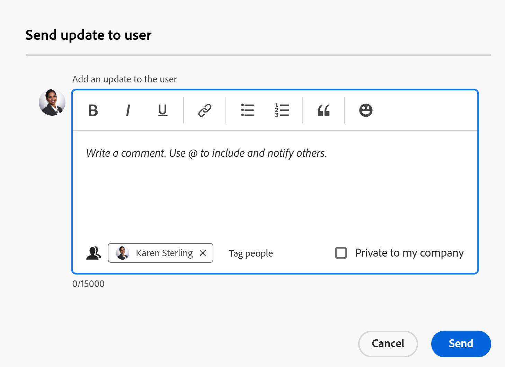

# Gerenciar a equipe do projeto

<!--take preview and production references out at production - August 7-->

<!--
 

The highlighted information on this page refers to functionality not yet generally available. It is available only in the Preview environment for all customers. The same features will also be available in the Production environment for all customers after a week from the Preview release.      

For more information, see [Interface modernization](/help/quicksilver/product-announcements/product-releases/interface-modernization/interface-modernization.md).  

-->

A Equipe do projeto consiste em usuários associados ao projeto. Para obter mais informações, consulte [Visão geral da Equipe do Projeto](/help/quicksilver/manage-work/projects/planning-a-project/project-team-overview.md).

Os membros da Equipe do projeto são exibidos na seção Pessoas do projeto.

Os usuários exibidos na seção Pessoas de um modelo de projeto se tornarão a equipe do projeto depois que o projeto for criado a partir do modelo.

Os seguintes usuários são adicionados automaticamente à equipe do projeto, para projetos e modelos:

* Proprietário
* Patrocinador
* Usuários atribuídos a tarefas
* Usuários atribuídos a problemas (somente para um projeto)

Os usuários da equipe do projeto recebem notificações sobre o projeto. Para obter mais informações, consulte [Tipos de notificação de evento](/help/quicksilver/administration-and-setup/manage-workfront/emails/event-notifications-available-in-wf.md).

Você pode gerenciar os usuários nas equipes do projeto e do modelo adicionando-os (somente para o projeto), removendo-os ou enviando a eles uma atualização.

## Requisitos de acesso

+++ Expanda para visualizar os requisitos de acesso. 

<table style="table-layout:auto"> 
 <col> 
 <col> 
 <tbody> 
  <tr> 
   <td role="rowheader">plano do Adobe Workfront*</td> 
   <td> 
Qualquer
 </td> 
  </tr> 
  <tr> 
   <td role="rowheader">Licença da Adobe Workfront*</td> 
   <td> 
Standard 

    
Plano 

    </td> 
  </tr> 
  <tr> 
   <td role="rowheader">Nível de acesso</td> 
   <td> 
Editar acesso a projetos e modelos
 
Acesso de visualização ou superior aos usuários
 </td> 
  </tr> 
  <tr> 
   <td role="rowheader">Permissões de objeto</td> 
   <td> 
Visualizar ou ter permissões mais altas para um projeto ou para um modelo
 </td> 
  </tr> 
 </tbody> 
</table>

*Para obter informações, consulte [Requisitos de acesso na documentação do Workfront](/help/quicksilver/administration-and-setup/add-users/access-levels-and-object-permissions/access-level-requirements-in-documentation.md).

+++

<!--Old access: 

You must have the following access to perform the steps in this article:

<table style="table-layout:auto"> 
 <col> 
 <col> 
 <tbody> 
  <tr> 
   <td role="rowheader">Adobe Workfront plan*</td> 
   <td> 
Any
 </td> 
  </tr> 
  <tr> 
   <td role="rowheader">Adobe Workfront license*</td> 
   <td> 
Plan 
 </td> 
  </tr> 
  <tr> 
   <td role="rowheader">Access level configurations*</td> 
   <td> 
Edit access to Projects
 
View or higher access to Users
 
<b>NOTE</b> 
   
   If you still don't have access, ask your Workfront administrator if they set additional restrictions in your access level. For information on how a Workfront administrator can modify your access level, see <a href="../../../administration-and-setup/add-users/configure-and-grant-access/create-modify-access-levels.md" class="MCXref xref">Create or modify custom access levels</a>.
 </td> 
  </tr> 
  <tr> 
   <td role="rowheader">Object permissions</td> 
   <td> 
View or higher permissions to the project
 
For information on requesting additional access, see <a href="../../../workfront-basics/grant-and-request-access-to-objects/request-access.md" class="MCXref xref">Request access to objects </a>.
 </td> 
  </tr> 
 </tbody> 
</table>

*To find out what plan, license type, or access you have, contact your Workfront administrator.

## Add users to a Project Team

When you add users to the project team, they gain View permissions on the project and the tasks, issues, and documents of the project. For more information, see the article [Project Team overview](../../../manage-work/projects/planning-a-project/project-team-overview.md).

>[!TIP]
>
>Users on the Project Team are not automatically added to the resource management tools for the project.

You can add users to the project team in the following ways:

* [Automatically add users to a Project Team](#automatically-add-users-to-a-project-team) 
* [Manually add users to a Project Team](#manually-add-users-to-a-project-team)

### Automatically add users to a Project Team {#automatically-add-users-to-a-project-team}

The users that fulfill the following roles on the project are automatically added to the project team and appear  in the People section when the project is created:

* The creator of the project
* The project owner
* The project sponsor

Users are also automatically added to the project team when they are assigned to the following:

* Tasks
* Issues

### Manually add users to a Project Team {#manually-add-users-to-a-project-team}

If users that don't fulfill any role on the project want to be notified about certain updates or changes during the life of the project, you can manually add them to the project team. 

 For more information about what notifications can be enabled for users on the project team, see [Event notification types](../../../administration-and-setup/manage-workfront/emails/event-notifications-available-in-wf.md). 

 <!--drafted - this used to be the case, in the note below but this limitation was removed on Jan 5, 2023 - as a patch, not a release feature:

>[!IMPORTANT]
>
>You can add to the Project Team only users that belong to the Group associated with the project. You cannot add users that belong to the Subgroups of the project's group. 

-->

## Gerenciar pessoas em um projeto

1. Vá para o projeto para o qual você deseja gerenciar a equipe de projeto.

   >[!TIP]
   >
   >Você deve ter usuários atribuídos a tarefas, problemas ou como participantes no projeto para que eles sejam exibidos na seção Pessoas.

1. Clique em **Pessoas** no painel esquerdo.

1. Clique em **Adicionar usuários**.

   A caixa **Adicionar usuários à Equipe do Projeto** é exibida.

   

1. Na caixa **Adicionar usuários**, comece digitando o nome de um usuário ativo do Workfront que deseja adicionar à equipe do projeto e clique no nome quando ele aparecer na lista.

   Repita esta etapa para adicionar vários usuários à equipe do projeto. Os usuários devem pertencer ao grupo associado ao projeto.

   >[!TIP]
   >
   >* Não é possível adicionar usuários adicionando suas equipes, grupos, empresas ou funções de trabalho.
   >* À medida que você adiciona os usuários, observe o avatar, a função principal do usuário e o endereço de email deles para distinguir entre usuários com nomes idênticos. Os usuários devem ser associados a pelo menos uma função de trabalho para visualizá-la à medida que forem adicionados.
   >
   >  Você deve ter a configuração Exibir informações de contato ativada no seu nível de acesso para que os usuários visualizem os emails dos usuários. Para obter informações, consulte [Conceder acesso aos usuários](../../../administration-and-setup/add-users/configure-and-grant-access/grant-access-other-users.md).

1. Clique em **Adicionar**.

   Os usuários ganham permissões de Visualização para o projeto e recebem notificações sobre o projeto como parte da equipe do projeto.

1. (Opcional) Se quiser que um usuário receba uma notificação quando sua função de trabalho for adicionada a uma tarefa, problema ou aprovação de projeto, clique dentro da coluna **Função de trabalho** do usuário e selecione uma função de trabalho que será associada à aprovação.

   Os usuários receberão notificações relacionadas às aprovações atribuídas à função de trabalho selecionada.

   Para obter mais informações, consulte a seção &quot;Aprovações baseadas em funções&quot; no artigo [Visão geral da Equipe do Projeto](/help/quicksilver/manage-work/projects/planning-a-project/project-team-overview.md).

1. Selecione um ou vários usuários na lista e clique no **ícone Remover**  para removê-los da equipe.

1. Clique em **Sim, remover usuários selecionados** para confirmar e remover os usuários.

   Os usuários são removidos e desatribuídos dos itens de trabalho incompletos.

   Para obter mais informações, consulte a seção [Considerações para remover usuários de uma equipe de projeto](#considerations-for-removing-users-from-a-project-team) neste artigo.
1. (Opcional) Para enviar uma atualização deste projeto para os usuários, clique em **Atualizar tudo** para enviar a atualização para todos na equipe

   Ou

   Selecione um ou vários usuários na lista e clique em **Enviar atualização para o usuário**.

   <!--update screen shot when they fix the bug - the text above the box needs to match the OLD box, below-->

   

   <!--Old UI for projects but the text above the comment box is right and matches the functionality):
   -->

   A caixa **Enviar atualização para o usuário** é aberta.

1. Siga um destes procedimentos:

   * Adicionar uma atualização para os usuários selecionados.
   * Clique no ícone de bloqueio para tornar a atualização privada para os usuários em sua empresa.
   * Adicione tags a usuários adicionais para receber a mesma atualização.
   * Clique em **Enviar**.

   A atualização é adicionada à seção **Atualizações** do projeto e todos os usuários selecionados são exibidos como usuários marcados.

   Os usuários podem receber uma notificação por email, se estiverem ativados para eles, e uma notificação no aplicativo sobre a nova atualização.

1. (Opcional) Clique no ícone **Exportar**  para exportar a lista de usuários para um arquivo

   Ou

   Selecione os usuários e clique no ícone **Exportar** para exportar apenas usuários específicos.

## Gerenciar pessoas em um modelo

1. Vá para o modelo para o qual você deseja gerenciar a equipe de projeto.

   >[!TIP]
   >
   >Você deve ter usuários atribuídos a tarefas ou como participantes no modelo para que eles sejam exibidos na seção Pessoas.

1. Clique em **Pessoas** no painel esquerdo.

1. Selecione um ou vários usuários na lista e clique no ícone **Remover** para removê-los da equipe.

1. Clique em **Sim, remover usuários selecionados** para confirmar e remover os usuários.

   Os usuários são removidos e desatribuídos das tarefas de modelo.

   Para obter mais informações, consulte a seção [Considerações para remover usuários de uma equipe de projeto](#considerations-for-removing-users-from-a-project-team) neste artigo.

1. (Opcional) Para enviar uma atualização aos usuários, clique em **Atualizar tudo** para enviar a atualização a todos os usuários da lista

   Ou

   Selecione um ou vários usuários na lista e clique em **Enviar atualização para o usuário**.

   <!--update screen shot for unshim production, notice the text above the box - it needs to say "Post an update to each person's profile"-->

   

   A caixa **Enviar atualização para o usuário** é aberta.

1. Faça o seguinte:

   * Adicionar uma atualização para os usuários selecionados.
   * Clique em **Marcar pessoas** para marcar usuários adicionais para receber a mesma atualização.
   * Selecione a opção **Particular para minha empresa** para tornar a atualização privada para os usuários em sua empresa.
   * Clique em **Enviar**.

   A atualização foi adicionada à seção **Atualizações** do perfil de cada usuário marcado.

   Os usuários podem receber uma notificação por email, se estiverem ativados para eles, e uma notificação no aplicativo sobre a nova atualização.

1. Clique no ícone **Exportar**  para exportar a lista de usuários para um arquivo

   Ou

   Selecione os usuários e clique no ícone **Exportar** para exportar apenas usuários específicos.

## Considerações para remover usuários de uma Equipe de projeto

Quando você remove usuários de suas funções no projeto, eles permanecem como parte da equipe do projeto.

Você deve removê-los da equipe do projeto, da seção Pessoas do projeto, para que eles parem de receber notificações enviadas à equipe do projeto.

Se você remover um usuário da equipe do projeto e o usuário for atribuído a tarefas ou problemas no projeto, a atribuição do usuário será desfeita das tarefas e problemas que não foram concluídos. Nesse caso, as tarefas e problemas retornam à área Trabalho não atribuído no Balanceador de carga de trabalho.

Os usuários atribuídos a tarefas e problemas concluídas permanecem atribuídos às tarefas e problemas, mesmo após você removê-los da equipe do projeto.

Os seguintes usuários são removidos de suas funções no projeto quando você os remove da seção Pessoas de um projeto ou modelo:

* Usuários atribuídos a tarefas incompletas
* Usuários atribuídos a problemas incompletos

Os seguintes usuários não são removidos de suas funções no projeto quando você os remove da seção Pessoas de um projeto ou de um modelo:

* Proprietário
* Patrocinador

Para obter mais informações sobre como remover usuários da equipe de projeto, consulte [Remover usuários dos projetos](../../../manage-work/projects/manage-projects/remove-users-from-projects.md).

