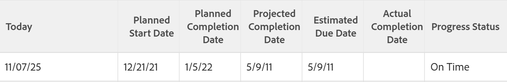
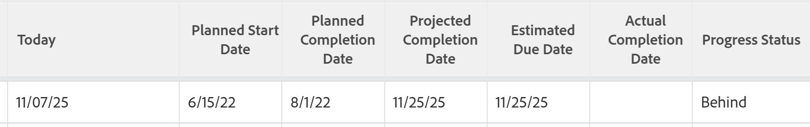

# Visão geral do status de progresso do projeto

<!--Audited: 12/2023-->

O Adobe Workfront determina o status do progresso de um projeto observando o progresso do projeto na linha do tempo. Você pode configurar o Workfront para determinar a Condição de um projeto com base no valor do Status de progresso das tarefas. Para obter mais informações sobre como configurar a Condição do projeto, consulte o artigo [Visão Geral da Condição do Projeto e do Tipo de Condição](../../../manage-work/projects/manage-projects/project-condition-and-condition-type.md).

A seguir estão os status de progresso dos projetos no Workfront:

<table style="table-layout:auto"> 
 <col> 
 <col> 
 <tbody> 
  <tr> 
   <td>No Prazo</td> 
   <td> O Status de Progresso de um projeto é <strong>No Prazo</strong> se:<ul><li>Se as Datas de Vencimento Projetadas e Estimadas forem anteriores ou iguais à Data de Término Planejada do projeto 
  
</li></ul>  </td> 
  </tr> 
  <tr> 
   <td>Em Risco</td> 
   <td> O Status de Progresso de um projeto é <strong>Em Risco</strong> se <strong>todos</strong> dos itens a seguir forem verdadeiros:<ul><li>As datas de conclusão estimada e projetada estão no futuro</li><li> A Data de Vencimento Estimada é posterior à Data de Conclusão Planejada e à Data de Conclusão Projetada 
  
</li></ul> </td> 
  </tr> 
  <tr> 
   <td>Fora do Cronograma</td> 
   <td> O status do progresso de um projeto é <strong>atrasado</strong> se <strong>todos</strong> dos itens a seguir forem verdadeiros:<ul><li>As datas de conclusão estimada e projetada estão no futuro</li><li> As datas de conclusão estimada e projetada são posteriores à data de conclusão planejada do projeto</li><li> A Data de Vencimento Estimada não é posterior à Data de Conclusão Projetada
   
  
</li></ul>  </td> 
  </tr> 
  <tr> 
   <td>Atrasado</td> 
   <td> 
     O Status de Progresso de um projeto é <strong>Atrasado</strong> se <strong>qualquer um</strong> dos itens a seguir for verdadeiro:<ul><li>O projeto estiver concluído e a Data de conclusão efetiva for posterior à Data de conclusão planejada 
  
 </li> 
     <li> 
O projeto não está concluído e a Data de conclusão planejada do projeto está no passado 
  
 </li> 
    </ul> </td> 
  </tr> 
 </tbody> 
</table>

Considere o seguinte:

* A Data de conclusão projetada do projeto é orientada pela tarefa no Caminho Crítico com a Data de conclusão projetada mais recente.
* A Data de vencimento estimada do projeto é orientada pela tarefa no Caminho Crítico com a Data de vencimento estimada mais recente.

Para obter informações sobre o Caminho Crítico do projeto, consulte [Visão Geral do Caminho Crítico do projeto](../../../manage-work/tasks/manage-tasks/critical-path.md).

Para obter informações sobre Datas de Término Projetadas, consulte [Visão geral da Data de Término Projetada para projetos, tarefas e problemas](../../../manage-work/projects/planning-a-project/project-projected-completion-date.md).
