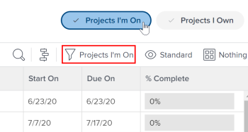

# Visão geral da equipe do projeto

<!-- Audited: 6/2025 -->

Uma equipe de projeto consiste em usuários associados a um projeto em alguma capacidade. Usuários listados na seção Pessoas de um projeto formam a equipe do projeto. Por exemplo, os usuários atribuídos para trabalhar no projeto ou o proprietário do projeto fazem parte da equipe do projeto.

Os seguintes usuários em um modelo de projeto fazem parte da equipe do projeto futuro depois que o projeto é criado usando o modelo:

* Usuários atribuídos para trabalhar (tarefas e problemas) no modelo.
* O proprietário ou patrocinador do modelo.

Os usuários que fazem parte da futura equipe de projeto em um modelo são exibidos na seção Pessoas do modelo.

## Membros da Equipe do Projeto

Você pode atribuir usuários a uma equipe de projeto manual ou automaticamente. Para obter mais informações, consulte a seção Adicionar usuários a uma Equipe do Projeto no artigo [Gerenciar a Equipe do Projeto](../../../manage-work/projects/planning-a-project/manage-project-team.md).

Quando você adiciona usuários manualmente à Equipe do projeto, eles recebem permissões de exibição para o projeto, bem como tarefas, problemas e documentos do projeto.

## Notificações para membros da equipe do projeto

Dependendo das notificações por email ativadas pelo administrador do Adobe Workfront, os usuários de uma equipe de projeto são notificados sobre várias ações em um projeto.

Para obter mais informações, consulte também os seguintes artigos:

* [Tipos de notificação de evento](/help/quicksilver/administration-and-setup/manage-workfront/emails/event-notifications-available-in-wf.md)

* [Configurar notificações de eventos para todos no sistema](../../../administration-and-setup/manage-workfront/emails/configure-event-notifications-for-everyone-in-the-system.md)

>[!NOTE]
>
>Mantenha a associação da equipe do projeto atualizada para evitar o envio de notificações a usuários que não precisam de informações sobre um projeto.

## Aprovações baseadas em função

Para usar aprovações com base em funções em um projeto, os usuários devem ser atribuídos à equipe do projeto e ter a função de trabalho correta atribuída em seu perfil de usuário.

Consulte os seguintes artigos para obter informações sobre como adicionar um usuário à equipe do projeto e como atribuir uma função de trabalho a eles:

* [Gerenciar a Equipe do Projeto](../../../manage-work/projects/planning-a-project/manage-project-team.md)
* [Editar o perfil de um usuário](../../../administration-and-setup/add-users/create-and-manage-users/edit-a-users-profile.md)

Se você não quiser exigir que o usuário esteja na equipe do projeto para aprovações baseadas em função, será possível controlar isso nas configurações de aprovação. Para obter mais informações, consulte [Definir configurações de aprovação global](../../../administration-and-setup/customize-workfront/configure-approval-milestone-processes/establish-approval-settings.md).

## Filtro de Projetos em que estou trabalhando

Se um usuário estiver listado na área Pessoas de um projeto, esse projeto aparecerá quando ele aplicar o filtro Projetos em que estou em uma lista de projetos ou relatório de projeto.

Você pode ver se o filtro Projetos em que estou trabalhando está selecionado no cabeçalho da área Projetos. Você pode aplicá-lo a partir do painel Filtros ou do cabeçalho.

>[!NOTE]
>
>Se você for o criador de um projeto, o projeto permanecerá listado na lista Projetos em que estou, mesmo se seu nome não aparecer na área Pessoas do projeto ou se seu nome tiver sido removido dessa lista.
