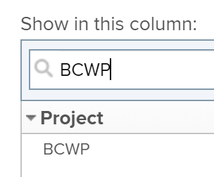

# Calcular o Custo Orçamentado do Trabalho Executado (BCWP)

## Visão Geral do Custo Orçamentado do Trabalho Executado (BCWP)

Também conhecido como Valor Ganhado, o Custo do Trabalho Executado Previsto no Orçamento (BCWP) é uma métrica de desempenho do projeto que representa o valor da tarefa realmente concluída no momento em que essa métrica é calculada.

A Adobe Workfront calcula o custo orçado do trabalho executado (BCWP) para projetos e tarefas.

Considere o seguinte ao revisar os valores do BCWP em uma tarefa ou projeto:

* A Workfront calcula o BCWP para uma tarefa com base na sua configuração do Método de Índice de Desempenho (PMI) do projeto.

   Você pode configurar seu projeto para calcular o PMI usando horas ou custo e o BCWP também é calculado usando os mesmos valores.

   Para obter informações sobre como configurar como o BCWP é calculado, consulte a seção [Configurar como o BCWP é calculado](#configure-how-bcwp-is-calculated) neste artigo.

* A Workfront calcula o BCWP para um projeto adicionando todos os valores de BCWP de todas as tarefas principais e tarefas individuais no projeto.

   Os valores das tarefas filho não são adicionados ao BCWP do projeto.

## Requisitos de acesso

Você deve ter o seguinte acesso para executar as etapas neste artigo:

<table style="table-layout:auto"> 
 <col> 
 <col> 
 <tbody> 
  <tr> 
   <td role="rowheader">Plano Adobe Workfront*</td> 
   <td> <p>Qualquer Um</p> </td> 
  </tr> 
  <tr> 
   <td role="rowheader">Licença da Adobe Workfront*</td> 
   <td> <p>Plano </p> </td> 
  </tr> 
  <tr> 
   <td role="rowheader">Configurações de nível de acesso*</td> 
   <td> <p>Editar acesso a Projetos</p> <p>Caso ainda não tenha acesso, pergunte ao administrador do Workfront se ele definiu restrições adicionais em seu nível de acesso. Para obter informações sobre como um administrador do Workfront pode modificar seu nível de acesso, consulte <a href="../../../administration-and-setup/add-users/configure-and-grant-access/create-modify-access-levels.md" class="MCXref xref">Criar ou modificar níveis de acesso personalizados</a>.</p> </td> 
  </tr> 
  <tr> 
   <td role="rowheader">Permissões de objeto</td> 
   <td> <p>Gerenciar permissões do projeto</p> <p>Para obter informações sobre como solicitar acesso adicional, consulte <a href="../../../workfront-basics/grant-and-request-access-to-objects/request-access.md" class="MCXref xref">Solicitar acesso a objetos </a>.</p> </td> 
  </tr> 
 </tbody> 
</table>

&#42;Para descobrir qual plano, tipo de licença ou acesso você tem, entre em contato com o administrador da Workfront.

## Configurar como o BCWP é calculado {#configure-how-bcwp-is-calculated}

Você pode configurar se o BCWP é calculado em horas ou custos, configurando como o Método de Índice de Desempenho (PIM) do projeto é calculado.

1. Acesse um projeto e expanda **Detalhes do projeto** no painel esquerdo.
1. No **Finanças** localize a **Método do Índice de Desempenho** e clique duas vezes para editá-lo.

   

1. Selecione dentre as seguintes opções:

   | Opção | Como o cálculo é executado |
   |---|---|
   | Baseado em Hora | A Workfront calcula o BCWP usando as Horas Planejadas das tarefas. |
   | Baseado em Custo | A Workfront calcula o BCWP usando o custo planejado das tarefas. |

1. Clique em **Salvar alterações**.

O valor de BCWP das tarefas do projeto é calculado em horas ou custos.

## Calcular BCWP

A Workfront calcula o Custo do Trabalho Executado (BCWP) Orçado para uma tarefa ou projeto usando as seguintes fórmulas:

```
Task BCWP = Actual Percent Complete x Task Budget
```

```
Project BCWP = SUM(BCWP values of all parent and individual tasks)
```

Os seguintes valores são usados neste cálculo:

| Valor usado | Descrição do valor utilizado |
|---|---|
| Porcentagem Real Concluída | Essa é a porcentagem real concluída da tarefa, conforme ela aparece no Workfront. |
| Orçamento da Tarefa | Esse é o valor para as Horas Planejadas ou o Custo Planejado da tarefa. |

Por exemplo, se a porcentagem real de conclusão da tarefa for de 25% e o Orçamento da Tarefa ou o Custo Planejado for de US$ 10.000, o BCWP da tarefa será:

```
BCWP = 25% x $10,000 = $2,500
```

## Localize o BCWP para um projeto ou uma tarefa

Você pode exibir o valor do Custo do Trabalho Executado no Orçamento em um relatório ou lista, adicionando a coluna BCWP à sua visualização.

1. Vá para uma lista de tarefas ou projetos.
1. Expanda o **Exibir** e selecione **Nova exibição** ou **Personalizar exibição**.

1. Clique em **Adicionar coluna**.
1. No **Mostrar nesta coluna:** digitação de início de campo **BCWP** e clique em para selecioná-lo quando for exibido na lista.

   

1. Clique em **Salvar exibição**.
1. O campo BCWP é exibido na visualização.
