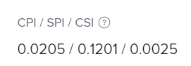

# Calcular Índice de Desempenho de Agendamento (SPI)

<!--
<p data-mc-conditions="QuicksilverOrClassic.Draft mode">(NOTE: Linked to the product. Do not change link.)</p>
-->

O Índice de Desempenho de Cronograma (SPI) descreve a relação entre o cronograma planejado e o cronograma real. O Adobe Workfront calcula a SPI nos níveis de projeto e tarefa. Os gerentes de projeto analisam essa métrica para identificar se as tarefas ou os projetos estão atualmente rastreando antes ou depois do cronograma.

## Requisitos de acesso

+++ Expanda para visualizar os requisitos de acesso para a funcionalidade neste artigo.

<table style="table-layout:auto"> 
 <col> 
 <col> 
 <tbody> 
  <tr> 
   <td>Pacote do Adobe Workfront</td> 
   <td>Qualquer</td> 
  </tr> 
  <tr> 
   <td>Licença do Adobe Workfront</td> 
   <td>
   <p>Leve ou superior</p>
   <p>Revisar ou superior</p></td>  
  </tr> 
  <tr> 
   <td>Configurações de nível de acesso</td> 
   <td>Exibir acesso a Projetos e Dados Financeiros</td> 
  </tr> 
  <tr> 
   <td>Permissões de objeto</td> 
   <td>Exibir ou permissões mais altas para o projeto com permissões para Exibir Finanças</td> 
  </tr> 
 </tbody> 
</table>

Para obter informações, consulte [Requisitos de acesso na documentação do Workfront](/help/quicksilver/administration-and-setup/add-users/access-levels-and-object-permissions/access-level-requirements-in-documentation.md).

+++

## Visão geral do Índice de desempenho de cronograma (SPI)

* [O que o valor SPI mostra](#what-the-spi-value-shows)
* [Como o Workfront calcula a SPI](#how-workfront-calculates-spi)

### O que o valor SPI mostra {#what-the-spi-value-shows}

Os gerentes de projeto entendem que um valor de SPI de 1 significa que o projeto está no plano ou dentro da programação.  Valores maiores que 1 indicam que um projeto está adiantado em relação ao cronograma e valores menores que 1 significam que um projeto está atrasado.  Quanto mais distante de 1, maior o desvio em relação ao plano.

| **Valor SPI** | **Indicação de &quot;Na Programação&quot;** |
|---|---|
| 1 | Planejado ou programado |
| > 1 (maior que 1) | Antes do agendamento |
| &lt; 1 (menos de 1) | Fora do cronograma |

{style="table-layout:auto"}

### Como o Workfront calcula a SPI  {#how-workfront-calculates-spi}

O Workfront calcula o SPI pela seguinte fórmula:

```
SPI = (Total Planned Hours x % Complete) / Planned Hours Scheduled to Date*
```

*&#42;Se as Horas Planejadas Programadas até o Momento = 0, SPI = 1*.

O Agendamento de Horas Planejadas até a Data é calculado no minuto em que você executa os cálculos. Ela mostra o número de Horas Planejadas planejadas até a data atual. Ele pode ser recalculado automaticamente quando você altera os dados financeiros para que sejam precisos. Não há um campo no Workfront que indique esse valor.

Por exemplo, se você tiver um projeto com 1 tarefa e a tarefa tiver 10 horas planejadas e uma Duração de 10 dias, o Cronograma de Horas Planejadas para Data no 5º dia será 5. 

## Localizar SPI em um projeto ou tarefa

1. Vá para o projeto ou tarefa em que deseja exibir a SPI.
1. Dependendo de você querer ou não exibir a SPI em um projeto ou em uma tarefa, execute um dos seguintes procedimentos:

   1. Clique em **Detalhes do projeto** no painel esquerdo e exiba a área **Finanças**.

   1. Clique em **Detalhes da tarefa** no painel esquerdo e exiba a área **Finanças**.

      

1. Localize o campo **CPI/ SPI/ CSI**.
