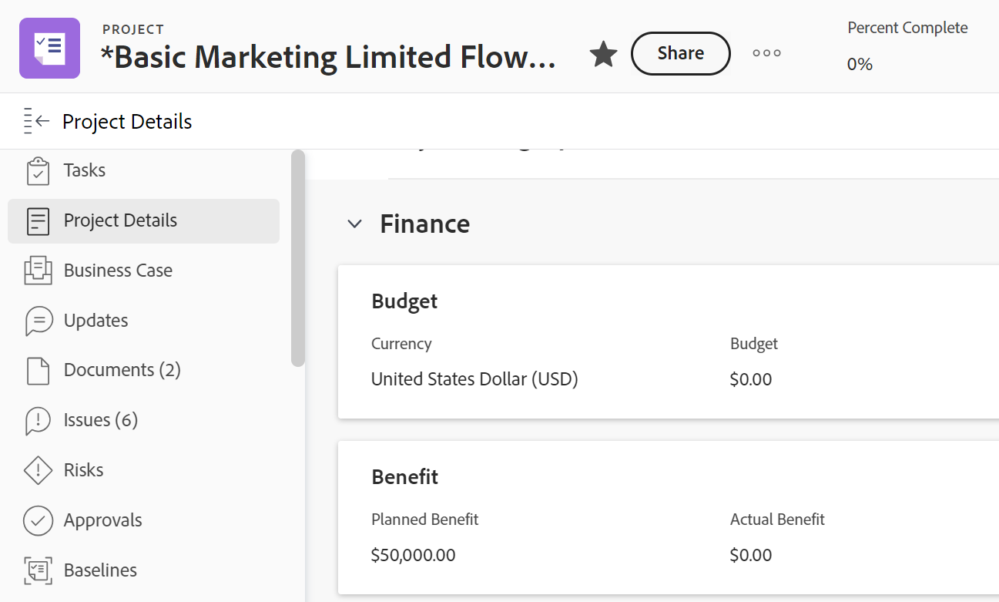

# Gerenciar informações na área de finanças do projeto

<!--

(NOTE: some information in here is duplicated in Edit projects. If you need to update one of the fields in this area, do it in both places.)

-->

É possível exibir ou editar as informações financeiras de um projeto acessando a área Finanças da seção Detalhes do Projeto. Há um número limitado de campos que você pode exibir ou editar nessa área. Para obter informações sobre como editar todas as informações de um projeto, consulte [Editar projetos](../../../manage-work/projects/manage-projects/edit-projects.md).

## Requisitos de acesso

+++ Expanda para visualizar os requisitos de acesso para a funcionalidade neste artigo.

Você deve ter o seguinte acesso para executar as etapas deste artigo:

<table style="table-layout:auto"> 
 <col> 
 <col> 
 <tbody> 
  <tr> 
   <td role="rowheader">plano do Adobe Workfront</td> 
   <td>Qualquer</td> 
  </tr> 
  <tr> 
   <td role="rowheader">Licença do Adobe Workfront</td>
   <td>
   
Novo: Claro ou superior

   
ou

   
Atual: revisão ou superior
</td> 
  </tr> 
  <tr> 
   <td role="rowheader">Configurações de nível de acesso</td> 
   <td> 
Visualização ou maior acesso a Projetos e Dados Financeiros
 
Editar acesso a Projetos e Dados Financeiros para editar informações financeiras sobre o projeto
</td> 
  </tr> 
  <tr> 
   <td role="rowheader">Permissões de objeto</td> 
   <td> 
Exibir permissões para um projeto ou superior que incluem permissões de Finanças de Exibição
 
Gerenciar permissões para o projeto que incluem Gerenciar Finanças para editar informações financeiras do projeto
 </td> 
  </tr> 
 </tbody> 
</table>

Para obter mais detalhes sobre as informações nesta tabela, consulte [Requisitos de acesso na documentação do Workfront](/help/quicksilver/administration-and-setup/add-users/access-levels-and-object-permissions/access-level-requirements-in-documentation.md).

+++

## Visão geral da área Financeira

Considere o seguinte ao exibir ou editar informações na área Financeira:

* As informações financeiras que você pode encontrar na área Finanças de Detalhes do Projeto representam valores acumulados no nível do projeto a partir de tarefas, bem como informações inseridas diretamente no projeto. Algumas informações financeiras podem ser gerenciadas tanto no nível do projeto quanto no nível da tarefa.
* Você deve ter permissões de Visualização no projeto, bem como acesso a Dados Financeiros no seu nível de acesso para poder visualizar a área Financeira em um projeto.
* Você deve ter permissões de gerenciamento no projeto, bem como acesso aos dados financeiros do seu nível de acesso para poder editar as informações na área de finanças. No entanto, recomendamos que somente o Proprietário do projeto edite as informações nessa área.

## Exibir informações financeiras em um projeto

1. Ir para um projeto.
1. Clique em **Detalhes do projeto** no painel esquerdo.
1. Clique no ícone **Editar**  no canto superior direito da seção Detalhes e em **Finanças**.

   

   >[!NOTE]
   >
   >Dependendo de como o administrador do Workfront configurou o Modelo de layout, a seção Visão geral pode não estar listada primeiro e, nesse caso, ela será recolhida. Para obter informações, consulte [Personalizar o modo de exibição de Detalhes usando um modelo de layout](../../../administration-and-setup/customize-workfront/use-layout-templates/customize-details-view-layout-template.md).

1. Exiba os seguintes campos na área Finanças do projeto:

   <table style="table-layout:auto"> 
    <col> 
    <col> 
    <tbody> 
     <tr> 
      <td role="rowheader">Método Índice de desempenho</td> 
      <td> Controla o método que o Workfront usa para calcular as métricas de Valor agregado. Pode ser baseada em horas ou em custos.  Para obter mais informações sobre o PIM, consulte o artigo <a href="../../../manage-work/projects/project-finances/set-pim.md" class="MCXref xref">Definir o Método de Índice de Desempenho (PIM)</a></td> 
     </tr> 
     <tr> 
      <td role="rowheader">CPI/SPI/CSI</td> 
      <td> 
Estas são as métricas de desempenho do projeto que mostram o desempenho do seu projeto em um determinado momento. Seus valores são calculados com base no Método de indexação de desempenho. Para obter mais informações, consulte os seguintes artigos: 
 
       <ul> 
        <li> 
<a href="../../../manage-work/projects/project-finances/calculate-cpi.md" class="MCXref xref">Calcular Índice de Desempenho de Custo (CPI)</a> 
 </li> 
        <li> 
<a href="../../../manage-work/projects/project-finances/calculate-spi.md" class="MCXref xref">Calcular SPI (Índice de Desempenho de Agendamento) </a> 
 </li> 
        <li> 
<a href="../../../manage-work/projects/project-finances/calculate-csi.md" class="MCXref xref">Calcular CSI (Índice de Desempenho de Agendamento de Custos)</a> 
 </li> 
       </ul> </td> 
     </tr> 
     <tr> 
      <td role="rowheader">Calcular ao concluir</td> 
      <td> Custo total projetado do seu projeto, representado em horas se o Método de Índice de Desempenho (PIM) for baseado em horas, e é representado em um valor de moeda, se o Método de Índice de Desempenho (PIM) for baseado em custo. Para obter mais informações sobre como calcular a Estimativa no Término, consulte o artigo <a href="../../../manage-work/projects/project-finances/calculate-eac.md" class="MCXref xref">Calcular a Estimativa no Término (EAC)</a></td> 
     </tr> 
     <tr> 
      <td role="rowheader">Orçamento</td> 
      <td>Este é o orçamento definido para o projeto. Isso é especificado manualmente pelo Proprietário do projeto.</td> 
     </tr> 
     <tr> 
      <td role="rowheader">Custo Fixo</td> 
      <td>Esses são os custos fixos do projeto, independentemente de outras atividades do projeto. Elas são inseridas manualmente pelo Proprietário do projeto.</td> 
     </tr> 
     <tr> 
      <td role="rowheader">Custo Planejado</td> 
      <td>O custo estimado do projeto, com base nas Horas Planejadas e nas taxas associadas aos atribuídos da tarefa (funções de trabalho ou usuários).</td> 
     </tr> 
     <tr> 
      <td role="rowheader">Custo Efetivo</td> 
      <td>Todos os custos do projeto. O Custo Real é a soma de todos os custos reais: custo de mão de obra (com base nas Horas Reais e nas taxas associadas às funções de trabalho ou aos usuários que as registram), despesas e custos fixos, que podem ser associados a um projeto ou tarefa.</td> 
     </tr> 
     <tr> 
      <td role="rowheader">Receita com Valor Fixo</td> 
      <td>Defina a receita esperada com base no cronograma do projeto. Receita Fixa é especificada manualmente pelo Proprietário do Projeto.</td> 
     </tr> 
     <tr> 
      <td role="rowheader">Receita Planejada</td> 
      <td>Receita projetada esperada com base nas Horas planejadas e nas taxas associadas às tarefas atribuídas (funções de trabalho ou usuários).</td> 
     </tr> 
     <tr> 
      <td role="rowheader">Receita efetiva</td> 
      <td>Receita real do projeto com base nas Horas efetivas e nas taxas associadas aos atribuídos da tarefa (funções de trabalho ou usuários).</td> 
     </tr> 
     <tr> 
      <td role="rowheader">Receita Faturada</td> 
      <td> 
Receita cobrada de clientes ou outras partes capturada nos Registros de cobrança. Para obter mais informações sobre registros de cobrança, consulte o artigo <a href="../../../manage-work/projects/project-finances/create-billing-records.md" class="MCXref xref">Criar registros de cobrança</a>. 
 </td> 
     </tr> 
     <tr> 
      <td role="rowheader"> </td> 
      <td> </td> 
     </tr> 
     <tr> 
      <td role="rowheader"> </td> 
      <td> </td> 
     </tr> 
    </tbody> 
   </table>

## Editar informações financeiras de um projeto

Como um Proprietário do projeto, você pode editar as informações na subguia Finanças de um projeto.

Para editar informações na subguia Project Finance:

1. Vá para um projeto do qual você é o proprietário.

   >[!NOTE]
   >
   >Você precisa de Permissões de gerenciamento para o projeto para executar as etapas a seguir. Também recomendamos que somente o Proprietário do projeto faça alterações na subguia Finanças do projeto.

1. Clique em **Detalhes do projeto** no painel esquerdo.
1. Clique no ícone **Editar**  no canto superior direito da seção Detalhes e em **Finanças**. Isso abre a área Finanças para edição.
1. Edite qualquer campo disponível para edição clicando uma vez no campo ou clicando em **+Adicionar** para adicionar informações a um campo vazio.

   >[!TIP]
   >
   >Os campos não estarão disponíveis para edição se forem calculados automaticamente pelo Workfront ou se você não tiver permissões de edição.

   

1. Atualize qualquer um dos campos abaixo.

   >[!NOTE]
   >
   >Dependendo de como o administrador do Workfront configura nosso Modelo de layout, os campos na seção Detalhes do projeto podem ser diferentes em seu ambiente. Para obter informações, consulte [Personalizar o modo de exibição de Detalhes usando um modelo de layout](../../../administration-and-setup/customize-workfront/use-layout-templates/customize-details-view-layout-template.md).

   <table style="table-layout:auto"> 
    <col> 
    <col> 
    <tbody> 
     <tr> 
      <td role="rowheader">Método Índice de desempenho</td> 
      <td> 
Controla o método que o Workfront usa para calcular as métricas de desempenho do projeto. Isso é configurado no nível do sistema pelo administrador, mas você também pode editá-lo no nível do projeto. Considere selecionar uma das seguintes opções:
 
       <ul> 
        <li><strong>Baseado em Hora:</strong>O Workfront usa as Horas Planejadas no cálculo da CPI e da EAC do projeto, e a EAC do projeto é exibida como um número, em horas. </li> 
        <li><strong>Baseado em Custo:</strong>O Workfront usa o Custo de Trabalho Planejado no cálculo do CPI e do EAC do projeto, e o EAC é exibido como um valor de moeda. Ao selecionar essa opção, certifique-se de que os atribuídos da tarefa (funções de cargo ou usuários) estejam associados a taxas de custo.</li> 
       </ul> </td> 
     </tr> 
     <tr> 
      <td role="rowheader">Calcular ao concluir</td> 
      <td> 
Representa o custo total projetado de seu projeto ou tarefa quando ela é concluída. Isso é configurado no nível do sistema pelo administrador, mas você também pode editá-lo no nível do projeto. Considere selecionar uma das seguintes opções:
 
       <ul> 
        <li><strong>Calcular no Nível do Projeto</strong>: a EAC da tarefa pai e do projeto é determinada pela inserção das horas reais/custo de mão de obra real nas Fórmulas da EAC. Esse cálculo inclui Horas Reais/custos e despesas adicionadas diretamente à tarefa ou ao projeto principal.</li> 
        <li><strong>Acúmulo de Tarefas/Subtarefas</strong>: o EAC da tarefa pai e do projeto é determinado pela soma do EAC de cada tarefa filho. Esse cálculo exclui Horas Reais/custos e despesas adicionadas diretamente à tarefa ou ao projeto principal.</li> 
       </ul> </td> 
     </tr> 
     <tr> 
      <td role="rowheader">Orçamento</td> 
      <td>Especifique o orçamento para este projeto.</td> 
     </tr> 
     <tr> 
      <td role="rowheader">Custo Fixo</td> 
      <td>Especifique o custo fixo para este projeto. Isso não deve incluir custos de mão de obra ou despesas.</td> 
     </tr> 
     <tr> 
      <td role="rowheader">Receita com Valor Fixo</td> 
      <td> 
Especifique a receita fixa deste projeto. Isso não deve incluir a receita proveniente de quaisquer registros de faturamento cobrados de parceiros ou terceiros.
 </td> 
     </tr> 
     <tr> 
      <td role="rowheader">Moeda do projeto</td> 
      <td> 
Especifique uma moeda para este projeto, se for diferente da moeda padrão no sistema. A moeda padrão em seu sistema é definida pelo administrador do Workfront. Para obter mais informações sobre como configurar taxas de câmbio no Workfront, consulte o artigo <a href="../../../administration-and-setup/manage-workfront/exchange-rates/set-up-exchange-rates.md" class="MCXref xref">Configurar taxas de câmbio</a>.
 </td> 
     </tr>
    </tbody> 
   </table>

1. Clique em **Salvar alterações**.
