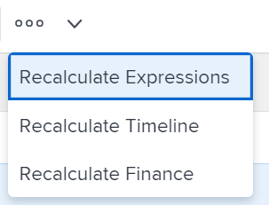

# Recalcular as finanças do projeto

As finanças são calculadas em um projeto à medida que ocorrem alterações nas horas registradas para o projeto ou nas taxas usadas para calcular custos e receita.

## Requisitos de acesso

+++ Expanda para visualizar os requisitos de acesso para a funcionalidade neste artigo.

Você deve ter o seguinte acesso para executar as etapas deste artigo:

<table style="table-layout:auto"> 
 <col> 
 <col> 
 <tbody> 
  <tr> 
   <td role="rowheader">plano do Adobe Workfront</td> 
   <td>Qualquer </td> 
  </tr> 
  <tr> 
   <td role="rowheader">Licença da Adobe Workfront*</td> 
   <td>
   
Novo: Padrão

   
ou

   
Atual: Plano
</td> 
  </tr> 
  <tr> 
   <td role="rowheader">Configurações de nível de acesso</td> 
   <td>Editar acesso a Projetos e Dados Financeiros</td> 
  </tr> 
  <tr> 
   <td role="rowheader">Permissões de objeto</td> 
   <td>Gerenciar permissões do projeto com permissões para Gerenciar Finanças</td> 
  </tr> 
 </tbody> 
</table>

Para obter mais detalhes sobre as informações nesta tabela, consulte [Requisitos de acesso na documentação do Workfront](/help/quicksilver/administration-and-setup/add-users/access-levels-and-object-permissions/access-level-requirements-in-documentation.md).

+++

## Considerações sobre o cálculo de finanças no Adobe Workfront

As finanças são calculadas para projetos das seguintes maneiras:

* Você pode recalcular manualmente custos e receitas em um projeto usando a opção Recalcular Finanças em um projeto.
* Além disso, algumas ações acionam um recálculo automático.

Quando a taxa de um usuário ou função é alterada durante a vida útil de um projeto, o seguinte pode ocorrer:

* Quando a alteração é feita, a taxa atualizada é usada a partir desse ponto, pois as horas são registradas e as informações financeiras são calculadas. A alteração da taxa não afeta como as coisas foram calculadas antes da alteração ser feita. Para todas as horas existentes registradas, a taxa antiga é usada para calcular as informações financeiras.
* Você pode forçar o Adobe Workfront a usar a nova taxa retroativamente para todas as horas registradas até o momento, usando a opção Recalcular Finanças. Isso força o Workfront a recalcular retroativamente todas as horas, custos planejados e receitas inseridos anteriormente de acordo com as novas informações de taxas.

O Projeto de tipo de relatório (Dados financeiros) não executa automaticamente um recálculo dos dados financeiros. Para atualizar os dados neste tipo de relatório, você deve recalcular manualmente as finanças de projetos individuais.

>[!CAUTION]
>
>Antes de recalcular manualmente as finanças de um determinado projeto, convém preservar os dados financeiros que já foram calculados em uma taxa anterior. Recomendamos o uso da opção Recalcular Finanças somente quando tiver certeza de que não está fazendo alterações nas informações existentes ou somente quando tais alterações forem desejadas.

## Preservar dados financeiros para tarefas com horas existentes {#preserve-financial-data-for-tasks-with-existing-hours}

Quando os dados financeiros de um projeto são recalculados, o Workfront recalcula retroativamente todas as horas registradas anteriormente, os custos planejados e reais e a receita planejada e real, de acordo com qualquer informação financeira nova ou atualizada.

* [Preservar Receita do Projeto](#preserve-project-revenue)
* [Preservar Custo do Projeto](#preserve-project-cost)

### Preservar Receita do Projeto  {#preserve-project-revenue}

As taxas de receita podem mudar durante a vida útil de um projeto.

Para obter mais informações sobre taxas de cobrança e receita, consulte o artigo [Visão Geral de Faturamento e Receita](../../../manage-work/projects/project-finances/billing-and-revenue-overview.md).

As taxas de receita podem mudar nos seguintes níveis:

* O nível do sistema (para funções de trabalho)\
  Para obter mais informações sobre como criar funções de trabalho com taxas de cobrança no nível do sistema, consulte o artigo [Criar e gerenciar funções de trabalho](../../../administration-and-setup/set-up-workfront/organizational-setup/create-manage-job-roles.md).

* O nível de usuário\
  Para obter mais informações sobre como alterar as informações de taxa de cobrança dos usuários, consulte o artigo [Editar perfil de usuário](../../../administration-and-setup/add-users/create-and-manage-users/edit-a-users-profile.md).

* O nível da Empresa (para funções de trabalho)\
  Para obter mais informações, consulte [Substituir taxas de cobrança de função de trabalho no nível da empresa](../../../administration-and-setup/set-up-workfront/organizational-setup/override-job-role-billing-rates-company-level.md).

* O nível do projeto (para funções de trabalho)\
  Para obter mais informações sobre substituição de taxas de função de trabalho no nível do projeto, consulte o artigo [Visão geral da substituição de taxas de cobrança de função de trabalho e cálculo de Receita em um projeto](../../../manage-work/projects/project-finances/override-role-billing-rates-and-calculate-project-revenue.md).

Por exemplo, a taxa de faturamento de um usuário muda durante o curso de um projeto de US$ 50 para US$ 75 por hora e você deseja que todos os dados existentes permaneçam calculados na taxa antiga (US$ 50 e hora). No entanto, quando as finanças do projeto são recalculadas, as tarefas que já têm dados financeiros existentes terão a receita atualizada para refletir a nova taxa de cobrança (de US$ 75 por hora).

* [Preserve a receita do projeto criando um registro de cobrança](#preserve-project-revenue-by-creating-a-billing-record)
* [Preservar Receita do Projeto usando várias sobreposições de Taxa de Faturamento](#preserve-project-revenue-by-using-multiple-billing-rate-overrides)

#### Preservar a receita do projeto criando um registro de cobrança {#preserve-project-revenue-by-creating-a-billing-record}

Quando as taxas de faturamento são alteradas em qualquer nível mencionado acima, é possível preservar a receita existente que já foi calculada no projeto, evitando o uso da opção Recalcular Finanças manual ou bloqueando o tempo registrado no projeto e calculado usando a taxa antiga em um registro de faturamento com status Faturado.

Quando você não recalcula as finanças do projeto ou quando bloqueia as horas registradas em um registro de cobrança faturado, as horas registradas após as alterações de taxa serão calculadas com a nova taxa e as horas registradas antes das alterações de taxa de custo permanecerão calculadas na taxa antiga.

Para obter mais informações sobre como criar registros de cobrança, consulte o artigo [Criar registros de cobrança](../../../manage-work/projects/project-finances/create-billing-records.md).

#### Preservar Receita do Projeto usando várias sobreposições de Taxa de Faturamento {#preserve-project-revenue-by-using-multiple-billing-rate-overrides}

Quando as taxas de faturamento são alteradas para funções de trabalho no nível do projeto, é possível preservar a receita existente que já foi calculada no projeto usando várias sobreposições de taxas de faturamento que estão bloqueadas em um intervalo de tempo especificado.

Para obter mais informações sobre o uso de substituições de várias taxas de cobrança, consulte o artigo [Visão geral da substituição de Taxas de cobrança de função de trabalho e cálculo de Receita em um projeto](../../../manage-work/projects/project-finances/override-role-billing-rates-and-calculate-project-revenue.md).

>[!NOTE]
>
>Isso se aplica somente às taxas de faturamento de função de trabalho alteradas no nível do projeto.

### Preservar Custo do Projeto {#preserve-project-cost}

As taxas de custo podem mudar nos seguintes níveis:

* Nível do sistema (para funções de trabalho)\
  Para obter mais informações sobre como criar funções de trabalho com taxas de custo no nível do sistema, consulte o artigo [Criar e gerenciar funções de trabalho](../../../administration-and-setup/set-up-workfront/organizational-setup/create-manage-job-roles.md).

* Nível do usuário\
  Para obter mais informações sobre como alterar as informações de taxa de custo dos usuários, consulte o artigo [Editar perfil de usuário](../../../administration-and-setup/add-users/create-and-manage-users/edit-a-users-profile.md).

Quando as taxas de faturamento são alteradas em qualquer nível mencionado acima, é possível preservar os custos existentes que já foram calculados no projeto, bloqueando o tempo registrado no projeto e calculado usando a taxa antiga em um registro de faturamento com status Faturado. Para obter mais informações sobre como criar registros de cobrança, consulte o artigo [Criar registros de cobrança](../../../manage-work/projects/project-finances/create-billing-records.md).

Você também pode evitar o uso da opção manual Recalcular Finanças se não quiser criar um registro de cobrança, conforme descrito na seção [Recalcular manualmente as finanças de um projeto](#manually-recalculate-finances-for-a-project) deste artigo.

Quando você não recalcula as finanças do projeto ou quando bloqueia as horas registradas em um registro de cobrança faturado, as horas registradas após as alterações de taxa serão calculadas com a nova taxa e as horas registradas antes das alterações de taxa de custo permanecerão calculadas na taxa antiga.

## Recalcular manualmente as finanças de um projeto {#manually-recalculate-finances-for-a-project}

Se as taxas forem alteradas durante a vida útil de um projeto e você quiser que os cálculos de custo e receita reflitam as novas taxas, será necessário recalcular manualmente as finanças do projeto.

>[!NOTE]
>
>Você pode impedir que os valores de receita sejam atualizados para refletir as novas taxas ao recalcular manualmente as finanças seguindo as etapas na seção [Preservar dados financeiros para tarefas com horas existentes](#preserve-financial-data-for-tasks-with-existing-hours) deste artigo. Os valores de custo são sempre atualizados para refletir as novas taxas quando você recalcula manualmente as finanças de um projeto.

Você pode recalcular as finanças dos projetos no Workfront a partir da página do projeto ou de uma lista de projetos ou relatório.

Você pode recalcular as finanças enquanto as edita em massa. Para obter informações, consulte a seção [Recalcular manualmente as finanças em massa](#manually-recalculate-finances-in-bulk) neste artigo.

1. Vá para o projeto onde deseja recalcular as finanças e clique no ícone **Mais**  à direita do nome do projeto.

   

   Ou

   Vá para uma lista de projetos ou relatório, selecione um ou vários projetos e clique no ícone **Mais**  na parte superior da lista.

   

   >[!TIP]
   >
   >Dependendo da complexidade de seus projetos, recomendamos não selecionar um grande número de projetos ao recalcular suas finanças em massa para garantir o desempenho ideal. Alguns itens que podem tornar um projeto muito complexo podem ser várias dependências ou atribuições ou um grande número de campos personalizados.

1. Clique em **Recalcular Finanças**.

   Todos os custos e receitas planejados no projeto são recalculados com qualquer nova informação.

   Você deve receber uma confirmação na parte superior do navegador de que as finanças do projeto foram recalculadas com êxito.
Os valores de custo existentes e alguns valores de receita que não foram bloqueados são atualizados para refletir as novas taxas.

## Recalcular manualmente as finanças em massa{#manually-recalculate-finances-in-bulk}

Você pode recalcular manualmente as finanças de vários projetos editando-os em massa. Isso faz com que a receita dos projetos seja recalculada retroativamente.

>[!IMPORTANT]
>
>Você pode impedir que os valores de receita sejam atualizados para refletir as novas taxas ao recalcular manualmente as finanças seguindo as etapas na seção [Preservar dados financeiros para tarefas com horas existentes](#preserve-financial-data-for-tasks-with-existing-hours) deste artigo. Os valores de custo são sempre atualizados para refletir as novas taxas quando você recalcula manualmente as finanças dos projetos.

Para recalcular manualmente as finanças de vários projetos:

1. Ir para uma lista de projetos.
1. Selecione vários projetos na lista e clique no ícone **Mais**, , na parte superior da lista.

   

   >[!TIP]
   >
   >Dependendo da complexidade de seus projetos, recomendamos não selecionar um grande número de projetos ao editá-los em massa para garantir o desempenho ideal. Alguns itens que podem tornar um projeto muito complexo podem ser várias dependências ou atribuições ou um grande número de campos personalizados.

1. Clique em **Recalcular Finanças**.

   Todos os custos e receitas planejados nos projetos selecionados são recalculados com qualquer nova informação.

   Você deve receber uma confirmação na parte superior do navegador de que as finanças dos projetos foram recalculadas com êxito.

## Ações que desencadeiam um recálculo automático das finanças

As seguintes ações acionam o recálculo financeiro de projetos no Workfront:

* Alterando status da tarefa
* Mover uma tarefa com horas para outro projeto
* Alteração do status de Concluído para ativo

>[!NOTE]
>
>Quando você altera o status do projeto, somente os valores planejados são recalculados.

Você também pode recalcular as finanças manualmente no menu **Mais**  no nível do projeto, clicando em **Recalcular Finanças**.
