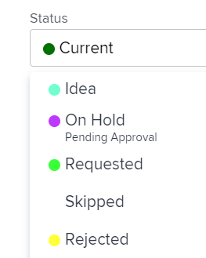

# Aplicar status ao trabalho associado a um grupo

<!--
Alina, I moved this out of an admin article about statuses (Create and customize statuses)
-->

Se um projeto estiver associado a um grupo, você poderá aplicar ambos os status do sistema, bem como um status personalizado associado a esse grupo ao projeto, ou tarefas e problemas nesse projeto. Para obter informações sobre status de grupo no Adobe Workfront, consulte [Criar ou editar um status](../../../administration-and-setup/customize-workfront/creating-custom-status-and-priority-labels/create-or-edit-a-status.md).

>[!TIP]
>
>Você pode associar somente projetos a grupos. Problemas e tarefas herdam o grupo do projeto ao qual pertencem.

## Requisitos de acesso

<!--drafted for P&P:

<table style="table-layout:auto"> 
 <col> 
 <col> 
 <tbody> 
  <tr> 
   <td role="rowheader">Adobe Workfront plan*</td> 
   <td> 
Any
 </td> 
  </tr> 
  <tr> 
   <td role="rowheader">Adobe Workfront license*</td> 
   <td> 
Current license: Standard 
 
   Or
   
Legacy license: Plan 
 
   </td> 
  </tr> 
  <tr> 
   <td role="rowheader">Access level configurations*</td> 
   <td> 
Edit access to Projects
 
<b>NOTE</b>
   
   If you still don't have access, ask your Workfront administrator if they set additional restrictions in your access level. For information on how a Workfront administrator can modify your access level, see <a href="../../../administration-and-setup/add-users/configure-and-grant-access/create-modify-access-levels.md" class="MCXref xref">Create or modify custom access levels</a>.
 </td> 
  </tr> 
  <tr> 
   <td role="rowheader">Object permissions</td> 
   <td> 
Manage permissions to the project
 
For information on requesting additional access, see <a href="../../../workfront-basics/grant-and-request-access-to-objects/request-access.md" class="MCXref xref">Request access to objects </a>.
 </td> 
  </tr> 
 </tbody> 
</table>
-->

Você deve ter o seguinte acesso para executar as etapas neste artigo:

<table style="table-layout:auto"> 
 <col> 
 <col> 
 <tbody> 
  <tr> 
   <td role="rowheader">Plano Adobe Workfront*</td> 
   <td> 
Qualquer Um
 </td> 
  </tr> 
  <tr> 
   <td role="rowheader">Licença da Adobe Workfront*</td> 
   <td> 
Plano 
 </td> 
  </tr> 
  <tr> 
   <td role="rowheader">Configurações de nível de acesso*</td> 
   <td> 
Editar acesso a Projetos
 
<b>Nota</b>

Caso ainda não tenha acesso, pergunte ao administrador do Workfront se ele definiu restrições adicionais em seu nível de acesso. Para obter informações sobre como um administrador do Workfront pode modificar seu nível de acesso, consulte <a href="../../../administration-and-setup/add-users/configure-and-grant-access/create-modify-access-levels.md" class="MCXref xref">Criar ou modificar níveis de acesso personalizados</a>.
 </td>
</tr> 
  <tr> 
   <td role="rowheader">Permissões de objeto</td> 
   <td> 
Gerenciar permissões do projeto
 
Para obter informações sobre como solicitar acesso adicional, consulte <a href="../../../workfront-basics/grant-and-request-access-to-objects/request-access.md" class="MCXref xref">Solicitar acesso a objetos </a>.
 </td> 
  </tr> 
 </tbody> 
</table>

&#42;Para descobrir qual plano, tipo de licença ou acesso você tem, entre em contato com o administrador da Workfront.

## Atualizar grupo de projetos e status

Quando você atualiza o Grupo de um projeto, as opções disponíveis para o Status de tarefas, problemas ou a alteração do projeto são alteradas para corresponder ao grupo.

1. Vá para um projeto ou crie um novo projeto, conforme descrito em [Criar um projeto](../../../manage-work/projects/create-projects/create-project.md).
1. Clique no botão **Mais** ícone , depois clique em **Editar**.

1. No **Editar projeto** caixa exibida, perto da parte inferior da **Visão geral** selecione o grupo na seção **Grupo** menu suspenso.

1. No **Status** selecione o status personalizado no menu suspenso.

   >[!NOTE]
   >
   >Se você selecionar um grupo diferente na variável **Grupo** no menu suspenso, os status personalizados na **Status** alteração de menu automaticamente para correlacionar com o novo grupo.
   >
   >
   >   >

1. Selecione o status do projeto. Os status personalizados criados e aplicados a esse grupo são exibidos na lista.
