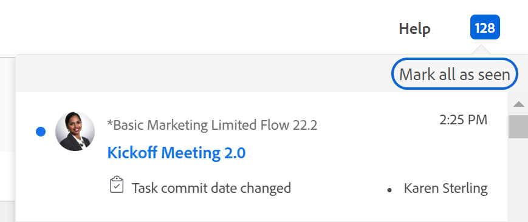

# Visão geral da data de compromisso

A Data de Compromisso é a data pela qual um usuário atribuído à tarefa ou um problema se compromete a concluir a tarefa ou o problema. Isso é diferente da Data de conclusão planejada, pois é uma estimativa mais realista da data de conclusão fornecida somente pelo usuário responsável pelo trabalho. Para obter informações sobre a Data de conclusão planejada, consulte [Visão geral da Data de conclusão planejada da tarefa](../../../manage-work/tasks/task-information/task-planned-completion-date.md).

## Visão geral da data de compromisso

Considere o seguinte ao trabalhar com datas de confirmação:

* Somente tarefas e problemas têm uma Data de confirmação.
* As datas de confirmação não são definidas automaticamente pela Adobe Workfront.\
  Quando você cria uma tarefa ou problema, não há data de confirmação atribuída à tarefa ou problema.
* Se você estiver atribuído a uma tarefa ou problema, poderá definir a Data de confirmação seguindo um destes procedimentos:

   * Deixe o Workfront definir a Data de confirmação para corresponder à Data de conclusão planejada existente da tarefa ou problema clicando em Trabalhar nela, Iniciar problema ou Iniciar tarefa na tarefa ou problema. Para obter informações sobre como substituir o botão Trabalhar na tarefa por um botão Iniciar, consulte  [Substitua o botão Trabalhar na tarefa por um botão Iniciar](../../../people-teams-and-groups/create-and-manage-teams/work-on-it-button-to-start-button.md).
   * Defina manualmente a Data de confirmação por conta própria de acordo com quando achar que a tarefa ou problema pode estar concluído. Esta é sua estimativa e compromisso, como o destinatário, para o Gerente de projetos de que você terá a tarefa ou problema concluído em uma data específica.

>[!NOTE]
>
>Você deve ser o Proprietário da Tarefa de uma tarefa para alterar a Data de Confirmação. Os seguintes usuários não podem alterar a Data de confirmação de uma tarefa:
>
>* Proprietário do projeto
>* Patrocinador do Projeto
>* Gerenciador de Recursos
>* Administrador de Sistema
>* Qualquer outro destinatário na tarefa
>* Qualquer outro usuário com permissões para a tarefa.
>
>Para obter mais informações sobre o Proprietário da Tarefa, consulte a seção [Editar tarefas](../../../manage-work/tasks/manage-tasks/edit-tasks.md#assignments) no artigo [Editar tarefas](../../../manage-work/tasks/manage-tasks/edit-tasks.md).

## Notificações e atualizações acionadas pela alteração da Data de confirmação {#notifications-and-updates-triggered-by-changing-the-commit-date}

Quando um responsável por uma tarefa ou problema seleciona uma Data de confirmação diferente da Data de conclusão planejada definida pelo Proprietário do projeto, há várias notificações e atualizações que alertam o Proprietário do projeto e outros usuários sobre essa alteração.

>[!NOTE]
>
>As alterações feitas na Data de Compromisso não alteram automaticamente as datas planejadas, e as alterações feitas nas datas planejadas não alteram automaticamente a Data de Compromisso.

Definir a Data de Compromisso para uma tarefa ou problema aciona as seguintes alterações:

* A alteração da Data de confirmação é preenchida na Atividade do sistema e nas guias Todos da seção Atualizar da tarefa ou problema.

  

  A alteração da Data de confirmação é exibida na área Atualizações da tarefa ou problema quando o administrador do Workfront ativa essa atualização na área Feeds de atualizações em Configuração. Para obter informações, consulte [Atualizações rastreadas pelo sistema](../../../administration-and-setup/set-up-workfront/system-tracked-update-feeds/system-tracked-update-feeds.md).

  Se um Proprietário do projeto não quiser aceitar a alteração, recomendamos que faça um comentário ao usuário propondo uma nova data usando a guia Comentários na seção Atualizações, para solicitar que ele altere a Data de compromisso novamente para a Data planejada original ou selecione uma nova data. Se um Proprietário do projeto aceitar a alteração, poderá ajustar manualmente a Data de conclusão planejada para corresponder à Data de confirmação oferecida pelo usuário atribuído ao item ao editar a tarefa ou o problema.

  Você deve ter acesso para gerenciar a tarefa ou o problema para editá-los.

<!--this is no longer possible: 
>[!NOTE]
>
>If you want to see how the timeline of the project is affected by accepting to change the Planned Completion Date of the task, click **Project Timeline**. This opens the task list where you can evaluate the date changes and the project timeline.
>
>
>  >
>
-->

* A Data de conclusão projetada da tarefa ou problema é definida para a mesma data, pois a tarefa agora tem uma indicação mais precisa de quando deverá ser concluída.

  Para obter mais informações sobre a Data de conclusão projetada, consulte [Visão geral da Data de conclusão projetada para projetos, tarefas e problemas](../../../manage-work/projects/planning-a-project/project-projected-completion-date.md).

  

* O Proprietário do projeto é notificado na área Notificações de que uma data de confirmação de tarefa ou problema foi alterada.

  

  <!--
  
(NOTE: the tip below is actually wrong and the updates feeds should not control this setting, but at this time it does, according to this issue in Hub: https://hub.workfront.com/issue/61e1aa5e0002a186fdd0a73a10db0fc3/updates?email-source=comm

  -->

  >[!TIP]
  >
  >A notificação de que a Data de confirmação foi alterada é enviada ao Proprietário do projeto somente quando o administrador do Workfront ativa a exibição da Data de confirmação na área Feeds de atualizações da Configuração. Para obter informações, consulte [Atualizações rastreadas pelo sistema](../../../administration-and-setup/set-up-workfront/system-tracked-update-feeds/system-tracked-update-feeds.md).

Para obter informações sobre a funcionalidade adicional disponível ao atualizar um item de trabalho, consulte  [Atualizar trabalho](../../../workfront-basics/updating-work-items-and-viewing-updates/update-work.md).

Para obter informações sobre como atualizar Datas de confirmação para tarefas e problemas, consulte [Atualizar datas de confirmação nas tarefas e problemas](../../../manage-work/projects/updating-work-in-a-project/update-commit-date-on-tasks-and-issues.md).

<!--

<h2>Update Commit Dates on tasks and issues</h2>

(NOTE: moved to its own article) 

Updating the Commit Date is identical for tasks and issues.

<ol>
<li value="1"> 
Go to a task or issue that you are assigned to as the <strong>Task Owner</strong>.
 
For more information about finding out who the Task Owner for an issue or task is, see the section <a href="../../../manage-work/tasks/manage-tasks/edit-tasks.md#assignments" class="MCXref xref">Edit tasks</a> in the article <a href="../../../manage-work/tasks/manage-tasks/edit-tasks.md" class="MCXref xref">Edit tasks</a>.
 </li>
<li value="2"> 
Click Work on it in the task or issue header
 
Or
 
Click <strong>Start Task</strong> or <strong>Start Issue</strong> if the Work on it button has been customized in your environment to indicate that you are now working on the work item. 
 
At this time, the Commit Date and the Planned Completion Date of the task or issue are the same.
 </li>
<li value="3"> 
(Optional) If you clicked Start Task or Start Issue, click <strong>Undo</strong> in the lower-left corner of the screen. The Commit Date is removed. 
 
For information about replacing the Work On It button with a Start button, see <a href="../../../people-teams-and-groups/create-and-manage-teams/work-on-it-button-to-start-button.md" class="MCXref xref">Replace the Work On It button with a Start button</a>.
 <note type="tip">
The option to undo your selection to start your work is not available when you click
Work on it.
</note> </li>
<li value="4"> 
 Expand the <strong>This will be done by</strong> date picker, and select a new Commit Date.

Click <strong>Updates</strong> in the left panel, then click the <strong>Start a new update</strong>><strong>Commit Date</strong>

Or

Click <strong>Task Details</strong> or <strong>Issue Details</strong> in the left panel, then double click <strong>Commit Date</strong> and select a new date from calendar. 

The Commit Date and the Planned Completion date are no longer the same.

Instead, the Commit Date and the Projected Completion Date of the task or issue become the same.

The changes are saved automatically.

The Project Owner is notified that you have suggested a new Commit Date for the task or issue and can, at this time, update the Planned Completion Date of the task or issue to match the Commit Date you suggested. For information about the notifications and updates that are triggered by this change, see the section <a href="#notifications-and-updates-triggered-by-changing-the-commit-date" class="MCXref xref">Notifications and updates triggered by changing the Commit Date</a> in this article.

 </li>
</ol>

-->
