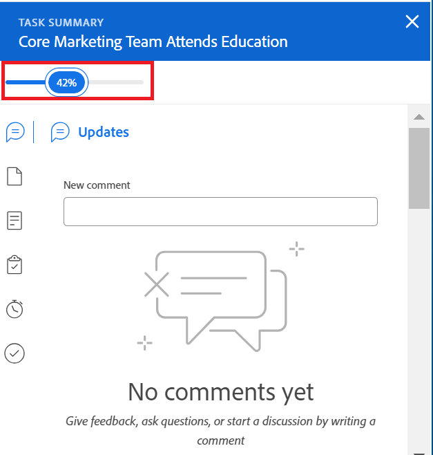

# Exibir e atualizar o Percentual Concluído das tarefas

<!--Audited:01/2024-->

Você pode atualizar o percentual concluído de uma tarefa para indicar o progresso feito na tarefa em sua conclusão.

## Requisitos de acesso

Você deve ter o seguinte acesso para atualizar tarefas manualmente:

<table style="table-layout:auto"> 
 <col> 
 <col> 
 <tbody> 
  <tr> 
   <td role="rowheader">plano do Adobe Workfront</td> 
   <td> 
Qualquer
 </td> 
  </tr> 
  <tr> 
   <td role="rowheader">Licença da Adobe Workfront*</td> 
   <td> 
Nova licença: Standard
 
   Ou
   
Licença atual: Comercial ou superior

   </td> 
  </tr> 
  <tr> 
   <td role="rowheader">Configurações de nível de acesso</td> 
   <td> 
Editar acesso a tarefas
 </td> 
  </tr> 
  <tr> 
   <td role="rowheader">Permissões de objeto</td> 
   <td> 
Gerenciar permissões para a tarefa
  </td> 
  </tr> 
 </tbody> 
</table>

*Para descobrir que plano, tipo de licença ou acesso você tem, entre em contato com o administrador do Workfront. Para obter informações, consulte [Requisitos de acesso na documentação do Workfront](/help/quicksilver/administration-and-setup/add-users/access-levels-and-object-permissions/access-level-requirements-in-documentation.md).

## Áreas em que é possível atualizar o percentual concluído de uma tarefa

Você pode atualizar o percentual concluído de uma tarefa em qualquer uma das seguintes áreas:

* **Em uma lista de tarefas**: É possível atualizar o percentual concluído de uma tarefa quando a coluna Percentual concluído é exibida.\
  Para obter mais informações sobre edição em linha, consulte [Itens de edição em linha em uma lista no Adobe Workfront](../../../workfront-basics/navigate-workfront/use-lists/inline-edit-objects.md).

* **Na visualização Marco**: é possível atualizar o percentual concluído de uma tarefa ao usar a visualização Marco em uma lista de projetos ou em um relatório de projeto. Para obter mais informações, consulte [Usar a visualização de Etapas](../../../reports-and-dashboards/reports/reporting-elements/use-milestone-view.md).

<!--only in legacy commenting: 
* **As you update the task**:  You can update the percent complete option of a task when adding an update to the task.

  >[!IMPORTANT]
  >
  >This option displays only after you enable the Show Percent Complete option.  
  >To enable the percent complete update bar for tasks, do the following:   
  >
  >1. Go to the **Main** menu>your name>**More** icon next to your name >**Edit** > select **Show percent complete on update status**.   
  >  >-->

* **No cabeçalho da tarefa**: é possível atualizar o percentual concluído de uma tarefa no cabeçalho da tarefa. Para obter informações, consulte [Editar tarefas](../../tasks/manage-tasks/edit-tasks.md).

  

* **No painel Resumo de uma tarefa**: é possível atualizar o percentual concluído de uma tarefa na parte superior do painel Resumo ao visualizar a tarefa nas seguintes áreas:

   * Lista de tarefas ou relatório
   * Planilha de horas
   * Balanceador de carga de trabalho

  

  Para obter mais informações, consulte [Visão geral do resumo](/help/quicksilver/workfront-basics/the-new-workfront-experience/summary-overview.md)

## Considerações sobre a atualização do percentual concluído de uma tarefa

* Quando você marca uma tarefa como 100% concluída, o Status da tarefa é atualizado para Concluído.
* Existem os seguintes cenários para tarefas pai:
   * Não é possível atualizar o percentual concluído de uma tarefa pai para 100% quando o Modo de Conclusão em Resumo do projeto está definido como Automático e as subtarefas não estão concluídas.
   * Você pode atualizar o percentual concluído de uma tarefa pai para 100% quando o Modo de Conclusão em Resumo do projeto estiver definido como Manual e as subtarefas estiverem concluídas ou incompletas.

  Para obter mais informações, consulte [Editar projetos](../manage-projects/edit-projects.md).

## Atualizar o percentual concluído de uma tarefa

1. Vá para qualquer uma das seguintes áreas no Workfront:

   * Uma lista de tarefas
   * Uma lista de projetos e aplicar a visualização Marco
   * Uma tarefa, acessando a página de tarefas
1. Localize o **Percentual Completo** campo da tarefa cuja porcentagem concluída você deseja atualizar.
1. Clique dentro do campo Percentual concluído e digite um número entre 0 e 100

   Ou

   Clique e arraste o **Percentual Completo** barra para o número necessário para indicar quanto da tarefa você concluiu, quando disponível.

   >[!NOTE]
   >
   >Quando você indica que 100% da tarefa está concluída, o status da tarefa também é atualizado para Concluído.

1. Pressione Enter no teclado para salvar a porcentagem concluída.

A Porcentagem concluída do projeto também é atualizada automaticamente.

