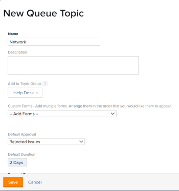

# Criar Tópicos da Fila

Os Tópicos da fila funcionam juntamente com as Regras de roteamento para atribuir automaticamente o trabalho de entrada a um usuário, função de trabalho, equipe ou para colocá-lo em um projeto. Os Tópicos da Fila definem as condições que precisam existir para que a Regra de Roteamento seja implementada.

Não há limite para o número de Tópicos da Fila que podem ser atribuídos a um Grupo de Tópicos ou a um projeto. Tópicos da fila são um tipo de objeto reportável.

## Requisitos de acesso

<!--drafted - replace table with P&P:

<table style="table-layout:auto"> 
 <col> 
 <col> 
 <tbody> 
  <tr> 
   <td role="rowheader">Adobe Workfront plan*</td> 
   <td> 
Any 
 </td> 
  </tr> 
  <tr> 
   <td role="rowheader">Adobe Workfront license*</td> 
   <td> 
Current license: Standard 
 
   Or
   
Legacy license: Plan 
 </td> 
  </tr> 
  <tr> 
   <td role="rowheader">Access level configurations*</td> 
   <td> 
Edit access to Projects
 
Note: If you still don't have access, ask your Workfront administrator if they set additional restrictions in your access level. For information on how a Workfront administrator can modify your access level, see <a href="../../../administration-and-setup/add-users/configure-and-grant-access/create-modify-access-levels.md" class="MCXref xref">Create or modify custom access levels</a>.
 </td> 
  </tr> 
  <tr> 
   <td role="rowheader">Object permissions</td> 
   <td> 
 Manage permissions to the project
 
For information on requesting additional access, see <a href="../../../workfront-basics/grant-and-request-access-to-objects/request-access.md" class="MCXref xref">Request access to objects </a>.
 </td> 
  </tr> 
 </tbody> 
</table>
-->

Você deve ter o seguinte:

<table style="table-layout:auto"> 
 <col> 
 <col> 
 <tbody> 
  <tr> 
   <td role="rowheader">Plano Adobe Workfront*</td> 
   <td> 
Qualquer Um 
 </td> 
  </tr> 
  <tr> 
   <td role="rowheader">Licença da Adobe Workfront*</td> 
   <td> 
Plano 
 </td> 
  </tr> 
  <tr> 
   <td role="rowheader">Configurações de nível de acesso*</td> 
   <td> 
Editar acesso a Projetos
 
Observação: Caso ainda não tenha acesso, pergunte ao administrador do Workfront se ele definiu restrições adicionais em seu nível de acesso. Para obter informações sobre como um administrador do Workfront pode modificar seu nível de acesso, consulte <a href="../../../administration-and-setup/add-users/configure-and-grant-access/create-modify-access-levels.md" class="MCXref xref">Criar ou modificar níveis de acesso personalizados</a>.
 </td> 
  </tr> 
  <tr> 
   <td role="rowheader">Permissões de objeto</td> 
   <td> 
 Gerenciar permissões do projeto
 
Para obter informações sobre como solicitar acesso adicional, consulte <a href="../../../workfront-basics/grant-and-request-access-to-objects/request-access.md" class="MCXref xref">Solicitar acesso a objetos </a>.
 </td> 
  </tr> 
 </tbody> 
</table>

&#42;Para descobrir qual plano, tipo de licença ou acesso você tem, entre em contato com o administrador da Workfront

## Criar um tópico da fila

1. Crie uma Regra de Roteamento, um Grupo de Tópicos e um formulário personalizado, caso planeje associá-los ao Tópico da Fila.\
   Para obter mais informações sobre como criar Regras de roteamento, Grupos de tópicos ou formulários personalizados, consulte os seguintes artigos:

   * [Criar regras de roteamento](../../../manage-work/requests/create-and-manage-request-queues/create-routing-rules.md)
   * [Criar grupos de tópicos](../../../manage-work/requests/create-and-manage-request-queues/create-topic-groups.md)
   * [Criar ou editar um formulário personalizado](../../../administration-and-setup/customize-workfront/create-manage-custom-forms/create-or-edit-a-custom-form.md)

1. Vá para o projeto que você escolheu para ativar como uma Fila de solicitação de ajuda e onde deseja criar um novo tópico da fila.\
   Para obter mais informações sobre como designar um projeto como uma fila de solicitações de ajuda, consulte o seguinte artigo:\
   [Criar uma fila de solicitações](../../../manage-work/requests/create-and-manage-request-queues/create-request-queue.md)

   Você pode organizar Tópicos da fila relacionados em um Grupo de tópicos ou diretamente sob o projeto designado como uma fila de solicitações de ajuda. Isso fornecerá ao solicitante uma série de menus suspensos ao fazer uma solicitação.\
   Você pode aninhar os Tópicos da fila diretamente no projeto designado como uma Fila de solicitação de ajuda, sem um Grupo de tópicos.

   Para obter informações sobre como criar Grupos de tópicos, consulte [Criar grupos de tópicos](../../../manage-work/requests/create-and-manage-request-queues/create-topic-groups.md).

1. Clique em **Tópicos da fila** no painel esquerdo. Talvez seja necessário clicar em **Mostrar mais**, em seguida **Tópicos da fila**.
1. Clique em **Novo tópico da fila**.
1. No **Novo tópico da fila** , especifique o seguinte:

   <table style="table-layout:auto"> 
    <col> 
    <col> 
    <tbody> 
     <tr> 
      <td role="rowheader"><strong>Nome</strong> </td> 
      <td> Nome do Tópico da Fila.</td> 
     </tr> 
     <tr> 
      <td role="rowheader"><strong>Descrição</strong> </td> 
      <td>Descreva a fila de solicitações. A descrição é exibida quando os usuários selecionam o tópico da fila no processo de envio de uma nova solicitação. </td> 
     </tr> 
     <tr> 
      <td role="rowheader"><strong>Adicionar ao Grupo de Tópicos</strong> </td> 
      <td> Se não houver Grupos de tópicos no projeto, o nome do projeto será padrão como um Grupo de tópicos. Se quiser criar Grupos de Tópicos adicionais a partir daqui, selecione <strong>Criar novo grupo de tópicos</strong> no menu suspenso. </td> 
     </tr> 
     <tr> 
      <td role="rowheader"><strong>Formulários personalizados</strong> </td> 
      <td>Selecione todos os formulários personalizados que deseja associar ao tópico da fila. Você deve criar formulários personalizados para problemas antes de associá-los a tópicos da fila. Para obter informações sobre como criar formulários personalizados, consulte <a href="../../../administration-and-setup/customize-workfront/create-manage-custom-forms/create-or-edit-a-custom-form.md" class="MCXref xref">Criar ou editar um formulário personalizado</a>.</td> 
     </tr> 
     <tr> 
      <td role="rowheader">Aprovação padrão</td> 
      <td> 
Associe um processo de aprovação a este tópico da fila. Somente Processos de aprovação de problemas estão visíveis neste menu suspenso. Todos os problemas enviados para esta fila serão associados a este Processo de Aprovação. O administrador do Adobe Workfront deve definir Processos de aprovação no nível do sistema antes que você possa associá-los a tópicos da fila. Um usuário com acesso administrativo a processos de aprovação também pode criar processos de aprovação específicos do grupo. Para obter mais informações sobre como criar Processos de Aprovação, consulte <a href="../../../administration-and-setup/customize-workfront/configure-approval-milestone-processes/create-approval-processes.md" class="MCXref xref">Criar um processo de aprovação para itens de trabalho</a>. 
 
       
 
        
Importante: Se o grupo do projeto mudar, o processo de aprovação específico do grupo anexado às questões existentes se tornará um processo de aprovação de uso único. Para obter mais informações sobre como as alterações no grupo do projeto ou no processo de aprovação afetam as configurações de aprovação, consulte <a href="../../../administration-and-setup/customize-workfront/configure-approval-milestone-processes/how-changes-affect-group-approvals.md" class="MCXref xref">Como as alterações de grupo e processo de aprovação afetam os processos de aprovação atribuídos</a>.
 
        
Considere o seguinte ao adicionar processos de aprovação a tópicos da fila: 
 
        <ul style="list-style-type: circle;"> 
         <li>Somente os processos de aprovação ativos são exibidos na lista. </li> 
         <li> 
Os processos de aprovação em todo o sistema e específicos do grupo são exibidos na lista. Um processo de aprovação associado a um grupo diferente do do projeto não é exibido na lista.
 </li> 
        </ul> 
       
 </td> 
     </tr> 
     <tr> 
      <td role="rowheader"><strong>Duração padrão</strong> </td> 
      <td>Essa é a duração padrão da solicitação e a Data de conclusão planejada da solicitação é calculada com base nesse valor.</td> 
     </tr> 
     <tr> 
      <td role="rowheader"><strong>Rota Padrão</strong> </td> 
      <td>Especifique a regra de roteamento que deseja associar ao Tópico da fila. Você deve criar a regra de roteamento antes de anexá-la a um Tópico da fila.</td> 
     </tr> 
     <tr> 
      <td role="rowheader"><strong>Tipos de solicitação</strong> </td> 
      <td> 
Escolha que tipo de solicitações este tópico da fila armazena. As opções visíveis são definidas na variável <strong>Detalhes da fila</strong> do projeto. Este campo é obrigatório. 
 
Observação: Os Tipos de Solicitação são exibidos como uma seleção na área Solicitações somente se o Tipo de Solicitação estiver selecionado nas páginas Detalhes da Fila e Tópico da Fila. Para obter informações sobre como configurar a área Detalhes da fila de um projeto, consulte <a href="../../../manage-work/requests/create-and-manage-request-queues/create-request-queue.md" class="MCXref xref">Criar uma fila de solicitações</a>. 
 
Selecione entre os seguintes tipos:
 
       <ul> 
        <li>Registro de Defeito</li> 
        <li>Pedido de alteração</li> 
        <li>Problema</li> 
        <li>Solicitar</li> 
       </ul> 
O administrador do Workfront pode ter renomeado algumas dessas opções. 
 </td> 
     </tr> 
    </tbody> 
   </table>

   

1.  
1. Clique em **Salvar**.\
   O Tópico da fila agora está disponível para uso e é visível na área Solicitações do Workfront, depois que uma Fila de solicitação e um Grupo de tópico são selecionados.
