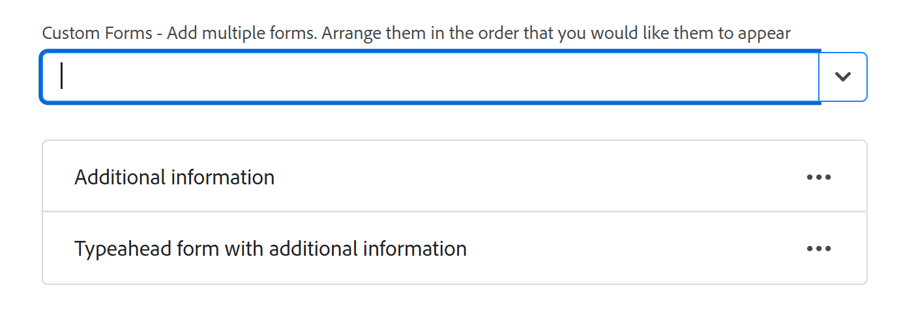

# Criar uma fila de solicitações

<!--Audited: 12/2023-->

<!--
<THIS IS CONNECTED TO THE PRODUCT IN BLUEPRINTS. DO NOT MOVE/ CHANGE URL>
-->

<!--hide/ comment out the entire "create requests in Production" section and just edit and leave  only the preview section when it releases to Production; also remove the template blurb when the queue details is unshimmed for templates-->

As informações destacadas nesta página referem-se a funcionalidades que ainda não estão disponíveis. Ela está disponível somente no ambiente de Pré-visualização para todos os clientes. Depois das versões mensais para produção, os mesmos recursos também ficam disponíveis no ambiente de produção para clientes que ativaram versões rápidas. 

Para obter informações sobre versões rápidas, consulte [Habilitar ou desabilitar versões rápidas para sua organização](/help/quicksilver/administration-and-setup/set-up-workfront/configure-system-defaults/enable-fast-release-process.md). 

Você pode configurar uma Fila de solicitações onde os usuários podem inserir solicitações ocasionais que não são trabalhos planejados em um projeto. Por exemplo, uma fila de solicitações de Help Desk pode ser configurada para capturar todas as solicitações de usuário que chegam a um departamento de TI.

As solicitações se tornam problemas no Adobe Workfront e são adicionadas aos projetos.

Configurar uma fila de solicitações ajuda a formalizar informações sobre problemas que serão adicionados a um projeto. Todos os problemas enviados ao projeto serão enviados da mesma forma e seguirão o mesmo caminho para a conclusão.

Você pode configurar os seguintes objetos como filas de solicitações no Workfront:

* Projetos
* Modelos. Os projetos criados a partir dos modelos configurados como filas de solicitações se tornarão filas de solicitações.

Para configurar um projeto ou um modelo como uma fila de solicitações, edite a área Detalhes da fila do projeto ou do modelo.

Este artigo descreve como configurar um projeto como uma fila de solicitações, em que os usuários podem enviar solicitações. A configuração de Detalhes da fila para um modelo é semelhante à configuração no projeto.

Para obter informações sobre como enviar uma nova solicitação para uma fila de solicitações, consulte [Copiar e enviar solicitações](../create-requests/copy-and-submit-requests.md).

## Requisitos de acesso

+++ Expanda para visualizar os requisitos de acesso para a funcionalidade neste artigo.

Você deve ter o seguinte acesso para executar as etapas deste artigo:

<table style="table-layout:auto"> 
 <col> 
 <col> 
 <tbody> 
  <tr> 
   <td role="rowheader">plano do Adobe Workfront</td> 
   <td> 
Qualquer 
 </td> 
  </tr> 
  <tr> 
   <td role="rowheader">Licença do Adobe Workfront</td> 
   <td> 
   
Nova licença: Standard 

   Ou
   
Licença atual: plano 
 </td> 
  </tr> 
  <tr> 
   <td role="rowheader">Configurações de nível de acesso</td> 
   <td> 
Editar acesso a projetos
 </td> 
  </tr> 
  <tr> 
   <td role="rowheader">Permissões de objeto</td> 
   <td> 
 Gerenciar permissões do projeto
 </td> 
  </tr> 
 </tbody> 
</table>

Para obter mais detalhes sobre as informações nesta tabela, consulte [Requisitos de acesso na documentação do Workfront](/help/quicksilver/administration-and-setup/add-users/access-levels-and-object-permissions/access-level-requirements-in-documentation.md).

+++

## Visão geral das filas de solicitações

Configurar uma fila de solicitações como um projeto. Ao designar o projeto como uma Fila de solicitações, a fila torna-se acessível a partir da área Solicitações do Adobe Workfront. Ao personalizar a Fila de solicitações, você também personaliza o formulário que os usuários preenchem ao enviarem as solicitações.

Este artigo descreve como criar uma fila de solicitações a partir de um projeto existente. No entanto, para criar consistência para o processo de entrada de solicitação ou para adicionar várias camadas a ele para fins de relatório e melhor gerenciamento, também é possível configurar blocos de construção adicionais de uma fila de solicitações, que são descritos na tabela a seguir.

<table style="table-layout:auto"> 
 <col> 
 <col> 
 <tbody> 
  <tr> 
   <td role="rowheader">Detalhes da fila</td> 
   <td> 
Você deve configurar um projeto como uma fila de solicitações na área Detalhes da fila. Esta etapa é obrigatória. 
 
Para obter mais informações, consulte a seção <a href="#create-a-request-queue" class="MCXref xref">Criar uma fila de solicitações</a> neste artigo.
 </td> 
  </tr> 
  <tr> 
   <td role="rowheader">Grupos de Tópicos</td> 
   <td> 
São menus adicionais que classificam solicitações com base em recursos comuns. Por exemplo, para uma Fila de solicitação de TI, você pode querer ter grupos de tópicos "No local" e "Remoto". 
 
Para obter mais informações, consulte <a href="../../../manage-work/requests/create-and-manage-request-queues/create-topic-groups.md" class="MCXref xref">Criar grupos de tópicos</a>. 
 
Isso é opcional.
 </td> 
  </tr> 
  <tr> 
   <td role="rowheader">Enfileirar tópicos</td> 
   <td> 
São menus adicionais que classificam solicitações que pertencem ao mesmo Grupo de tópicos com base em recursos comuns. Um grupo de tópicos pode conter vários tópicos da fila. 
 
Por exemplo, o grupo de tópicos "No local" da Fila de solicitação de TI pode conter os tópicos "Hardware", "Software" e "Rede" da fila. 
 
Para obter mais informações, consulte <a href="../../../manage-work/requests/create-and-manage-request-queues/create-queue-topics.md" class="MCXref xref">Criar tópicos da fila</a>. 
 
Isso é opcional.
 </td> 
  </tr> 
  <tr> 
   <td role="rowheader">Regras de Encaminhamento</td> 
   <td> 
Eles permitem encaminhar cada solicitação a um usuário, função de trabalho, equipe ou projeto. 
 
Para obter mais informações, consulte <a href="../../../manage-work/requests/create-and-manage-request-queues/create-routing-rules.md" class="MCXref xref">Criar Regras de Roteamento</a>. 
 
Isso é opcional.
 </td> 
  </tr> 
 </tbody> 
</table>

## Criar uma fila de solicitações

<!--at production release on April 10, do the following: take the first sentence here out; hide/ comment out the first section (Create a Request Queue in the Production environment); remove the title of the "Create a Request Queue in the Preview environment and leave that section as the only way to create request queues; search for any visible references of production/ preview and remove them from the entire article-->

A criação de uma fila de solicitações difere dependendo do ambiente usado.

### Criar uma fila de solicitações no ambiente de produção

Esta seção descreve como definir Detalhes da Fila para os seguintes objetos:

* Um projeto no ambiente de Produção
* Um modelo no ambiente de Produção ou Pré-visualização

Ao configurar um projeto como uma Fila de solicitações, o status do projeto deve ser Atual para ser exibido na área Solicitações do Workfront.

>[!TIP]
>
>O administrador do Workfront ou do grupo pode atribuir a você um modelo de layout personalizado que pode não incluir algumas das seções descritas nas etapas a seguir.

Para criar uma Fila de solicitações:

1. Vá para o projeto que você deseja configurar como uma Fila de solicitações.
1. (Opcional) Clique em **Detalhes do projeto** no painel esquerdo e adicione uma **Descrição** ao projeto na área **Visão geral**. Essas informações são exibidas em todas as novas solicitações.
1. Clique em **Detalhes da fila** no painel esquerdo. Talvez seja necessário clicar em **Mostrar Mais** e em **Detalhes da Fila**.

   Isso abre a seção Detalhes da fila.

   

1. Especifique as seguintes informações:

   * **Publicar como Fila de Solicitação de Ajuda:** Selecione esta opção para identificar este projeto como uma fila de solicitações. Todos os problemas recebidos são considerados Solicitações.\
     Quando essa opção não está selecionada, o projeto se comporta como um projeto padrão no Workfront e todos os problemas recebidos são problemas.

   * **Quem pode adicionar solicitações a esta fila:** Selecione quais usuários têm acesso para adicionar solicitações a esta fila. Você pode permitir que os seguintes grupos de pessoas vejam a Fila de solicitações em sua área Solicitações da Barra de navegação global quando adicionam uma nova solicitação:

     | Quem pode inserir solicitações | Descrição |
     |---|---|
     | Todos | Qualquer usuário do Workfront com uma conta ativa pode visualizar essa fila de solicitações e adicionar solicitações a ela |
     | Pessoas com acesso de visualização a este projeto | Usuários com permissões de Visualização no projeto podem visualizar e adicionar solicitações a esta fila |
     | Pessoas da empresa deste projeto  | Os usuários que pertencem à empresa associada a este projeto podem exibir e adicionar solicitações a esta fila. Se houver uma empresa associada ao projeto, o nome da empresa será listado entre parênteses após essa configuração. |
     | Pessoas do grupo deste projeto  | Os usuários que pertencem ao grupo associado a este projeto podem exibir e adicionar solicitações a esta fila. Se houver um grupo associado ao projeto, o nome do grupo será listado entre parênteses após essa configuração, em fonte cinza. |

     {style="table-layout:auto"}

   * **Compartilhe com esses links:** As opções a seguir permitem fornecer acesso direto à Fila de solicitações e aos formulários associados a ela a usuários fora do Workfront ou a usuários do Workfront usando uma página externa. Para obter informações sobre como incorporar uma fila de solicitações em um painel como uma página externa, consulte [Incorporar uma fila de solicitações em um painel](../../../reports-and-dashboards/dashboards/creating-and-managing-dashboards/embed-request-queue-dashboard.md).

     Os usuários já devem ter direitos de acesso à Fila de solicitações para obter acesso direto. O uso de qualquer das opções descritas aqui não concede acesso aos usuários automaticamente.

     >[!TIP]
     >
     >Os usuários devem primeiro fazer logon no Workfront antes de obter acesso à fila de solicitações quando acessam a página Fila de solicitações de outro aplicativo.

      * **URL de Acesso Direto:** Quando um usuário acessa esta URL a partir de um navegador, o usuário é levado diretamente para a seção Nova Solicitação na área Solicitações e esta solicitação é selecionada por padrão para ele.

        

        >[!NOTE]
        >
        >Você pode exibir uma Fila de solicitações em um painel como uma página externa. Nesse caso, a fila de solicitações é pré-selecionada, mas você pode selecionar qualquer outra fila de solicitações no campo Tipo de solicitação. usuários podem alterar o Tipo de solicitação. Os componentes de navegação das Solicitações também são exibidos.

      * **Código incorporado:** Use este código HTML para incorporar o formulário de fila de solicitações como um iframe em qualquer página do HTML.\
        Se os usuários ainda não estiverem autenticados no Workfront quando visualizarem a página em que o código está incorporado, a caixa de diálogo de logon do Workfront será exibida. Depois que os usuários fazem logon, o formulário Fila de solicitações é exibido.

        >[!NOTE]
        >
        >Ao exibir uma Fila de solicitações em um iframe, somente o formulário de solicitação é exibido, o nome da solicitação é pré-selecionado e esmaecido. O usuário não pode alterar o tipo de Solicitação. Os componentes de navegação da área Solicitações não são exibidos.

        Para que o formulário da fila de solicitações seja exibido ao usar esse código incorporado, você deve ativar a configuração &quot;Permitir incorporação do Workfront em um iframe&quot; na configuração do sistema. Para obter mais informações sobre como habilitar a incorporação do Workfront em um iframe, consulte [Configurar preferências de segurança do sistema](../../../administration-and-setup/manage-workfront/security/configure-security-preferences.md). Se essa configuração não estiver ativada, o iframe será exibido em branco.

        Você pode ajustar vários aspectos de como o formulário incorporado é exibido, da seguinte maneira:

        <table border="1" cellspacing="15"> 
         <col> 
         <col> 
         <thead> 
          <tr> 
           <th> 
<strong>Funcionalidade</strong> 
 </th> 
           <th> 
<strong>Solução</strong> 
 </th> 
          </tr> 
         </thead> 
         <tbody> 
          <tr> 
           <td> 
Ajustar o tamanho do quadro
 </td> 
           <td> 
Modifique os atributos "width" e "height".
 
A largura padrão é "500" e a altura é "600"
 </td> 
          </tr> 
          <tr> 
           <td> 
Direcione usuários para um Tópico de Fila ou Grupo de Tópicos específico
 </td> 
           <td> 
Adicione o parâmetro "path" ao URL src. Você pode encontrar o parâmetro de caminho navegando até o Tópico da fila ou Grupo de tópicos desejado no formulário não incorporado e inspecionando o URL.
 </td> 
          </tr> 
          <tr> 
           <td> 
Mostrar e permitir que os usuários alterem a lista suspensa pré-configurada Grupo de tópicos
 </td> 
           <td> 
Use o parâmetro "path" adicionando o parâmetro <code>showPreSelectedOptions=true</code> a <code>src URL</code>.
 </td> 
          </tr> 
          <tr> 
           <td> 
Detectar quando o formulário foi enviado
 </td> 
           <td> 
Adicione um ouvinte de eventos de "mensagem" à janela da sua página da Web e verificando se <code>event.data.type</code> é <code>requestSubmitted</code>. <code>event.data.newIssueID</code> será definido como a ID do problema criado.
 </td> 
          </tr> 
         </tbody> 
        </table>

   * **Tipos de Solicitação:** selecione uma das opções padrão abaixo.

     O administrador do Workfront pode renomear os tipos de solicitação padrão. Para obter mais informações sobre como renomear os tipos de solicitação, consulte [Personalizar tipos de problemas padrão](../../../administration-and-setup/set-up-workfront/configure-system-defaults/customize-default-issue-types.md).

      * Relatório de erro
      * Pedido de alteração
      * Problema
      * Solicitar

        Este campo é obrigatório e você deve selecionar pelo menos uma opção.

     >[!NOTE]
     >
     >Os Tipos de solicitação são exibidos como uma seleção na área Solicitações somente se o Tipo de solicitação for selecionado nas páginas Detalhes da fila e Tópico da fila. Para obter informações sobre como configurar a área Detalhes da Fila de um projeto, consulte [Criar Tópicos da Fila](../../../manage-work/requests/create-and-manage-request-queues/create-queue-topics.md).

     Cada tipo selecionado aqui estará disponível no formulário (você pode selecionar mais de um). Selecionar mais de um tipo pode ajudar a organizar várias solicitações recebidas.\
     Por exemplo, se você estiver usando o formulário em uma fila de solicitações para um projeto de TI, os seguintes tipos de solicitações poderão entrar na fila: hardware, software, correções de erros e problemas.

   * **Duração Padrão:** a duração padrão é o tempo que normalmente leva para concluir um problema. Isso se torna o padrão para todas as questões recebidas e pode ser modificado manualmente. A duração geralmente é definida em horas, dias ou semanas. A duração padrão de um problema é a mesma que o horário planejado para o problema. A Data de conclusão planejada do problema é calculada com base nesse campo.\
     O padrão para a Duração do problema é 1 dia ou 8 horas. Se o administrador do Workfront definir as Horas típicas por dia de trabalho como menos de 8 horas, a Duração padrão para problemas ainda será de 8 horas. Por exemplo, se a opção Horas típicas por dia de trabalho estiver definida como 7 horas, a duração padrão para problemas será de 1,14 dia ou 8 horas. Para obter mais informações sobre como configurar o sistema de Horas Típicas por Dia Útil, consulte a seção &quot;Cálculos de Linha do Tempo&quot; no artigo [Configurar preferências de projeto para todo o sistema](../../../administration-and-setup/set-up-workfront/configure-system-defaults/set-project-preferences.md).

   * **As pessoas da mesma empresa herdarão as mesmas permissões para todas as solicitações.:** Quando selecionada, todas as solicitações enviadas para a fila ficam visíveis para usuários na mesma empresa. Os usuários podem exibir essas solicitações na seção Todas as solicitações, localizada na área Solicitações. Quando essa configuração é ativada ou desativada, isso afeta todas as solicitações futuras; não afeta as informações retroativamente.
   * **Quando alguém faz uma solicitação, conceder automaticamente:** Quando um usuário faz uma solicitação à fila de solicitações, o usuário recebe automaticamente o nível de permissão que você escolher para essa solicitação. Selecione entre os seguintes níveis de permissões:

      * **Exibir Acesso**
      * **Acesso ao Contribute**. Esta é a seleção padrão.
      * **Gerenciar Acesso**

     Para obter informações sobre o modelo de permissões do Workfront, consulte [Visão geral das permissões de compartilhamento em objetos](../../../workfront-basics/grant-and-request-access-to-objects/sharing-permissions-on-objects-overview.md).\
     Definir as permissões aqui economiza tempo, em vez de precisar conceder permissões para cada solicitação recebida individual. A escolha dessa opção afeta todas as solicitações futuras, mas não afeta retroativamente as solicitações existentes.

   * **Aprovação padrão**: associe um processo de aprovação a esta fila de solicitações. Somente os Processos de aprovação de problemas ficam visíveis nesse menu suspenso. Todos os problemas enviados para essa fila serão associados a esse processo de aprovação. O administrador do Workfront deve definir processos de aprovação no nível do sistema antes que você possa associá-los a filas de solicitações. Os usuários com acesso administrativo aos processos de Aprovação também podem criar processos de aprovação específicos do grupo.

     >[!IMPORTANT]
     >
     >Se o grupo do projeto mudar, o processo de aprovação específico do grupo anexado a problemas existentes se tornará um processo de aprovação de uso único. Para obter mais informações sobre como as alterações no grupo do projeto ou no processo de aprovação afetam as configurações de aprovação, consulte [Como as alterações no grupo e no processo de aprovação afetam os processos de aprovação atribuídos](../../../administration-and-setup/customize-workfront/configure-approval-milestone-processes/how-changes-affect-group-approvals.md).

     Se você tiver vários tópicos da fila associados a uma fila de solicitações, recomendamos que você associe os processos de aprovação aos tópicos da fila. Para obter mais informações sobre como criar tópicos da fila, consulte [Criar tópicos da fila](../../../manage-work/requests/create-and-manage-request-queues/create-queue-topics.md).

     Considere o seguinte ao adicionar processos de aprovação a filas de solicitações:

      * Somente os processos de aprovação ativos são exibidos na lista.
      * Os processos de aprovação específicos do grupo e de todo o sistema são exibidos na lista. Um processo de aprovação associado a um grupo diferente daquele do projeto não é exibido na lista.

   * **Rota Padrão**: Associar uma Regra de Roteamento a esta fila de solicitações. Use as Regras de Encaminhamento para atribuir automaticamente novas ocorrências submetidas a uma Fila de Solicitações ao recurso correto (usuário, função de trabalho ou equipe) e ao projeto correto. Todos os problemas enviados para esta fila serão associados a esta Regra de Encaminhamento. Você deve configurar Regras de Roteamento antes que elas sejam exibidas na seção Detalhes da Fila e antes de associá-las à fila de solicitações.\
     Se você tiver vários tópicos da fila associados a uma fila de solicitações, recomendamos que você associe regras de roteamento aos tópicos da fila. Para obter mais informações sobre como criar regras de roteamento, consulte [Criar Regras de Roteamento](../../../manage-work/requests/create-and-manage-request-queues/create-routing-rules.md).

   * **Novos campos de problema:** na seção **Mostrar os seguintes campos selecionados para todos os usuários**, selecione os campos que você deseja que fiquem visíveis para todos os usuários que enviarem uma solicitação para o projeto ou adicionarem um problema ao projeto ou às tarefas.

     >[!TIP]
     >
     >Novos Campos de Problema selecionados na seção Detalhes da Fila também são associados a qualquer novo problema adicionado ao projeto <!--this is confusing: or to the tasks in the Issues section-->.

     Quando você habilita qualquer um dos campos Atribuído a, Função de trabalho ou Equipe, eles são sempre renomeados para Atribuições no formulário de solicitação, mas você só pode especificar o tipo de atribuição selecionado aqui.

     >[!NOTE]
     >
     >Se você selecionou Atribuído a na área Detalhes da fila, é possível informar somente usuários no campo Atribuições no formulário de solicitação. Nesse caso, não é possível inserir funções de trabalho ou uma equipe.

   * **Documentos**: se você optar por exibir a seção Documentos no novo formulário de solicitação, selecione onde a seção de carregamento do documento deve ser posicionada. Selecione entre as seguintes opções:

     <table style="table-layout:auto"> 
      <col> 
      <col> 
      <tbody> 
       <tr> 
        <td role="rowheader">Depois de formulários personalizados</td> 
        <td>A seção Documentos é exibida na parte inferior do formulário de solicitação. </td> 
       </tr> 
       <tr> 
        <td role="rowheader">Antes dos formulários personalizados</td> 
        <td> 
A seção Documentos é exibida entre os campos do Workfront e os campos personalizados do formulário de solicitação. 
 </td> 
       </tr> 
      </tbody> 
     </table>

     

   * **Mostrar todos os campos selecionados e não selecionados a:** Selecione quais usuários você deseja ver todos os campos no novo formulário de solicitação. As opções a seguir controlam o acesso aos campos no formulário.

     | Quais usuários podem ver todos os campos no formulário de solicitação | Descrição |
     |---|---| 
     | Todos os usuários (planejar licenças) | Todos os usuários que têm uma licença de Plano podem ver os campos selecionados, bem como os campos não selecionados. |
     | Pessoas com acesso de exibição a este projeto (Licença de plano) | Os usuários com uma licença de Plano que também têm direitos de Exibição para este projeto podem ver os campos selecionados, bem como os campos não selecionados. O restante dos usuários que podem enviar solicitações para esse projeto pode ver apenas os campos selecionados. |
     | Sem usuário | Nenhum usuário pode visualizar os campos não selecionados. Todos os usuários que podem enviar solicitações para este projeto só podem ver os campos selecionados. |

   * **Forms personalizado**: selecione um formulário personalizado para associar à Fila de solicitações. Somente Emitir Forms personalizadas estão disponíveis para seleção nesse menu suspenso. Todos os problemas enviados para a Fila de solicitações terão os formulários selecionados associados a eles. Você deve criar formulários personalizados de problemas antes de vê-los exibidos na seção Detalhes da fila.
Se você tiver vários Tópicos de fila associados a uma Fila de solicitação, recomendamos que você associe formulários personalizados aos Tópicos de fila. Para obter mais informações sobre como criar subseções para a Fila de Solicitações, consulte [Criar Tópicos de Fila](../../../manage-work/requests/create-and-manage-request-queues/create-queue-topics.md).

     

     Se você tiver vários formulários personalizados associados à Fila de solicitações, arraste e solte os formulários para classificá-los na ordem desejada, na seção **Reordenar Forms**.

     >[!TIP]
     >
     >Os formulários personalizados adicionados à seção Detalhes da Fila também estão associados a qualquer novo problema adicionado ao projeto <!--this is confusiong: or the tasks in the Issues  section-->.

1. Continue selecionando informações para as configurações na área **Configurações da fila de emails**, para permitir que os usuários enviem solicitações por email para o projeto da fila de solicitações.

   Para obter mais informações, consulte [Habilitar usuários a enviar um problema por email para um projeto da Fila de Solicitações](../../../manage-work/requests/create-requests/enable-email-issues-into-projects.md).

1. Clique em **Salvar**.\
   Seu projeto foi configurado para ser uma Fila de solicitações, e os usuários agora podem adicionar solicitações a ela.

1. (Opcional) Para aprimorar a funcionalidade Fila de solicitações, crie subseções adicionais para sua fila, bem como regras para rotear as solicitações recebidas para a equipe, destinatário ou projeto correto.

   * Para obter informações sobre como criar subseções para a Fila de Solicitações, consulte os artigos [Criar Tópicos da Fila](../../../manage-work/requests/create-and-manage-request-queues/create-queue-topics.md) e [Criar Grupos de Tópicos](../../../manage-work/requests/create-and-manage-request-queues/create-topic-groups.md).
   * Para obter informações sobre como rotear as solicitações para o responsável, a equipe e o projeto apropriado, consulte [Criar Regras de Roteamento](../../../manage-work/requests/create-and-manage-request-queues/create-routing-rules.md).

### Criar uma fila de solicitações no ambiente de visualização

Ao configurar um projeto como uma Fila de solicitações, o status do projeto deve ser Atual para ser exibido na área Solicitações do Workfront.

>[!TIP]
>
>O administrador do Workfront ou do grupo pode atribuir a você um modelo de layout personalizado que pode não incluir algumas das seções descritas nas etapas a seguir.

Para criar uma Fila de solicitações:

1. Vá para o projeto que você deseja configurar como uma Fila de solicitações.
1. (Opcional) Clique em **Detalhes do projeto** no painel esquerdo e adicione uma **Descrição** ao projeto na área **Visão geral**. Essas informações são exibidas em todas as novas solicitações.
1. Clique em **Detalhes da fila** no painel esquerdo. Talvez seja necessário clicar em **Mostrar Mais** e em **Detalhes da Fila**.

   Isso abre a seção Detalhes da fila.

   

1. Especifique as seguintes informações:

   * **Publicar como Fila de Solicitação de Ajuda**: selecione essa opção para identificar esse projeto como uma fila de solicitações. Todos os problemas recebidos são considerados Solicitações.\
     Quando essa opção não está selecionada, o projeto se comporta como um projeto padrão no Workfront e todos os problemas recebidos são problemas.

   * **Quem pode adicionar solicitações a esta fila?**: Selecione quais usuários têm acesso para adicionar solicitações a esta fila. Você pode permitir que os seguintes grupos de pessoas vejam a Fila de solicitações em sua área Solicitações da Barra de navegação global quando adicionam uma nova solicitação:

     | Quem pode inserir solicitações | Descrição |
     |---|---|
     | Todos | Qualquer usuário do Workfront com uma conta ativa pode visualizar essa fila de solicitações e adicionar solicitações a ela |
     | Pessoas com acesso de visualização a este projeto | Usuários com permissões de Visualização no projeto podem visualizar e adicionar solicitações a esta fila |
     | Pessoas da empresa deste projeto  | Os usuários que pertencem à empresa associada a este projeto podem exibir e adicionar solicitações a esta fila. Se houver uma empresa associada ao projeto, o nome da empresa será listado entre parênteses após essa configuração. |
     | Pessoas do grupo deste projeto  | Os usuários que pertencem ao grupo associado a este projeto podem exibir e adicionar solicitações a esta fila. Se houver um grupo associado ao projeto, o nome do grupo será listado entre parênteses após essa configuração, em fonte cinza. |

     {style="table-layout:auto"}

   * Use as opções a seguir para fornecer acesso direto à Fila de solicitações e aos formulários associados a ela a usuários fora do Workfront ou a usuários do Workfront usando uma página externa incorporada.

   Para obter informações sobre como incorporar uma fila de solicitações em um painel como uma página externa, consulte [Incorporar uma fila de solicitações em um painel](../../../reports-and-dashboards/dashboards/creating-and-managing-dashboards/embed-request-queue-dashboard.md).

   Os usuários devem primeiro ter permissões para a Fila de solicitações para obter acesso direto. O uso de qualquer das opções descritas aqui não concede acesso aos usuários automaticamente.

   >[!TIP]
   >
   >Os usuários devem primeiro fazer logon no Workfront antes de obter acesso à fila de solicitações quando acessam a página Fila de solicitações de outro aplicativo.

   * **URL de Acesso Direto:** Quando um usuário acessa esta URL a partir de um navegador, o usuário é levado diretamente para a seção Nova Solicitação na área Solicitações e esta solicitação é selecionada por padrão para ele.

     

     >[!NOTE]
     >
     >Você pode exibir uma Fila de solicitações em um painel como uma página externa. Nesse caso, a fila de solicitações é pré-selecionada, mas você pode selecionar qualquer outra fila de solicitações no campo Tipo de solicitação. Os usuários que enviam a solicitação podem selecionar outro Tipo de solicitação. Grupos de Tópicos e Tópicos de Fila também são exibidos.

   * **Código incorporado:** Use este código HTML para incorporar o formulário de fila de solicitações como um iframe em qualquer página do HTML.\
     Se os usuários ainda não estiverem autenticados no Workfront quando visualizarem a página em que o código está incorporado, a caixa de diálogo de logon do Workfront será exibida. Depois que os usuários fazem logon, o formulário Fila de solicitações é exibido.

     >[!NOTE]
     >
     >Ao exibir uma Fila de solicitações em um iframe, somente o formulário de solicitação é exibido, o nome da solicitação é pré-selecionado e esmaecido. O usuário não pode alterar o tipo de Solicitação. Os componentes de navegação da área Solicitações não são exibidos.

     Para que o formulário da fila de solicitações seja exibido ao usar esse código incorporado, o administrador do Workfront deve habilitar a configuração &quot;Permitir incorporação do Workfront em um iframe&quot; na área Configuração do sistema.

     Para obter mais informações sobre como habilitar a incorporação do Workfront em um iframe, consulte [Configurar preferências de segurança do sistema](../../../administration-and-setup/manage-workfront/security/configure-security-preferences.md). Se essa configuração não estiver ativada, o iframe será exibido em branco.

     Você pode ajustar vários aspectos de como o formulário incorporado é exibido, da seguinte maneira:

     <table border="1" cellspacing="15"> 
         <col> 
         <col> 
         <thead> 
          <tr> 
           <th> 
<strong>Funcionalidade</strong> 
 </th> 
           <th> 
<strong>Solução</strong> 
 </th> 
          </tr> 
         </thead> 
         <tbody> 
          <tr> 
           <td> 
Ajustar o tamanho do quadro
 </td> 
           <td> 
Modifique os atributos "width" e "height".
 
A largura padrão é "500" e a altura é "600"
 </td> 
          </tr> 
          <tr> 
           <td> 
Direcione usuários para um Tópico de Fila ou Grupo de Tópicos específico
 </td> 
           <td> 
Adicione o parâmetro "path" ao URL src. Você pode encontrar o parâmetro de caminho navegando até o Tópico da fila ou Grupo de tópicos desejado no formulário não incorporado e inspecionando o URL.
 </td> 
          </tr> 
          <tr> 
           <td> 
Mostrar e permitir que os usuários alterem a lista suspensa pré-configurada Grupo de tópicos
 </td> 
           <td> 
Use o parâmetro "path" adicionando o parâmetro <code>showPreSelectedOptions=true</code> a <code>src URL</code>.
 </td> 
          </tr> 
          <tr> 
           <td> 
Detectar quando o formulário foi enviado
 </td> 
           <td> 
Adicione um ouvinte de eventos de "mensagem" à janela da sua página da Web e verificando se <code>event.data.type</code> é <code>requestSubmitted</code>. <code>event.data.newIssueID</code> será definido como a ID do problema criado.
 </td> 
          </tr> 
         </tbody> 
        </table>

   * **Tipos de Solicitação:** na seção **Propriedades da Fila**, selecione uma das seguintes opções:

   * Relatório de erro
   * Pedido de alteração
   * Problema
   * Solicitar

   Este campo é obrigatório e você deve selecionar pelo menos uma opção.

   O administrador do Workfront pode renomear os tipos de solicitação padrão. Para obter mais informações sobre como renomear os tipos de solicitação, consulte [Personalizar tipos de problemas padrão](../../../administration-and-setup/set-up-workfront/configure-system-defaults/customize-default-issue-types.md).

   >[!NOTE]
   >
   >Quando os usuários acessam a fila de solicitações na área Solicitações, os Tipos de solicitação são exibidos como uma seleção somente se o Tipo de solicitação for selecionado nas páginas Detalhes da fila e Tópico da fila.
   >
   >Para obter informações sobre como configurar a área Tópicos da Fila de um projeto, consulte [Criar Tópicos da Fila](../../../manage-work/requests/create-and-manage-request-queues/create-queue-topics.md).

   Cada tipo selecionado aqui estará disponível no formulário (você pode selecionar mais de um). Selecionar mais de um tipo pode ajudar a organizar várias solicitações recebidas.\
   Por exemplo, se você estiver usando o formulário em uma fila de solicitações para um projeto de TI, os seguintes tipos de solicitações poderão entrar na fila: hardware, software, correções de erros e problemas.

   * **Duração Padrão:** Insira um número para a Duração e, no menu suspenso, selecione uma das seguintes unidades de duração:

      * Dias
      * Horas
      * Minutos
      * Semanas

   A duração padrão é o tempo normalmente necessário para concluir um problema enviado para essa fila de solicitações. Isso se torna o padrão para todas as questões recebidas e pode ser modificado manualmente.
A duração padrão de um problema é a mesma que o horário planejado para o problema. A Data de conclusão planejada do problema é calculada com base nesse campo.\
   Se deixado inalterado, o padrão para a Duração do problema é 1 dia ou 8 horas.
Se o administrador do Workfront definir as Horas típicas por dia de trabalho como menos de 8 horas na área Configuração, a Duração padrão para problemas ainda será de 8 horas.
Por exemplo, se a opção Horas típicas por dia de trabalho estiver definida como 7 horas na área Configuração do Workfront, a Duração padrão para problemas será 1,14 dia ou 8 horas.
Para obter mais informações sobre como configurar o sistema de Horas Típicas por Dia Útil, consulte a seção &quot;Cálculos de Linha do Tempo&quot; no artigo [Configurar preferências de projeto para todo o sistema](../../../administration-and-setup/set-up-workfront/configure-system-defaults/set-project-preferences.md).

   * **As pessoas da mesma empresa herdarão as mesmas permissões para todas as solicitações.**: Quando selecionada, todas as solicitações enviadas para a fila ficam visíveis para usuários na mesma empresa. Os usuários podem exibir essas solicitações na seção Todas as solicitações, localizada na área Solicitações. Quando essa configuração é ativada ou desativada, isso afeta todas as solicitações futuras; não afeta as informações retroativamente.
   * **Quando alguém faz uma solicitação, conceder automaticamente...:** Quando um usuário faz uma solicitação para a fila de solicitações, o usuário recebe automaticamente o nível de permissão que você escolher para essa solicitação. Clique no botão Acesso para selecionar entre os seguintes níveis de permissão:

      * **Exibir Acesso**
      * **Acesso ao Contribute**. Esta é a seleção padrão e o nome do botão Acessar.
      * **Gerenciar Acesso**

     Para obter informações sobre o modelo de permissões do Workfront, consulte [Visão geral das permissões de compartilhamento em objetos](../../../workfront-basics/grant-and-request-access-to-objects/sharing-permissions-on-objects-overview.md).\
     Definir as permissões aqui economiza tempo, em vez de precisar conceder permissões individualmente, para cada solicitação recebida. A escolha dessa opção afeta todas as solicitações futuras, mas não afeta retroativamente as solicitações existentes.

   * **Aprovação padrão**: clique no menu suspenso para selecionar um processo de aprovação para esta fila de solicitações. Somente os Processos de aprovação de problemas ficam visíveis nesse menu suspenso. Todos os problemas enviados para essa fila serão associados a esse processo de aprovação. O administrador do Workfront deve definir processos de aprovação no nível do sistema antes que você possa associá-los a filas de solicitações. Os usuários com acesso administrativo aos processos de Aprovação também podem criar processos de aprovação específicos do grupo.

     >[!IMPORTANT]
     >
     >Se o grupo do projeto mudar, o processo de aprovação específico do grupo anexado a problemas existentes se tornará um processo de aprovação de uso único. Para obter mais informações sobre como as alterações no grupo do projeto ou no processo de aprovação afetam as configurações de aprovação, consulte [Como as alterações no grupo e no processo de aprovação afetam os processos de aprovação atribuídos](../../../administration-and-setup/customize-workfront/configure-approval-milestone-processes/how-changes-affect-group-approvals.md).

     Se você tiver vários tópicos da fila associados a uma fila de solicitações, recomendamos que você associe os processos de aprovação aos tópicos da fila.

     Para obter mais informações sobre como criar tópicos da fila, consulte [Criar tópicos da fila](../../../manage-work/requests/create-and-manage-request-queues/create-queue-topics.md).

     Considere o seguinte ao adicionar processos de aprovação a filas de solicitações:

      * Somente os processos de aprovação de problemas ativos são exibidos na lista.
      * Os processos de aprovação de problemas específicos de grupo e de todo o sistema são exibidos na lista. Um processo de aprovação associado a um grupo diferente daquele do projeto não é exibido na lista.

   * **Rota Padrão**: Clique no menu suspenso para selecionar uma regra de roteamento para esta fila de solicitações. As regras de roteamento atribuem automaticamente novas ocorrências enviadas a uma fila de solicitações ao recurso correto (usuário, função de trabalho ou equipe) e ao projeto correto. Todos os problemas enviados para essa fila serão associados a essa regra de roteamento. Você deve configurar Regras de Roteamento antes que elas sejam exibidas na seção Detalhes da Fila e antes de associá-las à fila de solicitações.\
     Se você tiver vários tópicos da fila associados a uma fila de solicitações, recomendamos que você associe regras de roteamento aos tópicos da fila. Para obter mais informações sobre como criar regras de roteamento, consulte [Criar Regras de Roteamento](../../../manage-work/requests/create-and-manage-request-queues/create-routing-rules.md).

   * **Novos Campos de Problema:** Na seção **Mostrar os seguintes campos selecionados para todos os usuários**, selecione os campos que você deseja que fiquem visíveis para todos os usuários que enviarem uma solicitação para o projeto ou adicionarem um problema a este projeto ou às tarefas do projeto.

     >[!NOTE]
     >
     >* Quando você ativa qualquer um dos campos Atribuído a, Função de trabalho ou Equipe, eles são sempre renomeados para Atribuições no formulário de solicitação quando os usuários enviam a solicitação. Você só pode especificar o tipo de atribuição na área Detalhes da fila.
     >
     >* Se você selecionou Atribuído a na área Detalhes da fila, é possível informar somente usuários no campo Atribuições no formulário de solicitação. Nesse caso, não é possível inserir funções de trabalho ou uma equipe.

   * **Documentos**: selecione essa opção para exibir a seção Documentos no novo formulário de solicitação e, em seguida, selecione onde a seção de carregamento do documento deve ser posicionada. Selecione entre as seguintes opções:

     <table style="table-layout:auto"> 
      <col> 
      <col> 
      <tbody> 
       <tr> 
        <td role="rowheader">Depois de formulários personalizados</td> 
        <td>A seção Documentos é exibida na parte inferior do formulário de solicitação. </td> 
       </tr> 
       <tr> 
        <td role="rowheader">Antes dos formulários personalizados</td> 
        <td> 
A seção Documentos é exibida entre os campos do Workfront e os campos personalizados do formulário de solicitação. 
 </td> 
       </tr> 
      </tbody> 
     </table>

     

   * **Mostrar todos os campos selecionados e não selecionados para:** Selecione quais usuários devem ver todos os campos no novo formulário de solicitação. As opções a seguir controlam o acesso aos campos no formulário.

     | Quais usuários podem ver todos os campos no formulário de solicitação | Descrição |
     |---|---| 
     | Todos os usuários (planejar licenças) | Todos os usuários que têm uma licença de Plano podem ver os campos selecionados, bem como os campos não selecionados. |
     | Pessoas com acesso de exibição a este projeto (Licença de plano) | Os usuários com uma licença de Plano que também têm direitos de Exibição para este projeto podem ver os campos selecionados, bem como os campos não selecionados. O restante dos usuários que podem enviar solicitações para esse projeto pode ver apenas os campos selecionados. |
     | Sem usuário | Nenhum usuário pode visualizar os campos não selecionados. Todos os usuários que podem enviar solicitações para este projeto só podem ver os campos selecionados. Esta é a seleção padrão. |

   * **Forms personalizado**: selecione um formulário personalizado para associar à Fila de solicitações no menu suspenso. Você pode selecionar vários formulários, em seguida, arrastá-los e soltá-los na ordem que você deseja que eles sejam exibidos no formulário de solicitação.
Somente formulários de edição personalizados estão disponíveis para seleção nesse menu suspenso. Todos os problemas enviados para essa fila de solicitações, adicionados ao projeto ou às suas tarefas terão os formulários selecionados associados a eles.
Você deve criar formulários personalizados de problemas antes de vê-los exibidos na seção Detalhes da fila.
Se você tiver vários tópicos da fila associados a uma fila de solicitações, recomendamos que você associe formulários personalizados aos tópicos da fila.
Para obter mais informações, consulte [Criar tópicos da fila](../../../manage-work/requests/create-and-manage-request-queues/create-queue-topics.md).

     

1. Continue selecionando informações para as configurações na área **Configurações da fila de emails**, para permitir que os usuários enviem solicitações por email para o projeto da fila de solicitações.

   Para obter mais informações, consulte [Habilitar usuários a enviar um problema por email para um projeto da Fila de Solicitações](../../../manage-work/requests/create-requests/enable-email-issues-into-projects.md).

1. Clique em **Salvar**.\
   Seu projeto foi configurado para ser uma Fila de solicitações, e os usuários agora podem adicionar solicitações a ela.

1. (Opcional) Para aprimorar a funcionalidade Fila de solicitações, crie subseções adicionais para sua fila, bem como regras para rotear as solicitações recebidas para a equipe, destinatário ou projeto correto.

   * Para obter informações sobre como criar subseções para a Fila de solicitações, consulte os seguintes artigos
   * [Criar Tópicos de Fila](../../../manage-work/requests/create-and-manage-request-queues/create-queue-topics.md)
   * [Criar Grupos De Tópicos](../../../manage-work/requests/create-and-manage-request-queues/create-topic-groups.md).

     Para obter informações sobre como rotear as solicitações para o responsável, a equipe e o projeto apropriado, consulte [Criar Regras de Roteamento](../../../manage-work/requests/create-and-manage-request-queues/create-routing-rules.md).

