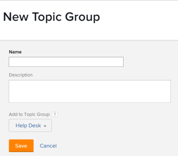

# Criar Grupos de Tópicos

<!-- Audited: 2/2024 -->

Grupos de Tópicos estão associados a Filas de solicitações. Eles permitem criar camadas das Filas de solicitações em várias categorias, dependendo da natureza das solicitações.

## Requisitos de acesso

+++ Expanda para visualizar os requisitos de acesso para a funcionalidade neste artigo.

Você deve ter o seguinte:

<table style="table-layout:auto"> 
 <col> 
 <col> 
 <tbody> 
  <tr> 
   <td role="rowheader">plano do Adobe Workfront</td> 
   <td> 
Qualquer 
 </td> 
  </tr> 
  <tr> 
   <td role="rowheader"> 
Licença do Adobe Workfront
 </td> 
   <td>   
      
Novo: Padrão

      
Ou
 
      
Atual: Plano

 </td> 
  </tr> 
  <tr> 
   <td role="rowheader">Configurações de nível de acesso</td> 
   <td> 
Editar acesso a projetos
 </td> 
  </tr> 
  <tr> 
   <td role="rowheader">Permissões de objeto</td> 
   <td> 
 Gerenciar permissões do projeto
 </td> 
  </tr> 
 </tbody> 
</table>

Para obter mais detalhes sobre as informações nesta tabela, consulte [Requisitos de acesso na documentação do Workfront](/help/quicksilver/administration-and-setup/add-users/access-levels-and-object-permissions/access-level-requirements-in-documentation.md).

+++

## Visão Geral de Grupos de Tópicos

Por exemplo, se você tiver uma Fila de solicitações para solicitações de marketing, poderá ter um Grupo de tópicos &quot;Campanha do dia das mães&quot;, com um Grupo de tópicos de segundo nível de &quot;Mídia digital&quot; e um Grupo de tópicos de segundo nível adicional de &quot;Mídia impressa&quot;. Em seguida, você pode ter vários Tópicos de fila dentro de cada Grupo de tópicos. Por exemplo, &quot;Anúncio de banner&quot; e &quot;Blog&quot; podem ser tópicos da fila do grupo de tópicos &quot;Mídia digital&quot;.

Para obter mais informações sobre como criar Filas de solicitações, consulte [Criar uma fila de solicitações](../../../manage-work/requests/create-and-manage-request-queues/create-request-queue.md).

>[!TIP]
>
>* Você pode criar até 10 camadas de Grupos de tópicos em uma Fila de solicitações.
>* Não há limite para o número de Tópicos da Fila que podem ser associados a um grupo de tópicos.
>* Grupos de tópicos são um objeto reportável.
>

## Criar Grupos de Tópicos

Recomendamos que você crie Grupos de Tópicos antes de criar um Tópico da Fila. No entanto, um Grupo de tópicos pode ser criado no Construtor de tópicos da fila. Para obter mais informações sobre a criação de Tópicos de Fila, consulte [Criar Tópicos de Fila](../../../manage-work/requests/create-and-manage-request-queues/create-queue-topics.md).

Para criar um Grupo de Tópicos:

1. Vá para o projeto publicado como uma Fila de solicitação de ajuda.\
   Para obter mais informações sobre como publicar um projeto como uma Fila de solicitação de ajuda, consulte [Criar uma fila de solicitações](../../../manage-work/requests/create-and-manage-request-queues/create-request-queue.md).

1. Clique em **Grupos de Tópicos** no painel esquerdo. Talvez seja necessário clicar em **Mostrar mais**, depois **Grupos de Tópicos**.
1. Clique em **Novo grupo de tópicos**.

   

1. Especifique as seguintes informações:

   * **Nome**: O nome é visível para usuários que enviam solicitações para essa fila de solicitações.
   * **Descrição**: A descrição é exibida quando os usuários selecionam o grupo de tópicos no processo de enviar uma nova solicitação.
   * **Adicionar ao Grupo de Tópicos**: Você pode adicionar o novo Grupo de Tópicos a um Grupo de Tópicos existente, ou pode adicioná-lo diretamente ao projeto publicado como uma Fila de solicitação de ajuda.

1. Clique em **Salvar**.\
   Isso cria um novo Grupo de Tópicos na sua Fila de solicitações. Agora é possível selecionar categorias adicionais no primeiro menu suspenso em uma Fila de solicitações.\
   Para obter mais informações sobre o envio de solicitações, consulte [Criar e enviar solicitações do Adobe Workfront](../../../manage-work/requests/create-requests/create-submit-requests.md).
