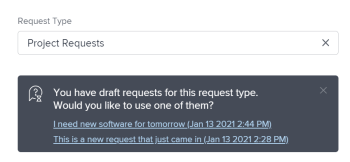

# Criar e enviar solicitações

<!--Audited: 12/2023-->

<!--

(NOTE: Linked to the UI - do not change/ remove; THIS IS NOW SPLIT IN THREE ARTICLES>> MAKE SURE THE TRANSITION TO THE OTHER TWO IS CLEAR SINCE THIS IS LINKED TO UI)

(NOTE: If they come out with templates AND drafts, consider splitting this article to keep Create in one and Working with Drafts and Requests in another??)

(NOTE: this article is linked from Submitting Workfront Requests from Salesforce) 

-->

As informações destacadas nesta página referem-se a funcionalidades que ainda não estão disponíveis. Ela está disponível somente no ambiente de Pré-visualização para todos os clientes. Depois das versões mensais para produção, os mesmos recursos também ficam disponíveis no ambiente de produção para clientes que ativaram versões rápidas. 

Para obter informações sobre versões rápidas, consulte [Habilitar ou desabilitar versões rápidas para sua organização](/help/quicksilver/administration-and-setup/set-up-workfront/configure-system-defaults/enable-fast-release-process.md). 

O trabalho planejado é representado na Adobe Workfront por projetos e tarefas. No entanto, você pode trabalhar em um ambiente em que o trabalho não planejado, na forma de solicitações, pode entrar a qualquer momento. O Workfront fornece um fluxo de trabalho para acomodar esse tipo de ambiente por meio do uso de Filas de solicitações.

Depois de criar uma solicitação em uma Fila de solicitações, você pode atribuí-la para ser concluída ou convertê-la em uma tarefa ou projeto.\
Para obter mais informações sobre como converter problemas em uma tarefa ou projeto, consulte o artigo [Visão geral da conversão de problemas no Adobe Workfront](../../../manage-work/issues/convert-issues/convert-issues.md).

Você pode criar uma solicitação Workfront das seguintes maneiras:

* Do zero, conforme descrito neste artigo.
* De rascunhos. Para obter informações, consulte [Criar solicitações de rascunhos](../../../manage-work/requests/create-requests/create-requests-from-drafts.md).
* De uma solicitação existente, copiando e submetendo uma cópia. Para obter informações, consulte [Copiar e enviar solicitações](../../../manage-work/requests/create-requests/copy-and-submit-requests.md).

Você pode criar uma solicitação do Workfront Planning do zero para criar registros no Workfront Planning das seguintes maneiras:

* De um link para um formulário de solicitação do Workfront Planning.

* Em um formulário de solicitação do Workfront Planning na área Solicitações do Workfront.

  Sua organização deve comprar um pacote do Workfront Planning. Para obter informações, consulte [Enviar solicitações do Adobe Workfront Planning para criar registros](/help/quicksilver/planning/requests/submit-requests.md).

## Requisitos de acesso

+++ Expanda para visualizar os requisitos de acesso para a funcionalidade neste artigo.

Você deve ter o seguinte acesso para executar as etapas deste artigo:

<table style="table-layout:auto"> 
 <col> 
 <col> 
 <tbody> 
 <tbody> 
  <tr> 
   <td role="rowheader">plano do Adobe Workfront</td> 
   <td> 
Qualquer 
 </td> 
  </tr> 
  <tr> 
   <td role="rowheader">Licença do Adobe Workfront</td> 
   <td> 
Novo: Colaborador ou superior

   Ou
   
Atual: solicitação ou superior

    </td> 
  </tr> 
  <tr> 
   <td role="rowheader">Configurações de nível de acesso</td> 
   <td> 
Editar acesso a ocorrências
  </td> 
  </tr> 
  <tr> 
   <td role="rowheader"> Produto</td> 
   <td> <ul><li>Adobe Workfront</li><li>Você precisa ter o Adobe Workfront Planning para exibir solicitações ou formulários de solicitação do Planning</td> 
  </tr> 
 </tbody> 
</table>

Para obter mais detalhes sobre as informações nesta tabela, consulte [Requisitos de acesso na documentação do Workfront](/help/quicksilver/administration-and-setup/add-users/access-levels-and-object-permissions/access-level-requirements-in-documentation.md).

+++

## Pré-requisitos para usar as Filas de solicitações

Um administrador do Workfront deve criar Filas de solicitações e disponibilizá-las aos usuários antes que eles possam usar essa funcionalidade. Um usuário com uma licença de Planejador e com acesso para Editar a Projetos e Gerenciar permissões para um projeto específico também pode criar Filas de solicitações.

Para obter informações sobre como criar Filas de solicitações, consulte o artigo [Criar uma fila de solicitações](../../../manage-work/requests/create-and-manage-request-queues/create-request-queue.md).

Um administrador do Workfront deve criar os seguintes componentes de uma Fila de solicitações:

* Um projeto com o status Atual, publicado como uma Fila de solicitação de ajuda.
* Enfileirar tópicos.\
  Para obter mais informações, consulte o artigo [Criar tópicos da fila](../../../manage-work/requests/create-and-manage-request-queues/create-queue-topics.md).

* Regras de Encaminhamento.\
  Para obter mais informações, consulte o artigo [Criar Regras de Roteamento](../../../manage-work/requests/create-and-manage-request-queues/create-routing-rules.md).

* (Opcional) Grupos de tópicos.\
  Para obter mais informações, consulte o artigo [Criar grupos de tópicos](../../../manage-work/requests/create-and-manage-request-queues/create-topic-groups.md).

* (Opcional) Solicitar formulário personalizado.\
  Para obter mais informações, consulte o artigo [Criar um formulário personalizado](/help/quicksilver/administration-and-setup/customize-workfront/create-manage-custom-forms/form-designer/design-a-form/design-a-form.md).

* (Opcional) Solicite o processo de aprovação.\
  Para obter mais informações, consulte o artigo [Criar um processo de aprovação para itens de trabalho](../../../administration-and-setup/customize-workfront/configure-approval-milestone-processes/create-approval-processes.md).

## Criar solicitações e gerar rascunhos no aplicativo web do Workfront

Ao criar uma solicitação no aplicativo Web do Workfront, o Workfront salva a solicitação como rascunho antes de você enviá-la. O Workfront cria um rascunho assim que você seleciona sua fila de solicitações e começa a inserir informações nela.

Você pode continuar enviando a solicitação ou preencher quantas informações estiverem disponíveis e sair dela para concluí-la posteriormente. O Workfront salva a solicitação em rascunho que você iniciou na pasta Rascunhos.

>[!IMPORTANT]
>
>Considere o seguinte ao trabalhar com rascunhos:
>
>* O Workfront não cria rascunhos de solicitações ao enviá-los por meio de um aplicativo de terceiros, como enviá-los por email para o Workfront ou criá-los usando outro aplicativo. Ao enviar uma solicitação de fora do aplicativo Web Workfront, ela é salva na seção Enviado.
>* Se a estrutura de uma fila de solicitações mudar, você não poderá mais acessar rascunhos existentes. Por exemplo, se um tópico da fila for removido ou um grupo de tópicos for adicionado, os rascunhos salvos não estarão mais acessíveis.
>

Para obter informações sobre como criar solicitações a partir de rascunhos existentes, consulte [Criar solicitações a partir de rascunhos](../../../manage-work/requests/create-requests/create-requests-from-drafts.md). Para obter informações sobre como excluir rascunhos de solicitações, consulte também [Excluir um rascunho de solicitação](../../../manage-work/requests/create-requests/delete-request-draft.md).

Para criar uma solicitação no aplicativo Web do Workfront:

{{step1-to-requests}}

1. (Opcional e condicional) Selecione a configuração **Alternar para nova experiência** no canto superior direito da tela se os seguintes itens se aplicarem à sua organização e instância do Workfront:

   * Sua organização adquiriu um pacote do Workfront
   * Sua organização foi integrada à Adobe Unified Experience.
   * Seu administrador concedeu acesso ao Workfront Planning
   * Você tem pelo menos permissões de exibição para um espaço de trabalho do Workfront Planning

   Para obter mais informações, consulte [Enviar solicitações do Adobe Workfront Planning para criar registros](/help/quicksilver/planning/requests/submit-requests.md)

1. Clique em **Nova solicitação** no canto superior direito da página.

   >[!TIP]
   >
   >* Você pode acessar a opção Nova solicitação em qualquer seção na área Solicitações.
   >* A opção Nova solicitação fica esmaecida quando você não tem acesso para criar problemas.

   A caixa **Nova solicitação** é aberta.

1. (Condicional) Se você alternou para a nova experiência e está no ambiente de produção, a caixa **Nova solicitação** exibe o seguinte:

   <ul><li>As 6 filas de solicitações do Workfront acessadas mais recentemente e os formulários de solicitação do Planning são exibidos na seção Recente. </li>
    <li>Todos os formulários de solicitação adicionais do Workfront e do Planning <b>seção Todos os formulários de solicitação</b>. Você pode procurar formulários de solicitação que não são exibidos por padrão. </li>
    <li>Todos os caminhos adicionais da fila de solicitações do Workfront e do Planning são exibidos na seção <b>Todos os caminhos de solicitação</b>. Você pode procurar uma fila de solicitações que não é exibida por padrão.</li></ul>
   Clique em um dos caminhos ou formulários da fila de solicitações do Workfront, ou procure um, e clique nele quando ele for exibido na lista.
1. (Condicional) Se você alternou para a nova experiência, selecione um dos caminhos ou formulários da fila de solicitações do Workfront ou clique na barra de pesquisa. 

   Quando você clicar na barra de pesquisa, será exibida uma lista suspensa mostrando primeiro as filas e os formulários usados mais recentemente. Selecione um na lista ou comece a digitar e selecione a fila ou o formulário quando ele for exibido.

   >[!NOTE]
   >
   >Considere o seguinte em relação à nova experiência de solicitação atualmente disponível na Visualização:
   >* A lista inclui as filas de solicitações do Workfront e os formulários de solicitação do Workfront Planning.
   >* Você pode filtrar a lista por tipo de objeto.
   >* Para exibir somente as filas de Solicitações Workfront, filtre por `Issue` tipos de objeto.
   >* Na nova experiência de solicitação, os rascunhos estão na mesma lista das solicitações enviadas.

1. (Condicional) Se você alternou para a nova experiência, selecione os grupos de tópicos e os tópicos da fila e continue atualizando o formulário.

   Caso contrário, clique dentro do campo **Tipo de solicitação** e siga um destes procedimentos:

   * Na seção **Caminhos recentes**, selecione um caminho usado recentemente para abrir uma fila de solicitações. Um caminho inclui a fila de solicitações, os grupos de tópicos e o tópico da fila que você enviou recentemente. Os três últimos caminhos são exibidos por padrão.

     >[!NOTE]
     >
     >O Workfront salva um caminho somente quando você realmente submeteu uma solicitação a ele. Ele não cria caminhos para solicitações em rascunho.

     

   * Na seção **Filas de Solicitação**, selecione uma fila de solicitações.
   * Insira uma palavra-chave que pertença a um caminho acessado anteriormente para procurar uma fila de solicitações.

     Por exemplo, se você tiver uma fila de solicitações chamada &quot;Help Desk&quot; com um Grupo de tópicos chamado &quot;Local&quot; e um Tópico da fila chamado &quot;Remoto&quot;, poderá digitar &quot;remoto&quot; e todas as filas de solicitações que contêm &quot;remoto&quot; em qualquer elemento de seu caminho serão exibidas.

     >[!TIP]
     >
     >Quando você digita um nome que contém um caractere especial, a fila de solicitações, o tópico da fila ou o grupo de tópicos são exibidos mesmo quando você omite a digitação do caractere.

     

     A lista de filas de solicitações e caminhos recentes disponíveis é atualizada dinamicamente para incluir apenas caminhos que contêm a palavra-chave que está destacada nos resultados.

     Os resultados da pesquisa são exibidos nas seguintes áreas:

     <table style="table-layout:auto"> 
      <col> 
      <col> 
      <tbody> 
       <tr> 
        <td role="rowheader">Filas de solicitações</td> 
        <td>Filas de solicitações que contêm a palavra-chave em seu nome</td> 
       </tr> 
       <tr> 
        <td role="rowheader">Caminhos de solicitação</td> 
        <td> 
Caminhos (que incluem filas de solicitações, grupos de tópicos, tópicos de fila) que contêm a palavra-chave em qualquer um dos nomes de seus elementos
 </td> 
       </tr> 
      </tbody> 
     </table>

   >[!TIP]
   >
   >* As primeiras 200 filas de solicitações são exibidas por padrão, em ordem alfabética.
   >* O nome da fila de solicitações é o nome do projeto que foi publicado como uma Fila de solicitações de ajuda.
   >* A descrição do projeto configurado como a fila de solicitações selecionada é exibida à direita do nome da fila de solicitações.
   >   
   >Para obter mais informações sobre como publicar um projeto como uma Fila de solicitações de ajuda, consulte o artigo [Criar uma Fila de solicitações](../../../manage-work/requests/create-and-manage-request-queues/create-request-queue.md).

1. No formulário **Nova solicitação**, siga um destes procedimentos:

   * (Condicional) Selecione um rascunho disponível na mensagem de notificação exibida sob o campo Tipo de solicitação.

     Esta área é exibida somente se você tiver salvado rascunhos antes sem enviá-los.

     Os três rascunhos mais recentes de três tópicos diferentes da fila são exibidos por padrão.

     

   * Comece a inserir uma nova solicitação na fila selecionada.

     Um novo rascunho é salvo automaticamente na seção Rascunhos depois que você começa a especificar informações para a nova solicitação e dá um nome à solicitação no campo Assunto.

1. (Opcional) Se sua Fila de solicitações incluir Grupos de tópicos, selecione o nome do Grupo de tópicos no primeiro campo suspenso. Caso contrário, selecione um Tópico da Fila.

   >[!TIP]
   >
   >Quando você passa o mouse sobre um Grupo de tópicos ou um Tópico da fila, o campo Descrição é exibido à direita. Contém informações adicionais sobre o grupo de tópicos ou o tópico da fila.
   >
   >
   >
   >

   Você pode ter até 10 camadas de Grupos de tópicos incorporados à sua Fila de solicitações.\
   Para obter mais informações sobre como criar Grupos de Tópicos, consulte o artigo [Criar Grupos de Tópicos](../../../manage-work/requests/create-and-manage-request-queues/create-topic-groups.md). Para obter mais informações sobre como criar Tópicos da Fila, consulte o artigo [Criar Tópicos da Fila](../../../manage-work/requests/create-and-manage-request-queues/create-queue-topics.md).

   >[!TIP]
   >
   >Se você tiver selecionado um rascunho ou um caminho anterior, os tópicos de grupos de tópicos e de fila já estarão selecionados. Você pode selecionar um diferente, se necessário.

1. Dependendo dos campos que o administrador do Workfront habilitou na seção **Novos Campos de Problema** da subguia **Detalhes da Fila** no projeto, você poderá encontrar qualquer um dos seguintes campos ao enviar uma nova solicitação:

   <table style="table-layout:auto"> 
    <col> 
    <col> 
    <tbody> 
     <tr> 
      <td role="rowheader"><strong>Assunto</strong> </td> 
      <td>Especifique um nome para a solicitação. Este campo é obrigatório.</td> 
     </tr> 
     <tr> 
      <td role="rowheader"><strong>Descrição</strong> </td> 
      <td>Especifique uma descrição para a solicitação.</td> 
     </tr> 
     <tr> 
      <td role="rowheader"><strong>URL</strong> </td> 
      <td> 
Especifique um URL que possa estar relacionado à sua solicitação.
 </td> 
     </tr> 
     <tr> 
      <td role="rowheader"><strong>Prioridade</strong> </td> 
      <td> 
Especifique uma prioridade para a solicitação. A prioridade deve definir a velocidade com que você acha que essa solicitação deve ser resolvida. As opções padrão são: 
 
       <ul> 
        <li>Nenhum(a)</li> 
        <li>Baixa </li> 
        <li>Normal</li> 
        <li>Alta</li> 
        <li>Urgente</li> 
       </ul> 
O administrador do sistema pode modificar os nomes das prioridades.
 </td> 
     </tr> 
     <tr> 
      <td role="rowheader"><strong>Severidade</strong> </td> 
      <td> 
Especifique uma severidade para a solicitação. A severidade deve definir o impacto que essa solicitação terá no seu trabalho se não for resolvida a tempo. As opções padrão são:
 
       <ul> 
        <li>Cosmética</li> 
        <li>Causa Confusão</li> 
        <li>Problema com Solução</li> 
        <li>Problema Sem Solução</li> 
        <li>Erro Fatal</li> 
       </ul> 
O administrador do sistema pode modificar os nomes das severidades.
 </td> 
     </tr> 
     <tr> 
      <td role="rowheader"><strong>Contato Primário</strong> </td> 
      <td>O contato principal de uma solicitação é assumido como padrão por você, já que você é a pessoa certa para responder a qualquer pergunta relacionada à solicitação. No entanto, é possível alterá-lo para qualquer outro usuário do Workfront.</td> 
     </tr> 
     <tr data-mc-conditions="QuicksilverOrClassic.Quicksilver"> 
      <td role="rowheader"><strong>Atribuições</strong> </td> 
      <td> 
Especifique o nome de um usuário ativo, função de trabalho ou uma equipe à qual a solicitação deve ser atribuída. 
 
Você pode especificar apenas um grupo.

   
 Dependendo de como a fila de solicitações foi configurada, você pode atribuir apenas um ou dois tipos de recursos à solicitação, em vez de todos os três (por exemplo, você só pode atribuir a solicitação aos usuários).

   
Se uma regra de roteamento também estiver associada à fila de solicitações e ela rotear automaticamente a solicitação para um tipo diferente de recurso (por exemplo, uma equipe), sua solicitação será atribuída à entidade especificada manualmente ao enviar a solicitação (usuários) e ao recurso especificado na regra de roteamento (a equipe). 

   
 Para obter mais informações, consulte os seguintes artigos:
 
      <ul> 
      <li> 
<a href="../../../manage-work/requests/create-and-manage-request-queues/create-request-queue.md" class="MCXref xref">Criar uma Fila de Solicitações</a> 
 </li> 
      <li> 
<a href="../../../manage-work/requests/create-and-manage-request-queues/create-routing-rules.md" class="MCXref xref">Criar Regras de Roteamento</a>   
 </li> 
      </ul> 

   
Recomendamos o uso das Regras de Roteamento para suas Filas de Solicitações para que elas possam ser roteadas automaticamente para os recursos apropriados. 
 </td> 
     </tr>

   <tr> 
      <td role="rowheader"><strong>Horas planejadas</strong> </td> 
      <td> 
Estime quantas horas levaria para essa solicitação ser concluída.
 </td> 
     </tr> 
     <tr> 
      <td role="rowheader"><strong>Data de Início Planejada</strong> </td> 
      <td> 
Especifique a data em que o trabalho nesta solicitação deve começar.
 </td> 
     </tr> 
     <tr> 
      <td role="rowheader"><strong>Data de Término Planejada</strong> </td> 
      <td>Especifique a data em que deseja que esta solicitação seja resolvida.</td> 
     </tr> 
     <tr> 
      <td role="rowheader"><strong>Status</strong> </td> 
      <td>O status padrão de uma nova solicitação é "Novo". O administrador do sistema pode ter alterado o nome deste status. Você também pode alterar o status para algo diferente nesse menu suspenso.</td> 
     </tr> 
     <tr> 
      <td role="rowheader"><strong>Documentos</strong> </td> 
      <td> 
Adicione documentos à sua solicitação. 
 
 Dependendo de como a fila de solicitações foi configurada, a seção Documentos pode ser exibida antes ou depois dos campos personalizados. 
 
Os documentos que você carrega no Workfront são armazenados por 24 horas em uma solicitação em rascunho. Depois disso, você deverá reanexá-los quando retornar para editar e submeter o rascunho. Os documentos vinculados a partir de outras unidades são salvos no rascunho permanentemente. 
 </td> 
     </tr> 
    </tbody> 
   </table>

1. (Opcional) Se o administrador do Workfront associou um formulário personalizado à Fila de solicitação ou ao Tópico da fila, especifique os campos dentro do formulário personalizado.\
   Os formulários personalizados são diferentes para cada instância do Workfront.
1. (Opcional e condicional) A qualquer momento durante a inserção da solicitação, clique em [!UICONTROL **Descartar rascunho**] se desejar excluir o rascunho criado automaticamente. Isso exclui o rascunho que não pode ser recuperado. Uma mensagem de confirmação é exibida para confirmar que você está excluindo o rascunho.

1. (Opcional) Clique em [!UICONTROL **Desfazer**] na mensagem de confirmação se desejar reverter sua ação e manter o rascunho.

1. Siga um destes procedimentos:

   * Clique em **Enviar** se estiver pronto para enviar a solicitação. A solicitação é salva na seção Enviada. Dependendo da Regra de Encaminhamento da Fila de Solicitações, essa solicitação pode ser encaminhada para um projeto diferente daquele designado como Fila de Solicitações. Para obter informações sobre regras de roteamento, consulte [Criar Regras de Roteamento](../../../manage-work/requests/create-and-manage-request-queues/create-routing-rules.md).

     Ou

     Clique em **Fechar** se não estiver pronto para enviá-lo e você poderá voltar e concluí-lo mais tarde. Sua solicitação é salva na seção Rascunhos e estará disponível para você na próxima vez que enviar uma solicitação para essa fila de solicitações.

     

   Ao enviar a solicitação, o rascunho é excluído automaticamente e não pode ser restaurado.

   As solicitações enviadas estão listadas na seção **Enviadas** da área Solicitações. Se você estiver usando a nova experiência do, as solicitações enviadas pelo Workfront serão exibidas na guia **Workfront** da área Solicitações.

   Para obter informações sobre como endereçar solicitações recebidas, consulte o artigo [Gerenciar solicitações de trabalho e de equipe](../../../people-teams-and-groups/work-with-team-requests/manage-work-and-team-requests.md).

   Para obter informações sobre como localizar solicitações enviadas ou rascunhadas, consulte também [Localizar solicitações enviadas](../../../manage-work/requests/create-requests/locate-submitted-requests.md).

## Criar solicitações de fora do Workfront

Você pode compartilhar um link direto para uma fila de solicitações ao enviar uma nova solicitação e incorporá-la a outros aplicativos. Os usuários que acessam este link pela web ou por outros aplicativos também devem estar conectados com uma conta ativa do Workfront para poderem acessar esta fila e enviar solicitações a ela. Para obter informações, consulte [Compartilhar um link para uma fila de solicitações](../../../manage-work/requests/create-requests/share-link-to-request-queue.md).

## Criar solicitações ao enviar por email para o Workfront

Se a Fila de solicitação estiver habilitada para receber solicitações por email, você poderá enviar suas solicitações por email diretamente para o endereço de email associado à Fila de solicitação.

O texto do corpo do email é adicionado como a descrição da solicitação.

>[!NOTE]
>
>A formatação do HTML é removida quando a solicitação entra no Workfront, mas as assinaturas e o conteúdo existente do thread de Responder para não são removidos e aparecem na descrição da solicitação.

Para obter informações sobre como habilitar uma Fila de solicitações para receber solicitações por email, consulte [Habilitar usuários a enviar um problema por email para um projeto da Fila de Solicitações](../../../manage-work/requests/create-requests/enable-email-issues-into-projects.md).

## Criar solicitações usando o cliente Outlook

Você pode enviar solicitações usando o cliente Outlook. Você pode criar uma nova solicitação ou converter um email em uma solicitação.

Para obter informações sobre como enviar solicitações usando o cliente Outlook, consulte o artigo [Criar uma solicitação do Adobe Workfront por email do Outlook](../../../workfront-integrations-and-apps/using-workfront-with-outlook/create-a-wf-request-from-an-outlook-email.md).

## Criar solicitações usando o aplicativo móvel Workfront

Você pode enviar solicitações usando o aplicativo móvel em seu smartphone. Você pode criar uma nova solicitação e enviá-la às Filas de solicitações que você tem acesso para ver no aplicativo web.

Para obter informações sobre como enviar solicitações por meio do aplicativo móvel, consulte a seção Solicitações nos artigos:

* [Adobe Workfront para Android](../../../workfront-basics/mobile-apps/using-the-workfront-mobile-app/workfront-for-android.md#requests)
* [Adobe Workfront para iOS](../../../workfront-basics/mobile-apps/using-the-workfront-mobile-app/workfront-for-ios.md#requests)

## Criar solicitações de outros aplicativos

É possível enviar solicitações usando qualquer aplicativo que tenha sido integrado ao Workfront:

* Você pode criar uma integração personalizada entre o Workfront e outro aplicativo que permite enviar solicitações para o Workfront a partir do outro aplicativo.\
  Para obter mais informações sobre integrações personalizadas do Workfront, consulte o artigo [Integrações do Adobe Workfront](../../../administration-and-setup/configure-integrations/workfront-integrations-1.md).

## Criar solicitações usando um formulário de solicitação do Workfront Planning

É possível adicionar uma solicitação do Workfront Planning usando um formulário de solicitação do Planning. Adicionar solicitações do Workfront Planning pode criar registros do Planning, se o formulário de solicitação for aprovado ou se não exigir aprovação.

Sua organização deve comprar um pacote do Workfront Planning para poder enviar solicitações do Planning.

Para obter informações, consulte os seguintes artigos:

* [Criar e gerenciar um formulário de solicitação no Adobe Workfront Planning](/help/quicksilver/planning/requests/create-request-form.md).
* [Enviar solicitações do Adobe Workfront Planning para criar registros](/help/quicksilver/planning/requests/submit-requests.md).

## Localizar solicitações enviadas

Para obter informações sobre como localizar solicitações enviadas ou rascunhadas, consulte [Localizar solicitações enviadas](../../../manage-work/requests/create-requests/locate-submitted-requests.md).
