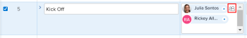
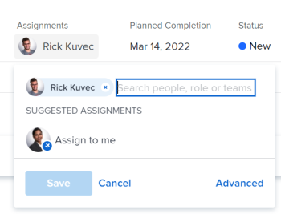

# Criar atribuições avançadas

{{highlighted-preview}}

Você pode gerenciar atribuições de tarefas ou problemas usando as Atribuições Avançadas.

Você pode ajustar as seguintes informações de atribuição ao fazer atribuições avançadas:

* Atribuir usuários à tarefa ou problema (isso pode ser feito fora de uma atribuição avançada).
* Ajuste e redistribua o número de horas que cada destinatário é alocado.
* Determine qual usuário deve ser designado como o proprietário ou o Principal responsável pela tarefa ou problema.
* Especifique qual função cada usuário está cumprindo ao trabalhar na tarefa ou problema.
* Substituir a taxa de cobrança de uma função de trabalho.

>[!NOTE]
>
>Ao atribuir usuários para trabalhar, sua disponibilidade de acordo com seus agendamentos afeta as Datas Planejadas e Projetadas de tarefas e problemas. Para obter informações sobre programações, consulte [Criar um agendamento](../../../administration-and-setup/set-up-workfront/configure-timesheets-schedules/create-schedules.md).

## Áreas do Adobe Workfront em que você pode fazer atribuições avançadas

Este artigo descreve como acessar Atribuições avançadas no cabeçalho da tarefa ou do problema.

Além disso, você pode fazer atribuições avançadas nas seguintes áreas do Workfront:

* Em listas e relatórios quando o campo Atribuições é exibido na visualização.
* Na seção Atribuições ao editar uma tarefa. Para obter mais informações, consulte [Editar tarefas](../../../manage-work/tasks/manage-tasks/edit-tasks.md).
* No cabeçalho da tarefa ou do problema, na área Atribuições.
* No Balanceador de carga de trabalho. Para obter mais informações, consulte [Atribuir trabalho manualmente usando o Balanceador de carga de trabalho](../../../resource-mgmt/workload-balancer/assign-work-in-workload-balancer-manually.md).

## Requisitos de acesso

Você deve ter o seguinte acesso para executar as etapas deste artigo:

<table style="table-layout:auto"> 
 <col> 
 <col> 
 <tbody> 
  <tr> 
   <td role="rowheader">plano do Adobe Workfront*</td> 
   <td> 
Qualquer Um
 </td> 
  </tr> 
  <tr> 
   <td role="rowheader">Licença da Adobe Workfront*</td> 
   <td> 
Trabalhar ou superior
 </td> 
  </tr> 
  <tr> 
   <td role="rowheader">Configurações de nível de acesso*</td> 
   <td> 
Editar acesso a tarefas e problemas
 
<b>Nota</b>

Se você ainda não tiver acesso, pergunte ao administrador do Workfront se ele definiu restrições adicionais em seu nível de acesso. Para obter informações sobre como um administrador do Workfront pode modificar seu nível de acesso, consulte <a href="../../../administration-and-setup/add-users/configure-and-grant-access/create-modify-access-levels.md" class="MCXref xref">Criar ou modificar níveis de acesso personalizados</a>.
 </td>
</tr> 
  <tr> 
   <td role="rowheader">Permissões de objeto</td> 
   <td> 
Contribuir com permissões ou mais altas para uma tarefa ou problema
 
Para obter informações sobre como solicitar acesso adicional, consulte <a href="../../../workfront-basics/grant-and-request-access-to-objects/request-access.md" class="MCXref xref">Solicitar acesso a objetos </a>.
 </td> 
  </tr> 
 </tbody> 
</table>

&#42;Para descobrir seu plano, tipo de licença ou acesso, entre em contato com o administrador do Workfront.

## Fazer atribuições avançadas

1. Vá para o projeto ao qual deseja atribuir uma tarefa ou um problema.
1. Clique em **Tarefas** ou **Problemas** no painel esquerdo, clique no nome de uma tarefa ou problema na lista.

   >[!TIP]
   >
   >Você pode fazer atribuições avançadas diretamente na lista de tarefas ou problemas se houver duas ou mais pessoas atribuídas. Clique dentro do **Atribuições** na mesma linha da tarefa ou problema, em seguida, clique no botão **Ícone Pessoas** para abrir a janela atribuições avançadas. Vá para a etapa 5 para continuar criando atribuições avançadas.\
   >
   >

1. Clique em **Atribuir a** no **Atribuições** no cabeçalho da tarefa ou problema

   Ou

   Clique no nome das atribuições se a tarefa ou problema já estiver atribuído.

1. Clique em **Avançado**.

   

1. No **Pesquisar pessoas, funções e equipes** comece digitando o nome de um usuário, função ou equipe e clique no nome quando ele aparecer na lista suspensa.

   >[!NOTE]
   >
   >Se o nome do usuário contiver um caractere especial, você deverá incluí-lo no campo de pesquisa.

1. (Opcional) Continue adicionando responsáveis na **Pesquisar pessoas, funções ou equipes** para adicionar vários recursos à tarefa ou problema.

   >[!TIP]
   >
   >* Você pode atribuir vários usuários, funções de trabalho ou equipes. Você pode atribuir somente usuários, funções de trabalho e equipes ativos.
   >
   >
   >* Ao adicionar uma atribuição de usuário, observe o avatar, a função principal do usuário ou seu endereço de email para distinguir entre usuários com nomes idênticos. Os usuários devem ser associados a pelo menos uma função de trabalho para visualizá-la à medida que forem adicionados.
   >
   >
   >* Ao adicionar uma atribuição de função de trabalho, você pode pesquisar a função de trabalho ou o local. Selecione a Função de Trabalho Sistema/Padrão para usar a taxa de faturamento padrão para a atribuição ou selecione uma Função de Cartão de Taxa para substituir a taxa no nível da atribuição. Para obter mais informações sobre cartões de taxa, consulte [Gerenciar cartões de taxa](/help/quicksilver/administration-and-setup/set-up-workfront/configure-system-defaults/manage-rate-cards.md).
   >
   >
   >* Se um usuário, função de trabalho ou equipe foi atribuído antes de ser desativado, ele permanece atribuído ao item de trabalho. Nesse caso, recomendamos o seguinte:
   >   
   >   * Reatribuir o item de trabalho aos recursos ativos.
   >   * Associe os usuários de uma equipe desativada a uma equipe ativa e reatribua o item de trabalho à equipe ativa.
   >   
   >

1. Para cada usuário na variável **Destinatário** especifique as seguintes informações:

   * **Proprietário**: Passe o mouse sobre o nome do responsável e clique em **Tornar primário** no campo Proprietário se quiser marcar o designado como o proprietário da tarefa ou do problema. Uma caixa de seleção verde indica que o usuário especificado é o contato principal da tarefa ou problema. O Adobe Workfront marca o primeiro usuário ou função de trabalho atribuída a uma tarefa ou problema como Proprietário ou Atribuição principal. Uma equipe não pode ser designada como o Proprietário principal de uma tarefa ou problema.

     >[!IMPORTANT]
     >
     >Dependendo de como o administrador do Workfront ou o administrador de grupo configuram as preferências do projeto, a Workfront pode usar o agendamento do proprietário da tarefa para calcular a linha do tempo da tarefa quando vários usuários estão atribuídos a ela. Para obter informações sobre vários atribuídos de tarefa, consulte a seção &quot;Atribuir vários usuários a uma tarefa&quot; no artigo [Atribuir tarefas](../../../manage-work/tasks/assign-tasks/assign-tasks.md).

   * **Alocações** : Quando o Tipo de duração de uma tarefa for Simples, especifique o número de horas que cada usuário ou função de trabalho deve ser atribuída à tarefa. A soma de todas as horas atribuídas para cada usuário é igual ao número no **Horas planejadas** na parte inferior da coluna Alocações. Em todos os outros casos, especifique a porcentagem de tempo (ou alocação) que você deseja que o destinatário passe resolvendo a tarefa ou problema.

     <!--   
     
(NOTE: make sure this is right in the new UI for both classic and QS???)
   
     -->

     >[!TIP]
     >
     >
     >   
     >   
     >   * Depois de modificar manualmente as alocações de atribuição em tarefas, as Horas Planejadas das tarefas podem ser atualizadas de acordo. Para obter mais informações, consulte a seção &quot;Atualizar horas planejadas da tarefa ao gerenciar alocações de usuários&quot; no artigo [Visão geral das Horas planejadas](../../../manage-work/tasks/task-information/planned-hours.md).
     >   * Não é possível modificar manualmente as alocações de atribuição em ocorrências.
     >   * Não é possível modificar manualmente as alocações de equipes atribuídas a tarefas.
     >   
     >

   * **Função do destinatário:** Selecione a função que o usuário deve usar ao realizar esta atribuição.  A Função principal do usuário é exibida por padrão. Clique na caixa Função do responsável para selecionar outra função.  Ao atribuir a tarefa ou o problema a uma função primeiro e, em seguida, adicionar um usuário que pode desempenhar essa função como uma segunda atribuição, a lista de usuários sugeridos é filtrada para os usuários que podem desempenhar as funções já atribuídas à tarefa e ao problema.

     

   

   * **Localização**: A localização vem do cartão de taxa, se um cartão de taxa anexado ao projeto usar localizações com as funções de trabalho. O local não pode ser alterado.

   * **Taxas de cobrança**: A taxa de faturamento de um usuário vem da taxa do sistema do usuário ou de sua função de trabalho associada. A taxa de cobrança de uma função de trabalho vem da taxa do sistema ou do cartão de taxa, se um cartão de taxa estiver anexado ao projeto. As taxas de cobrança existentes não são exibidas nesse campo. Clique em no campo para alterar a taxa de faturamento para essa atribuição de tarefa específica.

   

   * **Tipo de Duração**: disponível somente para tarefas. Clique no nome do Tipo de duração e selecione um Tipo de duração no menu suspenso. Para obter informações sobre Tipos de duração, consulte [Visão Geral da Duração da Tarefa e do Tipo de Duração](../../../manage-work/tasks/taskdurtn/task-duration-and-duration-type.md).

   * **Duração:** É possível atualizar esse campo para uma tarefa quando você tem permissões para gerenciar a tarefa.

     Para obter mais informações, consulte [Visão Geral da Duração da Tarefa e do Tipo de Duração](../../../manage-work/tasks/taskdurtn/task-duration-and-duration-type.md). Ao editar informações de atribuição em massa, uma caixa de diálogo semelhante é exibida para atribuir usuários, horas, alocação e proprietário da tarefa.

   * **Horas planejadas**: Quando o Tipo de duração for Atribuição calculada ou Simples, atualize o número de Horas planejadas. Como resultado, as porcentagens de alocação ou as horas de cada recurso são distribuídas uniformemente. O Workfront calcula as horas planejadas quando o tipo de duração é Trabalho calculado ou orientado pelo esforço. Para obter mais informações, consulte [Visão Geral da Duração da Tarefa e do Tipo de Duração](../../../manage-work/tasks/taskdurtn/task-duration-and-duration-type.md).

     Imagem de amostra no ambiente de produção:

     

     

     Imagem de exemplo no ambiente de Pré-visualização:

     

     

1. Clique em **Salvar**.
