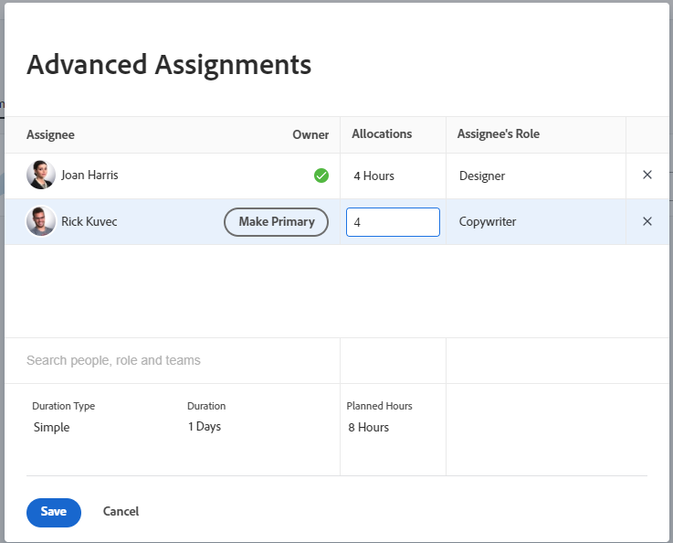

# Gerenciar horas de alocação de usuários e funções em tarefas

<!--

 

The highlighted information on this page refers to functionality not yet generally available. It is available only in the Preview environment for all customers. The same features will also be available in the Production environment for all customers starting with  a week from the Preview release.      

For more information, see [Interface modernization](/help/quicksilver/product-announcements/product-releases/interface-modernization/interface-modernization.md).  

 
-->

As horas de alocação representam a quantidade total de tempo que um recurso atribuído é planejado para trabalhar em uma tarefa. As horas representam o tempo que um usuário é alocado em um determinado dia ou dia da semana, semana ou mês durante toda a duração da tarefa.

>[!NOTE]
>
>Ao atribuir usuários para trabalhar, sua disponibilidade de acordo com seus agendamentos afeta as Datas Planejadas e Projetadas de tarefas e problemas. Para obter informações sobre agendamentos, consulte [Criar um agendamento](../../../administration-and-setup/set-up-workfront/configure-timesheets-schedules/create-schedules.md).

## Requisitos de acesso

+++ Expanda para visualizar os requisitos de acesso para a funcionalidade neste artigo.

<table style="table-layout:auto"> 
 <col> 
 <col> 
 <tbody> 
  <tr> 
   <td>Pacote do Adobe Workfront</td> 
   <td> 
Qualquer
 </td> 
  </tr> 
  <tr> 
   <td>Licença do Adobe Workfront</td> 
   <td> 
Standard

   
Trabalhar ou superior

   </td> 
  </tr> 
  <tr> 
   <td>Configurações de nível de acesso</td> 
   <td>Editar acesso a tarefas</td> 
  </tr> 
  <tr> 
   <td>Permissões de objeto</td>
   <td>
Contribuir com ou mais permissões para a tarefa

   
Editar permissões para atualizar horas de alocação na caixa Editar tarefa
</td>
  </tr>
 </tbody>
</table>

Para obter informações, consulte [Requisitos de acesso na documentação do Workfront](/help/quicksilver/administration-and-setup/add-users/access-levels-and-object-permissions/access-level-requirements-in-documentation.md).

+++

<!--
Change this sentence in the table:

Edit permissions to update allocation hours in the Edit Task box

To this:

Edit permissions to update allocation hours in the Edit Task box in the Production environment. You can no longer manage allocation hours in the Edit task box in the Preview environment.

-->

## Considerações para modificar as horas de alocação de uma tarefa

>[!IMPORTANT]
>
>Depois de modificar manualmente as alocações para cada atribuição nas tarefas, as Horas Planejadas das tarefas podem ser atualizadas de acordo. Para obter mais informações, consulte a seção [Atualizar horas planejadas da tarefa ao gerenciar alocações de usuário](../../../manage-work/tasks/task-information/planned-hours.md#update) no artigo [visão geral das horas planejadas](../../../manage-work/tasks/task-information/planned-hours.md).

* O total de horas alocadas a recursos individuais atribuídos à tarefa representa as Horas Planejadas da tarefa.
* Se houver uma atribuição de usuário ou função para uma tarefa, a quantidade de horas alocadas para o usuário ou função corresponderá às Horas planejadas da tarefa.
* No caso de várias atribuições, cada usuário ou função de trabalho recebe uma quantidade igual de horas para trabalhar na tarefa, por padrão, se o Tipo de duração da tarefa for Simples. Para obter mais informações, consulte os seguintes artigos:

   * [Visão Geral da Duração e do Tipo de Duração da Tarefa](../../../manage-work/tasks/taskdurtn/task-duration-and-duration-type.md)
   * [Visão geral do tipo de duração: simples](../../../manage-work/tasks/taskdurtn/simple-duration-type.md)

* Quando a tarefa tem um Tipo de Duração Simples, você pode alterar manualmente a quantidade de horas alocadas para cada usuário ou função de trabalho para indicar que alguns dos atribuídos da tarefa podem ter mais tempo para trabalhar em uma tarefa do que outros.
* Não é possível modificar a quantidade de horas alocadas para as equipes atribuídas a tarefas.
* Não é possível modificar manualmente a alocação de usuários ou funções de trabalho para ocorrências.
* Você também pode gerenciar alocações diárias, semanais ou mensais de usuários para tarefas ou problemas usando o Balanceador de carga de trabalho. Para obter mais informações, consulte [Gerenciar alocações de usuário no Balanceador de carga de trabalho](../../../resource-mgmt/workload-balancer/manage-user-allocations-workload-balancer.md).

## Modificar as horas de alocação de usuário ou função para uma tarefa

1. Vá para uma tarefa cujas atribuições você deseja alterar as horas de alocação.
1. Clique no menu **Mais**  ao lado do nome da tarefa e clique em **Editar** e depois em **Atribuições**.

   Ou

   Clique na área **Atribuições** no cabeçalho da tarefa e clique em **Avançadas**.

1. Verifique se o **Tipo de Duração** da tarefa é **Simples**.
1. Modifique as **Alocações** para cada destinatário de tarefa. São alocações gerais para cada atribuição a esta tarefa, para toda a duração da tarefa. Isso também pode atualizar o total de Horas planejadas da tarefa.

   

1. Clique em **Salvar**.
